# 如何开始使用 Cypress

> 原文：<https://javascript.plainenglish.io/cypress-setup-boiler-plate-1eb566502bb6?source=collection_archive---------5----------------------->

## 自动化测试的下一件大事


Photo by [Ferenc Almasi](https://unsplash.com/@flowforfrank?utm_source=medium&utm_medium=referral) on [Unsplash](https://unsplash.com?utm_source=medium&utm_medium=referral)

让我们从 cypress.io 自己的口号开始这个故事

> 网络已经进化了。
> 终于，检测也有了。

我真的相信 cypress 作为一个框架是近几年来自动化测试领域发生的最美妙的事情之一。它是企业采用的最具成长性的端到端测试框架之一。

快速阅读它是如何工作的—[https://www.cypress.io/how-it-works](https://www.cypress.io/how-it-works)

尽管 cypress 已经提供了非常好的文档，但我对本文的想法是提供 boiler plate setup 来开始一个框架，而不是原生的 cypress 测试。

涵盖本文中的以下主题:

*   视频/截图配置
*   摩卡牛逼记者
*   柏树仪表板
*   Github 集成
*   CICD 码头工人
*   珀西的视觉测试
*   主题

## **快速柏树设置**

```
mkdir cypress-boiler-plate && cd cypress-boiler-plate
npm init -y
npm i cypress
npx cypress open
npx cypress run 
```

## [**视频/截图配置**](https://docs.cypress.io/guides/references/configuration.html#Global)

如果在`cypress.json`中没有指定，视频和截图的默认路径分别是`cypress/videos`和`cypress/screenshots`

```
cypress.json ->{
    "screenshotsFolder": "screenshots", 
    "videosFolder": "videos"
}
```

这将在`cypress-boiler-plate`和`screenshots`下创建`videos`目录，以防测试中出现任何故障或`cy.screenshot()`。默认情况下`misc.spec.js`带有`cy.screenshot()`。

## **摩卡牛逼记者**

上面的执行将在终端上显示测试结果。可以利用[摩卡内置的](https://mochajs.org/#reporters)如`SPEC`、`DOT MATRIX`、`NYAN`、`TAP` …以及`mocha-teamcity-reporter`、`mocha-junit-reporter`。老实说，这些并不是非常花哨的记者，另一个缺点是它为每个`spec`创建一个`xml`文件，并且很难将它们合并成一个。

尝试使用`cypress.json`中的以下配置执行代码

```
{
      "screenshotsFolder": "screenshots",
      "videosFolder": "videos",
      "reporter": "junit",
      "reporterOptions": {
          "mochaFile": "results/my-test-output-[hash].xml"
      }
}
```

执行`npx cypress run`后，输出会是这样

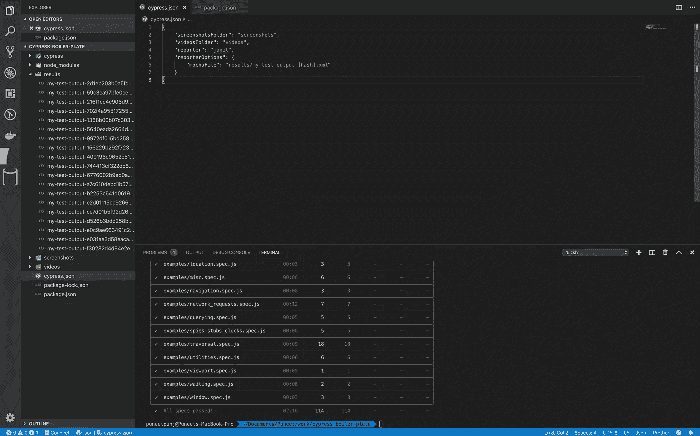

junit reporter output

因此，你需要像摩卡牛逼的第三方记者。下面是使它工作所需的一些包。如果你想知道为什么需要这么多其他的包，请在这里[随意阅读。](https://docs.cypress.io/guides/tooling/reporters.html#Examples)

```
npm i mochawesome mocha mochawesome-merge@2.0.1 mochawesome-report-generator -D
```

让我们用 mochawesome reporter 更新配置文件`cypress.json`

```
{
    "screenshotsFolder": "screenshots",
    "videosFolder": "videos",
    "reporter": "mochawesome",
    "reporterOptions": {
        "reportDir": "reports/mochawesome-report",
        "overwrite": false,
        "html": false,
        "json": true
     }
}
```

现在，如果您执行`npx cypress run`，它将为每个规格创建单独的报告文件。因此，为了更好地报告，我们必须使用其他包将它们合并成一个包。添加一个新文件，命名为`cy-runner.sh`,复制下面的内容

cy-runner.sh

打开`package.json`并更新`scripts`

```
"scripts": {
    "cy:run": "sh cy-runner.sh"
},
```

不要使用`npx cypress run`，而是使用`npm run cy:run`来执行你的测试。在执行这个命令时，合并的 mochawesome 报告应该会自动在 google chrome 中打开。


cypress dir after adding mochawesome report

## [**柏树仪表盘设置**](https://www.cypress.io/dashboard/)

这是 cypress 为有效的测试管理提供的最酷的特性之一(对于免费帐户也是如此)。

在您的终端中执行`npx cypress open`，这将打开 ***测试运行器*** 。单击运行(中间选项卡)

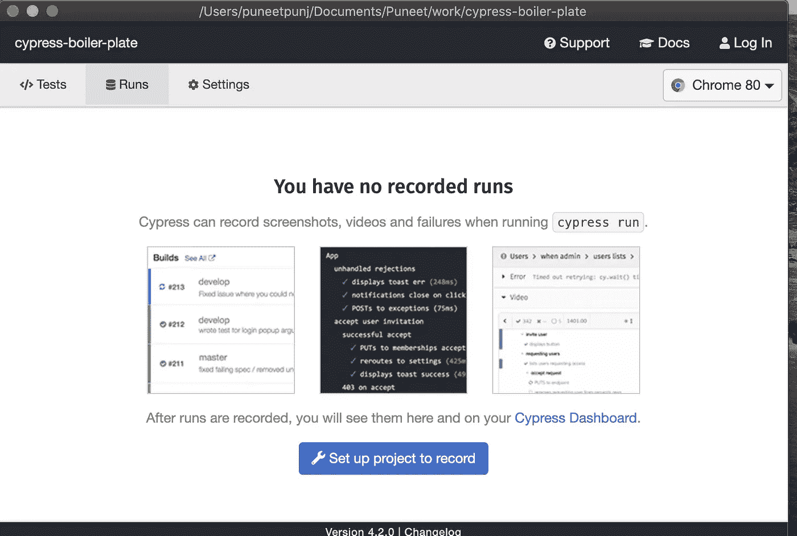

Cypress Test Runner

点击 ***设置项目记录*** 和 ***登录仪表板。*** [使用您的 google/github 帐户登录仪表板](https://dashboard.cypress.io/login)。

成功登录后，它应该带你回到测试运行和设置项目。

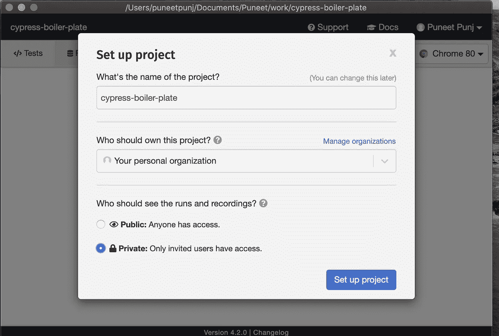

Setup Project after successful login

项目设置后，您应该看到`projectId`和`key`来记录您的执行。

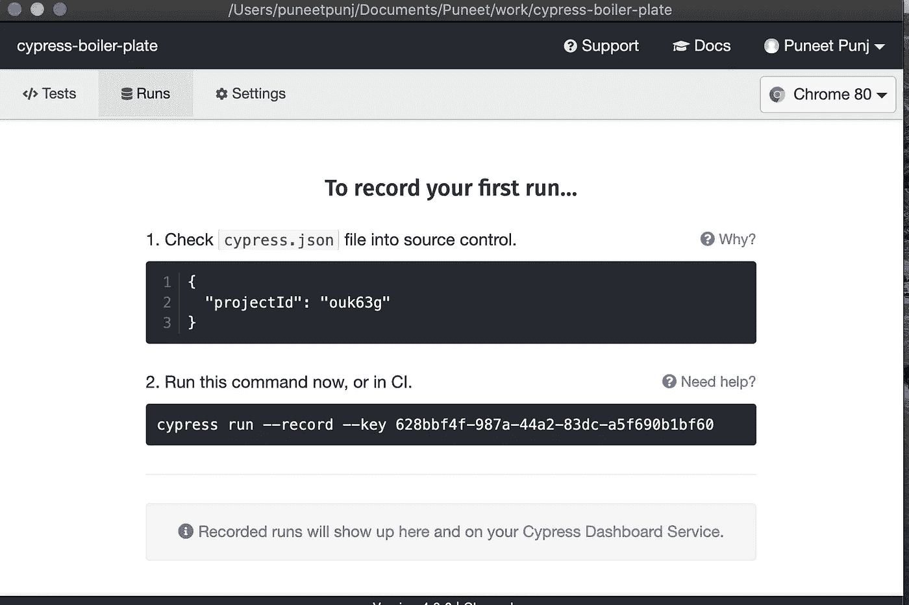

projectId and key provided by cypress for dashboard integration

打开`cypress.json`添加`projectId:”ouk63g"`键(用您在测试转轮上看到的任何值替换该值)。此外，更新`cy-runner.sh`，用`npx cypress run --record --key 628bbf4f-987a-44a2-83dc-a5f690b1bf60`替换`npx cypress run`，保留`--spec`参数，以防您运行特定的测试规范。

现在让我们尝试使用`npm run cy:run`来执行测试。执行应以**记录的运行** : <到仪表板>的 url 结束。您的本地 mochawesome 报告仍将保存在本地。

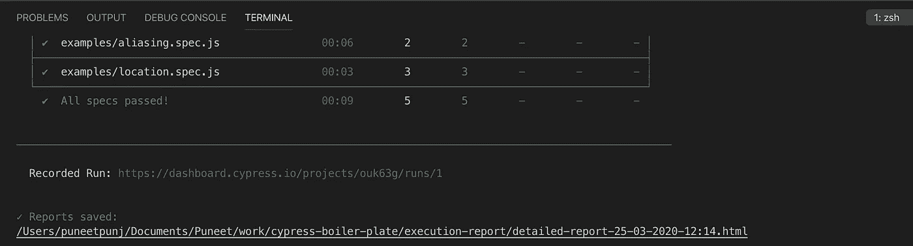

Execution using Dashboard Key

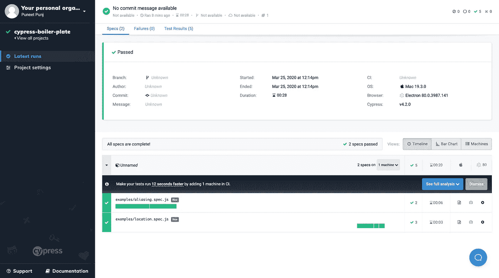

Cypress Dashboard

## **Github 集成**

目前，您可能已经注意到在上面的仪表板快照中有分支、作者、提交等字段。一旦 dashboard 与 Github 集成在一起，它就会被填充。

要集成，点击左侧窗格中的 ***项目设置*** ，向下滚动到 ***GitHub 集成*** 。

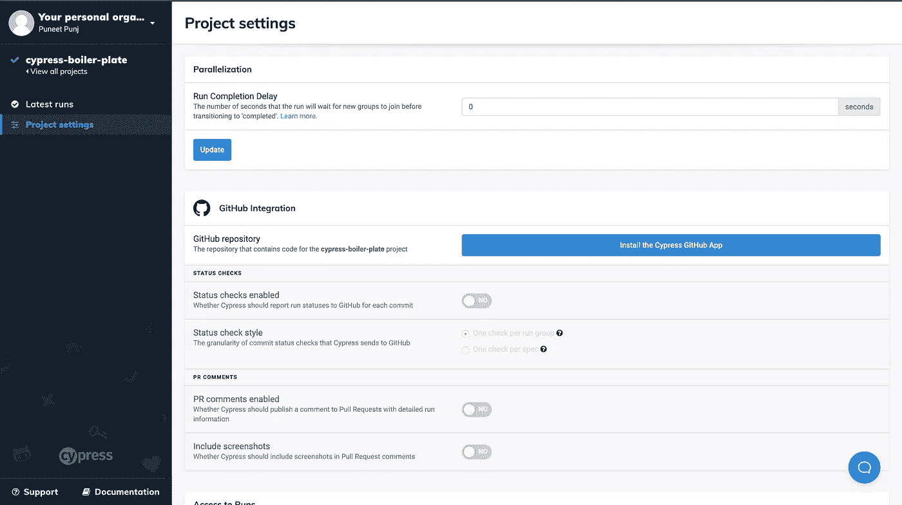

Github Integration

点击 ***安装 Cypress Github 应用*** 并按照指示提供对您的特定存储库的访问。

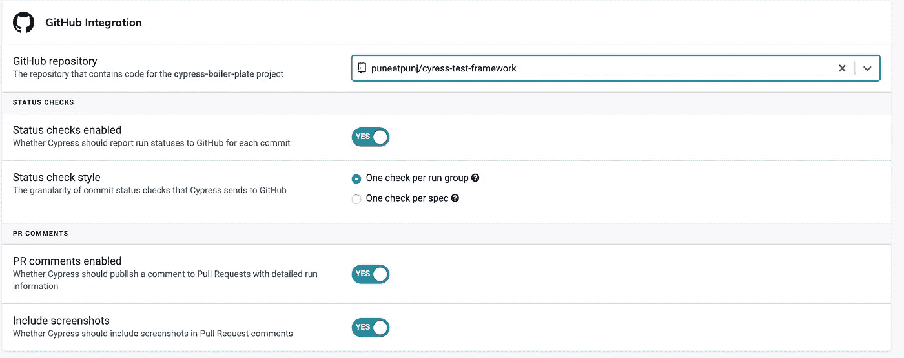

github repo integration

回到终端，再次执行测试`npm run cy:run`，它应该开始添加 git 提交的结果，看起来像这样

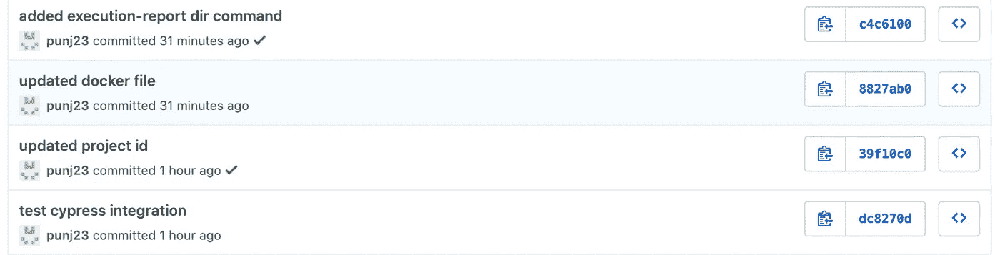

git commits sync with cypress dashboard

## CICD 码头工人

是时候构建`dockerfile`来使用 docker 执行测试，为 CICD 工具做好准备了。

创建一个新文件，并将其命名为 dockerfile — `touch dockerfile`,复制到下面的文件中

dockerfile

构建映像— `docker build -t cypressboilerplate .`
执行测试— `docker run -v "`pwd`/execution-report":/mnt/execution-report -v "`pwd`/videos":/mnt/videos -v "`pwd`/screenshots":/mnt/screenshots -it cypressboilerplate`

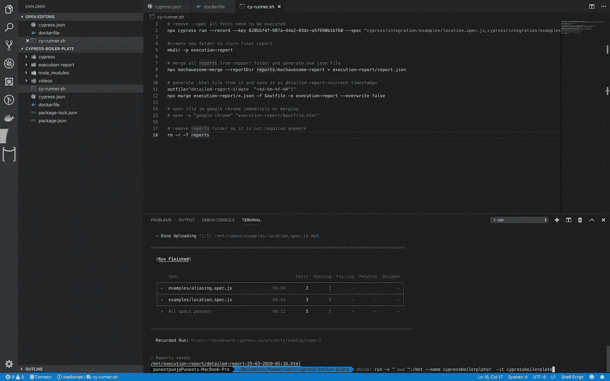

Cypress Test Execution Using Docker

*   `cypressboilerplate`是图像名称。确保在`build`和`run`命令中进行更改，以防您想要更新它。
*   注释掉`cy-runner.sh`中的第 15 行，因为如果在容器内运行，报告不会自动打开
*   `-v "'pwd'":/mnt`安装此卷将帮助您更新测试并立即运行它们，而无需重新构建映像

**就这样，你的测试是可移植的，可以在 CICD 工具中运行了**

## [珀西的视觉测试](https://docs.percy.io/docs/cypress)

作为本文的一部分，我想讨论的最后一个主题是视觉测试。这是我参与的大多数项目所需要的，除非只有后端测试，所以我想在这里包括它的设置。

*   注册[珀西](https://percy.io/login)账户，如果你还没有的话。
*   一旦登录并创建了一个新项目，复制`PERCY_TOKEN`
*   进入终端，运行`npm i @percy/cypress -D`安装 percy 的包
*   在`cypress/**support**/command.js`中添加以下代码:
    `import '@percy/cypress';`
*   在`cypress/**plugins**/index.js`中添加以下代码:
    `const percyHealthCheck = require('@percy/cypress/task')
    module.exports = (on, config) =>{
    on("task", percyHealthCheck)
    }`
*   通过在 cy-runner.sh 中添加以下内容作为第一行来设置 PERCY _ TOKEN:
    `export PERCY_TOKEN= <your token copied in second step>`
*   转到任何可用的样本测试规范，我正在使用`cypress/integration/examples/actions.spec.js`
*   在第 11 行的`cy.visit`命令后添加以下代码到本规范`cy.percySnapshot('Action Page')`的第一次测试中。
*   最后一步是更改`cy-runner.sh` 中的命令，将`npx cypress run`更新为`npx percy exec -- cypress run`
    保持所有其他参数——record 和——spec 不变

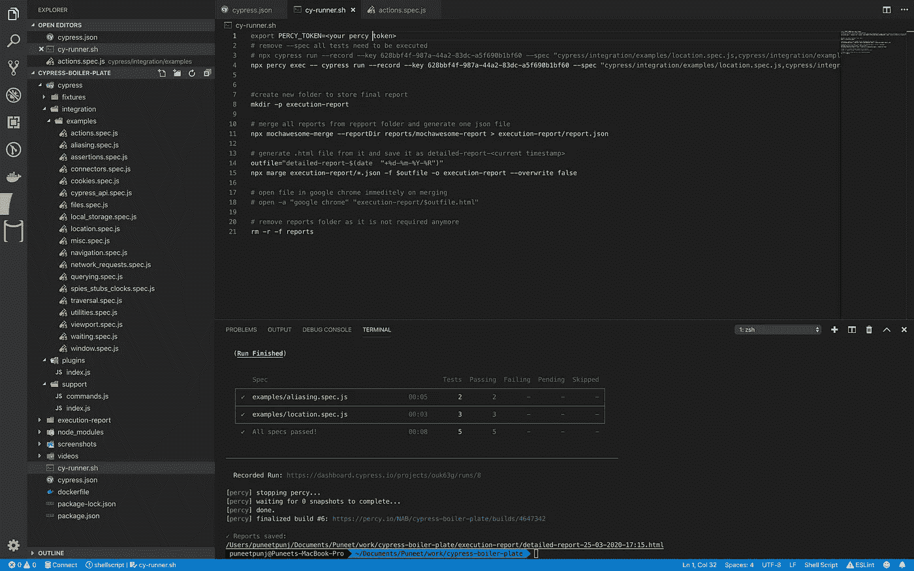

Percy/Cypress execution

**就这样，你已经准备好使用 percy 和 cypress 进行视觉测试了。**

## 主题设置

cypress 提供的一个很酷的东西是你可以添加额外的插件。这样可以更容易地将 ***测试者*** 的主题从无聊的浅白色背景改为黑暗/万圣节主题，作为标准插件的一部分。

*   安装包`npm i cypress-dark -D`
*   转到`cypress/support/index.js`并添加`require('cypress-dark/src/halloween')`或正常黑暗`require('cypress-dark')`
*   打开测试运行器`npx cypress open`，执行任何测试，您的测试运行器应该如下所示:)

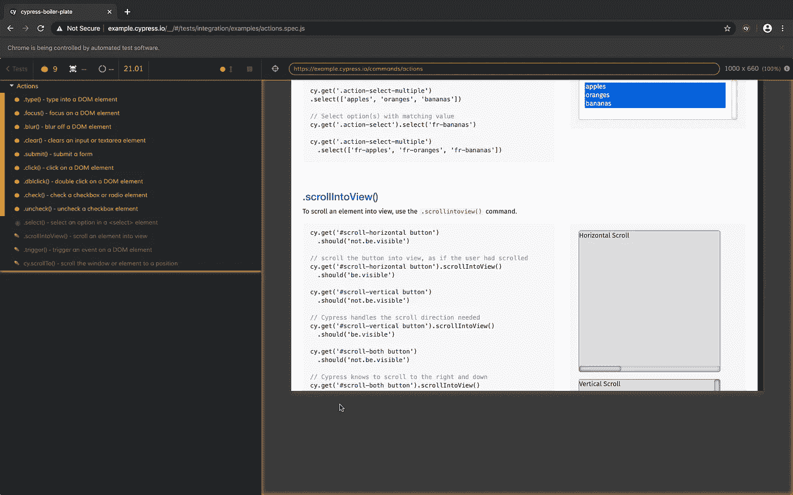

代码可在 git [这里](https://github.com/puneetpunj/cypress-boiler-plate)获得。让我知道任何反馈意见。

用简单英语写的 JavaScript 的注释:我们总是对帮助推广高质量的内容感兴趣。如果你有一篇文章想用简单的英语提交给 JavaScript，用你的中级用户名发邮件到[submissions@javascriptinplainenglish.com](mailto:submissions@javascriptinplainenglish.com)给我们，我们会把你添加为作者。