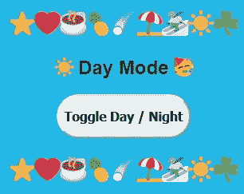
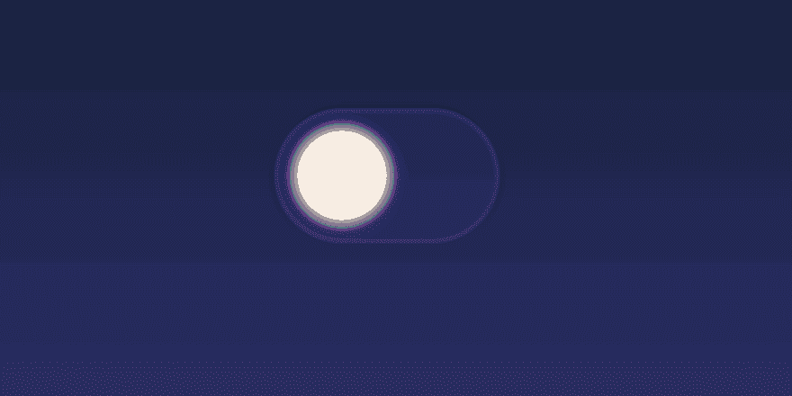

# 如何将黑暗模式添加到 React 应用程序

> 原文：<https://javascript.plainenglish.io/dark-mode-for-any-react-app-2019-part-1-of-a-series-on-day-night-toggles-b320ece903f7?source=collection_archive---------0----------------------->

## 让我们在 React 中切换白天/夜晚

Learn how to add Dark Mode to ANY React app using the NPM package *use-dark-mode*

在这篇文章中，我将用两行 JavaScript 代码展示如何给 React 网站或应用程序添加黑暗模式。**试试我下面的现场演示:**

Thanks CodeSandbox.io for the awesome embeddable React app! And it’s free!

# 为什么不从头开始编程黑暗模式？

你有没有想过在你的网站或者 app 上创建一个黑暗模式的效果？对我来说，我一直认为黑暗模式是最酷，最光滑的功能。

和 ***通常*** 这是一个编程项目，你可以真正炫耀你的印章，交换这个和搞乱那个，因为你灵活一些技能。

事实上，我的朋友 [Maxime Heckel](https://medium.com/u/25ade300ab5?source=post_page-----b320ece903f7--------------------------------) 有一篇很棒的文章“关灯”,他使用 React Hooks &上下文创建了一个黑暗模式。

 [## 关灯——用上下文和钩子给你的 React 应用程序添加黑暗模式

### 在这篇文章中，我将与你分享我是如何为一个带有情感主题的 React 应用程序构建黑暗模式支持的。

medium.com](https://medium.com/maxime-heckel/switching-off-the-lights-adding-dark-mode-to-your-react-app-with-context-and-hooks-f41da6e07269) 

# 只有两行代码的解决方案:使用黑暗模式

在 React Hooks 之前，黑暗模式应用是可能的，但是需要几个事件监听器。如上面的 [Maxime Heckel](https://medium.com/u/25ade300ab5?source=post_page-----b320ece903f7--------------------------------) 所示，Hooks & Context 使这变得更加容易，但是仍然需要将近 100 行代码来实现。

2019 年，在 React 中创建的任何网站或应用程序添加黑暗模式的最佳方式是使用 *use-dark-mode* ！**为什么？只有 2 行代码！！！**查看一下:

哇，这是伟大功能的快速实现！🥳

**关于*使用黑暗模式*你可以从它的源码库中了解更多:**
NPMjs:[https://www.npmjs.com/package/use-dark-mode](https://www.npmjs.com/package/use-dark-mode)
GitHub:[https://github.com/donavon/use-dark-mode](https://github.com/donavon/use-dark-mode)

# 如何用 CSS 得到动画日落效果？

动画日落效果借鉴了杰克-爱德华·奥利弗的一个很棒的昼夜切换例子。他创造了一种流行的日间&夜间效果！

在 CSS 中，它与一个巨大的梯度一起工作，有效地从白天到晚上推动 ***高度:1000vh*** 然后***&:{ top:-900 VH；}*** *。*

Source: [https://codemyui.com/day-night-toggle-switch-animation/](https://codemyui.com/day-night-toggle-switch-animation/) by [Jack-Edward Oliver](https://medium.com/u/75bb7332c494?source=post_page-----b320ece903f7--------------------------------)

这是我的 React 应用的现场演示的 JavaScript 源代码:

**Thanks to use-dark-mode author** [**Donavon West**](https://medium.com/u/8d9cdceed961?source=post_page-----b320ece903f7--------------------------------) **for help refactoring! Follow him on Twitter @donavon** ☕

# 喜欢这篇文章吗？更多内容即将推出！

我的计划是在这个系列中再写几篇文章，在每一步添加或改变功能，直到我们有一个极好的黑暗模式切换！

下一步将使切换本身看起来更酷和更有活力，可能通过实现上面例子中的太阳和月亮切换:

 [## 日夜拨动开关动画ξℂ𝕠𝕕𝕖𝕄𝕪𝕌𝕀

### 图片:白天和晚上切换开关动画 GIF 一个白天/晚上切换开关，当你…

codemyui.com](https://codemyui.com/day-night-toggle-switch-animation/) 

德里克·奥斯汀博士是《职业编程:如何在 6 个月内成为一名成功的 6 位数程序员 》一书的作者，该书现已在亚马逊上架。