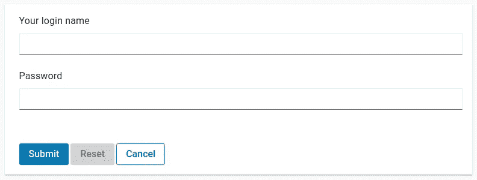
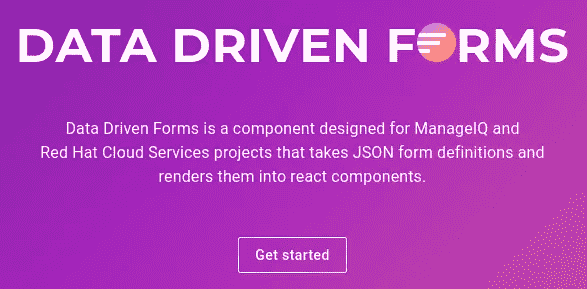
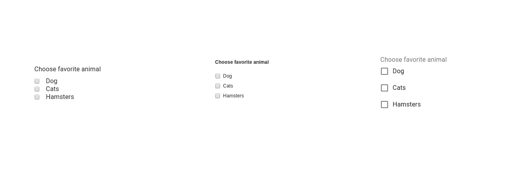
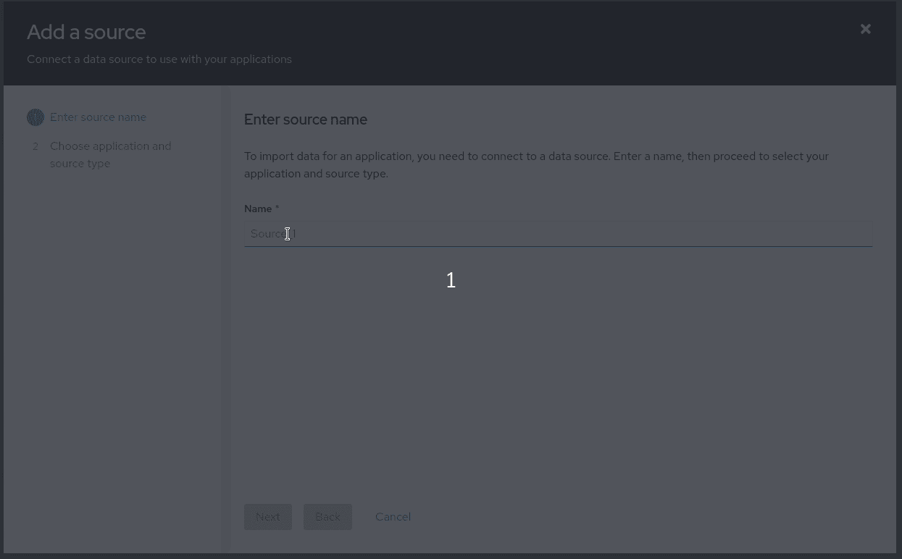

# React 表单的数据驱动方法

> 原文：<https://javascript.plainenglish.io/data-driven-approach-to-forms-with-react-c69fd4ea7923?source=collection_archive---------2----------------------->


Image by [xresch](https://pixabay.com/illustrations/analytics-information-innovation-3088958/)

毫无疑问，表单是用户和 web 服务器之间最基本的交互模式。从第一次登录到最后一次订单确认，所有这些操作仍然由一些 HTML 元素作为输入或按钮来处理。由于 JavaScript 的这种高度重要性和新兴力量，表单变得越来越复杂。异步验证和提交、动态元素、基于触摸的控件、支持不同本地化配置的复杂的多搜索下拉菜单以及许多更高级的功能正在缓慢但肯定地取代简单的静态 HTML 页面。

但是如何处理大型项目中这些无休止的变化呢？其中之一， [ManageIQ](https://www.manageiq.org/) ，一个管理云的开源工具，从 2006 年开始开发至今，包含了一百多个表单。所有这些都是不同的:大多数表单都是用 Ruby on Rails 提供动态特性的传统方式编写的，只有少数使用 AngularJS。然而，由于技术仍在向前发展，ManageIQ 决定改用 [ReactJS](https://reactjs.org/) ，团队必须想出一个解决方案，使未来的开发更容易、更易维护和测试。

首先，该团队研究了可以处理表单的 React 库。而且有很多: [Formik](https://github.com/jaredpalmer/formik) ， [ReduxForm](https://redux-form.com/8.2.2/) ， [Final Form](https://final-form.org/) 等等很多。问题得到了解决，并提供了所有需要的特性。这些库是先进的，它们提供了开发人员需要的一切。然而，开发人员仍然必须编写 HTML 标记(尽管它是以 JSX 的形式)，并且需要使用大量的 JavaScript/React 代码来实现所有这些功能。因此，实际上什么都没有解决，因为问题将在未来出现，当团队决定转向另一种技术(*也许是苗条？*wink** )

有许多关于如何处理它的讨论，但最终，数据驱动的方法被选为解决方案。它实际上意味着什么？因为您已经阅读了标题，所以您可能有一些想法，但本质上它意味着不用编写 HTML 标记和 JavaScript 代码，而是编写简单的数据，不依赖于所使用的技术。我们也可以称之为编写表单的声明式方法。与声明性范例一样，程序员不需要指定如何构建表单，只需要指定用户应该看到什么以及它应该如何表现。其他的都是靠魔法完成的。(不是真的靠魔法，而是靠大量代码……别担心，我们会实现的。)

听起来很简单？真的是。我给你举个例子。假设我们需要构建一个简单的登录页面，包含登录名和密码。(目前，我们选择哪个库并不重要。)首先我们要用一种标准的方式来写:

```
<form onSubmit={onSubmit}>
  <input type="text" name="login">Your login name</input>
  <input type="password" name="password">Password</input>
  <button type="submit">Your login</button>
</form>
```

还是简单吧？现在依然如此。然而，当用户在没有输入任何信息的情况下点击按钮时，他们希望看到哪些输入是必需的。

```
<form onSubmit={onSubmit}>
  <input type="text" name="login">Your login name</input>
  **{!login.meta.valid && 'This field is required'}**
  <input type="password" name="password">Password</input>  
  **{!password.meta.valid && 'This field is required'}**
  <button type="submit">Your login</button>
</form>
```

太好了。所有的开发者和用户都很高兴……但是没有，UX 团队决定显示一个带有警告三角形图标的模态组件，而不是简单的文本。让我们再次改变标记…开玩笑，我希望你已经得到了图片。在正常情况下，每一个变化，即使只是一个小的变化，随着大量代码的改变也会很痛苦。这是可管理的——在一个小项目中这完全没问题，但是在一个有数百个表单的项目中呢？不不可能。即使您最终使用了少量的可重用组件，这种方法也不能让您使用不同的技术，并且当您决定改变它时，所有的表单都必须从头开始构建。

让我们看看如何以 React 库中使用的格式处理这个表单，[数据驱动表单](https://data-driven-forms.org/):

```
const schema = {
    fields: [{
        component: 'text-field',
        name: 'login',
        label: 'Your login name'
    }, {
        component: 'text-field',
        type: 'password',
        name: 'password',
        label: 'Password'
    }]
}
```

当我们将 HTML 数据转换成 JSON 时，我们只需将其属性复制到正确的键上。而且这些键大部分都是一样的。name 属性变为 name，type 为 type，label 为 label。组件是来自映射器的一个组件的名称(稍后将详细介绍)。)键很简单，不言自明。你不需要知道任何关于 HTML 或者 React 的东西，你仍然能够编写你自己的复杂表单…

…哦，不，我们忘记添加必要的警告了！让我们修理它。

```
const schema = {
    fields: [{
        component: 'text-field',
        name: 'login',
        label: 'Your login name',
 **validate: [{
            type: 'required-validator'
        }]**
    }, {
        component: 'text-field',
        type: 'password',
        name: 'password',
        label: 'Password',
 **validate: [{
            type: 'required-validator'
        }]**
    }]
}
```

三角模态的东西呢？嗯，我们根本不需要改变表单中的任何内容。但是让我们等到实现的时候再说。现在还是来说说这种方式的优势，以及它给我们带来了什么。



PatternFly 4 visualization of the form using the schema. You can test it yourself [here](https://data-driven-forms.org/live-editor).

您已经看到，它编码简单，易于阅读，并且可以在 CTRL-F 和 CTRL-V 的帮助下毫不犹豫地进行更改。此外，顾名思义，您可以将这些数据保存在数据库中，这样 web 开发团队和那些开发最新 iOS 应用程序的酷哥们就可以共享这些数据，并在不同的编程语言和技术中使用它们。我们不需要再谈论可升级性了。无论您使用哪个版本的 React，也无论您决定将数据保存在什么格式或什么位置，数据就是数据。

太棒了，不是吗？当然，也有一些仅仅在 JSON 中存储信息难以处理的缺陷。(但也不是不可能！)例如，对于每个提交动作，我们仍然使用单独的编码函数，因为每个提交动作是不同的。但是如果您的团队已经很好地设计了 API，那么您也可以将 API 端点存储在模式中，并以通用的方式使用它。使用复杂的文本组件可能会导致另一个问题，因为不可能在数据库中用 JSON 存储 React 组件。然而，即使在这里，您仍然可以使用一些文本格式(如 markdown ),然后将文本转换成您需要的组件。



Data Driven Forms is a React library used to change your data into React forms.

# 数据驱动表单

现在，是时候进入使用数据驱动方法的更具体的例子了。在上文中，我提到了我们的自定义开源库，[数据驱动表单](https://data-driven-forms.org/)。它是一个 React 模块，基本上可以处理标准 web 表单的所有特性。这在另一个提到的库的帮助下是可能的，[最终形式](https://final-form.org/)。最终表单完全处理表单状态、验证和所有重要的东西。如果您更感兴趣，请在另一个选项卡中打开它的文档页面并继续阅读！

数据驱动表单由两个独立的组件组成:表单呈现器和映射器。表单渲染器全部由数据驱动表单提供，其职责是使用最终表单将数据解析到表单中，并提供所有功能，因此所有表单的行为都是相同的。映射器是一个不同的故事，你可以轻松地创建你自己的或者你可以使用数据驱动表单团队提供的三个映射器之一: [PatternFly 3](https://www.patternfly.org/v3/) 、 [PatternFly 4](https://www.patternfly.org/v4/) 和 [Material-UI](https://material-ui.com/) 。映射器顾名思义。它是一组将提供的功能(通过传递的属性)映射到 React 组件的组件。不多不少。每个映射器都包含了设计库中的组件，如您在名称中所见。



Same data, different mapper (from the left: PatternFly 4, PatternFly 3, Material-UI)

让我们回到前面的例子来提醒我们数据是什么样子的:

```
const **schema** = {
    fields: [{
        component: 'text-field',
        name: 'login',
        label: 'Your login name',
        validate: [{
            type: 'required-validator'
        }]
    }, {
        component: 'text-field',
        type: 'password',
        name: 'password',
        label: 'Password',
        validate: [{
            type: 'required-validator'
        }]
    }]
}
```

现在，让我们看看如何在数据驱动表单中使用该模式:

```
import React from 'react';
import FormRenderer from '[@data](http://twitter.com/data)-driven-forms/react-form-renderer';
import { **formFieldsMapper**, **layoutMapper** } from '[@data](http://twitter.com/data)-driven-forms/mui-component-mapper';const Form = () => (
  <FormRenderer
    schema={schema}
    formFieldsMapper={formFieldsMapper}
    layoutMapper={layoutMapper}
    **onSubmit**={console.log}
  />
)
```

那么，这里发生了什么？ [FormRenderer](https://www.npmjs.com/package/@data-driven-forms/react-form-renderer) 是将你的数据转换成表单的组件。只有四个必需的[道具](https://data-driven-forms.org/renderer/renderer-api#requiredprops) : **schema** 是具有特定格式的 JSON 数据， **formFieldsMapper** 是一组创建表单元素并能够访问表单状态并更改表单状态的组件， **layoutMapper** 是一组像表单包装器或按钮这样的几个特定组件，它们不能从数据中呈现在表单中，也不能更改表单。这两个映射器捆绑在一起。最后一个道具是一个 **onSubmit** ，它只是一个函数，在表单中按下 Enter 或 Submit 按钮后被调用。你可以使用更多的[道具](https://data-driven-forms.org/renderer/renderer-api#optionalprops)，这允许更多的定制(重置、取消……)

这再简单不过了。你写了一份可以立即使用的表格。仅此而已。故事结束。

等等。你是不是已经写了很多有很多自定义组件的表单了？嗯，这是编写自定义映射器的最佳时机。下面，您可以看到一个只有一个组件的基本示例:

```
const TextField = ({ name, type = 'text', **meta**, **input**, label }) => {
  **const { error, touched } = meta;**return (<div>
    <label htmlFor={ name }>{ label }</label>
    <input type={ type } onChange={ input.onChange } value={ input.value }/>
    **{ touched && error }**
  </div>);
};formFieldsMapper = {
  'text-field': TextField,
};
```

让我们一起解开它。该组件只是您了解和喜爱的基本 React 组件。您会注意到它从模式中获取所有属性，比如名称、类型或标签。不过新增了两个道具: [**输入**](https://data-driven-forms.org/renderer/field-provider#input) 和 [**meta**](https://data-driven-forms.org/renderer/field-provider#meta) 。这些属性由表单渲染器提供，它们是映射器获得的最重要的属性: **meta** 是一个对象，它包括关于字段的各种元数据:dirty、priest、modified 等。而**输入**是一个提供值和方法来改变表单状态的对象。如果您想知道 validate 属性去了哪里，答案很简单——验证完全由表单呈现器处理，组件不需要知道它。



A wizard form created using the PatternFly 4 mapper. Different steps for each source type are defined in the JSON schema. It’s easy to add new steps, remove old ones or add a completely new wizard branch. All wizard features (jumping back, switching steps, …) are controlled by the mapper, so there is no need to implement anything in the form itself.

完成了。另一个故事的结尾。但实际上，它更复杂；有更多的[组件](https://data-driven-forms.org/renderer/component-api)要覆盖，更多的[特性](https://github.com/data-driven-forms/react-forms)要实现。本文是对数据驱动方法世界的介绍。我已经向您展示了它的主要优点以及使用数据构建表单是多么简单。与此同时，我对诸如[向导](https://data-driven-forms.org/component-example/wizard?mapper=pf4)表单、[异步验证](https://data-driven-forms.org/renderer/validators#asyncvalidator)、[嵌套名称](https://final-form.org/docs/final-form/field-names)等许多特性保密。如果你想发现这些，请查看 GitHub 上的[我们的社区](https://github.com/data-driven-forms/react-forms)或者访问我们的[文档页面](https://data-driven-forms.org/)，在那里你可以获得你需要开始的所有信息。

> 我要特别感谢 Dayle 和 Gregg，他们帮助我完成了这篇文章。谢谢大家！

**更新**

自从写了这篇文章后，**新版本的 DDF (2.x)已经发布了**，它改变了本文中提到的一些事情:

-不再有**布局映射器**，取而代之的是使用**表单模板**(它允许更多地定制表单)
-一些常量已被更改(**必需-验证器**'改为'**必需** ')
-定制字段必须使用 **useFieldApi** 或 **FieldProvider** 与表单连接(文本字段没有自动连接)

有 v1 到 v2 的升级指南:
[https://data-driven-forms.org/migration-guide](https://data-driven-forms.org/migration-guide)

你也可以查看 DDF 的最新文章:[https://medium . com/JavaScript-in-plain-English/data-driven-form-building-in-react-30768 b49 e 625](https://medium.com/javascript-in-plain-english/data-driven-form-building-in-react-30768b49e625)

material UI mapper[https://medium . com/JavaScript-in-plain-English/introducing-material-UI-component-mapper-for-data-driven-forms-bb 05076 f7c 8](https://medium.com/javascript-in-plain-english/introducing-material-ui-component-mapper-for-data-driven-forms-bb05076f7c8)

碳设计系统映射器[https://medium . com/JavaScript-in-plain-English/introducing-carbon-component-mapper-for-data-driven-forms-c 9221 b 604 d8e](https://medium.com/javascript-in-plain-english/introducing-carbon-component-mapper-for-data-driven-forms-c9221b604d8e)

## 进一步阅读

[](/how-to-build-your-own-surveys-extend-them-with-custom-javascript-b4c7eb5648c4) [## 如何构建自己的调查并使用定制的 JavaScript 扩展它们

### 这是一本关于如何使用自己的 JS 函数来扩充 SurveyJS 附带的条件逻辑和验证器的入门书。

javascript.plainenglish.io](/how-to-build-your-own-surveys-extend-them-with-custom-javascript-b4c7eb5648c4) 

*更多内容请看*[***plain English . io***](https://plainenglish.io/)*。报名参加我们的* [***免费周报***](http://newsletter.plainenglish.io/) *。关注我们关于*[***Twitter***](https://twitter.com/inPlainEngHQ)[***LinkedIn***](https://www.linkedin.com/company/inplainenglish/)*[***YouTube***](https://www.youtube.com/channel/UCtipWUghju290NWcn8jhyAw)*[***不和***](https://discord.gg/GtDtUAvyhW) *。***