# React 中的数据驱动表单构建

> 原文：<https://javascript.plainenglish.io/data-driven-form-building-in-react-30768b49e625?source=collection_archive---------0----------------------->

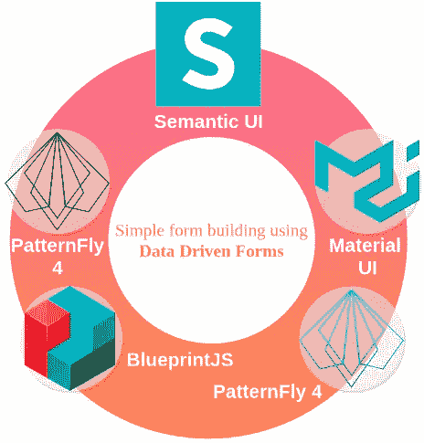

Data Driven Forms is open source React library for rendering and managing forms. Multiple design system bindings are provided.

*设计系统*是当今应用程序开发的一个非常强大的术语。每家科技公司都试图通过将其中一个整合到他们所有的应用程序中来实现一致性和简单的开发者体验。

此外，它们中的许多都是开源的，可以公开获得。为了说明这一点，我们可以提到 IBM 的 [Carbon](https://www.carbondesignsystem.com/) ，Google 的 [Material](https://material.io/design) ，或者 Red Hat 的 [PatternFly](https://www.patternfly.org/v4/) 。这些库是可定制的，易于与许多预定义的组件一起使用，因此即使是小项目也可以使用它们来使自己的开发更容易、更便宜、更快，而不会牺牲定制身份。

然而，选择一个正确的是特别困难的，当他们有这么多的时候。正因为如此，从一个简单的原型开始是一个很好的主意，但是这样做不应该花太多时间。一个有帮助的工具是[数据驱动表单](https://data-driven-forms.org/) ( *DDF* )，一个使用[数据驱动方法](https://medium.com/javascript-in-plain-english/data-driven-approach-to-forms-with-react-c69fd4ea7923)呈现和管理表单的 React 库。这种方法获取 JSON 数据，并将它们转换成功能齐全的形式。无需任何实际的代码知识，复杂的表单可以在几分钟内“编码”。

# 用例—创建表单模式

让我们想象一个简单的案例来实现:**一个注册表单**。根据我们*虚构的*产品管理，表单由用户必须输入的几个元素组成:

*   绰号
*   电子邮件
*   密码
*   确认口令
*   条款确认

我们可以根据其[定义](https://data-driven-forms.org/renderer/renderer-api#schema)直接开始定义数据驱动表单模式。

```
const schema = {
  fields: [] 
}
```

模式是一个包含一个必需属性的对象:**字段**。表单域的数组。每一个都是由只有[两个必需属性](https://data-driven-forms.org/renderer/component-api#commonpropsforallformfields) : **名称**和**组件**的对象定义的。

```
**const field = {
  name: ...,
  component: ...,**
  ...additionalAttributes
**}**
```

它们都是字符串值，定义了它们的名字的确切含义。**组件**依赖于一组使用的组件，但是在数据驱动表单提供的库中，我们可以在`text-field, select, checkbox, radio, textarea, ...`等关键字下找到[所有的基本表单组件](https://data-driven-forms.org/renderer/component-api)。然后这些组件实现它们的自定义属性，大部分都是共享的:`label, helperText, options, ...`。在 React 中，属性对应于组件属性。

因此，让我们将元素转换为字段定义:

*   **昵称**

```
{
  name: 'nickname',
  component: 'text-field'
}
```

然而，这显然不足以满足(*也是虚构的* ) UX 的要求。没有标签和验证——使用这样的配置，它只是一个 HTML 输入元素。幸运的是，在数据驱动的表单中，修复非常简单:

```
{
  name: 'nickname',
  component: 'text-field'
 **label: 'Nick name',
  validate: [{type: 'required'}],** }
```

引入了两个新属性:**标签**和**验证**。 [**Validate**](https://data-driven-forms.org/renderer/validators) 是一组验证器——对象或函数。数据驱动表单提供了覆盖大多数情况(长度、模式)的基本验证，但也可以通过提供[函数](https://data-driven-forms.org/renderer/validators#customfunction)来定制(也支持[异步函数](https://data-driven-forms.org/renderer/validators#asyncvalidator)))或者使用`[validatorMapper](https://data-driven-forms.org/renderer/validators#customvalidatormapper)`来定义自定义类型。然后，可以在基于字符串的对象中使用这些自定义类型。

`[**required**](https://data-driven-forms.org/renderer/validators#requiredvalidator)` [验证器](https://data-driven-forms.org/renderer/validators#requiredvalidator)是库实现的验证器之一，我们可以马上使用。(我们可以向字段添加另一个属性: **isRequired，**一个布尔值，它向字段追加一个必需的标记。然而，在我们的表单中，所有的输入都是必需的，所以最好在表单的开头加上一条注释。我们以后再做。)

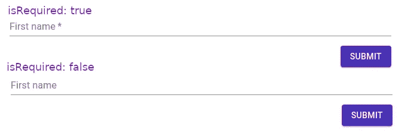

The difference between **isRequired**. (Material UI design)

*   **邮件**

我们可以使用前一段中获得的知识为电子邮件编写相同的对象，但电子邮件有一个额外的格式限制。我们将使用`[**pattern**](https://data-driven-forms.org/renderer/validators#patternvalidators)` [v](https://data-driven-forms.org/renderer/validators#patternvalidators) 验证类型来执行它。

```
{
  name: 'email',
  component: 'text-field',
  label: 'Email',
  validate: [{ 
    type: 'required' 
  } ,**{
    type: 'pattern',
    pattern: '[a-z0-9._%+-]+@[a-z0-9.-]+.[a-z]{2,}$',
    message: 'Not valid email'
  }**],
}
```

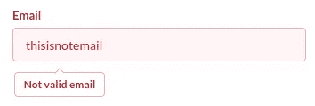

**Validation** triggered on the email field. (Semantic UI design)

*   **密码**

```
{
  name: 'password',
  component: 'text-field',
  label: 'Password',
  validate: [{
    type: 'required'
   }, **{
    type: 'min-length',
    threshold: 6,
   }],
  type: 'password',
  helperText: 'Password has to be at least 6 chars long'** }
```

使用了一个新的验证器类型:`min-length`确保值的长度为 6 或更长。`type: ‘password'`是标准的 HTML 输入元素类型，将值显示为点。`helperText`向字段呈现附加信息，其位置和外观取决于所使用的设计库。

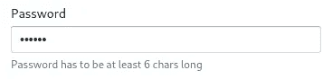

The password field with **helperText** and **password** **type**. (BlueprintJS design)

*   **确认密码**

让我们在这里做一个扭曲:有一个要求，只有当用户在上面的字段中输入一些密码时，密码确认字段才会出现。从 UX 的角度来看，这没有多大意义，但是它很好地展示了数据驱动表单的另一个特性:[条件字段](https://data-driven-forms.org/renderer/condition)。

```
{
  name: 'confirm-password',
  component: 'text-field',
  type: 'password',
  validate: [{type: 'required'}],
  label: 'Confirm your password',
  **condition: {when: 'password', isNotEmpty: true}**
}
```

数据驱动表单提供了几种类型的条件——其中之一是`[isNotEmpty](https://data-driven-forms.org/renderer/condition#isnotempty)`。使用这种类型，我们可以确保用户必须首先输入密码。DDF 还允许嵌套条件( *AND，OR，NOT* )，因此所有的组合都是可能的。

但是，我们仍然缺少检查确认是否与密码相同。如前所述，我们可以通过在 validate 数组中提供一个函数或者在`validatorMapper`中添加一个自定义类型来实现。我们将使用第二个选项，因为我们需要访问所有值:

```
**const validatorMapper = { 
   'same-password': () => (value, allValues) => value !== allValues.password ? 'Password do not match' : undefined
}**
```

注意，验证器是一个返回函数的函数(*高阶函数*)。)这个构造允许缓存结果或传递来自模式的附加参数。我们稍后将使用这个对象作为道具。现在，我们可以在验证数组中使用这种类型:

```
...
validate: [**{type: 'same-password'}**]
...
```

请注意，我们可以删除必需的验证器，因为它已经在初始密码字段中被选中。

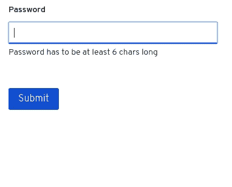

**Cross-field validation** and **conditional field**. (PatternFly 4 design)

*   **条款确认**

```
{
  name: 'terms',
  **component: 'checkbox',**
  label: 'I agree with our business terms',
  validate: [{type: 'required'}]
}
```

更换组件很简单——只需更换组件字符串**。其他的都一样。**


**Checkbox** component. (PatternFly 3 design)

# **最终模式**

现在，我们可以通过添加标题和描述将所有字段放在最终模式中:

```
const schema = {
 **title: 'Registration form',
    description: 'All fields are required',**
    fields: [{
            name: 'nickname',
            component: 'text-field',
            label: 'Nick name',
            validate: [{
                type: 'required'
            }]
        },
        {
            name: 'email',
            component: 'text-field',
            label: 'Email',
            validate: [{
                    type: 'required'
                },
                {
                    type: 'pattern',
                    pattern: '[a-z0-9._%+-]+@[a-z0-9.-]+.[a-z]{2,}$',
                    message: 'Not valid email'
                }
            ]
        },
        {
            name: 'password',
            component: 'text-field',
            label: 'Password',
            validate: [{
                    type: 'required'
                },
                {
                    type: 'min-length',
                    threshold: 6
                }
            ],
            type: 'password',
            helperText: 'Password has to be at least 6 chars long'
        },
        {
            name: 'confirm-password',
            component: 'text-field',
            type: 'password',
            validate: [{type: 'same-password'}],
            label: 'Confirm your password',
            condition: {
                when: 'password',
                isNotEmpty: true
            }
        },
        {
            name: 'terms',
            component: 'checkbox',
            label: 'I agree with our business terms',
            validate: [{
                type: 'required'
            }]
        }
    ]
};
```

> **在短短的几分钟内，我们已经编写了一个具有许多高级特性的全功能、人类可读的表单。**

现在，让我们在 React 项目中实现它。

# 数据驱动表单的使用

我们要做的第一件事就是安装[**r**](https://www.npmjs.com/package/@data-driven-forms/react-form-renderer)**eact-form-renderer:**

```
npm install --save @data-driven-forms/react-form-renderer
```

或者

```
yarn add @data-driven-forms/react-form-renderer
```

这是数据驱动表单库的核心。渲染器是负责将模式转换成 React 组件的组件，它提供了我们在本文中提到的所有特性。

安装后，我们可以将它导入到我们的项目中:

```
import React from 'react';
**import FormRenderer from '@data-driven-forms/react-form-renderer';***// if you want to treeshake the component
// import FormRenderer from '@data-driven-forms/react-form-renderer/dist/cjs/form-renderer';*const schema = { ... }; *// defined earlier* const validatorMapper = { ... }; *// defined earlier, not required* const App = () => {
 return(
 **<FormRenderer 
      schema={schema}
      onSubmit={(values, formApi) => console.log(values)}
      FormTemplate={FormTemplate}
      componentMapper={componentMapper}** validatorMapper={validatorMapper} *// not required* **/>**
 )
};
```

**onSubmit** 是一个提交函数。通常，它是一个向 API 端点发出请求的函数。**模式**是我们在前一章中创建的对象。但是仍然缺少两个道具: **FormTemplate** 和 **componentMapper** 。这就是本文的要点:这两个属性定义了表单使用的组件。[**component mapper**](https://data-driven-forms.org/renderer/component-mapping)**包括我们在模式中使用的组件:*文本字段*、*复选框*等。[**form template**](https://data-driven-forms.org/renderer/form-template)**包装表单，呈现按钮，显示标题。****

****我们可以实现自己的组件和模板，但数据驱动表单提供了多个准备好的库:****

*   ****[物料 UI](https://data-driven-forms.org/mappers/mui-component-mapper)****
*   ****[蓝图](https://data-driven-forms.org/mappers/blueprint-component-mapper)****
*   ****[语义 UI 反应](https://data-driven-forms.org/mappers/suir-component-mapper)****
*   ****[模式 3](https://data-driven-forms.org/mappers/pf3-component-mapper)****
*   ****[PatternFly 4](https://data-driven-forms.org/mappers/pf4-component-mapper)****

****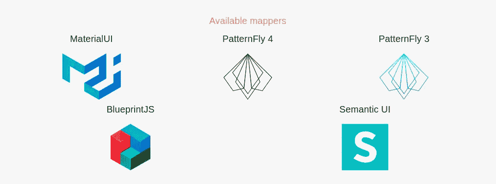****

****Available Data Driven Forms mappers libraries.****

****我们称这些库为“**映射器**”，因为它们**将**数据驱动表单属性和特征映射到库的道具。例如，模式中的`label`属性被映射到`FormLabel`材质 UI 组件。****

****这些地图绘制器的使用非常简单。安装它们，导入它们并在渲染器组件中使用它们。****

```
**import React from 'react';
import FormRenderer from '@data-driven-forms/react-form-renderer';**import { FormTemplate, componentMapper } from '@data-driven-forms/mui-component-mapper';***// you can also treeshake whatever component you need
// import FormTemplate from '@data-driven-forms/mui-component-mapper/dist/cjs/form-template';
// import TextField from '@data-driven-forms/mui-component-mapper/dist/cjs/text-field';
// import Checkbox from '@data-driven-forms/mui-component-mapper/dist/cjs/checkbox';
// const componentMapper = { 'text-field': TextField, checkbox: Checkbox }*const schema = { ... }; *// defined earlier* const validatorMapper = { ... }; *// defined earlier*const App = () => {
 return(
    <FormRenderer 
      schema={schema}
      onSubmit={(values, formApi) => console.log(values)}
 **FormTemplate={FormTemplate}
      componentMapper={componentMapper}**      validatorMapper={validatorMapper}    />
 )
};**
```

> ******因为所有 mappers 的 API 都是一样的，所以我们可以在它们之间快速切换，选择一个我们最喜欢的。******

****然而，**我们仍然必须单独安装组件库和它们的样式**。数据驱动表单文档页面提供了指向每个库的安装指南的链接，或者您可以使用下面的示例作为起点。请注意，有些库会覆盖全局样式，因此请确保一次只包含其中一个样式。****

## ****材料用户界面表单****

****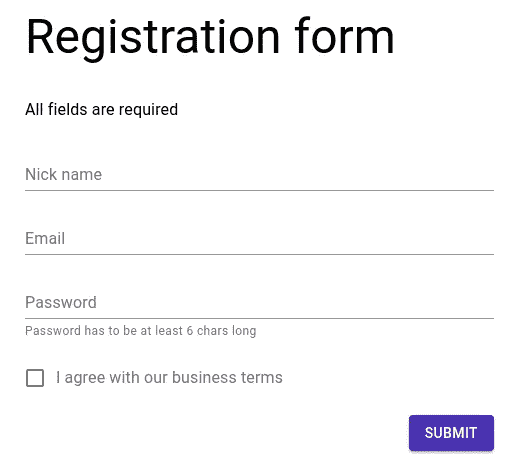****

****Material UI form.****

## ****蓝图表单****

****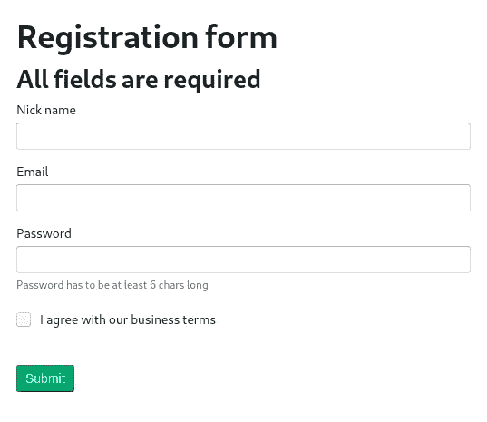****

****BlueprintJS form.****

## ****语义用户界面表单****

****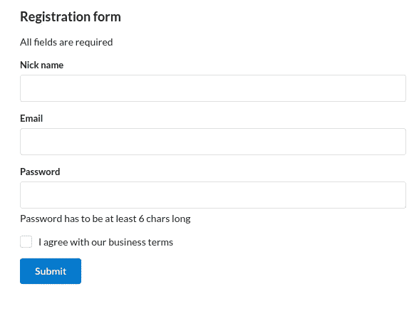****

****Semantic UI form.****

## ****模式 4 表格****

****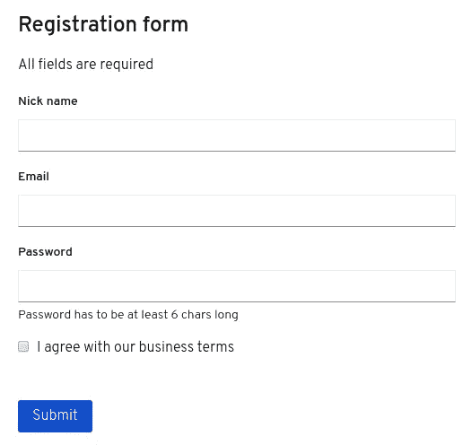****

****PatternFly 4 form.****

## ****模式 3 表单****

****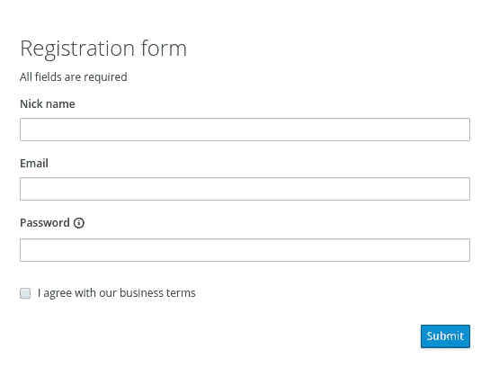****

****PatternFly 3 form.****

# ****结论****

****使用数据驱动表单，我们编写了定义表单模式的公共代码，其他一切都由库提供。我们可以运行所有这些项目，看看这些库之间有什么不同。所有这些表单都是功能齐全的，所以在原型制作期间，我们可以对整个表单进行编码，并在需要时随时切换设计库。****

****此外，定制表单的每个部分也很简单——如果您不喜欢标题或按钮，只需在 FormTemplate 中切换它们。或者您可以替换整个组件，添加您自定义的组件，等等。****

****此外，还有更复杂的组件，如[向导](https://data-driven-forms.org/component-example/wizard)或[选择](https://data-driven-forms.org/component-example/select)——从头编写它们可能需要几个小时，在数据驱动表单中使用它们就像使用*文本字段*一样简单。****

****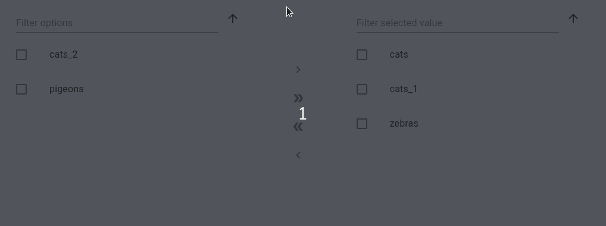****

****A [dual list select](https://data-driven-forms.org/component-example/dual-list-select) component provided by Data Driven Forms. (Material UI design)****

****如果你想使用不同的或定制的组件/设计库，数据驱动表单提供了一个简单的命令行[来生成整个包的结构，它甚至可以添加 TypeScript 定义。只需在](https://data-driven-forms.org/renderer/development-setup#generatingamappertemplate) [DDF 库](https://github.com/data-driven-forms/react-forms)的根文件夹中运行`yarn generate-template`，交互式 CLI 将会引导您。下一次，我们将看看这个命令，并作出自定义映射。****

*****[***数据驱动表单***](https://data-driven-forms.org/) ***项目完全基于***[***git hub***](https://github.com/data-driven-forms/react-forms)***。如果你觉得这个项目有趣，请加入我们的社区。我们对所有的贡献都持开放态度，我们深深感激我们得到的每一颗星星。还有一个官方推特账号***[***@ data drive infoms***](https://twitter.com/DataDrivenForms)***你可以跟着得到所有的最新消息。********

## *****简单英语中的 JavaScript*****

*****你知道我们有四种出版物吗？通过 [**找到它们吧。简单来说**](https://plainenglish.io/)——关注我们的出版物并订阅我们的 YouTube 频道 **来表达爱意吧！*******