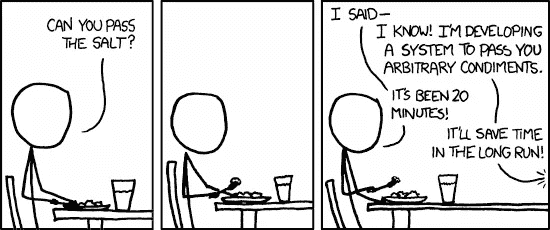

# JavaScript 中的数据封装

> 原文：<https://javascript.plainenglish.io/data-encapsulation-in-javascript-76730d89c3dc?source=collection_archive---------1----------------------->



当我第一次接触 JavaScript 时，它刚刚在 Netscape Navigator 中发布不久，它还只是一种玩具语言。它的全部和唯一的目的是做一些简单的计算和/或 DOM 重排。从那时起，这种语言已经发展到了我们实际上可以创建合理响应的应用程序和 3D 游戏的程度。这是很大的增长。

然而，尽管有这些增长，JavaScript(或者更准确地说是 ECMAScript)仍然有很大的增长空间。自从添加了对关键字`class`的支持以来，时间并不长。虽然这比带有原型对象的函数多了一点语法上的好处，但它似乎仍然没有达到目标，缺乏直接声明数据元素的能力。

虽然 TC39 并没有坐以待毙。他们实际上已经忙了将近 20 年的大部分时间，试图解决如何完全实现我们对 es 中的类的期望这个谜。这不是一个简单的壮举。我们大多数人所理解的类之所以成为可能，是因为编译器能够在代码运行之前很久就看到类的所有细节。在运行时用基于原型的语言再现这些相同的属性有点复杂。

# 简史

甚至在将`class`添加到 ES 之前，就已经有了封装或隐藏数据的需求。起初，由于默认情况下一切都是公开的，所以隐藏数据的唯一方法是使用函数的运行时环境，即它的“闭包”。然后可以创建返回函数的工厂函数，甚至是以函数为属性的对象。我们需要封装的任何数据都只是函数中声明的一个变量。因为只有返回的函数可以访问这些变量，所以数据被有效地封装了。

虽然这工作得非常好，但是当我们想要能够识别哪个函数创建了对象时，它没有多大帮助。它也没有给内存带来奇迹，因为返回函数的副本和对工厂函数的调用一样多。不知何故，这种缺乏可识别性和不必要的功能重复似乎是不对的。

最终出现了 ES5 和现在所谓的 ES5 风格的类。工厂函数的“原型”可用于保存一个对象，该对象可用作通过使用`new`调用工厂函数创建的任何对象的原型。然而，如果你想要封装，你仍然有一个问题。如果想确保封装的数据不能被外部操纵，就需要将 WeakMap 和闭包结合使用。为什么？

1.  当谈到 es 中的封装时,“闭包”真的是“唯一的游戏”。
2.  由于原型成员不再在工厂函数内部创建，闭包必须在工厂函数外部，这意味着工厂函数创建的所有实例都使用相同的闭包。解决方法是在同一个闭包内使用 WeakMap 来保存特定于实例的封装数据。

当`class`最终出现时，它在快速、干净和声明性地建立原型方面创造了奇迹。然而，人们感到缺乏数据能力。我们仍然不得不依靠“闭包”和 WeakMap。另外，我们不能使用像`this.foo`这样的东西来访问我们封装的数据，这感觉很尴尬。

# 现在

前面说过，TC39 并没有坐以待毙。他们正在尽最大努力发布一个提案，为我们提供缺失的声明性语法。我以前写过这方面的文章。

 [## ES 中即将出现的新功能:

### 类别字段

medium.com](https://medium.com/@kingmph/the-new-feature-on-the-horizon-in-es-cd0015158ceb) 

我让你来决定你的想法。虽然 TC39 已经完成了他们设定的目标，但它并没有满足对我来说很重要的几个用例。所以我回到了 ES6 的绘图板，再次尝试。这些年来，我在几个地方发表了关于我工作成果的文章，最近的一篇是:

[](https://medium.com/swlh/data-in-javascript-classes-7e15596168af) [## JavaScript 类中的数据

### 我将遵循我在许多其他这类文章中看到的模式，给你一点窥视我的…

medium.com](https://medium.com/swlh/data-in-javascript-classes-7e15596168af) 

# 图书馆

我现在带给你们的是这项工作的最新成果。这是一个我称之为**经典**的图书馆。您可以在这里找到它:

【https://github.com/rdking/ClassicJS 

我利用我所知道的关于其他语言中的类的一切，试图找到在 es 中实现该功能的最直接的方法，而不牺牲普通 es 用户的任何现有开发期望。

这被证明是相当成问题的，因为:

1.  原型上的可变对象被修改时会出现脚枪问题。
2.  由于上面的 1，类没有声明性数据，以及其他一些次要因素，开发人员已经习惯了将所有数据放在实例对象上的“最佳实践”。

尽管事实上无法修改引擎，我仍然相信我已经想出了一个很好的功能组合。因此，从现在开始，我将尽可能公平地给你比较(我是人，所以放我一马)经典和提议类字段。

# 功能性

看看下面使用 proposal-class-fields 编写的代码:

```
class Ex1_pcf {
  #data1 = { a: 1 };
  data2 = 2;
  print() {
    console.log(JSON.stringify(this.#data1, null, '  '));
  }
}
```

很紧凑，对吧？这是这项建议的主要优点之一。毫无疑问，作为模块编写的任何东西都无法达到这种语法简洁程度。然而，如果您以前从未见过该提议的语法，您能猜到发生了什么吗？如果使用 ClassicJS 查看相同的代码会怎么样:

```
let Classic = require("classicjs");
let {PUBLIC, PRIVATE, init=INIT} = Classic;
//or just
//import Classic, {PUBLIC, PRIVATE, init as INIT} from "classicjs";let Ex1_cjs = Classic({
  [PRIVATE]: {
    data1: INIT(() => ({ a: 1 }))
  },
  [PUBLIC]: {
    data2: 2,
    print() {
      console.log(JSON.stringify(this.$data1, null, '  '));
    }
  }
});
```

肯定是更重的代码，如果我没有提取`PUBLIC`、`PRIVATE`和`INIT`，它可能会看起来更重一点。然而，看了这个之后，你现在能理解没有解释的 proposal-class-fields 版本中发生了什么吗？

ClassicJS 增加的冗长让我们只需扫一眼就能明白我们在看什么。在这两个版本中，`.`后面的额外字符是必需的。任何使用过 ES5 风格的类的人都可以告诉你，ES 中的私有数据不是拥有它的对象的一部分。因此，必须有一些东西来区分公共和非公共成员。

对于 ClassicJS 还有另外一个问题。因为原型上的对象脚枪仍然在那里，助手函数`Classic.init`(或者仅仅是`INIT`)应该被用来推迟初始化直到实例构造。如您所见，它使用一个函数来返回初始值。这类似于 proposal-class-fields 在幕后为您做的工作。

虽然 ClassicJS 的语法有缺陷，但也有好处。看看这个:

```
let Classic = require("classicjs");
let {PUBLIC, PROTECTED, STATIC, init=INIT} = Classic;let Base = Classic({
  [STATIC]: {
    [PROTECTED]: {
      count: 0,
    }
  },
  [PUBLIC]: {
    someObj: INIT(() =>({ a: 1, b: 2})),
    constructor() {
      this.$count++;
    },
    print() {
      console.log(`(private Base).count = ${Base.$count}`);
      console.log(`this.someObj = ${JSON.stringify(this.someObj, null, '  ')}`);
    }
  }
});let Derived = Classic(Base, {
  [PUBLIC]: {
    resetCount() { Derived.$count = 0; }
  }
});let d = new Derived;
/**
 * Should print:
 *   (private Base).count = 1
 *   this.someObj = {
 *     a: 1,
 *     b: 2
 *   }
 */
d.print(); 
d.resetCount();
/**
 * Should print:
 *   (private Base).count = 0
 *   this.someObj = {
 *     a: 1,
 *     b: 2
 *   }
 */
d.print();
Base.prototype.someObj = INIT(42);let d2 = new Derived;
/**
 * Should print:
 *   (private Base).count = 1
 *   this.someObj = 42
 */
d2.print();let d3 = new Proxy(new Derived(), {});
/**
 * Should print:
 *   (private Base).count = 2
 *   this.someObj = 42
 */
d3.print();
```

与 proposal-class-fields 不同，可以使用 prototype 对象来更改将分配给新实例的初始化值。有对受保护成员的支持，不会泄露给他们的表亲。最重要的是，在使用非公共成员时支持代理。不幸的是，建议类字段不会给你这些。

# 权衡取舍

在我的“新特性”文章中，我列出了一系列潜在的严重权衡，这些权衡是为了创建提议类字段而做出的。要明白，这样的特性永远不会完全没有取舍。因此，我觉得列出使用 ClassicJS 的利弊是公平的:

1.  它使用代理来支持实例和静态非公共成员以及相应的语法。相比之下，这将使它有点慢，但不会慢到无法使用，除非执行速度成为一个关键因素。
2.  由于静态支持需要代理构造函数，因此不能直接构造 WebComponents。这可以通过扩展 ClassicJS 类并使用该扩展作为 WebComponent 来解决。
3.  必须使用`_`或`$`来访问私有成员。因此，在声明之后，不能创建以所选字符开头的新属性。
4.  您不得不在声明中选择使用庞大的修饰符号或相应的字符串作为节名。
5.  只有在您定义了新的 own 属性或者基类没有该名称的属性时，新的 own 属性才会出现。对基类属性的所有赋值都直接指向该类。

与提议类字段的权衡相比，我不认为这些都那么糟糕。

# 未来？

老实说，我不知道。这取决于其他人是否觉得我的代码有用。这是我的建议。如果你正在编写类，但是没有使用任何类型的继承，那么我建议你使用这个提议。它会给你更快的代码。同时，我也建议你不要暴露任何可能被扩展和包含数据的类。如果你那样做，就会遭到严厉的批评。我还建议您封装任何包含私有成员的实例，如果它有任何可能被开发人员代理的话。否则，等待你的只有例外。

另一方面，如果速度不是主要问题，我建议您尝试 ClassicJS。键入起来可能有点笨重，但是当您希望使用编译的基于类的语言的所有功能时，您的开发体验可能会更好。

# 摘要

这就是 JavaScript 中数据封装的发展方向。JS 与其早年的玩具语言阶段相去甚远。无论是通过像 ClassicJS 这样的库，还是像 proposal-class-fields 这样的新特性，JavaScript 的能力在可预见的未来只会继续增长。