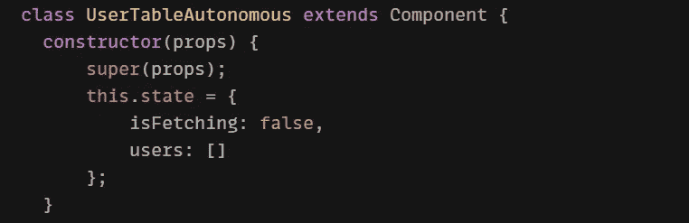
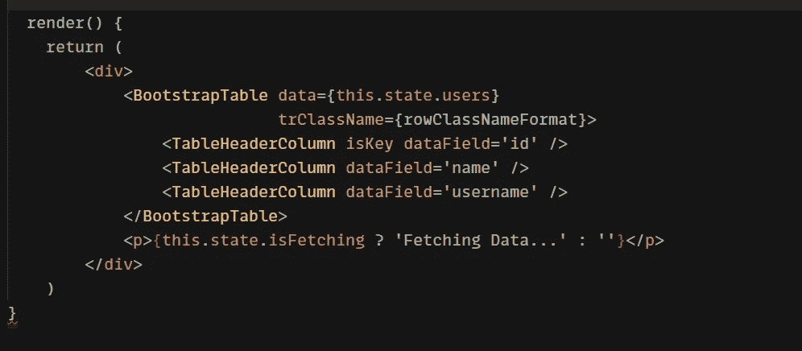
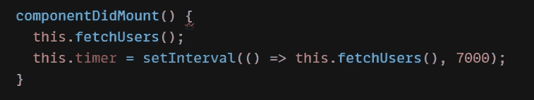
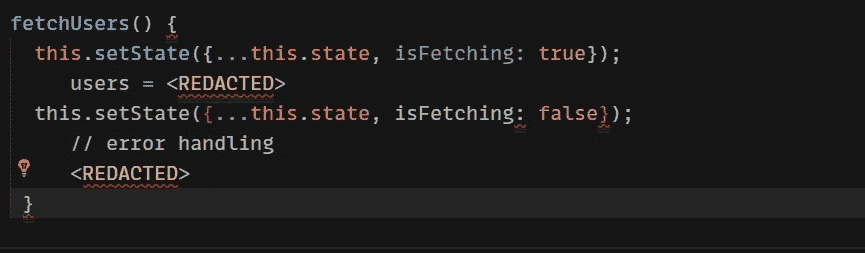
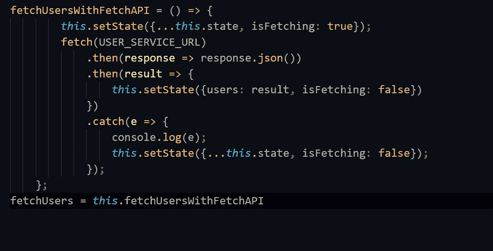
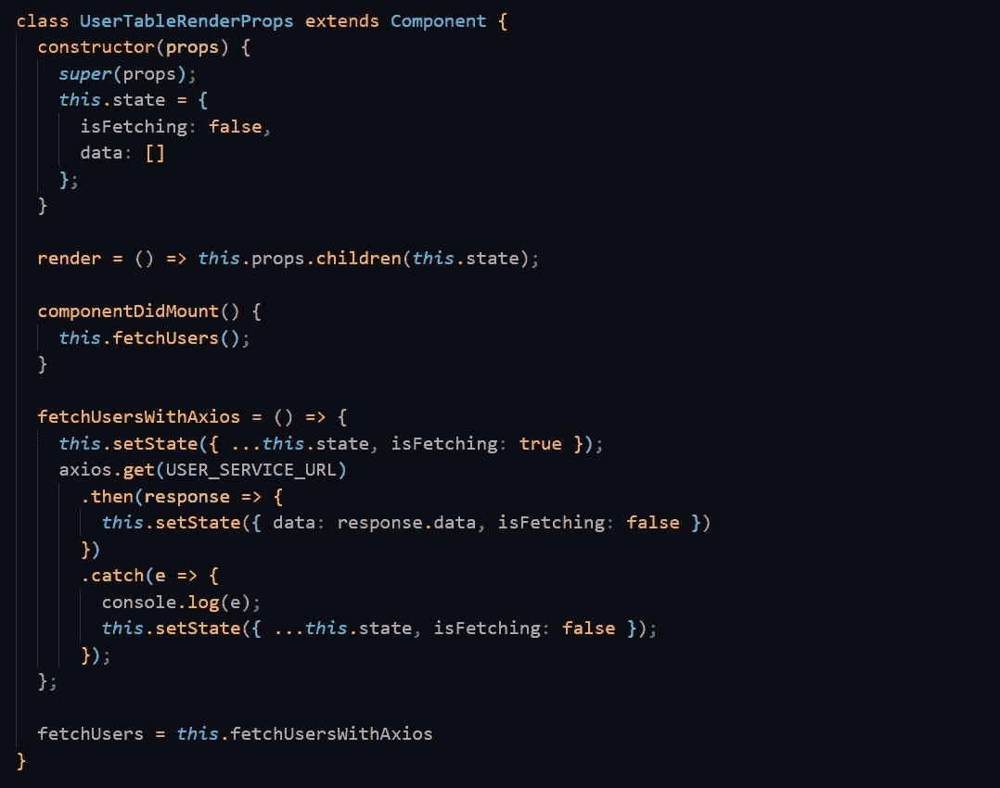
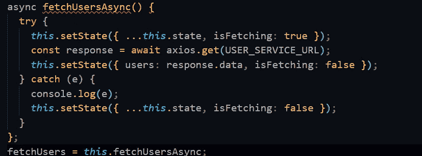
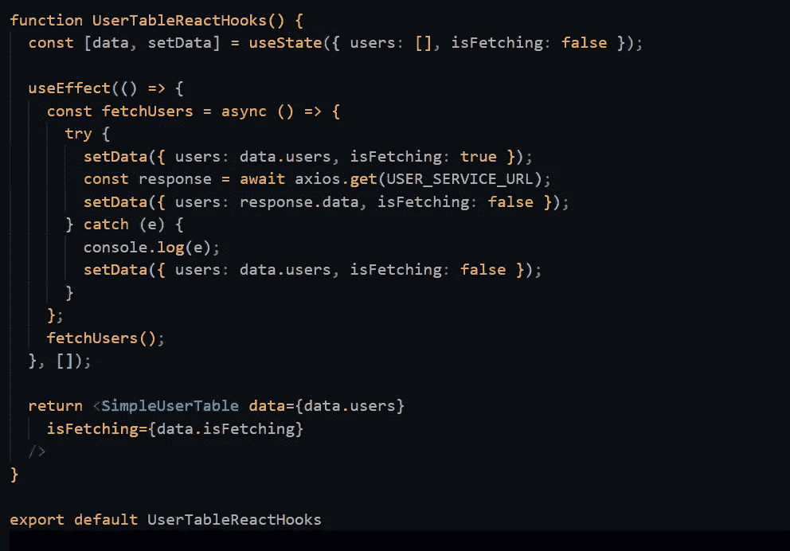

# React 中获取数据的不同方法

> 原文：<https://javascript.plainenglish.io/data-fetching-in-react-668ef136efd9?source=collection_archive---------10----------------------->

## React 中获取数据的 6 种方法


当谈到在组件视图中显示数据时，我将讨论所有的最佳方法。

> 你可以访问 [**GitLab**](https://gitlab.com/mohit199thd/react-data-patterns-demo) 链接来更好地理解我下面展示的例子

## 如何在 React 中获取数据

如果你是一个熟悉构建简单的 **React** 项目的初学者，那么你可能已经研究过简单的数据获取方法，而不是处理越来越多的要获取的数据。在您的 React 之旅中，随着您的发展，您的应用程序将变得更加复杂，使用正确的技术获取数据成为一项需求。使用内置的 **Fetch API、 *Axios、async/await、*** 等等，在 React 中获取数据的方法有很多。

# 1.服务器提供的数据

这种方法很简单，在大多数情况下，数据嵌入在从服务器发送的 **HTML** 中，效果很好。如果我们需要新数据，您需要手动刷新页面或定期刷新页面。

例如:

```
<meta http-equiv="refresh" content="30">
```

这个方法与 React 应用程序不太相关，但是我们可以称这个方法为从服务器向浏览器获取数据的更动态的方法。

尽管如此，许多**网络应用**使用这个&，以防 ***JavaScript*** 被禁用，或者当我们不得不处理旧浏览器时，这甚至是获取数据的最佳方式。

## React 组件如何获取数据

React 组件中的数据获取有几种方法。

1.从没有数据开始，然后在基于用户的操作(单击按钮)上获取数据。

2.一次加载数据。

3.定期加载数据

由于该组件是完全自主的，没有其他组件可以告知是时候加载一些数据了，所以将在***componentDidMount()***中首次加载数据，并设置一个计时器，该计时器将每 7 秒读取一次数据。

我们下面的 UserTableAutonomus 组件是一个标准的 **React 类**组件，

## 该状态包括两个字段:

1.  boolean***is fetching***初始化为 false，因为它还没有获取。
2.  一个空的**用户列表，**是它需要获取的数据。



***render()*** 方法呈现从状态传递给当前用户的 ***BootstrapTable*** 组件。实际的数据获取发生在 React 生命周期方法的***componentidmount()***中，我们不使用***componnetWillMount()***的原因有两个，首先是它已被弃用 **React 17** &当我们使用 Fetch API 或*Axios****componentWillMount()***时，渲染会不等它完成就发生



componentDidMount()在第一次渲染后被调用，所以我们仍然需要处理第一次空渲染，在这种情况下，我们使用 ***【获取数据】*** 消息，您也可以在构造函数中选择自己的初始数据获取。

因此，现在我们将在***componentDidMount()***中获取数据，代码只需调用 ***fetchUsers()*** 方法，并启动一个计时器，每隔 7 秒调用 ***fetchUsers()*** 。



当我们的组件离开时，componentWillMount()方法被调用，并且***clearInterval()***将通过将时间间隔设置为空来停止时间间隔。

*fetchUsers()* 将 isFetching 状态变量设置为 **True** ，这样一旦获取新数据，组件就会显示“获取数据”消息。然后在获得一些数据后，它设置**为将**取回到**假**。



# 2.获取 API

我已经在函数***fetchuserswithchapi()***中使用了 Fetch API，并为变量 ***fetchUsers*** 赋值，因此组件只调用 ***fetchUsers()。***

它首先将***is fetch***变量设置为 **true，**然后调用 fetch，fetch 返回一个 promise，promise 进一步解析为一个响应，然后 response***JSON()***方法返回一个 **JavaScript** 对象。

然后，它将 ***isFetching*** 重置为 false，如果出现错误，catch 处理程序会将错误记录到控制台，并在*获取*过程完成时重置 **isFetching** 变量。



# 3.使用 Axios

我们将在 UserTableRenderProps 组件中使用 Axios。Axios 也有一个类似于 Fetch 的基于 promise 的 API，但是它省去了 JSON 解析阶段并处理所有的错误。其中 Fetch API 返回一个**错误 404** 作为正常响应，所以您可能需要检查代码上的响应并自己抛出一个错误。Axios 有几乎相似的代码来获取 API，但是少了一个步骤和更多的错误处理。



## 获取与 Axios

我们可以使用两者通过 **HTTP** 协议与服务器通信，但是哪一个更适合你将取决于你的项目目标。

Fetch API 在窗口项目上提供了一个 ***Fetch()*** 方法，以及一个用于访问 **HTTP** 请求和响应的 ***JavaScript*** 接口，fetch 只有一个强制参数，即要获取的资源的 ***URL*** ，它返回一个可用于检索请求响应的承诺

而 Axios 是一个 JavaScript 库，能够从 **Node.js** 或 **XML &发出 HTTP 请求，支持 ES6 版 JavaScript 中的 Promise API。**

# 4.在 React 中使用 Async/Await 提取数据

承诺的改变是对回调的巨大改进，而且可以变得更好。



# 5.从 React 中的 GraphQL API 获取

一个 GraphQL 后端怎么样？它们通常通过 HTTP 返回一个 JSON，主要区别在于只有一个查询端点来获取数据，而实际请求的数据遵循 **GraphQL** 模式。数据获取方法并没有真正区分 REST 和 GraphQL，两者都工作得很好。

# 6.用 React 钩子获取数据

高阶组件和渲染道具等模式要求您重新构建组件层次结构。 ***React Hooks*** 的需求是打破**状态管理**是独立的函数，不需要将状态的圆桩放入类生命周期方法的方孔中。React 的特性不需要类，我们可以使用 React 钩子获取数据。

例如:

在函数***UserTableReactHooks()***中，使用状态钩子用初始状态调用，钩子返回两个值:当前状态和更新它的函数。

为了执行像数据获取这样的副作用，我们将使用一个效果钩子。在这种情况下，我们只想运行它一次，所以我们将传递一个函数和一个空数组。数组参数告诉钩子，只有在数组中列出的状态变量发生变化时才应用效果。

