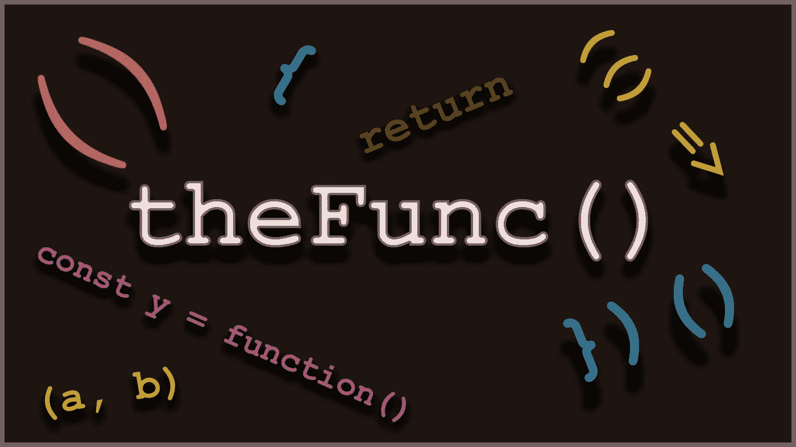

# JavaScript 中的模块模式

> 原文：<https://javascript.plainenglish.io/data-hiding-with-javascript-module-pattern-62b71520bddd?source=collection_archive---------0----------------------->

## JavaScript 开发人员需要理解核心模式

# 什么是模块模式

模块模式是 JavaScript 中重要的**模式之一。这是一种常用的设计模式，用于将一组变量和函数一起包装在一个范围内。**

*   它用于定义对象，并指定可以从函数范围之外访问的变量和函数。
*   我们将某些属性和函数公开为公共的，也可以限制对象本身的属性和函数的范围，使它们成为私有的。
*   这意味着不能在函数范围之外访问这些变量。
*   我们可以使用这种模式实现数据隐藏抽象

让我们来看看只有公共字段的模块模式的简单实现:

该代码包含定义某个变量的函数，并从该函数返回这些变量。函数调用返回的值作为对象文字保存在变量`newEmployee` **中。**我们正在指定需要返回的键值对。这是模块模式的简单实现之一。我们可以从返回的对象中访问属性“姓名”、“年龄”、“职务”。在上面的代码中，我们可以访问由对象定义的所有属性，因为它们是从函数调用中公开的。

我们现在将扩展上面的代码来定义一些在模块函数范围之外不可访问的变量。

# **用模块模式隐藏数据**

上面的代码创建了另一个变量“salary ”,该变量没有在“EmployeeDetails”函数之外公开，因此对于“newEmployee”对象不可用。这个“薪水”现在可以被看作一个私有变量，只能从函数中访问。外面没有。

现在，让我们看看如何在不公开的情况下使用工资值:

上面的函数使用私有变量“salary”来计算需要提供给雇员的“bonus”值。因此，尽管不能使用`newEmployee`直接访问“salary ”,但它仍然保留在范围内，以便其他组件可以使用该值进行其他计算。尽管变量对于`EmployeeDetails`函数的作用域来说是“私有”的，即使在函数执行之后,“薪水”变量仍然保留在作用域中，以便其他函数可以使用这些值来提供进一步的功能。

这里的 salary 是一种私有变量，可以由函数公开的其他函数访问。它相当于一个私有的隐藏变量，可以通过它的成员函数来访问。因此提出了数据隐藏的概念。

使用模块模式有以下好处:

1.  可维护性:模块模式支持更好的可维护性，因为所有相关的代码都可以封装在一个逻辑块中。这些逻辑上独立的块相对更容易更新。
2.  **可重用性**:我们单个单元的代码可以在整个应用程序中重用。封装为模块的功能可以重用，我们不需要在多个点定义相同的功能。

如果你喜欢这篇文章，请提供你的评论。

**作者其他文章:**

 [## JavaScript 生成器的基础知识

### ES6 生成器函数是可以中途停止执行并可以继续执行的函数…

levelup.gitconnected.com](https://levelup.gitconnected.com/the-basics-of-javascript-generators-f89c9b0e8d72)  [## React 挂钩简介

### React Hooks 是 React 16 . 8 . 0 版本中的最新版本，似乎是所有 React…

levelup.gitconnected.com](https://levelup.gitconnected.com/introduction-to-react-hooks-e0102c038bf1)  [## React 高阶组件(hoc)介绍

### 简单地说，高阶函数是要么以函数为参数，要么返回一个新的…

levelup.gitconnected.com](https://levelup.gitconnected.com/introduction-to-reacts-higher-order-components-hocs-c42182fb634)  [## RxJS 自定义可观察对象介绍

### 在我之前的文章中，我们谈到了 RxJS 的基础知识。该库提供了许多创建可观察对象的方法。在这个…

levelup.gitconnected.com](https://levelup.gitconnected.com/creating-custom-observable-with-rxjs-379692f08f76)  [## RxJS 和反应式编程简介

### 反应式编程是 JavaScript 世界的新宠。在本文中，我们将讨论基础知识…

levelup.gitconnected.com](https://levelup.gitconnected.com/introduction-to-rxjs-3f17e1009527) 

*更多内容请看*[*plain English . io*](http://plainenglish.io/)