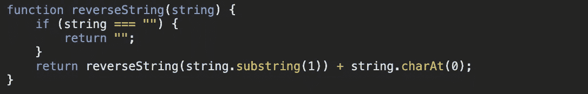
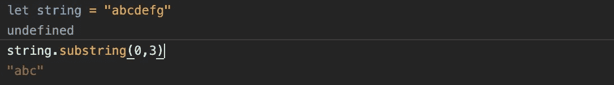
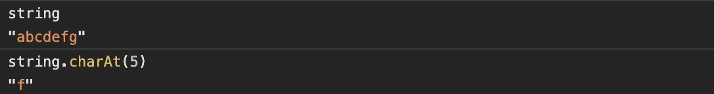
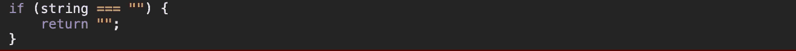
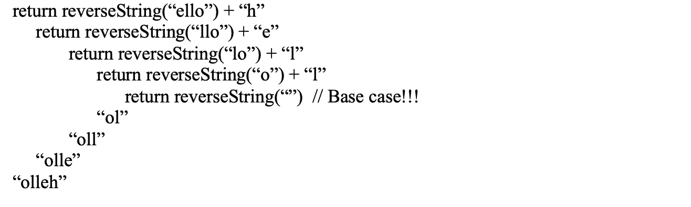

# 数据结构和算法概念:递归

> 原文：<https://javascript.plainenglish.io/data-structures-and-algorithm-concepts-recursion-fdbd3bf6cd9d?source=collection_archive---------13----------------------->

什么是递归函数，为什么它们对理解算法极其重要？我将尽可能用最好最简单的方式来解释递归。

Photo from Pexels ([cottonbro](https://www.pexels.com/@cottonbro))

用最简单的术语来说，递归函数是一个调用自身的较小版本来得到解的函数。有一种模式，通过一遍又一遍地重复这个函数，我们可以找到答案。递归的一个关键点是它必须有一个基本情况，或者说递归必须停止的情况。这就是所谓的结束条件。

我之所以有上面这张照片中的套娃，是因为它是递归的一个很好的视觉表现。每一个洋娃娃内部都有一个更小的版本，直到我们找到绝对最小的那个——其中不再有任何更小的了。在递归函数中，最小的将是基本情况。

让我们来看一个可以利用递归的简单问题。在之前的一篇博文中，我回顾了[反转一根弦](https://medium.com/javascript-in-plain-english/simple-string-reversal-ds-a-i-b43b0ef2619f?sk=d65372e798324da4ec026e3af497d013)。你知道有一个递归的解决方案，只需要 3 行代码吗？

让我们一步一步地完成这个过程，因为一开始可能会有点混乱。我将解释内置 JavaScript 函数*子串*和*字符*是如何工作的，然后我将解释基本情况(if 条件*)。*

根据 MDN 文档，[*子串*方法](https://developer.mozilla.org/en-US/docs/Web/JavaScript/Reference/Global_Objects/String/substring)返回开始和结束索引之间的字符串部分，或者返回到字符串的末尾。

在这个例子中，对于给定的字符串“abcdefg ”,在开始索引为 0、结束索引为 3 的情况下对其调用 substring 方法将返回“abc”。注意不要将此方法与 [*substr*](https://developer.mozilla.org/en-US/docs/Web/JavaScript/Reference/Global_Objects/String/substr) *，*混淆，substr 采用起始索引的参数和要包含的字符数。两者都可以在这个函数中使用，但是我将坚持使用*子串*方法。

接下来要讨论的方法是 *charAt* 。根据 MDN，[*charAt*方法](https://developer.mozilla.org/en-US/docs/Web/JavaScript/Reference/Global_Objects/String/charAt)返回一个新的字符串，它由位于字符串中指定偏移量的单个 UTF-16 代码单元组成。简单地说，这意味着给定索引的参数， *charAt* 将返回给定索引处的字符。

在上面的示例中，当对字符串“abcdefg”调用 charAt(5)时，它返回第 5 个索引处的字符，即“f”。(记住第一个字符的索引是 0！)

现在，让我们回到基本情况场景:

在基本情况下，每当字符串为空时，我们将简单地返回一个空字符串并停止递归。这是我们能拥有的绳子的最小部分。一旦我们开始遍历递归函数，这将更有意义。

为了便于参考，我将完整的函数放在这里:

假设我们对字符串“hello”运行 reverseString 函数。我们第一次运行它时，函数将检查字符串是否为空，因为它不是空的，所以它将运行下一行，这将使用 substring(1)的新参数再次调用函数。只使用一个参数调用“hello”上的 substring(1)将返回从给定索引到字符串末尾的字符，在本例中，返回“ello”。然后我们添加 charAt(0)，它是字符串后面的第一个字符，但它还没有返回到链的上游，因为函数在“ello”上再次被调用，这次返回子字符串“llo”和“e”。这种情况会沿着字符串继续下去，直到我们遇到空字符串基本情况。这是整个退货链的更直观的示意图:

每次函数被再次调用时，一个字母从开始处被取出并添加到末尾，但是直到我们遇到基本情况并在返回链的途中，被添加的字母才真正被添加。

希望这有点道理！GeeksforGeeks 有一个稍微复杂一点的解释，但是请随意查看，因为它可能对你理解递归有更大的帮助。

递归可能很难，但是随着你练习更多涉及递归的问题，它会变得越来越有意义。在解决方案中实现递归时，要考虑的另一个重要方面是时间和空间复杂度。递归常常不是最有效的解决方案，所以记住任何递归解决方案总是有迭代解决方案是很重要的。对于反向字符串解决方案，我之前的博客已经讨论过迭代解决方案。由于解决方案的递归性质，您可以想象递归解决方案的时间和空间复杂性将随着函数调用数量的增加而迅速显著增加。想象一下，试图反转一个包含 25 个字符的字符串。我们必须进行 25 个不同的函数调用，一个在另一个里面！

了解递归只是向你的技术面试官展示你解决算法知识的另一种方式。这只是提高你技术面试表现的另一个难题。尽管递归一开始看起来非常令人困惑，但和任何主题一样，你练习得越多，就越容易理解它。

下周，我将深入研究求解斐波那契数列的递归方法！下面是第 N 个斐波那契数列问题的大概情况:

给定一个整数(n)，打印出斐波那契数列中的第 n 个数字条目。例如，fibonacci(6)将返回 8。

玩得开心，像往常一样，不要忘记在编码时休息一下！

喜欢这篇文章吗？如果有，通过 [**订阅获取更多类似内容解码，我们的 YouTube 频道**](https://www.youtube.com/channel/UCtipWUghju290NWcn8jhyAw?sub_confirmation=true) **！**