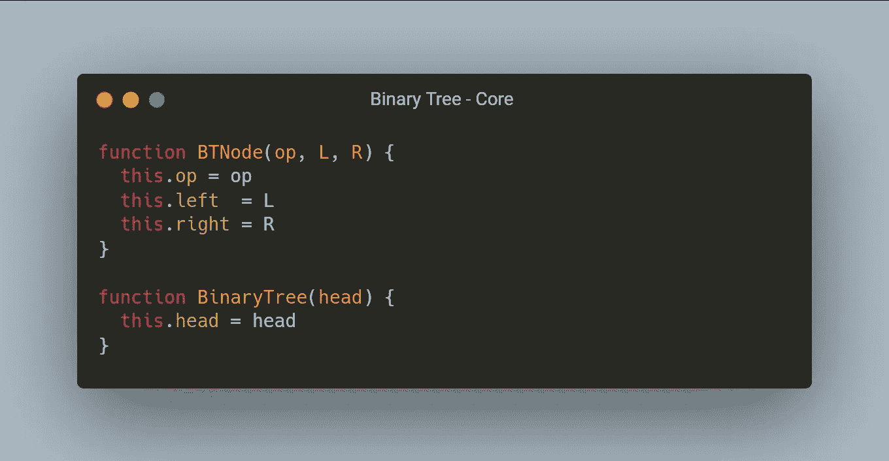
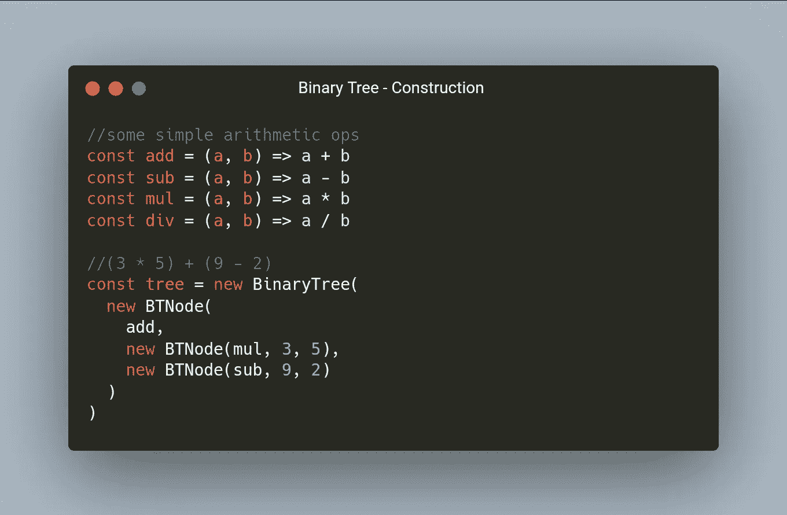
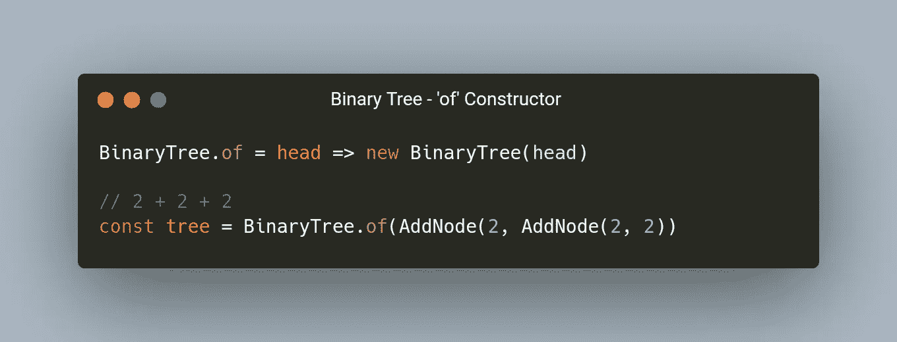
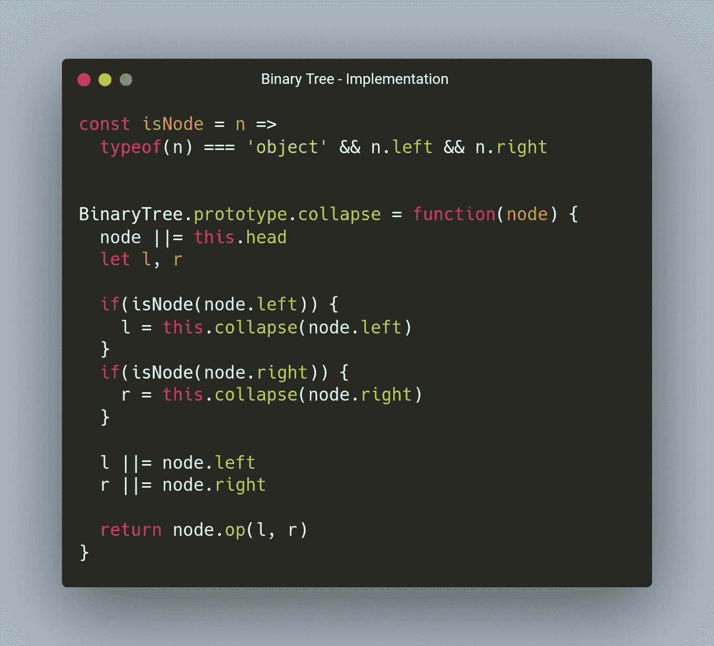
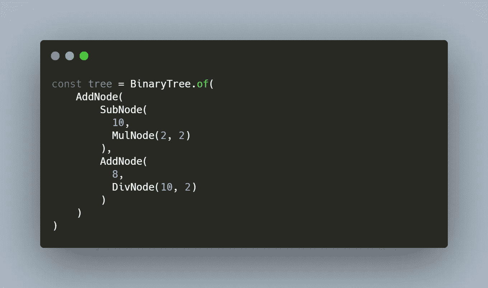

# 数据结构:二叉树

> 原文：<https://javascript.plainenglish.io/data-structures-binary-tree-f8da24fe9602?source=collection_archive---------4----------------------->

## 从数学表达式到语言语法

作为我关于 JS 数据结构的全新系列文章的一部分，我想写一点关于*二叉树*的内容。你可能会认为二叉树是二元数学的一部分。但事实上，它只是一棵树，其中每个节点最多有 2 个值，因此被称为“二叉树”。二叉树在现实世界中有很多应用，但众所周知，它们用于解析编程语言语法和数学表达式。

二叉树由*节点*组成。每个节点有两个值，我称之为左边的*和右边的*和*。*每个节点的左值或右值也可以是节点。为了评估一个节点，每个节点还应该知道它将使用其左右值执行的二元运算。因为每个节点都知道其子节点，所以我们只需引用树中的头节点。让我们用代码想象一下这个结构:

如你所见，我们已经使用构造函数创建模式在代码中定义了二叉树的最小数据接口。现在，我们可以很容易地使用`new`关键字来创建树或节点的实例。

同样值得注意的是，节点很容易专门化。我们可以定义自定义函数来创建已经知道其操作的节点，而不是通过`new`来构造并传递操作。

采取这种方法是一个好主意。我们抽象掉了`new`的使用(我个人并不喜欢)，并且我们通过抽象掉为构造函数提供操作符的需要，保持编程上的枯燥(不要重复自己)。当我们抽象掉不便之处时，让我们一起放弃使用`new`创建二叉树的需要:

那里，干净而`new`——自由。所以现在我们应该对二叉树所表示的数据结构有了牢固的理解。但是我们如何利用这些数据呢？我们建造这些树终究不是白建的。使用提供的算术示例，我们接下来需要做的是处理我们在树中构建的表达式。为此，我将在二叉树原型上定义一个名为`collapse`的方法。`collapse` 函数将为我们提供一种递归地将任意复杂度的树简化为单个值的方法。这个函数是这样的:

我们还必须定义一个助手函数来确定一个对象是否也是一个二叉树节点。让我们一步一步地完成折叠功能。

首先我们定义一些东西——当且仅当`node`没有被定义为参数时，我们设置`node`等于二叉树的`head`属性；我们为子节点的计算结果分配变量`l`和`r`来占用。

接下来是递归部分。使用我们定义的助手函数`isNode`，我们确定`l`或`r`值是否是节点。如果是，那么我们开始向左遍历树。这意味着我们总是先访问节点的左分支，然后再访问右分支。我们通过调用 collapse 函数本身来实现这一点，并以所讨论的节点作为参数。一会儿我会解释更多关于递归的内容。

递归之后，我们决定是否必须设置我们的`l`或`r`值。如果我们没有设置它们，这意味着节点已经是一个终端值(在本例中是一个普通的数字)，所以我们不必减少它，因此我们可以使用原始的`node.left`或`.right`值。

最后，我们可以使用我们最初的节点操作将`l`和`r`的值减少到一个结果。

现在谈谈递归。每当我们在函数内部调用一个函数时，我们都在利用递归。注意 collapse 在试图计算任何东西之前是如何检查节点的？这迫使它打开，但还没有返回，一个新的框架，你每下降一级树。把每个函数调用想象成一个图片框架，把每个递归调用想象成一个框架中的一个框架。对树的递归操作是深度优先的。在您点击第一个最左边的终端节点之前，没有任何东西能够返回。

为了说明这一点，我用这篇文章的封面图片制作了一个表达式树。绿色数字是我们访问节点的顺序:

原谅它的质量。这就是表情`(10 - (2 * 2)) + (8 + (10 / 2))`。因为我们的函数走的是偏左的路径，所以我们可以画出它实际上是如何被手动解释的。

1.  第一个端子左侧值为 10。这不是一个节点，所以我们继续到正确的节点。
2.  右边的值是一个节点，所以我们对它调用`collapse`。我们首先访问终端左值 2…
3.  …然后是终端右值，也是 2。
4.  每个节点都知道它将执行什么操作。这是一个乘法节点，所以我们将它的左右值相乘。这是我们折叠的第一个节点，评估为 4。
5.  像我们的第四步，这是一个操作。我们用减法将 10 和减少后的 4 相加，得到 6。
6.  现在，我们移到根节点的右侧。我们遇到的第一个终值是 8。然后，我们必须寻找正确的节点…
7.  …这确实是一个节点。我们进入它，在左边遇到终值 10。
8.  右边是一个 2
9.  现在我们再次减少左边和右边，这次是通过除法，结果是 5。
10.  再一次，我们在一个操作符上，这次是加法。我们将终端 8 与缩减后的 5 相结合，得到 13。
11.  最后，我们可以用缩减后的值 6 + 13 = 19 来完成对表达式的求值。

下面是我们实现`BinaryTree`后的树形图:

如果我们调用`tree.collapse()`,我们将以值 19 结束，正如我们通过手动遍历树所预期的那样。

最后，我将留给我的读者一支笔来写:

快乐的编码人们，记得保持你的代码功能！

喜欢这篇文章吗？如果有，通过 [**订阅获取更多类似内容解码，我们的 YouTube 频道**](https://www.youtube.com/channel/UCtipWUghju290NWcn8jhyAw) **！**