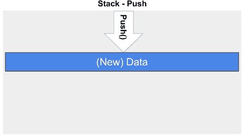
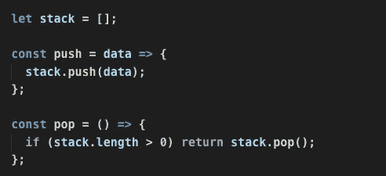
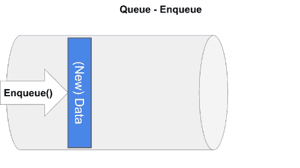
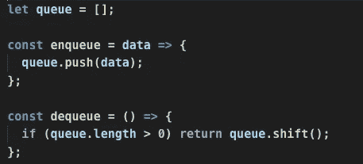
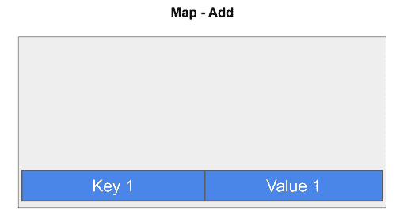
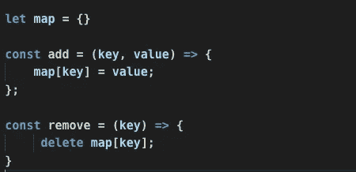
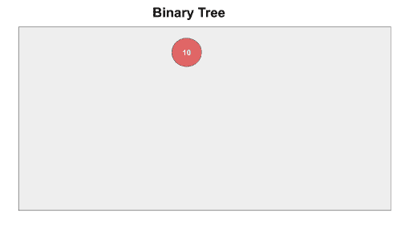
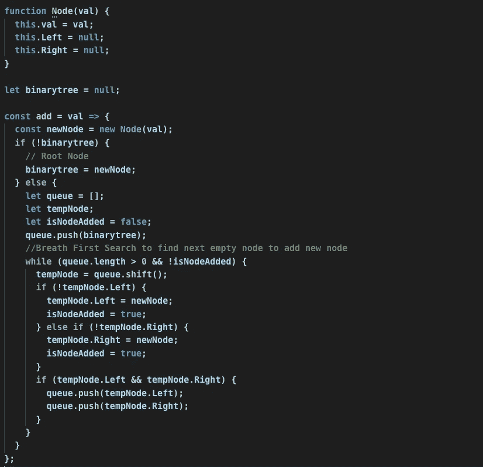

# JavaScript 中的数据结构

> 原文：<https://javascript.plainenglish.io/data-structures-in-javascript-28ce180b7673?source=collection_archive---------5----------------------->

像其他编程语言(C#、Java)一样，JavaScript 不提供所有内置的数据结构。所以我们必须手工用 JavaScript 实现数据结构，

*   排列
*   目标

本文将帮助您学习如何用 JavaScript 创建基本的数据结构。

## 基本数据结构(不是 JavaScript 内置的)

*   堆
*   长队
*   哈希表或哈希映射
*   链表
*   二叉树

## 堆

堆栈是一种数据结构，它按照“后进先出(LIFO)”模式存储数据。下面的 GIF 将解释堆栈是如何工作的。

如前所述，JavaScript 不提供内置的堆栈数据结构。所以我们可以用数组来实现堆栈数据结构。

下面的代码是用 JavaScript 创建一个堆栈。

## 长队

队列是按照“先进先出(FIFO)”模式存储数据的数据结构。下面的 GIF 将解释队列是如何工作的。

下面的代码是用 JavaScript 创建一个队列。

## 哈希表或哈希映射

哈希表是一种按照“键-值”模式存储数据的数据结构。

> 注意:从 ES 6 开始，JavaScript 提供了内置选项，通过 [Map](https://developer.mozilla.org/en-US/docs/Web/JavaScript/Reference/Global_Objects/Map) 对象实现哈希表。

下面的代码是用 JavaScript 对象而不是 Map 对象创建一个散列表。

## 链表

链表是由节点组成的数据结构，其中每个节点包含一个数据字段和一个到下一个节点**的引用(链接)。**

下面的代码是用 JavaScript 创建链表。

> 注意:链表删除功能不是本文的一部分。

## 二叉树

**二叉树**是一种树形数据结构，其中每个节点有两个子节点，左边的子节点和右边的子节点。

下面的代码是用 JavaScript 创建一个二叉树数据结构。

> 注意:我使用队列和“呼吸优先搜索”来查找空节点

## 结论

本文帮助您理解了如何用 JavaScript 实现数据结构。感谢阅读我的文章。

如果你有任何问题，请在评论中告诉我。

*更多内容请看*[***plain English . io***](https://plainenglish.io/)*。报名参加我们的* [***免费周报***](http://newsletter.plainenglish.io/) *。加入我们的* [***不和谐***](https://discord.gg/GtDtUAvyhW) *社区，关注我们的*[***Twitter***](https://twitter.com/inPlainEngHQ)[***LinkedIn***](https://www.linkedin.com/company/inplainenglish/)*和**[***YouTube***](https://www.youtube.com/channel/UCtipWUghju290NWcn8jhyAw)*******

*****用*** [***电路***](https://circuit.ooo/?utm=publication-post-cta) *学习如何为你的创业建立认知和采用。***