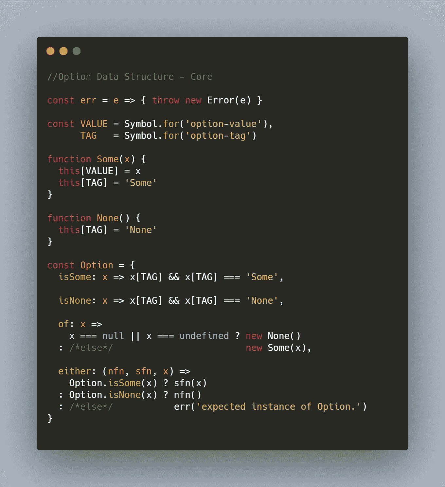
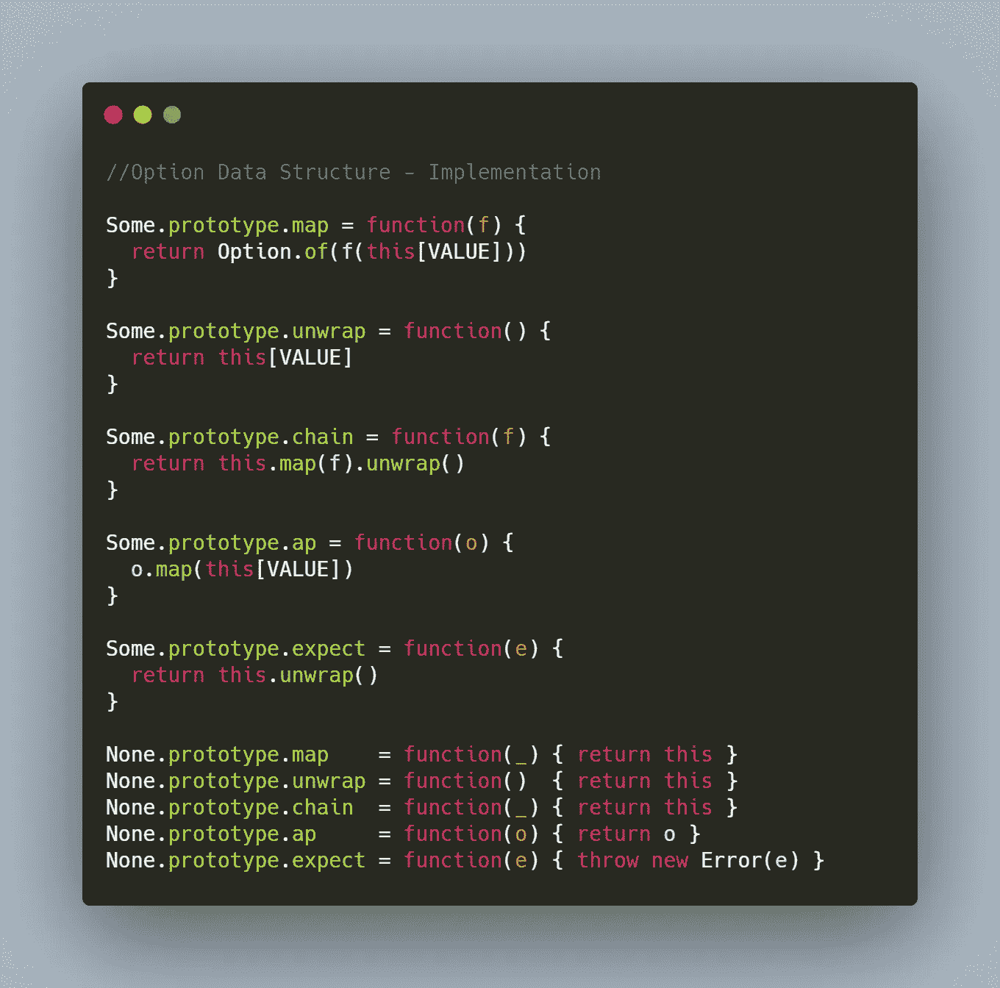
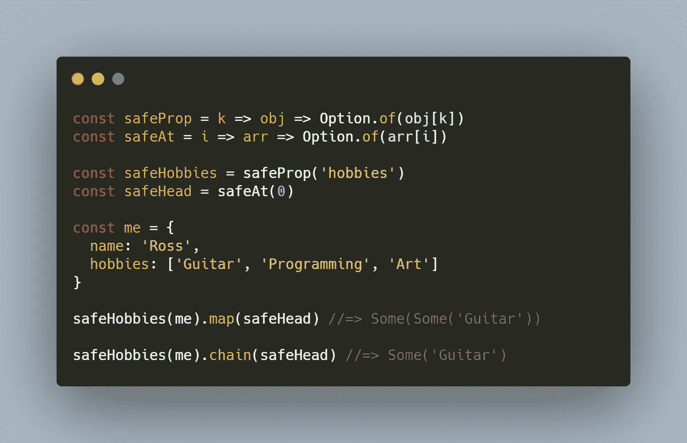
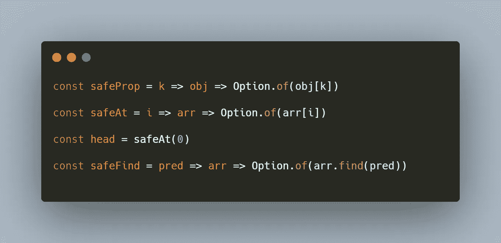
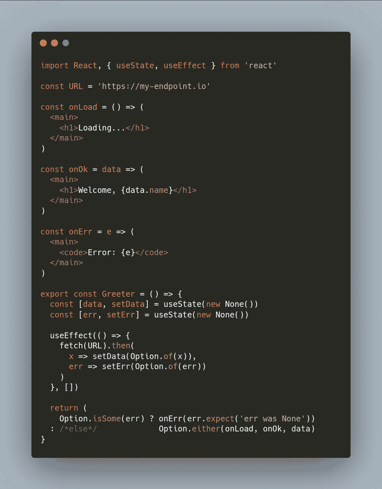

# JavaScript 数据结构:选项

> 原文：<https://javascript.plainenglish.io/data-structures-option-965705a903f5?source=collection_archive---------9----------------------->

## 优雅地处理 Null 和 Undefined

Some / None. (Photo by [Michael Jasmund](https://unsplash.com/@jasmund?utm_source=medium&utm_medium=referral) on [Unsplash](https://unsplash.com?utm_source=medium&utm_medium=referral))

我在与单子相关的文章中已经写了很多关于期权数据结构的内容。但是根据我关于数据结构的系列文章，除了与 Monad 的关系之外，Option 应该有自己的完整文章。在这篇文章中，我们将放弃所有的单子论，只理解选项是什么。

首先，我们来讨论一下`null`和`undefined`值。假设我们正在检查一个对象，这个对象可能是我们从 JSON 中解析出来的，JSON 来自我们正在开发的应用程序的后端。我们接收到的对象由于某种原因有不同的模式，所以有时我们会有意想不到的`null`或`undefined`值给我们的客户端造成严重破坏。选项很可能是这个问题的解决方案！

该选项是一种特殊类型的容器，由两个*变体组成。*这意味着一个选项的实例可以存在于两种状态之一(变量)。我们称这两种变体*有*和*无*。*有的*代表容器中的一个当前值的状态，而*无的*代表一个空容器。无论您的选项实例处于什么状态，它都不会抛出任何`null`或`undefined`值。这是选项数据部分的核心:

我喜欢用符号来隐藏选项的内部值(我写的其他容器也是如此)。我选择了构造函数方法，允许我们使用`new`关键字创建一些或没有实例。您可以看到，有些需要一个值，而没有一个不需要。`TAG`符号用于快速识别某个或某个实例。我还将一些核心函数打包到 Option namespace 对象中。最值得注意的，`either`和`of`。您可以使用`of`构造函数通过调用`Option.of`来创建一些或没有实例。使用`of`有一些好处——它隐藏了普通函数调用后面的`new`的使用，并且它足够聪明，可以毫不费力地决定是给你一个 some 还是 None 实例。我们可以使用`either`函数调用一个函数，这取决于它是一个 Some 值还是 None 值。

当然，如果我们不在我们的选项变体上实现一些操作，这些都不会给我们带来太多好处:

因此，我们用相同的函数集扩展了我们的两个选项变体。你可以说他们服从同样的*界面*。这个接口实际上是 Monad 接口(它也服从 Applicative 接口)。不过，现在这对我们来说没什么大不了的，因为你可以在本质上不理解单子的情况下理解如何使用选项。

让我们浏览一下我们在选项界面中定义的每个函数。

1.  `map`——这是最容易理解的一个。就像`Array.map`。它使用提供的函数转换容器中的值。对于某些变体，我们传入一个函数。有些人知道如何将该功能应用于其内容，同时将其保存在容器中。如果出了问题，我们只得到一个“无”。`map`不过在无上的工作方式不同——map 不执行任何操作，而是简单地不执行任何操作。映射到无只会产生无。
2.  `unwrap`-从容器中取出价值(因此有了标题`unwrap`)。无变量将返回无。
3.  `chain`——这个很难理解。为了理解它，让我们来看看这段代码:

我定义了一些返回选项的函数，以及一些数据来表示我自己和我的爱好。最后两行表示如果使用`map`或`chain`会发生什么。当我们转到`map`返回另一个选项的操作时，我们开始构建容器层。这是因为我们的内在价值被包裹在一个选项中。这就是`chain`不同的地方——它执行映射，但是通过“展开”去掉外部的选项层。这样，即使我们的操作功能返回了一个选项，我们也只需要与选项一起工作一层。

4.`ap`——这是另一个奇怪的概念。有时，我们存储在选项的`VALUE`符号中的将是一个函数。通常，当您将返回函数的函数映射到您的选项容器时，就会发生这种情况。`ap`允许我们利用*另一个*选项的`map`函数，使用该另一个选项中的值作为当前选项(我们称之为`ap`的选项)中存储的函数的参数。这被称为应用程序。你基本上是在说，‘把我在选项 A 中的函数，应用到选项 B 中的值上’。如果这听起来很奇怪，请不要担心，您不需要理解 Applicative 来理解如何从 Option 中受益。

5.`expect` —该函数“期望”您的选项中有一个值，如果有，则返回该值。但是万一你不这样做，它会抛出一个错误消息。

让我们来看看更多的这些选项。这里有一些方法可以让你每天写的代码包含 null 或未定义的 into 选项:

这些功能都是为了您的方便而设置的。必要时，您可以使用相关参数预加载它们，以制作专门的版本。请看`head`来看看这种模式在起作用。它使用`safeAt`并预加载 0 来访问数组的第一个元素，否则返回一个 None 实例。注意所有这些函数是如何返回选项的。这使得它们的每个返回都非常适合使用`chain`操作符。精心设计的函数定义将改善函数的组合方式。使你的函数更加通用将会使你的代码更加可重用，并且最终更容易使用。

现在我们知道了如何操作容器中的值。但它仍然只是一个盒子里的值。为了真正利用价值，我们必须以某种方式提取它。我们可以用`unwrap`。但是我们可能一点也拿不回来。`expect`会更好。但是对我们选项中的值做一些事情的最好方法是使用`Option.either`函数。它需要两个函数和一个 Option 实例。当传入函数的实例为 *None* 时，调用`either`的第一个函数参数。第二个函数参数是当我们的实例是一个 *Some 时要调用的函数。*

我们现在知道如何*对存储在我们选项中的数据做一些事情*。让我们将它应用到一个真实的场景中——想象一个 React 组件调用一个 API，然后等待响应来填充它原本为空的数据字段。

onLoad '，' onErr '和' onOk '都是微小的函数组件，代表我们的主组件可能处于的状态。我们的主要组件 Greeter 使用 React 钩子来获取和设置它的状态。当 err 不为 None 时，这表明我们有一个错误要显示，所以我们使用 expect 打开 err 选项。否则我们没有错误，所以我们要么在等待响应(onLoad ),要么得到了响应(onOk)。而且看起来还不错！没有空检查，它很有表现力(这里几乎没有命令性代码)，并且它优雅地处理了三种可能的状态。

希望您在期权数据结构中享受了一次相当功能性的冒险。请继续关注我的数据结构系列文章，朋友们！