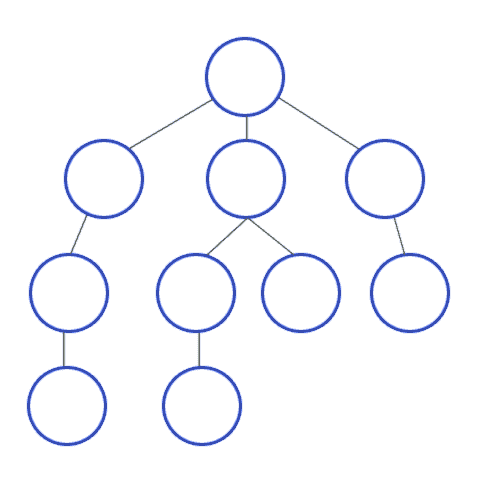

# 数据结构:理解图形

> 原文：<https://javascript.plainenglish.io/data-structures-understanding-graphs-82509d35e6b5?source=collection_archive---------0----------------------->


**什么是图？**图用来表示*关系*和*层次*，由*节点*和*边*组成。

**什么是节点？**一个节点代表图中的对象。如果媒介是图形，那么用户和帖子就是对象。

**什么是优势？**一条边代表物体之间的联系。节点由边连接。如果我在 medium 上发布博客，我和我的帖子之间就有一个边缘。我和我关注的另一个用户之间也有差距。

图形可以是*有向的*或*无向的。*

**有向图**节点间的边向一个方向延伸的图。在 Instagram 上，约翰可以关注简，而简不会关注约翰。

**无向图:节点间的边向两个方向延伸的图。在脸书，如果约翰和简是朋友，简也一定和约翰是朋友。**

有三种方法来表示一个图。最常见的是*邻接表*或*边表*，不太常见的是*网格*。

给定这个简单的飞行地图，其中城市表示节点，路由表示边，下面是邻接和边列表表示的示例。


**邻接表:**

```
const flights = {
    ‘ATL’ :  [’NYC’, ‘DC’, ‘MIA’],
    ‘DC’ : [‘ATL’],
    ‘MIA’ : [‘ATL’],
    ‘NYC’ : [‘ATL’, ‘SEA’],
    'SEA' : ['NYC']
}
```

ATL 连接的所有节点可以这样定义:`const ATLConnections = flights‘ATL’]`

一个**边列表**被表示为图上所有边的数组:

```
const flightsEdgeList = [[‘ATL’, ‘NYC’], [‘ATL’, ‘DC’], [‘ATL’, ‘MIA’], 
    [‘MIA’, ‘ATL’], [‘DC’, ‘ATL’], [‘NYC’, ‘ATL’], 
    [‘NYC’, ‘SEA’], [‘SEA’, ‘NYC’]]
```

遍历一个图有两种方法— *广度优先搜索*或*深度优先搜索*。

**广度优先搜索**使用一个队列在图中均匀移动，如果存在一条路径，寻找两点之间的最短路径。


点击查看问题[示例。](https://medium.com/javascript-in-plain-english/fewest-flights-a-breadth-first-search-sample-problem-and-solution-72c5224c71af?source=---------5------------------)

**深度优先搜索**在查看任何其他路径之前，使用堆栈数据结构沿着一个路径向下直到它结束。

