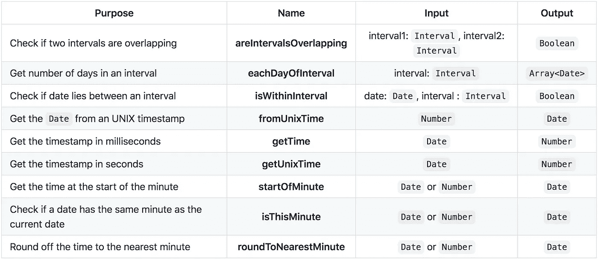
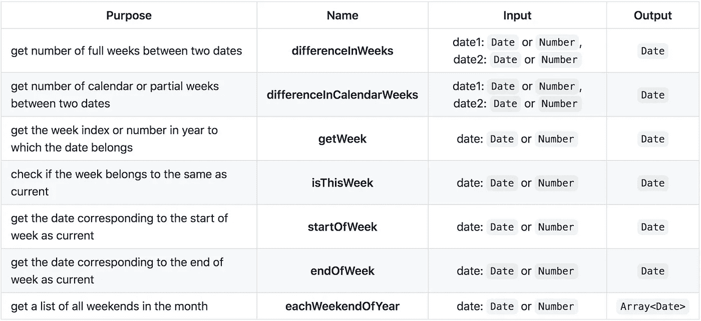
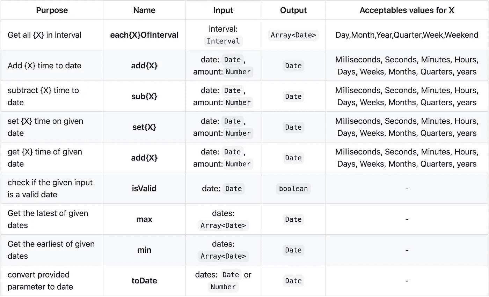
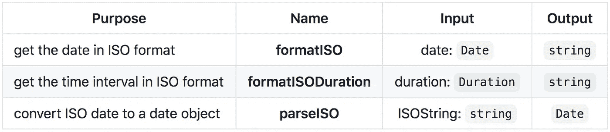
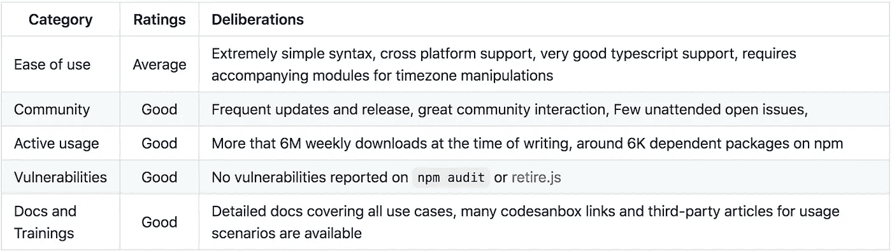

# JS 中的日期操作通过 date-fns 变得简单

> 原文：<https://javascript.plainenglish.io/date-manipulation-in-js-made-easy-with-date-fns-6c66706a5874?source=collection_archive---------1----------------------->


Photo by [Fabrizio Verrecchia](https://unsplash.com/@fabrizioverrecchia?utm_source=medium&utm_medium=referral) on [Unsplash](https://unsplash.com?utm_source=medium&utm_medium=referral)

# 概观

曾经写过一个方法来获取 GMT 时间吗？或者想知道我是否需要将时间转换成 UTC？大多数应用程序都有一些常见的日期时间操作，这些操作经常重复，过一段时间后会变得非常难以维护。此外，在国际化应用程序时，日期和时间操作是您将面临的主要挑战之一。以至于你会忘记修改的时间😉。

滴答滴答！别害怕，我们会保护你。`date-fns`就是这样一个包，它为日期时间操作提供了简单的帮助函数。有了国际化选项，您可以随时利用它，快速走向国际化。

# 突出

开始使用 date-fns 相当容易。可以通过运行命令`npm install date-fns`来安装。所有的帮助器方法都可以通过主程序包导入，也可以只安装所需的子模块。其中一个是`fp`,它有两个带和不带格式选项的方法副本。

```
/* Babel or ES6 */
import {methodName} from "date-fns";/* Node or requireJs */
const methodName = require("date-fns").methodName;
```

它值得额外的加分，因为它提供了 typescript 支持而不需要任何额外的包，并帮助开发人员不必维护另一个开发依赖。它的包结构促进了`tree-shaking`，这有助于整个应用程序的大小，因此我们建议安装主模块，因为只有所需的方法会被捆绑进来。开发者必须处理三种类型之一，即:

*   **Interval:** 这是两个日期实例之间时间间隔的简单表示。它纯粹用于对时间跨度进行操作的方法中。
*   **Locale:** 表示用于格式化日期的所需国家的数据。
*   **持续时间:**标准的`Date`对象和持续时间对象的主要区别在于，后者没有任何地区信息。持续时间可以部分包含以下任何内容:

```
{    
    years, months, weeks, days, hours, minutes, seconds      
}
```

提供的大多数助手可以根据它们帮助简化的日期-时间维度分为以下四类。

# 时间助手

这些助手主要关注于操作和验证时间方面的谓词，比如秒、分、小时。它通过`Interval`型提供有用的时间跨度。下表很好地概述了一些方法:



有助于您熟悉上述功能的一些示例如下:

```
const interval1 = {
  start: new Date(2014, 0, 10), // 10th Jan 2014
  end: new Date(2014, 11, 21) // 21st Dec 2014
};const interval2 = {
  start: new Date(2014, 6, 10), // 10th July 2014
  end: new Date(2015, 0, 10) // 10th Jan 2015
};const interval3 = {
  start: new Date(2015, 6, 10), // 10th July 2015
  end: new Date(2020, 11, 10) // 10th Dec 2020
};const interval4 = {
  start: new Date(2015, 11, 10), // 10th Dec 2015
  end: new Date(2015, 11, 10) // 10th Dec 2015
};
```

*   **areintervaloverlapping:**

```
console.log(areIntervalsOverlapping(interval1, interval2)); 
// => true
console.log(areIntervalsOverlapping(interval1, interval3));  
// => false
```

*   **每一天的间隔:**

```
console.log(eachDayOfInterval(interval4));
// => [Sun Jan 10 2016 00:00:00 GMT+0530 (India Standard Time)]
```

*   **isWithinInterval:**

```
console.log(isWithinInterval(Date.now(), interval1)); // => false
console.log(isWithinInterval(Date.now(), interval3)); // => true
```

*   **fromUnixTime:**

```
console.log(fromUnixTime(1595157314)); 
// => Sun Jul 19 2020 16:45:14 GMT+0530 (India Standard Time)
```

*   getTime:

```
console.log(getTime(Date.now())); // => 1595157440507
```

*   **getUnixTime:**

```
console.log(getUnixTime(Date.now())); // => 1595157492
```

*   **开始时间分钟:**

```
console.log(startOfMinute(Date.now())); // => Sun Jul 19 2020 17:02:00 GMT+0530 (India Standard Time)
```

*   **是时间分钟:**

```
console.log(isThisMinute(Date.now())); // => true
console.log(isThisMinute(new Date(2020, 6, 10, 17, 4))); // => false
```

*   **roundonearestminute**:将时间舍入到给定日期最接近的分钟开始时间。我们可以通过提供在 1 - 30 之间的`nearestTo`选项来改变这一点。如果它与前一个间隔和下一个间隔距离相等，则向上取整。

```
console.log(roundToNearestMinutes(Date.now())); 
// => Sun Jul 19 2020 17:12:00 GMT+0530 (India Standard Time)console.log(roundToNearestMinutes(Date.now(), {nearestTo: 15})); 
// => // => Sun Jul 19 2020 17:15:00 GMT+0530 (India Standard Time)console.log(roundToNearestMinutes(new Date(2020, 6, 10, 17, 13), {nearestTo: 8})); 
// => Fri Jul 10 2020 17:16:00 GMT+0530 (India Standard Time)console.log(roundToNearestMinutes(new Date(2020, 6, 10, 17, 11), {nearestTo: 8})); 
// => Fri Jul 10 2020 17:08:00 GMT+0530 (India Standard Time)/* here 17:12 is equidistant from 17:8 and 17:16, the method rounds it off to 16 */console.log(roundToNearestMinutes(new Date(2020, 6, 10, 17, 12), {nearestTo: 8})); 
// => Sun Jul 19 2020 17:16:00
```

让我们看看如何将我们的时间助手应用于一些现实生活中的用例:

*   计算登记时间内是否有预订:

```
const checkIfBookingIsValid = timeOfBooking => isWithinInterval(timeOfBooking, {
  start: startTimeOfRegistration,
  end: endTimeOfRegistration
});
```

*   指定计划作业下一次运行的时间:

```
const getNextStartTimeOfJob = (lastExecutionTime, {days, hours, minutes, seconds}) => add(lastExecutionTime, {days, hours, minutes, seconds})
```

# 约会助手

虽然时间助手在处理微观方面很有用，但是日助手用于操纵宏观方面，例如日、周、季度、年、十年。这些助手简化了我们的应用程序，在这些应用程序中，我们可能需要计算用户是否超过年龄阈值，对数据进行分组，并执行批量操作。更多此类突出显示的功能如下所示:



上面解释的大多数方法都可以扩展到月、季度和年。如`differenceInMonths`、`differenceInCalendarMonths`、`isSameMonth`、`isSameYear`、`setMonth`、`setYear`、`eachWeekendOfMonth`等。

有助于您熟悉上述功能的一些示例如下:

*   **differenceInWeeks** :左边的日期必须是最新的，否则该方法返回-1。

```
console.log(differenceInWeeks(new Date(2015, 11, 22), new Date(2015, 11, 10))); // => 1
```

*   **差异日历周**:

```
console.log(differenceInCalendarWeeks(new Date(2015, 11, 25), new Date(2015, 11, 10))); // => 2
```

*   **getWeek** :我们也可以通过`weekStartsOn`标志来指定一周从哪一天开始。范围从 0-6，0 为星期日。周数从 1 开始。

```
console.log(getWeek(Date.now())); // => 30
console.log(getWeek(Date.now(), {weekStartsOn: 1})); // => 29
```

*   **isThisWeek:**

```
console.log(isThisWeek(Date.now())); // => true
```

*   **每年的每个周末**

```
console.log(eachWeekendOfYear(Date.now())); 
// => [Sat Jan 04 2020 00:00:00 GMT+0530 (India Standard Time)...]
```

# 常见助手和用例

## 简单的操作

除此之外，我们还可以对两个`Date`对象进行加减运算，并且它们的命名非常直观，如下图所示:



详述上述方法的一些例子是:

```
addQuarters(new Date("2020-01-01"), 3); 
// => Thu Oct 01 2020 05:30:00 GMT+0530 (India Standard Time)max([new Date(2020, 2, 22), new Date(2020, 2, 2)]); 
// => Sun Mar 22 2020 00:00:00 GMT+0530 (India Standard Time)
```

## 格式化日期时间

最常见的问题之一是将日期和时间格式化为适合应用程序要求的特定格式。这也意味着这是最自我管理的方法，如果格式改变，它可能会失控。date-fns `format` util 有各种各样的格式选项，方法的签名非常简单，我们可以通过更新字符串来改变格式。

```
format(date, formatOptions)
```

虽然`formatOptions`列表很广泛，但涵盖一些最常用的示例如下:

```
const date = new Date("2020-07-19 18:32:00");format(date, "yy-MM-dd") => 20-07-19
format(date, "dd/MM/yyyy") => 19/07/2020
format(date, "do LLL yyyy") => 19th Jul 2020
format(date, "HH:mm:ss") => 18:32:00
format(date, "dd/MM/yyy hh:mm:ss x") => 19/07/2020 12:32:00 +0530
format(date, "dd/MM/yyy hh:mm:ss O) => 19/07/2020 06:32:00 GMT+5:30
format(new Date("2020-07-19 00:32:00"), "hh:mm:ss a") => 12:32:00 PM
format(new Date("2020-07-19 12:00:00"), "hh:mm:ss b") => 12:00:00 noon
format(new Date("2020-07-19 00:32:00"), "kk:mm:ss") => 24:32:00
format(new Date("2020-07-19 00:32:00"), "KK:mm:ss") => 00:32:00//second timestamp
format(date, "t") => 1595163720
//millisecond timestamp
format(date, "T") => 1595163720000/* some really interesting built-ins *///Localized date
format(date, "P") => 07/19/2020
format(date, "PPPP") => Sunday, July 19th, 2020
format(date, "PPPP G") => Sunday, July 19th, 2020 AD//Localized time
format(date, "p") => 6:32 PM
format(date, "pppp") => 6:32:00 PM GMT+05:30// Localized date and time
format(date, "PPPPpppp") => Sunday, July 19th, 2020 at 6:32:00 PM GMT+05:30
```

如果您在格式化时不需要如此小的区域设置选项，那么您可以使用`lightFormat`。它被称为相同的格式方式，并且不考虑与`Era`、`Quarter`、`Extended year`相关的某些选项。

```
lightFormat(new Date("2020-07-19 18:32:00"), "dd/MM/yy") => 19/07/20
lightFormat(new Date("2020-07-19 18:32:00"), "p") =>  throws RangeError
```

date-fns 允许我们通过它的`formatDistance`和`formatDuration`方法格式化时间间隔和持续时间。它们之间的主要区别在于，前者根据给定的日期格式化日期，而后者只是用文字表示持续时间。`formatDistanceToNow`与`formatDistance`相同，参考设置为`now()`

```
formatDistance(Date.now(), sub(Date.now(), {hours: 4})); 
// => About 4 hoursformatDistance(Date.now(), sub(Date.now(), {hours: 4}), {addSuffix: true}); 
// => in about 4 hoursformatDistance(Date.now(), sub(Date.now(), {seconds: 4}), { addSuffix: true, includeSeconds: true}); 
// => in less than 5 secondsformatDistanceStrict(Date.now(), sub(Date.now(), {seconds: 4}), { addSuffix: true, includeSeconds: true }); 
// => in 4 secondsformatDuration({days: 4, hours: 3}); // => 4 days 3 hoursformatDuration({days: 4, hours: 3}, {delimiter: "|"}); 
// => 4 days|3 hoursformatDuration({days: 4, hours: 3, months: 44}, {delimiter: "|", format: [ "months", "hours"]}) 
// => 44 months|3 hours
```

# ISO 格式

ISO 日期格式是表示日期的标准方式，定义为`YYYY-MM-DDTHH:mm:ss.sssZ`，而 UTC 是主要的时间标准。ISO 格式总是以 UTC 作为时间标准，并在末尾用`Z`表示。date-fns 有办法以 ISO 格式实现上述所有功能。下面是一些例子:



# 国际化

大多数开发者和应用都面临国际化的问题，因为它不在`TODO`列表的首位。date-fns 附带了一个名为`date-fns-tz`的模块，用于处理时区格式和转换。这个助手模块可以通过运行`npm install date-fns-tz`来安装，也提供了类型脚本支持。

## 将时区时间转换为 UTC 和 ISO

如果您的系统将日期时间存储在特定的时区，并且必须将其转换为 UTC，那么可以使用`zonedTimeToUTC`方法。它采用输入日期时间的`IANA`格式的日期和时区。

```
zonedTimeToUTC(date, originTimeZone)examples:zonedTimeToUtc(new Date("Sun Jul 19 2020 14:41:43"), "America/Los_Angeles"); 
// => Mon Jul 20 2020 03:11:43 GMT+0530 (India Standard Time)zonedTimeToUtc(new Date("Sun Jul 19 2020 14:41:43"), "Asia/Bangkok"); 
// => Sun Jul 19 2020 13:11:43 GMT+0530 (India Standard Time)
```

## 将 UTC 转换为时区时间

考虑这样一个用例，您要向您的用户发送通知或电子邮件，如果您以 UTC 格式发送时间和日期细节，而他们必须将其转换为当地时间，这对他们来说是一个麻烦。因此，另一个常见的用例是将存储在数据库中的 UTC 时间转换为任何时区。这是通过`utcToZonedTime`实现的。这也采用了`IANA`格式的日期和时区，但是时区代表了您想要转换到的时区。

```
utcToZonedTime(date, destinationTimeZone)examples:console.log(utcToZonedTime(Date.now(), "Asia/Kolkata")); 
// => Mon Jul 20 2020 02:06:59 GMT+0530 (India Standard Time)console.log(utcToZonedTime(Date.now(), "America/Los_Angeles")); 
// Sun Jul 19 2020 13:36:59 GMT+0530 (India Standard Time)
```

# 评估指标



# 看看这个包裹和一些阅读材料

*   [https://date-fns.org/v2.14.0/docs](https://date-fns.org/v2.14.0/docs)
*   在 https://codesandbox.io/s/lyq47o17z9 尝试这些方法
*   https://www.npmjs.com/package/date-fns-tz
*   [https://en .维基百科. org/wiki/List _ of _ tz _ database _ time _ zones](https://en.wikipedia.org/wiki/List_of_tz_database_time_zones)

# 包装的视频审查

视频回顾，其中包含有趣的使用案例和对即将推出的功能的深入探索！更多相关内容，请查看[未打包的评论](https://unpackaged.reviews/)

# 揭发

本文/评论中提到的内容和评估分数是主观的，是作者在无包装评论中基于日常使用和对流行开发者论坛的研究的个人意见。它们不代表任何公司的观点，也不受任何赞助/合作的影响。