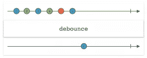
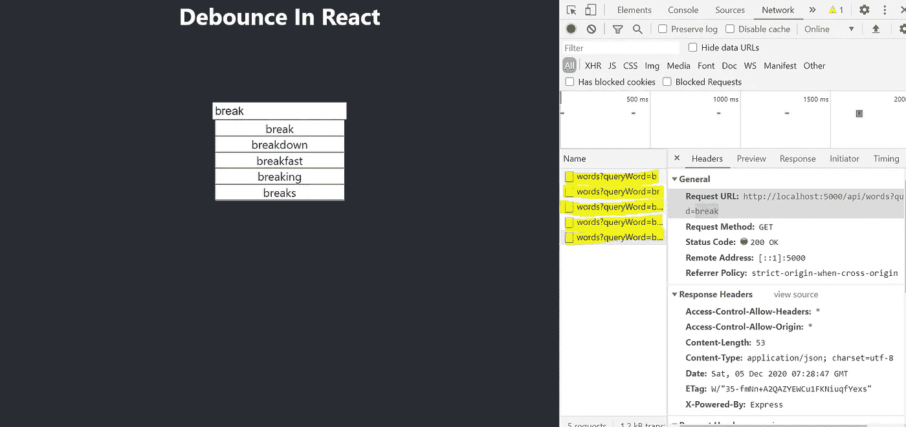
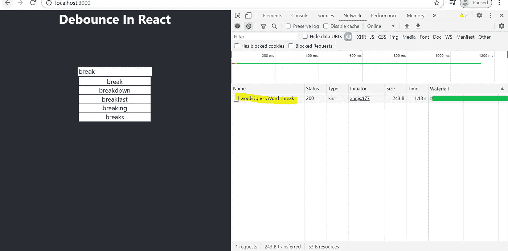

# 如何在反应中创建自己的去抖函数

> 原文：<https://javascript.plainenglish.io/debounce-in-javascript-7715d4266542?source=collection_archive---------0----------------------->

## JavaScript 中的去抖


Photo by [Kevin Mueller](https://unsplash.com/@kevinmueller?utm_source=medium&utm_medium=referral) on [Unsplash](https://unsplash.com?utm_source=medium&utm_medium=referral)

今天，2020 年 12 月 5 日，JavaScript 庆祝了它的 25 岁生日，我想解释一下 JavaScript 开发者应该知道的最重要的话题之一,**去抖**函数。

# 什么是去抖功能？

**去抖**(**功能**强制**功能**等待一定时间后再运行。**函数**的建立是为了限制**函数**被调用的次数。

## 但这有什么帮助呢？

为了理解这一点，让我们举一个自动完成或提前键入的例子。(我们将在本文中构建自己的自动完成)。

所以，假设你有一个自动完成功能，现在为了显示下拉选项，你必须在每次击键时启动一个 API。因此，如果我需要在自动完成中搜索“*中的文章*”，我们将触发大约 14 个 API 调用。这有效率吗？一点也不。但是接下来如何解决这个问题呢？这时**去抖**进入画面。

通过使用去抖功能，我们只在用户键入时有时间延迟时触发一个 API。如果我们给一个 300 毫秒的延迟，一个用户花大约相同的时间或更多的时间来输入下一个字母或单词，我们就触发一个 API。

这大大减少了 API 调用的数量，并使我们的代码更加高效。



# 创建我们的项目。

让我们首先构建一个自动完成的项目，在每次击键时调用 API，然后使用我们自己的**自定义去抖**函数对其进行改进。最后，我们还将了解如何使用由 **lodash** 提供给我们的内置**去抖**功能。

# 后端代码

为此，我使用**节点**创建了一个简短的后端，根据提供的查询参数(“搜索字符串”)为我们提供单词。您也可以为同样的目的使用一些免费的 API。

# 反应代码

这只是一个简单的代码，我们在每一个按键上调用 API，我们的`input`的`onChange`



# 创建我们自己的去抖功能

现在有趣的部分来了。我们将首先构建我们自己的`debounceFunction`。
*有一点要记住，这个函数应该返回一个函数。*
我们的`debounceFunction`将接受两个参数，第一个是延迟时需要调用的函数(在我们的例子中是`getDropDown`函数)，第二个是调用该函数的延迟量。(两次按键事件之间的延迟)
现在我们不直接调用`getDropDown`函数，而是等待延迟时间。这可以通过使用`setTimeout()`来实现

现在，为了修复`this`的上下文并将参数传递给我们的函数`getDropDown,`，我们应该用 apply 调用`getDropDown`函数。

现在，为了停止一次又一次地调用我们的函数，我们必须清除超时。我们最终的`debounceFunction`应该是这样的:

所以现在在我们的`onInputChangeHandler`上我们可以调用我们的`debounceFunction`。

```
const onInputChangeHandler = (e) => {
    const nextValue = e.target.value
    setSearchString(nextValue);
    const debounceDropdown = debounceFunction(getDropDown , 1000);
    debounceDropdown();
}
```

## 但是现在这行得通吗？

答案是否定的。因为每当我们调用`onInputChangeHandler`时，我们都在创建一个新的`debounceFunction`，它将在每次击键时被调用，而且因为我们每次都在调用新的`debounceFunction`，我们正在丢失对旧的`debounceFunction`的引用，这就是为什么它会丢失它的值。

为了解决这个问题，我们需要使用 [**回调**](https://reactjs.org/docs/hooks-reference.html) 钩子。

这应该能解决我们的问题。现在，一旦有 1 秒钟的延迟，我们将调用 API。



# 使用 lodash 去抖

现在，除了从头开始创建一个去抖功能，还可以直接从 [lodash 包](https://www.npmjs.com/package/lodash.debounce)中使用它

为此，首先使用

```
npm i --save lodash.debounce
```

然后我们将它导入到我们的 App.js 中

```
import debounce from 'lodash.debounce';
```

现在，你可以使用 **lodash** 提供的**去抖**，而不是在 **useCallback** 中添加我们的自定义函数。

```
const debounceDropDown = useCallback(debounce((nextValue) => getDropDown(nextValue), 1000), [])
```

最后，我们的 App.js 应该是这样的:

# 结论

我们现在已经了解了什么是**去抖**功能，以及如何创建自定义去抖功能。还有一个类似的概念叫做**油门。在我的下一篇文章中，我将尝试解释 Throttle 是什么以及如何在一个场景中实现它。**