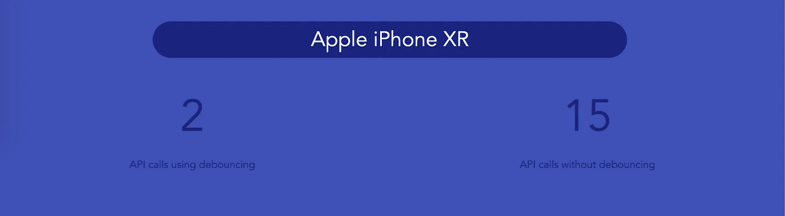

# 用 JavaScript 去抖

> 原文：<https://javascript.plainenglish.io/debouncing-with-javascript-420363f02176?source=collection_archive---------4----------------------->

从一些通用的琐事开始，去抖源于计算机硬件领域。电子设备中经常使用去抖技术来避免弹跳。弹跳是用于描述两种金属接触时触发的多个信号的术语。

在软件和 web 应用程序开发的环境中，去抖动可以有效地提高前端应用程序的性能。任何在浏览器端涉及复杂计算的事情都可以通过去抖动来简化或推迟一段时间。

例如，在调整浏览器窗口大小时获取它的坐标涉及频繁的复杂计算。使用去抖动可以最小化计算量。然而，有一种更好的方法来处理这种特殊情况——节流。虽然节流是一个值得单独在博客上发表的主题，但是去抖动最著名的用例之一是控制 API 调用速率。在这篇文章中，我们将演示一种使用普通 JavaScript 实现去抖动的方法。

假设您的 web 应用程序中有一个搜索栏，它根据用户类型过滤搜索结果。通过动态过滤搜索结果，您可以为用户节省一些时间，消除多余的按钮点击，并提供更好的整体用户体验。但是，这是有代价的。您的应用服务器必须承担的成本。

如果您有使用 JavaScript 的经验，第一个要实现的方法是在每次击键时放置一个事件监听器。您可能会跳转到用事件侦听器来挂钩搜索栏。

```
<input type="text" onkeyup="getSearchResultsFromAPI()">
```

事件侦听器应该会进行 API 调用。

```
function getSearchResultsFromAPI(){
  console.log('Making an API call..')
 }
```

我鼓励你尝试这样做，并思考这样做可能产生的问题。对于像“苹果 iPhone”这样的基本查询，这将触发 14 个 API 调用。如果你的产品规模扩大了，(我真诚地希望如此)你会有成千上万的用户每分钟发送数百个 web 请求。这肯定会让您的应用服务器不堪重负。

为了减少这些 web 请求，我们可以使用去抖。去抖采用了一种相当简单的方法。它不是在每次击键时都发送一个 HTTP 调用，而是等待一段时间(比如说 0.2 秒)，然后只有在这 0.2 秒内没有其他击键时才发送一个 HTTP 请求。慢慢地再读最后一行。

如果两次击键之间的时间少于 0.2 秒，计时器将重置。如果你输入的速度很快，很有可能你只会对完整的搜索查询提出 1 或 2 个请求。

我制作了一个基本的 React 应用程序来演示这一点。链接可以在这里找到[，Github 上的代码可以在这里](http://sumit.cc/Debounce/)找到[。](https://github.com/sumitmukhija/Debounce/)



一个普通的 JavaScript 实现

```
const debounce = (funcToExecute, executeAfter) => {        
       let timer;        
       return function(){
            clearTimeout(timer);            
            const context = this;            
            const args = arguments;            
            timer = setTimeout(()=>{
                    funcToExecute.apply(context, args)}
                    , executeAfter);                       
       }      
}
```

我们首先创建一个高阶箭头函数，它有两个参数，一个是要执行的函数，另一个是以毫秒表示时间的数字(executeAfter)。这是我们希望在两次连续击键之间等待的时间。我们声明一个计时器。

然后我们创建一个内部函数。这是返回的函数。该函数清除现有的定时器。第一次计时器将是未定义的，这一行将没有任何影响。我们接着捕捉和争论。最后，我们使用 setTimeout 函数初始化计时器，并调用 apply 函数，该函数是我们作为参数传入的。我们希望 setTimeout 在我们作为第二个参数传递的毫秒数之后触发回调。

上面的 JavaScript 函数可以被调用为

```
debounce(() => this.makeAPICall(), 300);
```

这就是我要做的一切。您的 web 应用程序上的搜索栏现在应该发出更少的调用，我鼓励您使用开发人员工具的网络选项卡来检查这一点。我希望你喜欢这篇文章。


## **用简单英语写的便条**

你知道我们有四份出版物和一个 YouTube 频道吗？你可以在我们的主页 [**plainenglish.io**](https://plainenglish.io/) 上找到所有这些——关注我们的出版物并 [**订阅我们的 YouTube 频道**](https://www.youtube.com/channel/UCtipWUghju290NWcn8jhyAw) **来表达你的爱吧！**