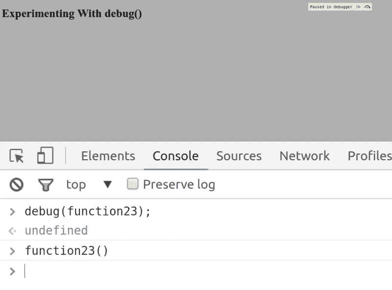
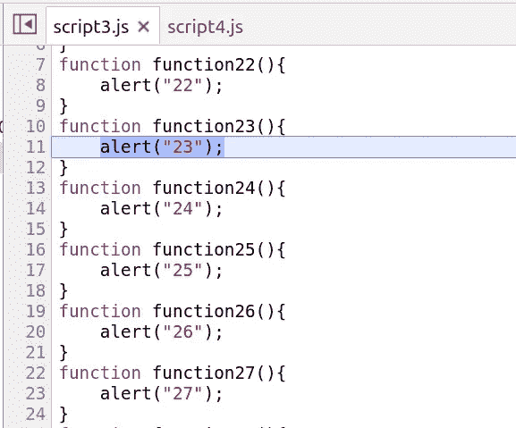

# Debug() — Javascript 调试技巧|饿龟代码

> 原文：<https://javascript.plainenglish.io/debug-javascript-debugging-tips-hungry-turtle-code-e58a538c0ec7?source=collection_archive---------18----------------------->

# debug()—Ctrl+f 的死亡

如果你和我一样，你已经浪费了无数的时间使用 ctrl+f 来寻找代码中的函数。如果你只有一个文件，ctrl+f 仍然是你最好的选择。但是一旦您开始处理许多文件，debug()方法就成了救命稻草！

这篇文章将继续我的 Javascript 调试系列。如果这是你看到的第一个，你可能也会对其他的感兴趣。

今天不会很长。调试方法是一种非常简单的方法。

这次我们开始使用的 HTML 略有不同。

```
!DOCTYPE html>
<html lang="en">
<head>
	<meta charset="UTF-8">
	<title>Debug Method</title>
</head>
<body>
  <h1>Experimenting With debug()</h1>

  <script src="script.js"></script>
  <script src="script2.js"></script>
  <script src="script3.js"></script>
  <script src="script4.js"></script>
  <script src="script5.js"></script>

</body>
</html>
```

我们从 5 个不同的脚本文件开始，来说明 debug 方法的强大功能。在每个文件中，我们有 10 个函数。其中每一个只是输出它们的号码作为警报。像这样:

```
function function1(){
  alert("1");
}
function function2(){
  alert("2");
}
function function3(){
  alert("3");
}
function function4(){
  alert("4");
}
function function5(){
  alert("5");
}
function function6(){
  alert("6");
}
function function7(){
  alert("7");
}
function function8(){
  alert("8");
}
function function9(){
  alert("9");
}
```

# 我想找函数 23

假设我们不知道 function23 在什么文件中，但是我们想找到它。我们进入浏览器，打开 sources 选项卡。我们可以打开所有的脚本文件，从所有文件中可靠的 ctrl+f 开始寻找函数 23。

或者，我们可以使用调试方法。我们所需要做的就是将我们想要找到的函数名传递给 debug 方法。在我们的例子中`debug(function23)`。在控制台中运行它。

什么都没发生！

现在发生的是代码被监控。任何时候调用 function23，代码执行都会停止，你会直接跳到 sources 标签页，进入 function23 的代码。相当酷！让我们通过在控制台中手动调用 function23 来尝试一下。



当我们从控制台手动调用 function23 时，您可以立即看到代码的执行已经暂停。下面你也可以看到代码跳转到了哪里。是的，function23 被突出显示，在 script3.js 中。不需要再使用 ctrl+f 来找到那个小流氓了！



# 函数运行前代码暂停

其中一个非常棒的部分是，在函数内部的代码运行之前，代码执行会暂停。这意味着，如果您在本地环境中，现在可以直接从 sources 选项卡向该函数中添加代码，然后执行它，而不必篡改实际文件。

这可以与我写过的其他技巧结合起来，比如 console.trace。

也许我们知道在导致 function23 的调用栈中的某个地方出现了一个 bug，但是我们不知道确切的调用栈，因为应用程序是动态的。我们可以在 function23 上使用 debug，然后使用该应用程序，直到错误发生，这将导致 function23 处的暂停。

现在，我们可以在函数的第一行插入 console.trace，然后继续执行。这个 console.trace 将为我们提供这个用例中导致 function23 调用的确切调用堆栈。

你能看出综合运用所有这些技巧和想法真的能加快速度吗？这意味着有更多的时间来进行实际的编码！

直到下一次，保持饥饿，继续编码！—阿德里安

这是一个来自我的网站的帖子: [Debug() — Javascript 调试技巧](https://hungryturtlecode.com/tutorials/debug-javascript-tips/)