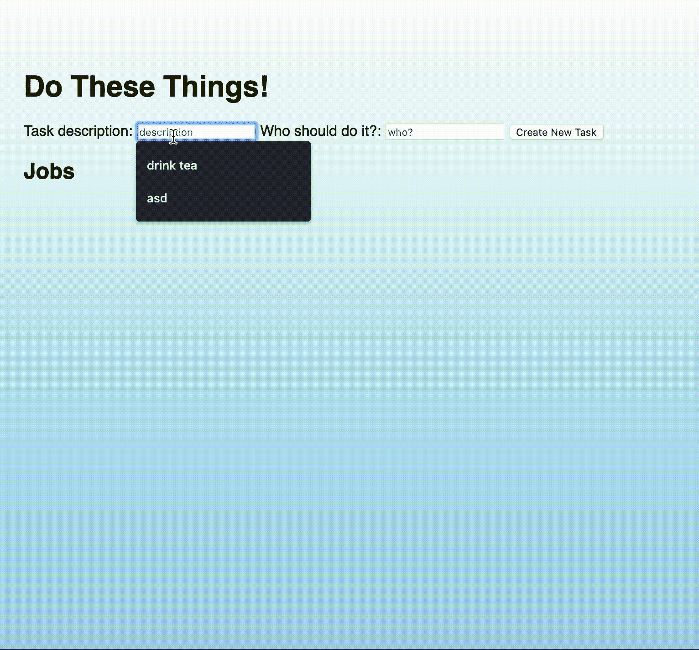

# 使用调试器跟踪 JavaScript 中的事件

> 原文：<https://javascript.plainenglish.io/debugger-and-events-4b3d1514e34b?source=collection_archive---------1----------------------->

## 使用 debugger 关键字仔细查看提交事件。

我的上一篇文章关注了使用调试器来降低时间的[,以便更好地理解我们代码中的活动变量发生了什么。现在，我想仔细看看如何使用调试器来公开有关事件的信息。](https://medium.com/javascript-in-plain-english/using-debugger-in-javascript-e5947aa528ca)

# 事件

JavaScript 如此激动人心是因为我们可以利用事件；这是用户(或 DOM)和呈现给浏览器的 HTML 元素之间的交互，结果导致 HTML 元素的改变。

我们可以监听事件并在事件发生时执行 JS 代码——这可能是一次点击、提交一个表单或者将鼠标悬停在一个元素上。如果你需要重温事件，这里有一个由 [Will Bush](https://medium.com/@willbush) 制作的[伟大的小应用](https://will-bush.github.io/event-listener-fun/)，它展示了一些可以用来触发 DOM 变化的事件监听器。


[https://will-bush.github.io/event-listener-fun/](https://will-bush.github.io/event-listener-fun/)

这是一个简单的家务清单应用程序，在这里我可以命名家务，并将它们分配给不同的家庭成员！完成后，可以将它们从列表中删除。

当我创建一个新任务时，它应该在我的后端创建一个新条目:一个本地托管的 J [SON 服务器 API](https://medium.com/codingthesmartway-com-blog/create-a-rest-api-with-json-server-36da8680136d) 。



App functionality


JSON server backend

# 我打破了它

不知何故我弄坏了我的应用！提交任务后，它无法正确显示任务。我可以看到一个奇怪的事情涉及括号代替。


让我们看看我们是否能让它再次工作。

我将在代码中单击“创建新任务”的地方放置 debugger 关键字，因为这似乎是我遇到问题的地方。

这里我有一个事件监听器，连接到我的表单元素(formEl ),监听一个“提交”事件。(当用户点击“创建新任务”按钮时。)
当使用表单向后端发送信息时，使用“提交”事件监听器很有用，这样我们就可以访问表单中的所有元素。


我将事件作为参数传递给一个匿名函数，这个匿名函数又被传递给事件监听器。

因为提交事件的默认动作是刷新网页，所以我在事件上调用 preventDefault()，所以我没有得到页面刷新。

我想把输入到表单中的值作为一个带有“文本”和“名称”关键字的对象发送到我的后端。“文本”键将由用户在“任务描述”输入中键入的任何内容填充，“名称”将由“谁应该做这件事？”填充输入。


要触发调试器，我单击按钮，调用事件监听器函数，应用程序暂停。当我的页面在 debugger 中暂停时，我可以在 Dev Tools 的 console 选项卡中访问该事件，并查看它是什么类型的事件，该事件的目标是什么，如果有任何其他元素，我可以访问它们的值…了解该事件并探索从中可以使用哪些信息是值得的。


当我的应用程序在调试器中暂停时，我可以访问提交事件。我现在可以通过在控制台中键入“event”来浏览该事件。这将向我显示触发了哪种事件、目标以及一大堆其他信息。

在这里，我可以看到键入 event.target 正在返回表单元素！如果我打开可扩展菜单，我可以看到表单的子元素列表。这个列表就像一个数组，从 0 开始。所以如果我输入:

```
event.target[0]*<input required name="task" type="text" id="new-task-description" placeholder="description">*event.target[1]*<input required name="person" type="text" id="task-doer" placeholder="who?">*
```

我可以访问表单上的输入！

当我的应用程序在调试器中暂停时，我还可以访问我在本地文件中设置的任何全局变量。例如，当我将表单元素保存到变量 formEl 中时，我可以键入:

```
formEl
```

进入控制台查看元素。我已经为表单的每个输入赋予了 name 属性，所以我也可以使用它来访问输入:

```
formEl.task                // returns the first input*<input required name="task" type="text" id="new-task-description" placeholder="description">*formEl.person              //returns the second input*<input required name="person" type="text" id="task-doer" placeholder="who?">*
```

让我们快速回顾一下我的源代码:


我正在把这个发送回我的后台:

```
formEl.task
```

它返回:

```
*<input required name="task" type="text" id="new-task-description" placeholder="description">*
```

啊啊！这就是为什么我的任务以如此怪异的方式呈现！我发送回整个 HTML 元素，我们不希望这些元素保存在 db.json 文件中。我想把输入表单的内容发送回去。我该如何访问它？


在控制台中，我在表单元素的 name 属性后面键入了一个句号。这将带来一个包含所有可用属性的自动更正菜单！你可以访问父元素，高度，大小…在这里，我在寻找值。这将返回输入的任何内容…

```
formEl.person.value
*“charl”*
```

这就是我的代码中缺少的东西！我现在就做更改…


我将测试行为…


看起来没错！

希望这是一个有用的演示，展示了如何在代码中使用 debugger 关键字来暂停应用程序，并仔细查看发生了什么，以及如何使用事件来访问有用的 DOM 元素和值。如果你觉得这很有用，请给我一个掌声，并请在下面评论你需要的任何问题或澄清。你有更多的调试器提示吗？