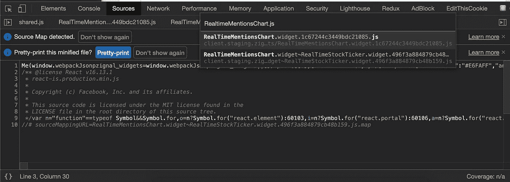
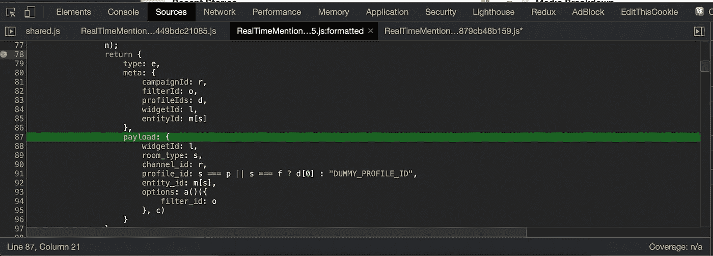

# 使用 REST 方法调试 JavaScript 代码

> 原文：<https://javascript.plainenglish.io/debugging-javascript-code-using-the-rest-method-5710bff8a46e?source=collection_archive---------17----------------------->

## 不要与宁静混淆！

They say a power nap can really improve your debugging skills — would 10/10 not recommend doing during a critical issue though 😉

大约在一个星期四的午夜，我们的平台团队终于完成了一次数据迁移。这比预期多花了大约 3 个小时，我自愿成为电话呼叫的前端开发人员，检查迁移后网站上的一切是否正常。我想，很简单。但是事情发生了意想不到的变化。

我们都厌倦了这场大规模的迁徙，尽管我是整个过程的旁观者，但我感觉到了残余的压力，准备睡觉了，因为我们已经慢慢进入了第二天。快速浏览一下网站，没有发现明显的错误。好吧，除了一个。我们的实时折线图不再工作。这是我们的许多客户在他们公司和行政办公室的大厅里自豪地展示的图表。看起来很酷。持平的时候就没这么多了。

现在有两个选择:回滚数据迁移或者找出这个错误的原因。现在大约是凌晨 12:30，我决定做任何一个优秀的开发人员在这个时候都会做的事情，休息一下。T2 在本地生产这个 bug。检查源代码。 **S** et 断点。这是修复的方法。

## **重现 Bug**

这个实时图表通过网络接口输入数据，并在推特上收听对特定短语的提及。已经过了午夜，所以很有可能我们根本就没有任何收获。我启动了我的本地版本的网站，下载了我们目前在生产中运行的代码，并使用了一个我确信会产生一些点击的特别流行的短语。还是一无所获。但是什么都没有预料到。

我打开了 chrome 开发者工具中的网络标签，查看了收到的信息。我们确实收到了信息。好吧，这很好，虽然我暗暗希望这个问题是在平台方面。这当然是客户端的问题。

## **检查源代码**

我对这个实时图表不是很熟悉，但是我们需要在短时间内更加熟悉来修复这个 bug。我们的生产站点缩小了我们的 JavaScript 代码，这使得在检查时阅读和推理有点困难。检查特定文件的一个很好的技巧是使用打开 chrome 开发者工具，点击 sources 标签并按下`command + p`——这将打开一个文件搜索，在那里你可以选择并检查某个文件。

要美化精简的代码，只需点击左下角的`{}`图标。

幸运的是，我在本地运行这个项目，并且能够在我的机器上以原始的、人类可读的形式挖掘代码。嗯。这张图表只是一个表象的组成部分。数据管理发生在订阅我们的套接字连接的 redux 代码中。确定是否应该显示传入消息的逻辑是一个函数，它查看消息对象中的两个属性。如果这些属性匹配，那么我们将显示数据。双 hmmm。

## **设置断点**

现在是凌晨 1 点左右，我知道这个惊人的错误的可能来源:我们的 redux 代码和数据过滤逻辑。我见过开发人员在他们的代码中使用超过 20 个控制台日志来调试问题，这是一种通过 JavaScript 代码跟踪 bug 的低效方法。我自己以前肯定使用过这种方法，它令人困惑，需要大量刷新和修改更多日志才能最终获得有价值的信息。

不要这样。相反，在错误的源头添加一个调试器。在这种情况下，我使用 chrome 开发工具设置了一个断点，一次一行地遍历逻辑。在源文件打开的情况下，只需单击要暂停执行的行号，等待这一行触发调试器。

另一种方法是简单地在本地运行的代码中添加一个`debugger`语句。

浏览代码，错误现在很明显。我们的过滤逻辑寻找一个值为`DUMMY_PROFILE_ID`的`profile_id`属性，该属性在这些传入消息中不存在。在做了一些快速的 git 历史调查后，我看到一个开发人员最近改变了这个逻辑，以前检查空字符串现在检查这个新值。有意思。现在是凌晨 2 点。我在我们的代码中添加了补丁，我们的图表看起来工作正常！

接下来的一个小时是通过我们的代码管道修复这个 bug，并在大多数使用我们软件的办公室开门之前部署好。凌晨 3 点，问题终于解决了，我兴奋不已，只有在晚上这个时候修复产品缺陷才能让我兴奋不已。

> 在 REST 方法中不是还有一个步骤吗？

亲爱的读者，你是对的。

## **测试修复**

在我急于解决问题的时候，我从来没有真正质疑过为什么那个开发人员改变了我们 redux 代码中的逻辑。嘿，我们的实时图表起作用了，我还需要什么证据？我们的实时图表确实在工作，但是有人注意到我们很少使用的、更新的实时显示新闻的组件不再工作了。哎呀。

一个简单的单元测试或者对我们所有实时组件的更彻底的测试会暴露这个错误，但是我视野狭窄，没有想到所有其他依赖于这个实时数据和逻辑的部件。幸运的是，这个图表不那么引人注目，可以在第二天的正常工作时间部署修复程序。为了避免这种导致其他错误的飞去来器标签或错误修复，添加测试是很重要的。

当我听说没有时间添加测试时，我知道它们可能更重要。解决一个客户的问题，同时为另一个客户产生错误，这不是您想要的解决方案。抵制未经彻底测试和审查就发布代码的冲动。很容易让神经干扰判断。尤其是凌晨 3 点。

我应该知道这些吗？获得在工作和面试中脱颖而出所需的自信，学习所有的 [**JavaScript，我希望我作为一名初级开发人员**](https://www.amazon.com/Javascript-Wish-Knew-Junior-Developer-ebook/dp/B08P25QLB3/)