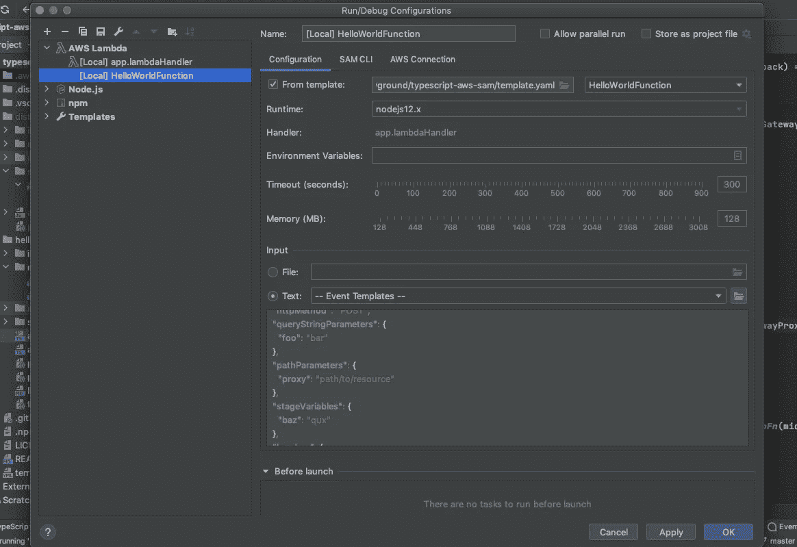
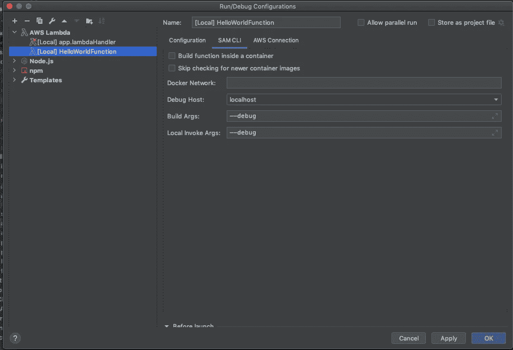
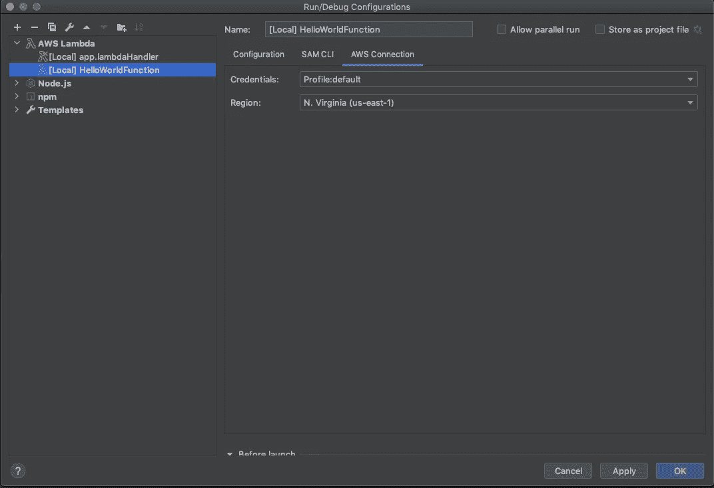
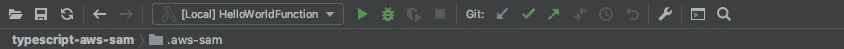

# 如何调试基于 SAM 的类型脚本 Lambdas

> 原文：<https://javascript.plainenglish.io/debugging-sam-based-typescript-lambdas-1c9584fafa73?source=collection_archive---------5----------------------->


[https://flic.kr/p/Em7wAx](https://flic.kr/p/Em7wAx)

如果你必须在 2020 年使用 AWS 无服务器应用程序模型(SAM)和 AWS Lambda 创建无服务器应用程序或服务，那么你会遇到一个问题——设置断点并以传统方式进行调试。AWS 工具包目前不支持用 Webstorm 调试 typescript。本文帮助您在选择的 TypeScript Lambda repo 中设置调试。

*   安装 AWS SAM CLI 工具。有关如何为您的操作系统执行此操作的说明，请访问[https://docs . AWS . Amazon . com/server less-application-model/latest/developer guide/server less-Sam-CLI-install . html](https://docs.aws.amazon.com/serverless-application-model/latest/developerguide/serverless-sam-cli-install.html)
*   如果 Docker 不可用，请安装它。如何操作的说明可以在 https://docs.docker.com/get-docker/[找到](https://docs.docker.com/get-docker/)
*   可以在 https://github.com/rtre84/typescript-aws-sam 的[找到 Lambda starter 的工作打字稿](https://github.com/rtre84/typescript-aws-sam)

启动器有。idea 文件夹，当在你最喜欢的 Jetbrains IDE 中打开时，也会自动继承配置。请感谢决定这么做的善良灵魂。

*   为 Webstorm 安装 AWS 工具包。这将为您提供 SAM Lambda 本地调试选项。

关于安装工具包的说明可以在[https://docs . AWS . Amazon . com/toolkit-for-jetbrains/latest/user guide/setup-toolkit . html](https://docs.aws.amazon.com/toolkit-for-jetbrains/latest/userguide/setup-toolkit.html)找到

如果你注意到，默认情况下，从现在(2020 年 8 月 23 日)开始，用 TypeScript 编写的 lambda 处理程序将不会被默认选择。Webstorm 的调试器和 AWS 工具包需要一些推动，让我们设置断点和调试 ts 文件。

解决方法是通过包装函数公开您的处理程序。我不完全确定为什么这能工作，或者为什么 Webstorm 调试器以某种方式需要它，但是它确实能工作。

再次链接工作样板，查看[https://github.com/rtre84/typescript-aws-sam](https://github.com/rtre84/typescript-aws-sam)

假设您的 lambda 处理程序名为 handler，在 index.ts 或 app.ts 文件的底部公开它，如下所示。

```
export const lambdaHandler = (event, context) =>
  wrapper(handler)(event, context, {});
```

查看位于[https://github . com/rtre 84/typescript-AWS-Sam/blob/master/hello-world/app . ts](https://github.com/rtre84/typescript-aws-sam/blob/master/hello-world/app.ts)的文件，获取一个工作示例。

```
import {
  APIGatewayProxyEvent,
  APIGatewayProxyHandler,
  Callback,
  Context,
  Handler
} from "aws-lambda";
import { parse } from "querystring";

export type LambdaFnWrapper = () => (fn: Handler) => LambdaProxyHandler;
export type LambdaProxyHandler = (
  event: APIGatewayProxyEvent,
  context: Context,
  callback: Callback
) => Promise<APIGatewayProxyHandler> | void;

const lambdaFnWrapper: LambdaFnWrapper = (): ((
  fn: Handler
) => LambdaProxyHandler) => {
  return (fn: Handler): LambdaProxyHandler => {
    return (
      event: APIGatewayProxyEvent,
      context: Context,
      callback: Callback
    ): Promise<APIGatewayProxyHandler> | void => {
      // TODO add any pre processing of incoming requests
      if (
        event.headers["Content-Type"] === "application/x-www-form-urlencoded"
      ) {
        (event as any).body = parse((event as any).body);
      }

      return fn(event, context, callback);
    };
  };
};

export const httpFn: (fn: Handler) => LambdaProxyHandler = lambdaFnWrapper();

const middleware: (fn: Handler) => LambdaProxyHandler = (
  fn: Handler
): LambdaProxyHandler => {
  return (
    event: APIGatewayProxyEvent,
    context: Context,
    callback: Callback
  ): Promise<APIGatewayProxyHandler> | void => {
    (context as any).myName = "Miro";

    return fn(event, context, callback);
  };
};

export const wrapper: (fn: Handler) => LambdaProxyHandler = (
  fn: Handler
): LambdaProxyHandler => httpFn(middleware(fn));
```

包装函数可以在[https://github . com/rtre 84/typescript-AWS-Sam/blob/master/hello-world/MW/MW . ts](https://github.com/rtre84/typescript-aws-sam/blob/master/hello-world/mw/mw.ts)找到

*   右键单击包含您的 TypeScript Lambda 源代码的目录，然后选择`Mark directory as`。在随后的子菜单中，选择`Resource Root`。这应该可以解决 lambda 处理程序找不到的大多数问题。

# 调试器配置



Lambda Debugger Configuration

在模板字段中选择 Cloudformation 模板。下拉菜单应该填充，您的 Lambda 函数现在应该是可选的。

我更喜欢在 SAM CLI 配置中使用`--debug`标志，这样输出会很详细。



Lambda Debugger Configuration SAM CLI Section

AWS 部分应该类似于下面的内容。如果您在公司 VPN 后面或通过联合帐户尝试这样做，您可能需要生成临时 AWS 凭证。



Lambda Debugger Configuration AWS Connection

在输入字段中，复制粘贴以下内容作为您的事件模板。这只有在你使用上面提到的样板文件时才有效。如果你正在建立自己的回购，这可能是不相关的。

```
{
  "body": "{\"test\":\"body\"}",
  "resource": "/{proxy+}",
  "path": "/path/to/resource",
  "httpMethod": "POST",
  "queryStringParameters": {
    "foo": "bar"
  },
  "pathParameters": {
    "proxy": "path/to/resource"
  },
  "stageVariables": {
    "baz": "qux"
  },
  "headers": {
    "Accept": "text/html,application/xhtml+xml,application/xml;q=0.9,image/webp,*/*;q=0.8",
    "Accept-Encoding": "gzip, deflate, sdch",
    "Accept-Language": "en-US,en;q=0.8",
    "Cache-Control": "max-age=0",
    "CloudFront-Forwarded-Proto": "https",
    "CloudFront-Is-Desktop-Viewer": "true",
    "CloudFront-Is-Mobile-Viewer": "false",
    "CloudFront-Is-SmartTV-Viewer": "false",
    "CloudFront-Is-Tablet-Viewer": "false",
    "CloudFront-Viewer-Country": "US",
    "Host": "1234567890.execute-api.{dns_suffix}",
    "Upgrade-Insecure-Requests": "1",
    "User-Agent": "Custom User Agent String",
    "Via": "1.1 08f323deadbeefa7af34d5feb414ce27.cloudfront.net (CloudFront)",
    "X-Amz-Cf-Id": "cDehVQoZnx43VYQb9j2-nvCh-9z396Uhbp027Y2JvkCPNLmGJHqlaA==",
    "X-Forwarded-For": "127.0.0.1, 127.0.0.2",
    "X-Forwarded-Port": "443",
    "X-Forwarded-Proto": "https"
  },
  "requestContext": {
    "accountId": "123456789012",
    "resourceId": "123456",
    "stage": "prod",
    "requestId": "c6af9ac6-7b61-11e6-9a41-93e8deadbeef",
    "identity": {
      "cognitoIdentityPoolId": null,
      "accountId": null,
      "cognitoIdentityId": null,
      "caller": null,
      "apiKey": null,
      "sourceIp": "127.0.0.1",
      "cognitoAuthenticationType": null,
      "cognitoAuthenticationProvider": null,
      "userArn": null,
      "userAgent": "Custom User Agent String",
      "user": null
    },
    "resourcePath": "/{proxy+}",
    "httpMethod": "POST",
    "apiId": "1234567890"
  }
}
```

最后，你应该在顶部有一个类似这样的工具栏。



Debugger Toolbar

恭喜你！您现在应该有一个工作调试配置。在选择的. ts 文件中设置断点，并通过单击调试图标进行调试。


Debug icon

# 附录

另一个打字稿 Lambda Starter:[https://github.com/mir4ef/aws-lambda-typescript-starter](https://github.com/mir4ef/aws-lambda-typescript-starter)

[Flickr 图片来源](https://www.flickr.com/photos/pagedooley/25169160699/in/photolist-Em7wAx-aRVsKv-rcJuLr-AyUxTf-96RucU-qiUL-2jf67N4-69Yugv-2hYWb3T-2jy8Aza-pcGzVY-2j1Q9ps-rrEdsm-rac7Df-quYb1c-quL1zU-rpsCN5-rabb5o-rpsDas-quL1af-rpsD69-rpsCVu-2jpcf7x-2iZfWLL-2iX6zAk-2j25Jg2-2bzcLQ-2iZfWKZ-akhS9Y-8gSPsR-4qzfNu-2o3zry-4rURJR-51qgSf-2jvWpdz-2jycW34-9t9ex-Bux4oA-4HYU56-2jxXVpx-2jxEJ1Q-2jxFN3m-2jsK162-9uK6cj-9A6zhw-9uFKug-29nsiJJ-FVSBun-2jxEDUi-5nP2AJ)

*更多内容请看*[***plain English . io***](http://plainenglish.io/)