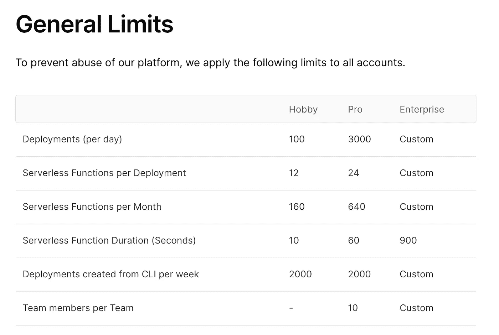

# 在创建 React 应用程序和 Next.js 之间做出选择

> 原文：<https://javascript.plainenglish.io/deciding-between-create-react-app-and-next-js-76586ef7f22a?source=collection_archive---------3----------------------->

## 一个 5 分钟的指南，帮助你决定是为你的应用创建 React App 还是 Next.js


如果你正在阅读这篇文章，你可能是一名 React 开发人员，正在为你的新项目在[创建 React App (CRA)](https://reactjs.org/docs/create-a-new-react-app.html) 和 [Next.js](https://nextjs.org/) 之间做出选择。我已经在几个项目中广泛使用了这两个工具，并开始喜欢上 Next.js，因为它简单、易于开发，而且它在 React 的基础上增加了大量的功能。

让我们来分解一下，包括做出决定的主要好处和注意事项。

# CRA 与 Next.js

CRA 是官方推荐给大多数人启动一个新 React 项目的方法。它去掉了连接 Webpack 或 Babel 的所有困难部分，让我们可以直接构建我们的应用程序。

Next.js 是来自 Vercel(以前称为 Zeit)的 React 框架。它包含了强大的功能，但其中最好的是服务器端渲染。

# Next.js 的主要优势

## 服务器端呈现(SSR)

使用 SSR，当您的应用程序加载到浏览器上时，服务器将返回要呈现的页面的 HTML。与客户端呈现(CSR)形成对比的是，服务器返回一个空的 HTML，其中只有它需要加载的 JavaScript 文件的各种链接。

这意味着通过 SSR，浏览器可以在 JavaScript 文件并行下载和执行的同时开始显示 HTML。有了 CSR，在页面变得可用和可交互之前，用户需要看更长时间的空白页面。因此，SSR 在用户体验方面有巨大的优势。

LogRocket 做的一个更深入的实验[，展示了 SSR 在速度和灯塔评分方面的有效性。](https://blog.logrocket.com/next-js-vs-create-react-app/)

## Vercel 上的免费托管

作为一名开发人员，我有[大量的兼职项目](https://harishv.me/projects/)，还有什么比免费托管它们更好的呢？Vercel 提供 Next.js 项目的免费托管，在这里你甚至可以用无服务器功能创建基于 API 的应用程序。

到目前为止，我已经在 Vercel 上托管了 3 个应用程序，通过与 GitHub 连接，运行时间和持续部署都很长。该平台托管 Next.js 应用程序令人惊叹。

# Next.js 的警告

## Vercel 上自由帐户的限制

Vercel 是所有 Next.js 应用程序的推荐托管方法，因为 Next.js 是由 Vercel 创建的，并针对托管进行了优化。

如果您构建的应用程序不仅仅是一个辅助项目，那么您应该小心 Vercel 上的以下分层方法。这可能会对您的应用程序造成限制。



一个亮点是您可以拥有的无服务器功能数量最多为 12 个。对于服务器渲染的页面，它们将通过无服务器功能创建。如果您计划使用超过 12 页的 SSR，那么这将是一个限制。

这个限制可以通过静态呈现一些页面来克服，而只在需要的地方保留 SSR 页面，这取决于项目的类型。

## 使用 Redux

Redux 是一个流行的轻量级状态管理工具，如果您正在构建一个中型到大型的 React 应用程序，我猜想您可能会将 Redux 作为解决方案的一部分来实现。对于 Next.js，最常见的实现方式是使用 [next-redux-wrapper](https://github.com/kirill-konshin/next-redux-wrapper) NPM 模块。

问题是这个模块要求我们像这样更新 Next.js 应用程序的`_app.js`根页面:

```
import React from 'react';
import {wrapper} from '../components/store';

const MyApp = ({Component, pageProps}) => (
    <Component {...pageProps} />
);

export default wrapper.withRedux(MyApp);
```

如果我们导航到`withRedux`的方法声明，我们可以看到它调用了`getInitialProps`方法:

```
withRedux: (Component: any) => React.FunctionComponent<WrapperProps> & {getInitialProps?(context: NextPageContext<any, AnyAction>): WrapperProps | Promise<WrapperProps>;};
```

通过在`_app.js`根级别调用`getInitialProps`，现在所有的页面都将实现 SSR。

# 简单来说…

1.  你想要 Vercel 提供的免费主机吗？作为一名有许多附带项目的开发人员，对我来说这是一个免费托管我的应用程序的好机会，不用担心会产生更多的成本。
2.  **需要 SSR 吗？Next.js 在 React 上提供了很好的特性，尤其是 SSR。但是首先，问问你自己你的应用程序是否需要 SSR？例如，如果您的应用程序大部分位于认证或登录屏幕之后，那么您甚至可能不需要 SSR。**
3.  **Vercel 的免费等级够你用吗？** 如果你确定你需要 SSR，并且喜欢 Next.js 的许多特性，那么下一个问题就是问一下 Vercel 的免费层是否对你有好处。否则，您是否愿意升级到团队计划的下一层，即起价为 20 美元/月/用户的 Pro 层？

## 简单英语的 JavaScript

喜欢这篇文章吗？如果有，通过 [**订阅获取更多类似内容解码，我们的 YouTube 频道**](https://www.youtube.com/channel/UCtipWUghju290NWcn8jhyAw) **！**