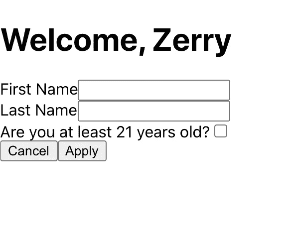

# 使用 React 测试库进行声明性和可伸缩性测试

> 原文：<https://javascript.plainenglish.io/declarative-and-scalable-testing-with-react-testing-library-177f35f41396?source=collection_archive---------7----------------------->


> "所有的**代码**都是有罪的，直到被证明是无辜的."—匿名

老实说，为 React 组件编写测试可能不是您最喜欢做的事情。它通常看起来很麻烦、困难和烦人。我们经常不知道测试什么，甚至不知道如何测试我们的组件。但是，现实情况是，测试对于应用程序的完整性极其重要，如果测试正确，它可以让您对应用程序的运行方式充满信心。

有很多文章给出了如何在小范围内使用 React 测试库的例子，但是没有多少文章讨论了如何编写干净的测试以及如何为有多个开发人员的大型项目简化测试。我想分享一下我在为具有复杂组件和大量移动部件的大型项目编写测试时学到的东西。我的目标是向您展示如何以这样一种方式测试您的 React 组件，即编写测试变得轻而易举，缺乏代码覆盖率成为过去。

让我们得到它。

首先，我们将初始化一个新的 React 应用程序。我将在本文中使用 TypeScript。

```
npx create-react-app test-app --template typescript# oryarn create react-app test-app --template typescript
```

我们还将安装另一个测试库，以便像用户一样轻松地与我们的组件进行交互。这个库叫做`@testing-library/user-event` ，它将使模拟真实世界的用户事件变得非常容易，比如在你的测试用例中点击和输入。

```
npm install @testing-library/user-event --save-dev# oryarn add @testing-library/user-event --dev
```

现在，在你选择的 IDE 中打开这个项目，在`src`下创建以下名为`/components/ComplexForm/ComplexForm.ts`的文件

将下面的代码粘贴到文件中:

然后，在`src`文件夹根目录下的`App.tsx`文件中粘贴以下代码:

在我们继续之前，我将解释这个组件是做什么的。

1.  我们正在创建一个名为`ComplexForm`的组件，它呈现一个简单的 HTML 表单供用户交互。
2.  该表单要求用户输入他们的名和姓，并检查他们是否超过 21 岁。
3.  如果用户超过 21 岁，则呈现另一个输入，询问用户他们最喜欢的饮料是什么。
4.  填写完表格后，用户可以点击**应用**或**取消**。这两个按钮都将触发回调属性，这些属性被传递到 **ComplexForm** 中，正如你在 App.tsx 中看到的。
5.  如果用户单击 submit，我们将表单元素转换成 JSON，并传递给 onSubmit 回调函数。

现在您已经了解了所有代码的作用，可以使用以下代码启动项目:

```
$ cd test-app 
$ yarn start
```

您应该会看到如下所示的表单:



现在，我们已经准备好了要测试的示例组件，但是首先，让我们稍微讨论一下 React 测试库。

# 为什么要测试 React 库？

React 测试库是一个为测试 React 组件而设计的库。你过去可能使用过酶来测试你的反应成分。React 测试库与 Enzyme 的不同之处在于，它使用实际的 DOM 节点而不是 React 组件的实例来呈现测试。

这对您的测试来说意味着您的测试用例将在一个与您的用户将在其中运行您的应用程序的真实环境相似的环境中运行，例如 web 浏览器。您的测试环境与用户使用您的应用程序的环境越相似，您在测试中就越有信心。

我更喜欢使用 React 测试库的另一个重要原因是因为库的理念，本质上是说你的测试应该类似于你的用户与你的应用交互的方式。当你的一个用户在使用你的应用时，他们并没有意识到他们正在与状态和道具进行交互。他们不关心你是在功能组件中使用钩子，还是在类组件中使用高阶组件。你的用户看到的是用户界面(按钮、输入、模态等)，这就是他们交互的内容。

因此，React 测试库不是测试你的组件中正确的属性或状态是否被改变，而是以这样一种方式设计的，你必须测试你的用户*看到了什么*和*做了什么*。这鼓励你构建易访问的用户界面，并在构建 HTML 时遵循最佳实践。

# 运用哲学

那么，React 测试库的原理如何应用于我们的示例组件，以及我们如何知道要测试什么呢？好吧，让我们考虑一下用户与这个组件交互的方式。

## 测试案例 1

当用户加载这个应用程序时，首先会看到什么？嗯，他们应该会看到一个输入名字和姓氏的标题，一个询问他们是否超过 21 岁的复选框和一个取消并提交按钮。我总是喜欢写一个默认的测试用例来测试用户首先应该看到什么。

## 测试案例 2

用户的下一个逻辑交互是开始填写表单。因此，用户将开始填写表格，然后他们将得到“你是否至少 21 岁？”复选框。如果用户点击 yes，那么我们显示另一个输入，让他们输入他们最喜欢的饮料。这代表了我们需要测试的代码的一个单独的*分支*。

注意这个测试并没有直接测试我们对`useState`的使用。我们正在测试我们的用户看到的是正确的信息，而不是内部状态更改为`true`或`false`。我们可以重构状态逻辑，使用`useReducer`或任何其他状态管理解决方案，测试用例将永远不会改变。

## 测试案例 3 和 4

用户在该组件中可以做的最后一件事是点击*取消*或*提交*。该组件的设计方式是，当点击*取消*或*提交*按钮时，父组件将传入回调。因此，这些测试用例与之前的略有不同。我们不会测试用户看到了什么，而是想测试我们的代码通过调用特定的函数对用户的动作做出了正确的内部反应。

# 使用声明式编程编写测试

因此，我们已经设置了我们的测试组件，我们已经讨论了什么是 React 测试库，并且我们应用了 React 测试库的原理来创建我们的测试用例。现在是真正开始编写测试的时候了！

您会经常看到开发人员编写这样的测试:

这个测试本身没有什么问题，如果你的组件真的很简单，只需要 1 到 2 次测试，那么这就非常好了。当您的组件变得复杂，并且您开始为单个组件拥有 5、10 或 15 个以上的测试用例时，这种类型的测试就会成为一个问题。

如果每个测试都像这样，不仅你的测试文件会很大，而且其他开发人员和你未来的自己也很难快速理解测试中发生的事情，因为他们必须仔细阅读每一行代码才能理解你在做什么。

相反，如果我们的测试是声明性的呢？如果我们不写测试来展示我们在做什么，而是写测试来描述用户的意图，会怎么样？起初这听起来可能令人困惑，但我会给你一个例子来说明我的意思。上面的测试用例可以使用声明式编程来重写:

那个测试是不是感觉更容易阅读和理解？只要简单地阅读允许的函数，您就可以立即理解发生了什么。我们正在检查输入的名字和姓氏是否在文档中。然后我们点击“你至少 21 岁了吗？”复选框，然后我们检查最喜欢的饮料输入是否在文档中。

不仅这个测试可读性更好，而且从`renderComplexForm` 函数中导出的测试助手可以在其他测试用例中重用。因此，如果我们总共有 10 或 20 个测试用例，我们将不得不编写和重复更少的代码，并获得更好的可读性。如果另一个开发人员必须在 6 个月后向这个组件添加特性，并且需要更新测试，那么他们更新测试会容易得多。

我发现以这种方式编写测试非常适合大型项目，并且使测试复杂的组件变得更加容易。

# 为 ComplexForm 组件编写测试

最后，让我们将这种测试方法应用于我们的`ComplexForm`组件，并为我们上面记录的 4 个测试用例编写实际的测试规范。以下是最终代码:

让我们稍微分解一下:

1.  首先，我们为组件创建渲染函数。render 函数负责使用 React 测试库来呈现我们的组件，并为我们的测试用例导出辅助函数。您还可以为 render 函数创建一个单独的文件，并将其导入到您的测试中。
2.  在每一个测试用例中，我们调用`renderComplexForm`并获取特定测试用例所需的效用函数。
3.  我们创建了测试助手函数来改变输入值，比如`changeFirstName`。这模拟了用户将如何交互，并使测试中发生的事情变得非常明显。
4.  `renderComplexForm`函数接受一个*道具*参数。通常情况下，你的组件将能够接受改变你的组件的用户界面或者用户所看到的东西的道具。通过允许每个测试用例在 *props* 中通过，我们也可以在每个测试用例中测试不同的交互。
5.  我们正在为`onSubmit`和`onCancel`道具使用玩笑模仿功能。Jest mock 函数对于测试一个函数是否被调用、被调用了多少次以及调用时使用了什么参数非常有用。Jest mock 函数在最后两个测试用例中用于测试用户按钮点击触发了适当的回调函数。

我相信最终的结果是测试更具可读性、可伸缩性和持久性。我可以回到这个测试，添加额外的输入，并且能够在几分钟内更新测试，而不必解析测试代码来知道在哪里添加新的测试覆盖。

请在评论中告诉我你们的想法！

你可以在[https://github.com/jerrywithaz/how-to-test-react-app](https://github.com/jerrywithaz/how-to-test-react-app)找到 GitHub 回购