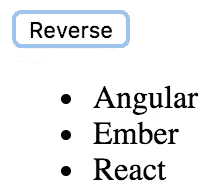
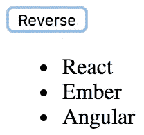

# 如何在 React 中编写事件处理程序

> 原文：<https://javascript.plainenglish.io/declaring-event-handlers-d63b17e170d9?source=collection_archive---------2----------------------->

在 Adam Boduch 的这篇文章中学习如何声明事件处理程序，他是一位经验丰富的 web 应用程序开发人员，拥有从 jQuery 到 React 的丰富经验。

React 有一种独特的处理事件的方法:在 JSX 中声明事件处理程序。React 组件中事件处理的区别在于它是声明性的。与 jQuery 相比，在 jQuery 中，您必须编写命令式代码来选择相关的 DOM 元素并将事件处理函数附加到这些元素上。


JSX 标记中事件处理程序的声明性方法的优点是它们是 UI 结构的一部分。不必追踪分配事件处理程序的代码是一种精神解放。在本文中，您将编写一个基本的事件处理程序，这样您就可以感受一下 React 应用程序中的声明性事件处理语法。然后，您将学习如何使用通用事件处理函数。

## 声明处理函数

下面是一个为元素的 click 事件声明事件处理程序的基本组件:

```
import React, { Component } from 'react'; export default class MyButton extends Component {// The click event handler, there's nothing much happening here other than a log of the event. onClick() { console.log('clicked');} // Renders a "<button>" element with the "onClick" event handler set to the "onClick()" method of this component. render() { return ( <button onClick={this.onClick}>{this.props.children}/> ); }}
```

事件处理函数`this.onClick()`被传递给`<button>`元素的`onClick`属性。通过查看这些标记，可以清楚地看到当按钮被单击时会运行什么代码。

## 多个事件处理程序

当一个元素有多个处理程序时，声明性事件处理程序的语法很容易理解。例如，有时一个元素有两三个处理程序。命令式代码很难处理单个事件处理程序，更不用说几个事件处理程序了。当一个元素需要更多的处理程序时，它只是另一个 JSX 属性。从代码可维护性的角度来看，这一点很好:

```
import React, { Component } from 'react'; export default class MyInput extends Component {// Triggered when the value of the text input changes...onChange() { console.log('changed');}// Triggered when the text input loses focus...onBlur() { console.log('blurred');}// JSX elements can have as many event handler properties as necessary. render() { return <input onChange={this.onChange} onBlur={this.onBlur} />; }}
```

这个`<input>`元素可以有更多的事件处理程序，代码也同样可读。

随着您不断向组件添加更多的事件处理程序，您会注意到许多事件处理程序都在做同样的事情。接下来，您将学习如何跨组件共享通用处理程序函数。

## 导入通用处理程序

任何 React 应用程序都可能为不同的组件共享相同的事件处理逻辑。例如，在响应按钮点击时，组件应该对项目列表进行排序。正是这些类型的通用行为属于它们自己的模块，以便几个组件可以共享它们。实现一个使用通用事件处理函数的组件:

```
import React, { Component } from 'react';// Import the generic event handler that manipulates the state of a component.import reverse from './reverse';export default class MyList extends Component { state = { items: ['Angular', 'Ember', 'React'] }; // Makes the generic function specific to this component by calling "bind(this)".onReverseClick = reverse.bind(this);render() { const { state: { items }, onReverseClick } = this; return ( <section>{/* Now we can attach the "onReverseClick" handler to the button, and the generic function will work with this component's state. */} <button onClick={onReverseClick}>Reverse</button> <ul>{items.map((v, i) => <li key={i}>{v}</li>)}</ul> </section> );}}
```

您正在导入一个名为`reverse()`的函数。这是您对`<button>`元素使用的通用事件处理函数。当它被点击时，列表应该颠倒它的顺序。

`onReverseClick`方法实际上调用了通用的`reverse()`函数。它是使用`bind()`将通用函数的上下文绑定到这个组件实例上而创建的。

最后，查看 JSX 标记，可以看到`onReverseClick()`函数被用作按钮点击的处理程序。

这到底是怎么回事？你有没有一个通用函数，因为你绑定了上下文而改变了这个组件的状态？嗯，差不多，是的，就是这样。现在让我们来看看通用函数的实现:

```
// Exports a generic function that changes the state of a component, causing it to re-render itself.export default function reverse() { this.setState(this.state.items.reverse());}
```

这个函数依赖于状态中的一个`this.state`属性和一个`items`数组。关键是状态是通用的；一个应用程序可能有许多状态中带有一个`items`数组的组件。

下面是您的渲染列表的样子:



不出所料，点击按钮会导致列表排序，使用通用的`reverse()`事件处理程序:



*如果你觉得这篇文章很有趣，你可以探索一下* [*React 和 React Native——第二版*](https://www.amazon.com/React-Native-Complete-native-development-ebook/dp/B07GVMNQCB) *用 React、JSX、Redux 和 GraphQL 为 web 和原生移动平台构建应用。* [*React 和 React Native —第二版*](https://india.packtpub.com/in/application-development/react-and-react-native-second-edition) *带您了解如何使用 React 16 和 React Native 0.5 为所有平台创建强大而迷人的桌面移动和本机应用程序。*