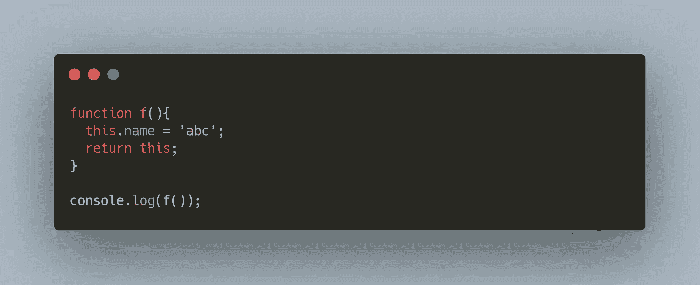
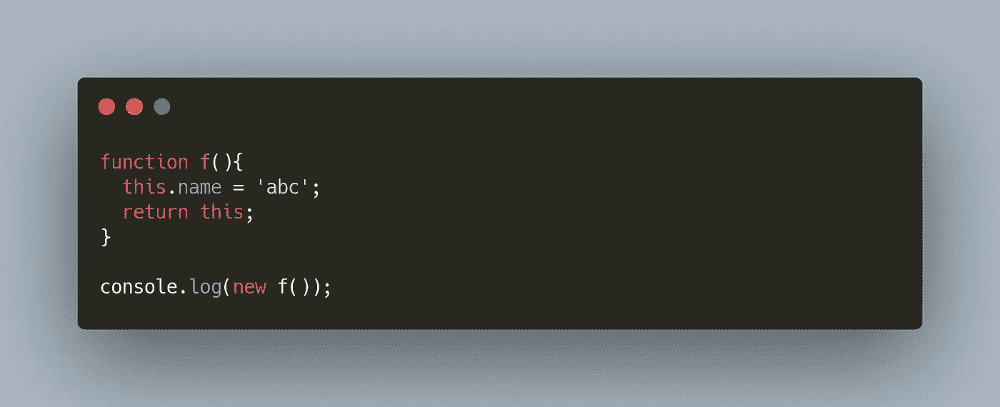
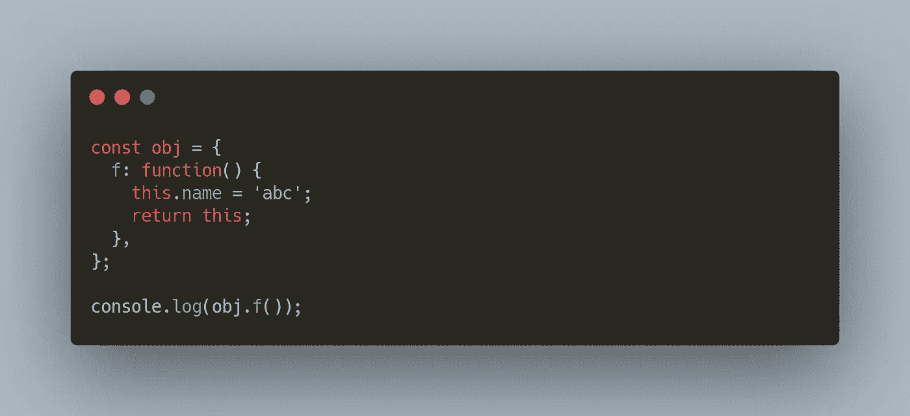
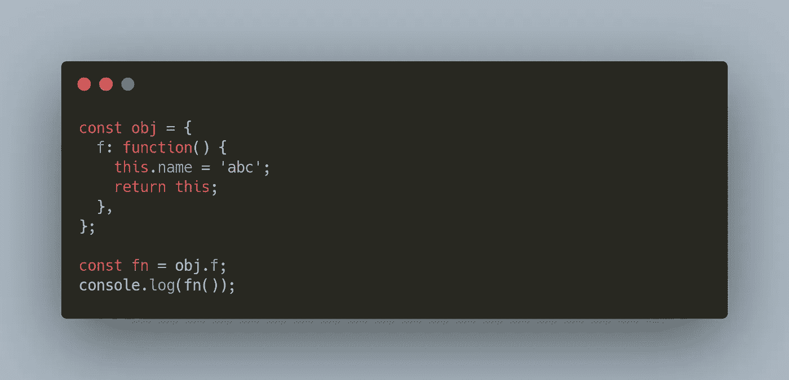
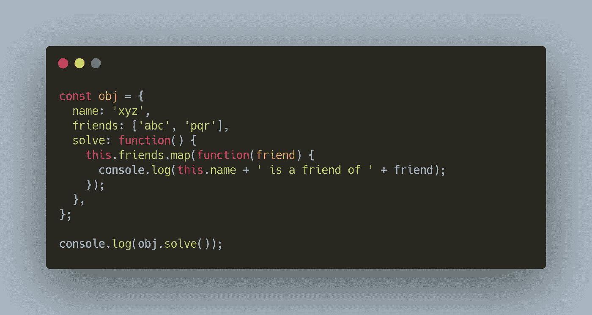
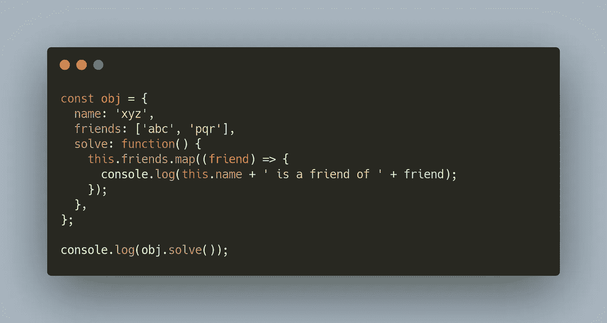

# 解码 JavaScript 上下文行为

> 原文：<https://javascript.plainenglish.io/decoding-the-behaviour-of-the-javascript-context-88ceba445f54?source=collection_archive---------12----------------------->


JavaScript 中最重要的两样东西是函数和对象。对象几乎是 JavaScript 语言的组成部分。JavaScript 中的任何东西，从类到函数，除了原语；本质上归结为运行时的 JavaScript 对象。

语言中所有面向对象的属性都是通过对象来实现的，比如通过使用原型来继承等等。另一方面，函数是典型 JavaScript 代码的主要构造，可以根据您的需求做多种事情。

在这两个主题中，有一点是最重要的，也是最难理解的，那就是它们内部的背景的性质。在我们的 JavaScript 代码中，由 **this** 关键字表示的上下文在不同的场景中显示出非常矛盾的结果，与其他面向对象的编程语言(如 Java)不同，您无法做出确定的预测。

为了更好地了解这种不可预测的性质，请参考下面的四个代码块，并尝试在您的控制台中运行。这些程序的输出也在下面给出。



Code example 1

```
**// Output for code block 1**
Object [global] {
   global: [Circular],
   clearInterval: [Function: clearInterval],
   clearTimeout: [Function: clearTimeout],
   setInterval: [Function: setInterval],
   setTimeout: [Function: setTimeout] {     
    [Symbol(util.promisify.custom)]: [Function] },
     queueMicrotask: [Function: queueMicrotask],
     clearImmediate: [Function: clearImmediate],
     setImmediate: [Function: setImmediate] {
    [Symbol(util.promisify.custom)]: [Function]
  },
 name: ‘abc’
}
```



Code example 2

```
**// Output for code block 2**
f { name: ‘abc’ }
```



Code example 3

```
**// Output for code block 3**
{ f: [Function: f], name: ‘abc’ }
```



Code example 4

```
**// Output for code block 4**
Object [global] {
   global: [Circular],
   clearInterval: [Function: clearInterval],
   clearTimeout: [Function: clearTimeout],
   setInterval: [Function: setInterval],
   setTimeout: [Function: setTimeout] {     
    [Symbol(util.promisify.custom)]: [Function] },
     queueMicrotask: [Function: queueMicrotask],
     clearImmediate: [Function: clearImmediate],
     setImmediate: [Function: setImmediate] {
    [Symbol(util.promisify.custom)]: [Function]
  },
 name: ‘abc’
}
```

在上面的例子中，有一个非常简单的函数，它捕捉上下文，分配一个新的属性，然后返回上下文。

但是当从同一个函数返回时，它们返回的上下文是非常不可预测的。这是因为 JavaScript 在本质上不是静态的上下文中工作。

与 Java 等语言中上下文是静态的不同，JavaScript 严重依赖于其运行时或脚本中函数的调用点来确定执行实例的上下文。从调用该函数的地方，它简单地获取该对象的上下文并对其进行操作。

为了更好地理解它，让我们假设背景是你目前所在的房间。房间里有很多东西，比如桌子，椅子，你的包，你的手机。我们会将它们视为房间的不同属性。制造它们的材料就是它的价值。

所以我们的上下文看起来像一个有价值的财产表，木头，椅子，铁等等。当你使用像 java 这样的静态上下文的编程语言时，这个空间是不能改变的。因此，当你称之为财物袋时，你是在说那个房间里的袋子。但是对于像 JavaScript 或 Self 这样具有动态上下文的语言来说，这个空间可以有一些开箱即用的变化。

现在我们知道 JavaScript 函数内部的上下文依赖于它的调用范围，理解上面的例子变得非常容易。

在第一个例子中，从调用函数的地方没有任何东西，函数位于全局范围内。因此，由函数调用获得的上下文是全局上下文对象，并为其分配一个名称属性。

对于第三个示例，从对象 obj 调用该函数。因此，它简单地选择它的上下文，因此控制台日志打印具有函数 **f** 和新分配的属性**名称的上下文。**然而，对于第四个例子，调用点还是全局的，因为我们已经从对象中提取出了函数。现在，它将再次拾起全球背景。

第二个例子有些什么不同。这是一个典型的例子，使用 new 关键字将常规函数作为构造函数执行。这种功能在 Java 等其他面向对象语言中很少见。然而，它继承了 Java 的行为，并从中创建了一个新的对象。因此，返回的上下文是一个只有一个属性**名的新对象。**

## **箭头函数内上下文的性质**

为了理解 arrow 函数中上下文的工作原理，让我们借助一个例子直接将其与传统函数进行比较。



code exmple 5

上述代码将输出以下内容。

```
**// output code example 5**
undefined is a friend of abc
undefined is a friend of pqr
```

这确实出乎意料，因为我们对传统函数的理解是，函数 solve 中的**名**应该取自我们调用该函数的对象 obj。

但是这里的情况不是这样，因为 map 方法中的函数有不同的调用范围。Map 是 JavaScript 数组中给定函数，它接受一个函数作为其参数。您真的不知道是谁在调用那个函数，如果调用对象有自己的 name 属性就更糟了。

这就是为什么我们在那个地方期待字符串“xyz”时，却得到了未定义的结果。这是 arrow 函数解决的经典问题。现在让我们看另一个例子，这里的传统函数被一个箭头函数代替，看看结果。



代码的输出如下所示。

```
**// output code example 6** xyz depends on abc
xyz depends on pqr
```

这是我们所预料的。这是因为 arrow 函数中的上下文只不过是在它的作用域之外找到的上下文。无论 arrow 函数在它的块范围之外找到什么，它都将其作为上下文。因此，在示例中，map 内部的函数将对象放在它的作用域之外，并找到了所需的 name 属性。

## **结论**

函数内部的 JavaScript 上下文是不可预测的，因为它是动态的。函数的调用范围主要决定它将选取哪个上下文。然而，在 arrow 函数的情况下，它更容易预测，因为它选择了在它的函数范围之外找到的上下文。