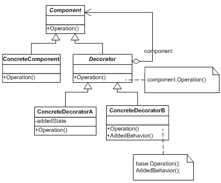

# 基于类和基于原型的编程语言之间的装饰器

> 原文：<https://javascript.plainenglish.io/decorators-between-class-based-and-prototype-based-programming-languages-ee8a1c854411?source=collection_archive---------8----------------------->


OOP 和原型语言之间的区别集中在重用原则(称为继承)上，它是通过基于原型的编程语言中重用对象的过程(称为原型继承)和重用对象类或对象蓝图的过程(称为类继承)来实现的。

装饰器是一种设计模式，它允许以动态方式将行为添加到对象中，而不必更改该对象的实现。装饰器被认为是**结构设计模式**。一个重要的注意事项是，装饰器遵循**开闭原则**。

基于类的编程语言和基于原型的编程语言实现装饰模式是不同的，因为它们的本质不同。我将在本文中讨论用 Javascript 和 C#编程语言实现装饰模式。并考虑一些现实生活场景来使用它们。

# C#中的装饰器

C#中的装饰器可以用两种方法来应用:

1-从目标类继承并有一个 setter 方法来设置装饰器中目标类实例，或者通过构造函数绕过目标类作为装饰器类的依赖项。然后在被覆盖的函数中，我们调用带有附加修饰的目标类函数。下一个 UML 解释说:



该图摘自:

[](https://www.dofactory.com/net/decorator-design-pattern) [## 装饰者

### 动态地将附加责任附加到对象上。装饰者为子类化提供了一个灵活的选择…

www.dofactory.com](https://www.dofactory.com/net/decorator-design-pattern) 

你可以通过这个链接了解更多关于装饰的方法。

2-使用 C#属性来简化其用法。ASP.NET Web API 中装饰器非常著名的例子是 HTTP 动词装饰器，它是用 C#属性设计的，用来装饰控制器动作，当它被调用时被缩短为一个特定的 HTTP 动词。请注意，装饰不会自动添加到目标类函数中，但是应该存在另一个组件，它会在调用目标函数之前或之后，或者在初始化类之前或之后调用装饰函数。该组件将使用反射来检测这些装饰器(属性)。

此外，我在使用属性装饰器的职业生涯中遇到的另一个例子是在 Web API 动作上使用授权属性，如下所示:

Example of Decorations through C# Attributes

# Javascript 中的装饰器

Javascript 中的 Decorators 只是编写一个函数，通过扩展其功能来修改特定类或方法的原型。

从下一篇文章中，您可以确切地知道它在 ES5 中的样子:

[](https://medium.com/better-programming/learn-about-decorators-in-javascript-d19c8795e8a) [## 了解 JavaScript 中的装饰器

### 用漂亮的增强装饰你的代码

medium.com](https://medium.com/better-programming/learn-about-decorators-in-javascript-d19c8795e8a) 

而且只是关于下面的功能:

```
**function** **decoratorName**(target) { // do something with ‘target’ … }
```

ES6 函数装饰器是一个表达式，它返回函数并接受一个目标(静态成员的类的构造函数或实例成员的类的原型)、成员名和属性描述符作为参数。

ES6 类装饰器应用于类的构造函数，可以用来观察、修改或替换类定义。class decorator 的表达式将在运行时作为一个函数调用，被修饰类的构造函数是它唯一的参数。

Example of Class decorator

当`@sealed`被执行时，它将密封构造函数和它的原型。

装饰器的另一个例子是 delay decorator:

Example of Function decorator

在撰写本文时，ES6 中的 decorators 还处于试验阶段，可能会随着时间的推移而改变，但是在 Babel 中，虽然它是 TypeScript 中的一个原生特性，但您需要做一些配置来启用它。

Angular 大量使用 decorator，您可以查看下一篇文章，了解该框架中所有可用的 decorator:

[](https://medium.com/@madhavmahesh/list-of-all-decorators-available-in-angular-71bdf4ad6976) [## Angular 中所有可用的@ Decorators 列表

### Angular 中所有装饰器的列表及其用法。

medium.com](https://medium.com/@madhavmahesh/list-of-all-decorators-available-in-angular-71bdf4ad6976) 

在撰写本文时，ES6 中的 decorators 还处于试验阶段，可能会随着时间的推移而改变，但是在 Babel 中，虽然它是 TypeScript 中的一个原生特性，但您需要做一些配置来启用它。

这是一本非常好的读物，关于 Javascript 中装饰者的更多细节，你可以点击下一个链接:

[](https://itnext.io/a-minimal-guide-to-ecmascript-decorators-55b70338215e) [## ECMAScript 装饰器和对象属性描述符的简明指南

### 对 JavaScript 中“装饰者”提议的简短介绍，包括基本示例和一点关于 ECMAScript 的内容

itnext.io](https://itnext.io/a-minimal-guide-to-ecmascript-decorators-55b70338215e)