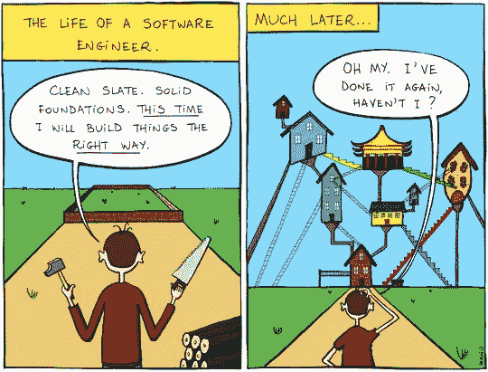

# 用 React 钩子将数据从 UI 解耦

> 原文：<https://javascript.plainenglish.io/decouple-data-from-ui-with-react-hooks-6f7fe968c3e3?source=collection_archive---------3----------------------->

## 以及我如何用 JavaScript 函数“编程到一个接口”

Source: [Imgur](https://imgur.com/gallery/CgWZFId)

我相信您已经见过(或写过)这种常见的 React 模式:(a)在通过 AJAX 获取一些数据的同时呈现一个占位符/加载器/微调器，然后(b)根据接收到的数据重新呈现组件。让我们编写一个功能组件，利用[获取 API](https://developer.mozilla.org/en-US/docs/Web/API/Fetch_API) 来完成这个任务。

假设我的应用增长了，有`X`个组件使用相同的数据获取逻辑，因为……原因。为了避免服务器收到垃圾数据请求，我决定使用[本地存储](https://developer.mozilla.org/en-US/docs/Web/API/Window/localStorage)来缓存数据。

**好的……这是否意味着我需要更新数据逻辑** `**X**` **次？😬😱**

不，让我们[写一个自定义的钩子`useSomeData`来干掉](https://medium.com/better-programming/kiss-dry-and-code-principles-every-developer-should-follow-b77d89f51d74)。

共享这个数据逻辑的组件现在看起来很简洁。

**好吧……干代码很棒，但那又怎样？**

假设我的应用程序变得复杂，所以我决定使用 Redux 来处理 AJAX 请求并维护全局应用程序状态。我只是简单地更新了`useSomeData` *的实现，而没有触及 UI 组件*。

然后 GraphQL 出现了，我也跟上了潮流。同样，我只是简单地更新了`useSomeData`T19 的实现，而没有触及 UI 组件。

**每当我被迫用最新/最热的状态管理框架或 API 范式更新数据层时，就清洗并重复。**

对我来说，这看起来很像经典的依赖倒置原则，即 SOLID 中的“D”(查看 Matthew Lucas 的优秀[讲解者](https://medium.com/better-programming/revisiting-solid-927e6a5202d3))。虽然这无论如何都不是 OOP，我们正式定义了一个抽象的`Interface`并创建了一个实现那个`Interface`的具体的`Class`，但我认为有一个事实上的“接口”`useSomeData`提供给使用它的各种 UI 组件。在这个例子中，UI 不关心`useSomeData`如何工作，只要它从钩子接收到`someData`、`loading`和`error`。

**所以从理论上来说，这将用户界面从被锁定到数据层的任何特定实现中解放出来，并且支持迁移到新的实现(框架/库/等等),而不必更新用户界面代码，只要“接口”契约被兑现。**

很想听听你的想法。

Source: [Pinterest](https://www.pinterest.com/pin/333759022356307210/)

**p . s .**[容器模式](https://medium.com/@dan_abramov/smart-and-dumb-components-7ca2f9a7c7d0)、[渲染道具](https://reactjs.org/docs/render-props.html)和 [HOC](https://reactjs.org/docs/higher-order-components.html) 是将传统组件的数据层与 UI 层分离的流行选项。这篇文章并不是要讨论 Hooks 是好是坏。我只是分享我是如何学会使用钩子来应用同样的关注点分离的。

# 阅读更多

 [## 在 React 第 2 部分中将数据从 UI 中分离出来

### 对钩子、渲染道具和特设模式的进一步探索

medium.com](https://medium.com/javascript-in-plain-english/how-to-decouple-data-from-ui-in-react-d6b1516f4f0b)  [## React 服务器端渲染简介

### 如何在没有任何工具或框架的情况下构建一个 React SSR app？

medium.com](https://medium.com/javascript-in-plain-english/intro-to-react-server-side-rendering-3c2af3782d08) 

📫*我们来连线上*[*LinkedIn*](https://www.linkedin.com/in/suhanwijaya/)*或者*[*Twitter*](https://twitter.com/suhanw)*！*