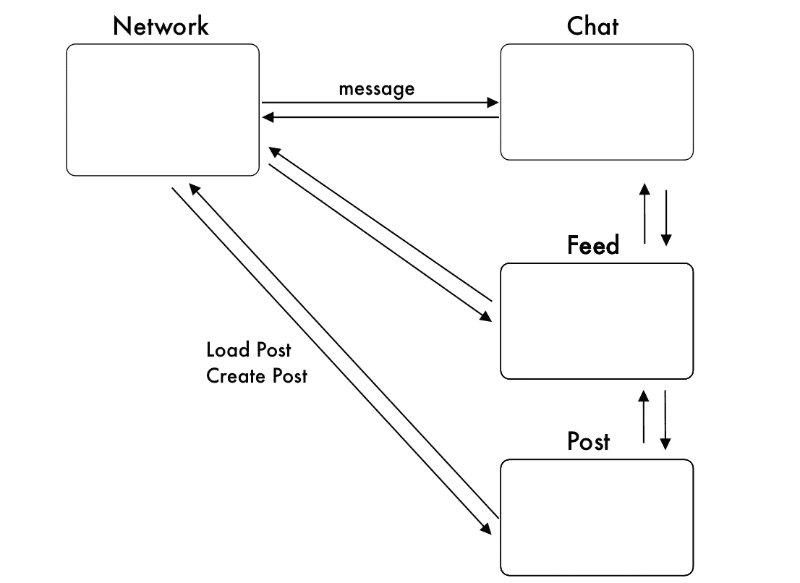
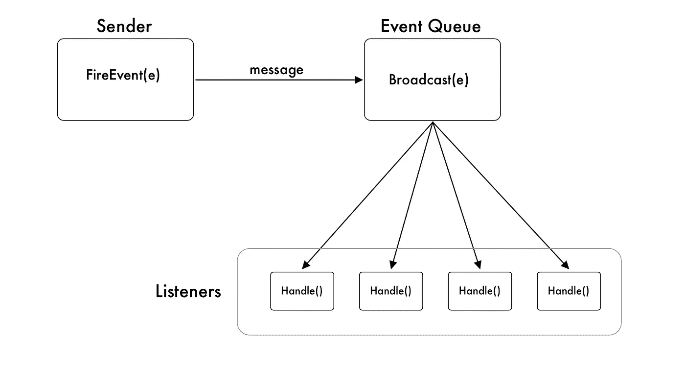
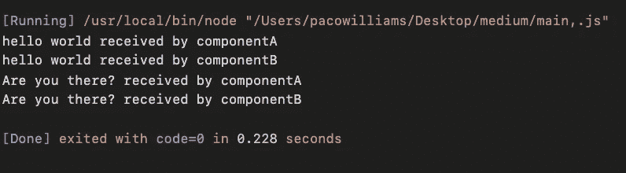

# 什么是事件队列？

> 原文：<https://javascript.plainenglish.io/decoupling-patterns-event-queue-b3c0fa2ce5c1?source=collection_archive---------10----------------------->

Photo by [Evonne Yuwen Teoh](https://unsplash.com/@evonneteoh?utm_source=medium&utm_medium=referral) on [Unsplash](https://unsplash.com?utm_source=medium&utm_medium=referral)

## 用于系统设计的强大设计模式

*你可以在这里* [***下载完整代码***](https://github.com/pacosw1/EventQueue)**到* *跟着来。**

*今天我们将谈论一个在系统设计中使用的非常令人兴奋的模式。无论是金融后端服务、实时应用程序还是视频游戏，这种模式都使系统易于维护和扩展。*

*这是本系列的第一个解耦模式，所以让我们从解释什么是解耦以及为什么要使用它开始。*

# *简而言之，脱钩*

*在我们特定的上下文中，解耦意味着**将我们系统中的组件**分开，这样它们就不会直接依赖于彼此**或者相互**交互。*****

# ***目的***

***当我们构建需要扩展的复杂系统时，我们很少会单独工作。这意味着不同的人需要同时阅读和修改项目的不同部分。***

***如果事情做得不对，这会导致很多挫折。***

***例如，假设我们正在建立一个社交网络。团队中的每个人都被分配到不同的组件。一个负责网络，另一个可能负责聊天功能，还有一个负责 feed 和图片上传。***

***乍一看，人们可能会认为网络组件(从客户端发送和接收数据)必须与聊天组件有直接的联系，因为它们需要彼此才能工作。关于上传位也可以这么说。***

***虽然这可能是真的，但网络和聊天执行完全不同的功能，彼此并不完全相关。但同时，聊天需要网络组件正在接收和处理的数据。***

# ***避免意大利面条代码***

******

***all graphics created by me***

***如果我们实现了简单的方法，我们会让聊天依赖于网络组件，反之亦然。***

***网络组件中的任何改变都可能影响聊天功能，聊天者可能需要侵入网络者的代码，以使其代码再次工作。这是事情变得非常混乱的地方。聊天的人不应该需要修改不特定于他的领域的代码。或者至少是最少的数量。***

***因为这两个组件是耦合的，所以双方都需要跟踪这两个领域中发生的事情，当系统随着时间变得更加复杂时，这就变得非常棘手。***

# ***救援事件队列***

******

***事件队列就像一个中心站，一个中间人，所有的“包”都到达这里，并被分发到相应的目的地。这种模式使用基于事件的系统来解耦所有的通信。***

***想象一下，你正在看 youtube，你真的很喜欢 X 的频道，希望在他们上传新视频时得到通知。每当 X 上传一个新的视频，你，现在是订阅者，将会收到一封电子邮件(事件)。***

***事件队列以同样的方式工作。组件向队列发送一个事件，队列处理所有这些消息，并将其分发到订阅该事件的任何组件。***

# ***事件队列的构造块***

## ***事件***

***事件是一种结构，它定义了发送和接收的数据是什么(它的类型)，并跟踪谁在监听它。***

## ***发报机***

***发送者就像 YouTuber，他将消息发送到事件队列，这就是他所需要担心的。不错！***

## ***听众***

***侦听器将首先需要订阅一个事件。那么每当来自所述事件的新消息到达时，事件队列将通知他。***

## ***处理函数***

***一旦接收到数据，处理程序是由每个用户执行的功能。所有订户都接收到该特定事件的相同数据，但是每个订户都可以将该数据用于不同的目的。***

## ***事件队列***

***事件队列将接收来自发送方的事件消息，并将它们广播给相应的订阅方。***

# ***实现事件队列***

***现在我们更熟悉它是如何工作的，让我们用 JavaScript 来实现它***

***让我们从实现 eventQueue 类开始***

***这里我们可以看到一些东西。***

## ***长队***

*   ***该队列将用于接收和广播事件消息***

## ***消息监听器***

*   ***监听 Message 类型事件的所有组件的列表***

## ***运转***

*   ***我们的 EventQueue 的状态，我们可以通过使它= false 来停止循环；***

## ***开始()***

*   ***开始运行循环***

## ***runLoop()***

*   ***它卸载队列中的下一个事件，并将其消息广播给所有注册的侦听器。(订户)***
*   ***这是最重要的部分之一。事件循环异步等待发送到其队列的消息。***
*   ***我们需要使它成为异步函数的原因是因为 JavaScript 是单线程的，所以如果我们不这样做，循环将阻塞我们代码中的所有其他内容，我们将无法接收任何输入，甚至无法停止循环。***

## ***创建事件***

***我们可以创建许多不同类型的事件，如“客户端连接”、“客户端断开”、“客户端加入组”、“客户端离开组”等…***

***要创建一个事件，我们需要存储的只是侦听器和实际发送的消息(有效负载)。***

***每个事件都有一个广播方法，因此 eventQ 可以将消息广播给它的所有侦听器。***

***注意:在这种情况下，每个侦听器都必须实现一个名为 HandleMessage 的方法，但是您可以选择方法的名称。***

***该方法可以对信息做任何它想做的事情。***

## ***注册事件***

***在 EventQueue 类中，我们需要添加一个方法来注册一个组件，这样它就可以监听我们的消息事件。***

***我们需要为每个独特的事件添加一个侦听器数组，并创建一个注册函数来为该事件添加组件。***

***在本例中，我们在创建事件队列类时已经创建了 **messageListeners[]** ，因此我们可以添加 **register 方法。**每当触发这种类型的事件时，所有注册的组件都会得到通知。***

# ***将这一切结合在一起***

# *****怎么回事？*****

******组件 A 和 B*** 将只监听和处理它们收到的消息，因此它们不需要访问 eventQueue 实例***

******组件 C*** 将发送消息，因此它需要访问 eventQueue 的方法。***

***然后我们注册**组件 A 和 B** 来接收消息类型的事件***

***我们从**组件 C** 发送**两个消息**，它们被广播给注册的组件。(A & B)***

***您还可以修改组件 A 和 B，以便能够像组件 C 那样发送消息事件，或者您能想到任何其他类型的事件。***

> ***请注意，这段代码将创建一个无限循环，因为我们希望在应用程序运行的同时运行 eventQ。您可以在 main.js 文件的末尾添加 eventQ.running = false，但是由于我们正在停止循环，因此只会记录第一条消息。***

***输出将如下所示。***

***发送了两个消息事件，由于这个事件类型有两个侦听器，它被打印两次，每个侦听器打印一次，***

******

# ***结论***

***事件队列是一个非常强大的解耦设计模式。它使系统的内部通信更加有效，并提供了一种及时安排行动的方法。***

***这意味着只要系统中有事件发生，就可以接收消息。这对于需要在发生重要事情时通知用户的系统来说非常有用，比如实时应用程序和多人视频游戏。***

***在 JavaScript 中，我们使用异步来“并发”运行它，但是在像 GO 这样的多线程语言中，我们可以更有效地做到这一点***

***今天到此为止。***

***编码快乐！***

## ***用简单英语写的 JavaScript 的注释***

***我们总是有兴趣帮助推广高质量的内容。如果你有一篇文章想用简单的英语提交给 JavaScript，用你的中级用户名发邮件到[**submissions@javascriptinplainenglish.com**](mailto:submissions@javascriptinplainenglish.com)给我们，我们会把你添加为作者。***

***我们还推出了三种新出版物！通过以下方式表达对我们新出版物的热爱:**[**【UX】**](https://medium.com/ux-in-plain-english)[**【Python】**](https://medium.com/python-in-plain-english)**——谢谢您，继续学习！*******