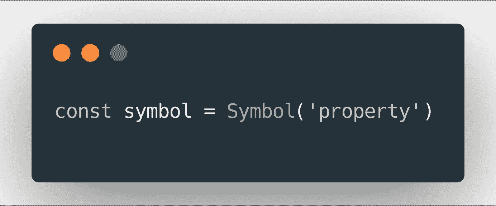

# 深入探究 ES6 符号

> 原文：<https://javascript.plainenglish.io/deep-dive-into-es6-symbols-3b44f4ba7eb3?source=collection_archive---------0----------------------->

Image by [carbon.sh](https://carbon.sh)

2015 年发布的 ES6 引入了很多功能:`class`关键字、生成器、`const` / `let`声明等等。但是有一个不为人知的特性是`Symbol`数据结构。在这篇文章中，我将解释什么是 ES6 符号，为什么你可能想要使用它们，以及它们是如何工作的。

实际类型叫做`symbol`，`Symbol()`是它的构造函数。`symbol`是一个*原语*数据类型。一个*原语*数据类型意味着`symbol`不是一个对象，也没有附加到它的方法。此外，基本数据类型还有一个重要的属性:不变性。观察原始数据类型和复杂数据类型之间的差异:

# ES6 符号是做什么的？

ES6 符号的主要目的是返回唯一的值。就是这样。您将一个人类可读的名称传递给符号构造函数，它将返回一个可以在其他地方使用的唯一值。事实上，这些值是如此独特，以至于可能会令人困惑:

您永远不会直接使用符号值，也没有简单的方法来这样做。如果您想在代码库中的其他地方访问相同的符号，您可以使用`Symbol.for()`:

接受一个符号的键，并试图从全局符号注册表中获取这个符号。如果没有找到，它将创建一个，存储并返回。你可以想象它是这样工作的(非常简化的版本):

# ES6 符号有什么用途？

符号最常见的用例是将其用作对象属性。它们的优点是这些属性不会出现在属性枚举中(例如`for..of`循环)，这使得它们非常适合元编程和定义对象的隐藏/内部方法。

大多数 JS 引擎内部已经在使用符号，因此有了元编程特性。例如，iterable 对象有一个由`for..of`循环使用的`Symbol.iterator`函数。可以被转换为图元的对象(`String`、`Number`等)。)有一个这样做的`Symbol.toPrimitive`函数。以下是它们的完整列表:

# ES6 符号不用于什么？

理解符号不能做什么也是非常重要的，因为在这里它会变得有点混乱。我的第一个例子是关于 Redux 的，所以如果你不熟悉它，你可以跳到下一段。现在，在 redux 动作创建器中使用符号作为动作类型可能很有诱惑力。这也是我的第一个想法，但有一个很好的论点，符号不适合它。原因是符号是不可序列化的，并且(还)没有办法将它们保存到存储器中，或者发送到另一个实体。因此，如果使用符号作为 redux 动作的类型，重放、持久性甚至调试都将不起作用。你可以关注[这个](https://github.com/reduxjs/redux/issues/4)讨论，了解更多信息。

符号也不是定义*私有*对象属性的方法。即使这些属性不会出现在常规的枚举中，您仍然可以使用`Object.getOwnPropertySymbols`来访问它们。我们仍在等待真正的私有财产，这个提议可能就是它。

感谢您阅读本文，希望您觉得有用。请随时分享你的想法或在评论中纠正我。