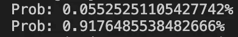
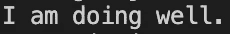

# 用 JavaScript 进行深度学习

> 原文：<https://javascript.plainenglish.io/deep-learning-with-javascript-2d328064e8b1?source=collection_archive---------9----------------------->

## Brain.js 简介及其神经网络特性的代码演示。

Image from [Unsplash](https://unsplash.com/photos/5eBW5GomfhY)

Python 一直是大多数深度/机器学习爱好者的主要语言，但也有相当多的 JavaScript 库将 ML 的魔力直接带到了浏览器中。 [Brain.js](https://brain.js.org/#/) 是最流行的 JavaScript ML 库之一，因其简单易用而闻名。该库极大地简化了神经网络的构建和训练，只有几行代码，消除了完全理解该模型的理论方面所需的大量数学和术语。

Brain.js 支持几种不同的神经网络类型，在这次演示中，我将研究前馈(ANN)和 LSTM 网络。为了进一步探索这个图书馆，请点击这里查看他们的知识库[。此外，这个库和其他库一样也有优点和缺点，我们将在最后探讨。](https://github.com/BrainJS/brain.js)

**注意**:我是一个更好的 Python 开发者，并且仍然在精通 JavaScript 的过程中，所以请随意指出任何编码方面的最佳实践。这篇文章也不是为了探索深度学习背后的理论，它纯粹是为了探索如何用 Brain.js 创建神经网络架构。如果你想要一个视频演示而不是这篇文章，我会链接一个简单但干净的 Youtube 视频[通过 Brain.js 示例。](https://www.youtube.com/watch?v=RVMHhtTqUxc)

# 目录

1.  前馈(ANN)代码演示
2.  长短期记忆(LSTM)代码演示
3.  图书馆的利与弊
4.  整个代码/结论

# 1.前馈(ANN)代码演示

要首先使用这个库，你需要确保你已经安装了 node 和 NPM。要检查是否安装了 node，请在终端中运行以下命令。

*   **节点 v**
*   **npm -v**

检查安装后，我们需要使用 npm install 下载 Brain.js 库(可以把 npm 想象成 Python 开发人员的 pip 的等价物)。您可以使用以下命令在项目目录中安装 Brain.js。

*   **npm i brain.js**

现在我们可以开始创建我们的神经网络。首先我们需要**导入**库。

Importing Brain.js

接下来，我们创建人工神经网络。

Creating an ANN using Brain.js

对于这种情况，我们没有添加任何配置，但如果您想要对您的**神经网络架构**进行更多控制，您可以填写一个**配置**对象，该对象具有您可以输入的超参数，如隐藏层和激活。在括号中输入带有 NeuralNetwork 部分的配置变量，以应用此架构。接下来我们可以看看**培训**网络。我们已经为每个输入创建了包含三个值的数组的人工数据。

Training the network

火车调用应该有一个输入和输出，两者都可以是从 **0 到 1** 的数字数组。然后我们可以用两个不同的输入来测试网络的**推理**。根据我们为训练提供的人工数据，更多的 0 应该导致更低的值，而更多的 1 应该导致更高的值。

Inference from network

要查看程序输出的内容，请在终端中运行以下命令。

*   **节点 ann** (用你的文件名替换 ann)

这导致两个不同输出的低值和高值，如预期的那样。

Results from ANN example

# 2.长短期记忆(LSTM)代码演示

创建一个 **LSTM** 的过程与我们使用人工神经网络的过程非常相似。我们有相同的导入，除了我们现在正在创建一个 LSTM 网络，它可以很好地处理**序列数据**(时间序列预测、文本数据、NLP 等等)。因此，在这个例子中，我们将使用文本，并模仿一个具有样本字符串输入和输出的聊天机器人，以查看模型如何预测。再次提醒，这个例子非常粗糙，与实际的 ML 问题的规模相差甚远。

Creating and training an LSTM

这里要注意的另一个关键变化是迭代**超参数**。迭代是网络遍历训练数据的次数，默认值为 20，000 次，根据您配置的网络类型，这可能需要很长时间。与迭代参数类似，训练也接受超参数，如学习率。还有许多其他功能/配置，你可以改变周围玩。虽然我们不会探索所有的东西，但是它们都清楚地列在[文档](https://github.com/BrainJS/brain.js#brainjs)中，供您设计和修改您的架构。接下来，我们可以测试预测模型。

Inference from LSTM

根据我们提供的最少训练数据，这将返回我们附加到相应输入值的输出。

Result from LSTM

# 3.图书馆的利与弊

## 赞成的意见

*   只需要几行代码就能**构建**复杂的**神经网络架构**
*   易于在全栈项目中集成/使用，特别是对于不熟悉深入的 ML 原理的开发人员
*   非常**易于使用**并适合初学者或**没有多少 ML 经验的人学习**

## 骗局

*   我们可以在多大程度上**配置**架构**是有**限制的。对于更多的 ML/DL 工程师来说，在构建自己的定制模型时有更多的自由****
*   ****培训**可能会花费**很长时间**，尤其是当架构更加复杂并且需要更多的时期/迭代时**
*   **尚不支持 CNN、GANs 或其他神经网络架构**

# **4.整个代码和结论**

** [## RamVegiraju/DLJSDemo

github.com](https://github.com/RamVegiraju/DLJSDemo) 

Brain.js 允许 JavaScript 开发人员和机器学习爱好者将深度学习无缝集成到他们的项目中。虽然这个库有局限性，但是如果时间有限，它可以完成构建和训练神经网络架构的大部分脏工作。

我希望这篇文章对尝试使用 JavaScript 进行机器学习的人有用。如果您对 ML &数据科学感兴趣，请随时在评论中留下任何反馈或通过 [Linkedln](https://www.linkedin.com/in/ram-vegiraju-81272b162/) 与我联系。感谢您的阅读！

喜欢这篇文章吗？如果有，通过 [**订阅获取更多类似内容解码，我们的 YouTube 频道**](https://www.youtube.com/channel/UCtipWUghju290NWcn8jhyAw?sub_confirmation=true) **！****