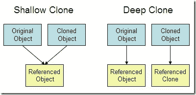

# JavaScript 中的深层拷贝与浅层拷贝

> 原文：<https://javascript.plainenglish.io/deep-vs-shallow-copy-in-javascript-1287a4ef7788?source=collection_archive---------5----------------------->

## 对深层拷贝和浅层拷贝进行全面比较，以了解更多差异以及何时使用这两种拷贝。


[Deep vs Shallow Copy](https://blog.alexdevero.com/)

副本意味着您从原始元素创建一个新的相同元素，并且您希望原始元素在副本中更改时保持不变，但是如果您创建一个副本，则原始元素会发生更改！

然后，您需要看一看我们将在本文中讨论的复制类型。

一开始，我们需要理解按值传递的概念，按引用传递有助于我们理解浅层和深层复制。

# 按值传递和按引用传递概念

传递或复制东西有两种方式，一种是按值传递，一种是按引用传递。当您通过值复制某个东西时，意味着您正在创建一个与原始值相似的新的单独且独立的值(深度复制)。但是当你通过引用来复制某样东西时，你只是在创造一个原物的别名，而不是一个新的或独立的副本(浅层副本)。

而这就要带我们知道什么是深浅抄了！

# **深度复制**

创建深层副本时，会创建与原始元素及其属性完全相同的副本。
原始元素和复制元素并不相连，这意味着如果你改变了原始元素的属性，将不会影响或改变复制元素中的任何内容。

# 浅拷贝

另一方面，当您创建浅层副本时，您会创建一个连接到原始副本的新副本。
因此，当你改变原始元素时，它也会影响和改变复制的元素，同样，如果你改变了复制的元素，它也会改变原始元素。



[Image source](https://jojozhuang.github.io/programming/java-advanced-shallow-copy-vs-deep-copy)

如上图所示，浅复制仍然连接，但深复制元素有不同的参考，根本没有连接。

# 如何创建深层副本

复制元素有很多种方法，但是哪一种是深层复制，哪一种是浅层复制！

## 1.原始类型

所有像数字、字符串和布尔这样的原始类型的元素都是深度复制的，这意味着复制的元素和原始元素没有连接，任何更改都不会影响原始元素。

```
const original = 'Marina';
let copy = original ; //Marina
copy = 'Magdy';
console.log(original); //Marina
console.log(copy); //Magdy
```

另一方面，对象和数组在创建时只存储一次，给变量赋值会创建一个指向该值的指针(引用),因此在副本中的更改也会在原始对象或数组中发生更改。

## 2.目标

将原始对象赋给一个新变量会创建一个浅层副本，这意味着原始对象和副本是相连的，任何更改都会影响它们，如下例所示:

```
const car1 = {color : "red" , wheels : 4};
let car2 = car1;
car2.color = "black";
console.log(car1.color);//black
console.log(car2.color);//black
```

那么如何为对象创建深度副本呢！

## **2.1 传播算子**

它也被称为析构，这有助于将数组或对象中的所有属性或元素分散到一个新元素中，这创建了一个深度副本，这意味着当副本中的更改不会影响原始内容

```
const car1 = {color : "red" , wheels : 4};
let car2 = {...car1};
car2.color = "black";
console.log(car1.color);//red
console.log(car2.color);//black
```

## 2.2 对象分配

另一种深度复制对象的方法是使用 object.assign()创建一个全新的单独的副本。

```
const car1 = {color : "red" , wheels : 4};
let car2 = Object.assign({}, car1);
car2.color = "black";
console.log(car1.color);//red
console.log(car2.color);//black
```

## **2.3 JSON . parse()&JSON . stringify()**

这可能是通过使用`JSON.stringify()`将传递的元素转换成字符串来进行深度复制的最常见方式。然后，`JSON.parse()`将它转换回原始的形式或数据类型，这也允许嵌套对象的深度克隆，而 object.assign 或 spread 操作符不会发生这种情况

```
const car1 = {color : "red" , wheels : 4};
let car2 = JSON.parse(JSON.stringify(car1));
car2.color = "black";
console.log(car1.color);//red
console.log(car2.color);//black
```

## 3.数组

数组也只是对象，所以浅拷贝也有同样的问题，那么我们怎么能深拷贝数组呢！

## 3.1 扩展运算符

扩展操作符也和数组一起使用，所以我们可以避免浅层拷贝来创建一个不与原始拷贝连接的新拷贝

```
const carsOriginal = ["Audi" , "BMW**" , "**Toyota**"**];
let carsCopy = [...carsOriginal];
carsCopy[2] = "Kia"
console.log(carsCopy[2]);//Kia
console.log(carsOriginal[2]);//Toyota
```

## 3.2 映射、过滤、减少

这些方法是由 ES6 引入的，它通过返回一个没有连接到原始数组的新数组来帮助创建一个数组的深度副本，这也发生在**中。slice()** 返回一个新数组并帮助创建一个深层副本。

```
const carsOriginal = ["Audi" , "BMW**" , "**Toyota**"**];
let carsCopy = carsOriginal.map(car => car);
carsCopy[2] = "Kia"
console.log(carsCopy[2]);//Kia
console.log(carsOriginal[2]);//Toyota
```

## **3.3 JSON . parse()&JSON . stringify()**

与对象一样，它也与数组一起使用来创建深层复制数组。

```
const carsOriginal = ["Audi" , "BMW**" , "**Toyota**"**];
let carsCopy = JSON.parse(JSON.stringify(carsOriginal));
carsCopy[2] = "Kia"
console.log(carsCopy[2]);//Kia
console.log(carsOriginal[2]);//Toyota
```

# 结论

创建副本时，您需要确定是否要更新原始副本。
如果您需要它来更新原始元素，您可以使用遵循按引用传递概念的浅层复制，否则您可以使用遵循按值传递概念的深层复制。

**在这篇文章中，我们经历了:**

*   按值传递和按引用传递
*   深层与浅层拷贝
*   如何创建深层副本

## 参考

*   [blog.alexdevero.com](https://blog.alexdevero.com/shallow-deep-copy-in-javascript/#by-value-and-by-reference)
*   [www.freecodecamp.org/understanding-by-reference-vs-by-value](https://www.freecodecamp.org/news/d49139beb1c4/#:~:text=When%20you%20assign%20a%20variable,everything%20is%20copied%20by%20value.)

非常感谢您花时间阅读这篇文章，如果您有任何问题，请留下您的评论。

快乐学习！