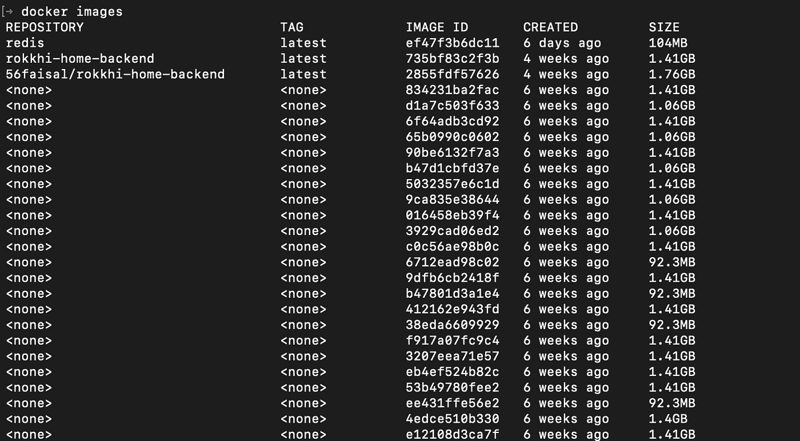
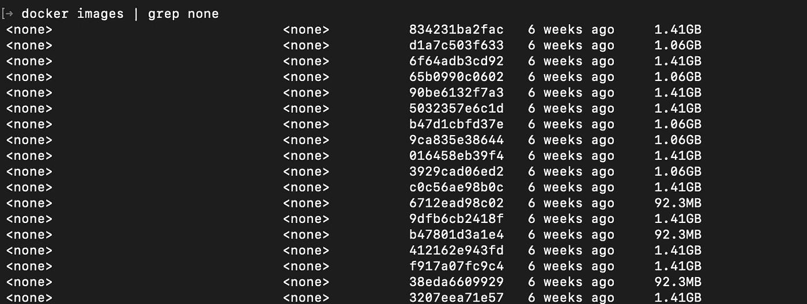
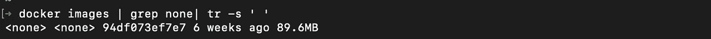
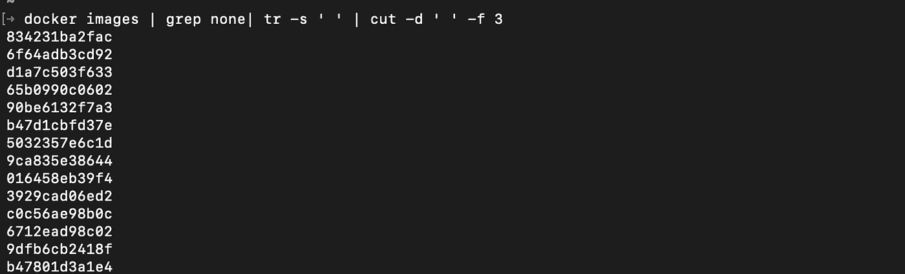
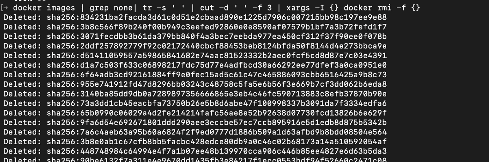

# 像专业人士一样处理 Docker 图像

> 原文：<https://javascript.plainenglish.io/delete-docker-images-like-a-pro-a8fece854ec8?source=collection_archive---------4----------------------->

## 使用一些基本的 Linux 命令


Photo by [Clay Banks](https://unsplash.com/@claybanks?utm_source=unsplash&utm_medium=referral&utm_content=creditCopyText) on [Unsplash](https://unsplash.com/s/photos/delete?utm_source=unsplash&utm_medium=referral&utm_content=creditCopyText)

## 问题是

每当我玩 docker 的时候，在几个`docker build`命令之后，我的本地机器就会被大量的图像弄得臃肿不堪。最新的一个被标记为`latest`以前的版本会失效，但不会被删除。

所以当我运行命令`docker images`时，列表看起来像这样，有很多无效图像…



invalid images

## 当量溶液

通常情况下，解决方案是用类似

```
docker rmi -f IMAGE_ID
```

所以现在我必须按照图片 id 一个接一个地删除每张图片。一点都不好玩。

## 快捷解决方案

要删除所有无效的图像(名称/标签为`none`)，只需运行以下命令。。。

```
docker images | grep none| tr -s ' ' | cut -d ' ' -f 3 | xargs -I {} docker rmi -f {}
```

想了解关于这些命令的更多信息吗？继续读。。。

# 说明

我们将讨论帮助我们实现这一目标的每个命令。顺便了解更多关于 Linux 的知识。。。

## 可做文件内的字符串查找

*   命令的第一部分`docker images`简单地列出了所有的图片。命令`grep none`过滤包含单词`none`的图像。所以我们可以用这个命令看到所有无效的图像。

这是 grep 命令的一个简单用法。这是一个非常强大的命令。我们可以使用这个命令添加定制的逻辑来删除 docker 图像！



docker images | grep none

## tr

下一个命令是`tr -s ' '`。这是一个[命令](https://linuxize.com/post/linux-tr-command/),帮助我们用我们选择的字符压缩一个字符串。我们可以看到在名称、标签、图像 ID 之间有多个空格。所以使用这个命令我们可以最小化它们之间的空间。

运行该命令后，我们可以看到名称现在是等间距的。



after squeezing their name

## 切口

```
cut -d ' ' -f 3
```

这个[命令](https://linuxize.com/post/linux-cut-command/)帮助我们剪切输入字符串的一部分。选项`-d ' '`有助于将分隔分隔符设置为空格。并且`-f 3`指定我们想要字符串的第三部分。

如果我们运行这个命令，它将给出所有带有标签`none`的图像 id 列表



All image Id of tag none

## xargs

该命令的最后一部分是

```
xargs -I {} docker rmi -f {}
```

该命令获取一个命令的输出，并将其作为输入提供给另一个命令。在我们的例子中，我们希望使用图像 ID 列表作为`docker rmi -f`的输入。

运行整个命令后，你可以看到所有不需要的图像都被删除了。



您可以再次使用命令`docker images`进行验证，以验证所有不需要的图像现在都已消失。

如果你想用第一个`grep`命令进行另一种过滤，你可以使用这个命令，因为它也支持正则表达式过滤。

今天到此为止。编码快乐！:D

**通过** [**LinkedIn**](https://www.linkedin.com/in/56faisal/) **或我的** [**个人网站**](https://www.mohammadfaisal.dev/) **与我取得联系。**