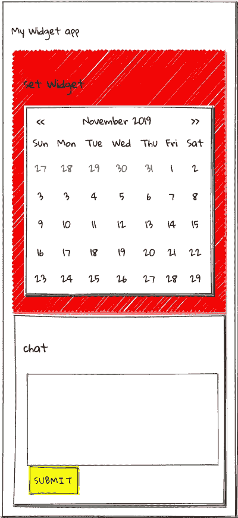
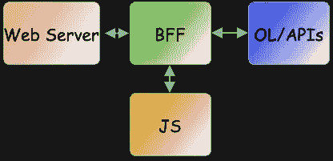
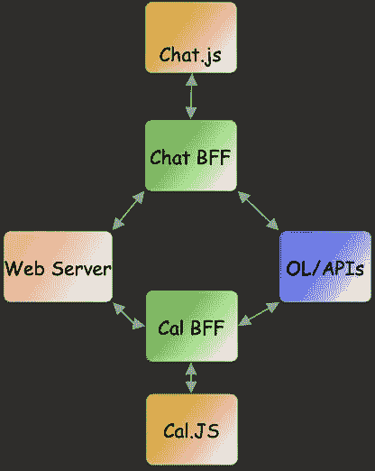
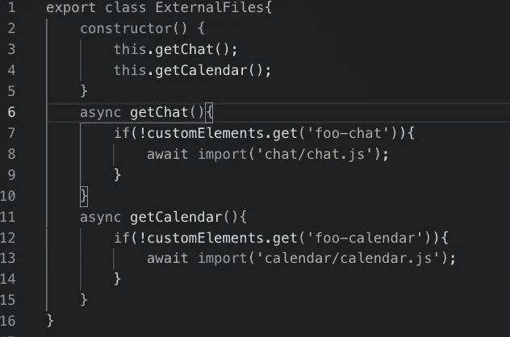

# 使用组件库揭开微前端的神秘面纱。

> 原文：<https://javascript.plainenglish.io/demystify-micro-frontends-using-component-libraries-53aa9a33cf5b?source=collection_archive---------3----------------------->

## 如何在门户风格的应用中使用 web 组件和组件库创建前端来开发独立的应用。

Photo by [Markus Spiske](https://unsplash.com/@markusspiske?utm_source=medium&utm_medium=referral) on [Unsplash](https://unsplash.com?utm_source=medium&utm_medium=referral)

如今，一个至关重要的新技术术语是微前端(MFE 或前端)。我确实相信这最近变得流行是因为服务业的兴起。事实是我们已经有 MFE 很长时间了。我们过去称它们为小部件、零件或当时的营销词。发生变化的是我们今天可以使用的一些技术和工具，与过去的小部件相比，这些技术和工具使部署和维护变得更加容易。

MFE 的一个很好的定义是网站[https://micro-frontends.org/](https://micro-frontends.org/)。微前端背后的想法是将一个网站或网络应用程序想象成由**独立团队**拥有的**功能**的组合。MFE 背后的核心思想是，**成为技术不可知论者**，**隔离团队代码** e，**建立团队前缀** s，**支持网络平台**，以及**构建弹性站点**。核心理念中的关键部分是**技术不可知的，**和**偏好原生浏览器特性而非定制 API。但是这对我们开发者来说意味着什么呢？**

如果你在一家大公司工作，你通常会在能力模型的保护伞下工作。您的应用程序将是这些功能的组合。在我们假设的公司中，我们有数百种能力。企业可能决定在新的 web 应用程序中需要这些功能中的两个。“设置小工具日期”和“聊天”是我们新应用程序需要的两个功能。

New Web App

这些元素可以而且很有可能由不同的团队开发，并且使用完全不同的 API 和系统。解决这个问题的一种方法是使用 web 组件创建组件库应用程序。[网页组件。](https://www.webcomponents.org/)由三个规范组成——定制元素、模板和影子 DOM——这些规范可用于创建普通的 JavaScript 定制元素，交付给 web 应用程序开发人员。你可以在我的上一篇文章“创建定制 HTML ”中找到更多信息现在我可以听到抱怨“我的框架怎么样，我只想用 X 框架。”Web 组件只是您工具箱中的一个工具。所有主要的框架都将使用 web 组件。因为它是规范的一部分，所以在下一波酷框架到来之后，它还会存在。

如果我们把 Brad Frost 的原子设计应用到我们的 web 架构中，我们可以看到 web 组件和框架是如何协同工作的。我们的原子或分子级组件可以用 web 组件编写，并在整个企业中共享。这些组件不关心应用程序是用 Angular、Vue 还是 React 编写的。您的按钮、输入字段和其他核心元素将在所有应用程序中具有标准的行为和可视化。当构建下一个应用程序并使用新的框架时，您的核心元素仍然可以工作，并且您不必编写所有的基本功能。

这就是微前端发挥作用的地方。如果你有一个团队，他们正在为整个企业开发聊天应用程序，那该怎么办？如果他们在一个框架中编写这个应用程序，而应用程序团队使用不同的框架，那么应用程序团队将不得不重写这个应用程序。但是如果这个小部件是作为 web 组件编写的，那么任何框架 app 都可以使用它。然后我可以用新的 Web APIs 更进一步，只在需要的时候动态加载我的 Javascript。

## 把所有的放在一起

如果我们可以创建我们的聊天或日历部分作为一个独立的应用程序，我们将需要我们的应用程序的一些服务。最好的方法是使用后端对前端(BFF)。您可以将其视为旧的 servlet 引擎或应用程序的编排层。您的应用程序将与 API 或服务编排层进行通信。这里的神奇之处在于，您可以使用 BFF 将 Javascript 文件提供给宿主应用程序。

在我们的示例中，聊天小部件将有一个聊天 BFF，它将从其 BFF 中提供 chat.js。日历应用程序也是如此。

在你的托管应用中，你必须导入你的 javascript 并在你的应用中使用基本元素。您的主机应用程序可以在任何您想要的框架中。如果您愿意，甚至可以动态加载 JS。您可以使用您的框架路由和动态加载来做到这一点，或者您可以做一些简单的事情，如。

ExternalFile.js

关键是你的主机应用可以在任何框架中，也可以不在任何框架中。这给了你第二个显著的优势。日历，并独立于聊天进行部署和更新。反之亦然。无需重新部署主机应用程序即可从任一部分获得更新。这为构建应用程序提供了一种灵活的方式。我们的应用程序可以使用任何框架来构建。如果团队需要对他们的应用程序的部分有更多的控制，那么我们可以通过我们的构建过程导入代码。如果我们愿意，我们可以通过不同的方式和版本来介绍我们的应用程序部分。团队可以专注于核心能力的实现。我们将 MFE 的定义融入到我们的应用中。它是可移植的、可重用的代码，与技术无关，并且比自定义 API 更支持 Web 平台。我已经用这种方式为大型组织开发了几个应用程序，使用起来很愉快，上市速度也是首屈一指的。