# 揭开 JavaScript 的“这个”的神秘面纱

> 原文：<https://javascript.plainenglish.io/demystifying-javascripts-this-e460d0d93ed9?source=collection_archive---------7----------------------->

## 这很容易


对于 JavaScript (JS)初学者来说，最神秘、最令人困惑的概念之一是关键字“this”。让它如此令人困惑的是，它根据使用它的上下文表现不同。好消息是，一旦你理解了它的细微差别，你会发现‘这个’其实没那么复杂。让我们直接开始吧！

## **这是什么？**

“This”是 JavaScript 语言中引用对象的关键字。该对象可以是以下两种情况之一:

1.  “窗口”对象
2.  对象的实例

# **1。窗口对象**

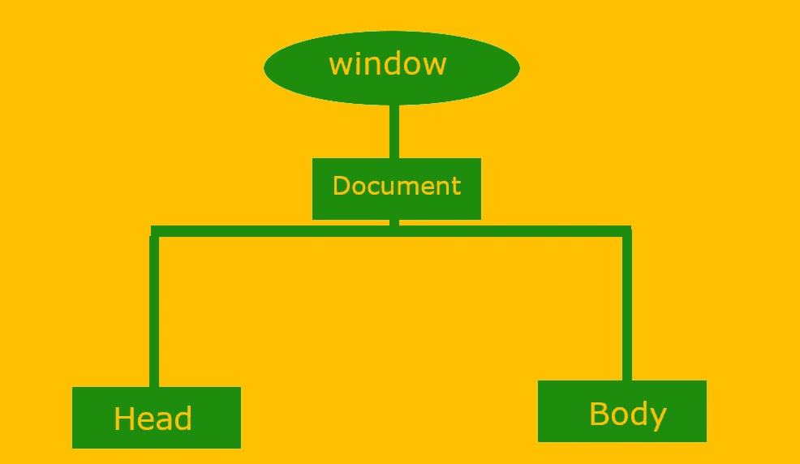

window 对象代表文档对象模型(DOM)中的浏览器本身。它在 DOM 层次结构中占据最高位置，因为它是*文档*对象及其所有子对象的父对象。“This”在两种情况下可以引用窗口对象:

*   当在全球范围内使用时
*   当在无基函数中使用时

## **在全球范围内**

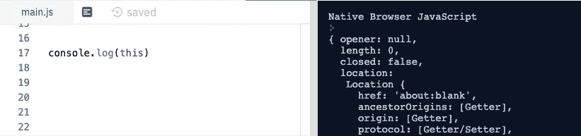

The keyword ‘this’ in a global context

如果你打开 repl.it for JavaScript 并输入`*console.log(this)*` *，*，你会看到，如上所述，它显示了*本地浏览器窗口(在右边)*。或者，要在浏览器控制台中查看它，您可以在“index.js”文件中键入相同的命令，在“index.html”文件中引用，然后点击 CMD + J(在 Mac 上)或 CTRL + J(在 PC 上)。您将得到以下内容:

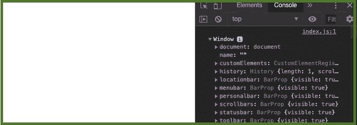

Logging out the value of ‘this’ in a browser console

正如你所看到的，“this”代表了*窗口*对象，它的直接子对象是文档对象。

## **用于无基础功能时**

在 JS 中，无基函数是用关键字“function”定义的函数，与绑定到类/对象(即实例方法)的方法相反。当“this”用于常规无基函数时，它指的是*窗口*对象。

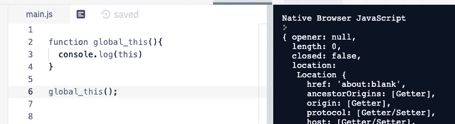

‘This’ refers to the ‘window’ object when called within a function not tied to any object

我们再次得到和以前一样的输出。

# **2。一个对象的实例**

*'* 这个 *'* 也可以指一个对象的实例，就像在那个对象的*方法*中定义的情况一样。让我们在 index.js 文件中键入以下内容:

```
const pet = { name: 'Milou', bark(){ console.log(this); }//BARK()}//PETpet.bark();
```

我们在浏览器控制台中看到以下内容:

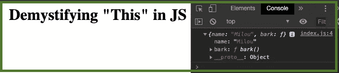

‘This’ as an object

这里,“this”的值是“pet”对象的名称属性及其“bark”方法。因此，“this”指的是一个特定的对象实例，而不是*窗口*对象。现在，让我们向 pet 对象添加另一个方法，看看“this”的计算结果是什么:

```
const pet = { name: 'Milou', bark(){ console.log(this) }//BARK()}//PET//pet.bark();**pet.walk = function(){** **console.log(this);
}//WALK****pet.walk();**
```

结果是‘this’仍然像以前一样引用‘pet’对象，尽管我们在对象的定义之外使用‘function’关键字显式地定义了它。那是因为它仍然在一个类函数或方法的上下文中，并且“this”从它被执行的地方获得它的值。

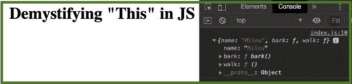

‘This’ still refers to the object

如果我们使用一个构造函数来输出' this '的值会发生什么？JS 中的构造函数是使用对象名的大写字母定义的，并使用“new”操作符调用。我们可以按如下方式重构代码:

```
const pet = { name: 'Milou', bark(){ console.log(this) }//BARK()}//PET//pet.bark();**function Pet(petName){//Pet constructor** **this.name = petName;** **console.log(this);****}//PET Constructor****const dog = new Pet('Scooby');**
```

注意:*构造函数通常在类内部定义，然而 JS 也允许我们在类外部创建它。*

我们得到:

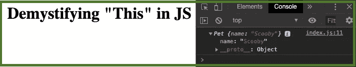

同样，尽管这被定义为“宠物”对象之外的一个函数，但它仍然引用宠物对象的一个实例。请注意，它现在引用的是一个新实例，其名称是“Scooby”而不是“Milou”。每当我们使用 *new* 操作符调用一个函数时，即一个构造函数，“this”将总是指向正在被实例化的对象。构造函数也是一个对象的方法，因此“this”仍然指的是对象实例，而不是全局*窗口*对象。

让我们试试别的东西。如果我们修改代码，将一个数组作为 pet 对象的属性，然后在对象中输出它的值，会怎么样呢？

```
const pet = { name: 'Milou', **colors: ['black', 'brown', 'white'],** **petColors(){** **this.colors.forEach(function(color){** **console.log(color);** **});//FOREACH** **}//PETCOLORS()**}//PET**pet.petColors();**
```

我们添加了一个颜色数组和一个 *petcolors* 方法来显示它们。然后' This '被用来引用对象的颜色，调用 *forEach* 方法来注销每种颜色。正如所料，This 仍然指向 pet 对象，因为它是通过“petcolor”方法与*对象联系在一起的。*

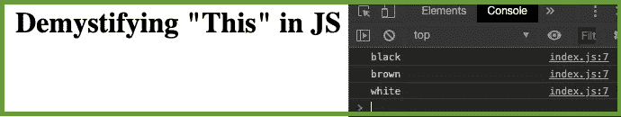

如果我们想在每种颜色旁边显示宠物的名字呢？我们可以通过在“console”语句中添加 *name* 属性来修改输出:

```
console.log(this.name, color);
```

根据浏览器的不同，您可能会在每种颜色旁边看到“未定义”，或者出现一个*无声错误*，其中“this.name”根本不显示任何值。

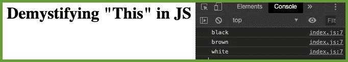

发生了什么事？为了搞清楚这一点，让我们看看“这”等于什么:

```
console.log(this);
```

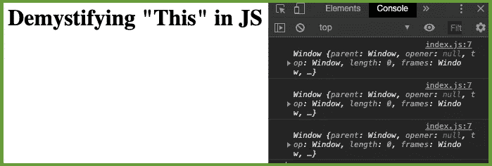

哇哦。！！' This '引用了窗口对象！这怎么可能呢？它不是在“petColors”方法内部使用的吗？？这里发生的情况是，尽管“this”在对象方法内部，但它进一步嵌套在 *forEach 的*回调函数中！回调函数之所以存在，是因为它是 *forEach* 迭代器所需要的；该函数与 pet 对象没有任何联系(即，pet 对象的方法)。换句话说，这个函数只是一个常规函数，就像我们之前介绍的“global_this”函数一样，因此引用了全局*窗口*对象。This 总是根据它的执行位置来获取它的值。

我们如何补救这种情况？ *forEach* 允许传递一个对象作为第二个参数，“thisArgs”。在这种情况下，我们将通过“this”传递实际的宠物对象作为参数。

```
const pet = { name: 'Milou', colors: ['black', 'brown', 'white'], petColors(){ this.colors.forEach(function(color){ console.log(this.name, color); }, **this**);//FOREACH }//PETCOLORS()}//PETpet.petColors();}//PETpet.petColors();
```

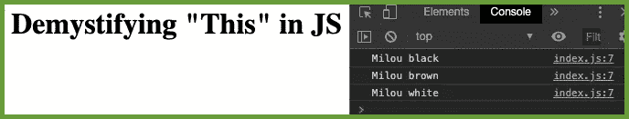

通过将“this”作为 *forEach* 迭代器的第二个参数传递(即在回调函数之外)，语句“this.name”现在将引用 pet 对象，而不是全局(窗口)对象。要进一步了解这一点，请将第二个参数替换为下面的 object {name: 'Scooby'}，看看会发生什么。

解决这个问题的另一种方法是将“forEach”中的函数转换为匿名回调函数:

```
petColors(){this.colors.forEach(**(color) => {****console.log(this.name, color);****}**);//FOREACH
```

这将把“This”绑定到对象实例。

概括地说，作为一条经验法则，“this”指的是以下两种情况之一:

1.  一个对象，如果在该对象的方法中调用它。它的值取决于它在代码中的执行位置。
2.  全局“窗口”对象，如果它在全局函数之外、常规函数或匿名回调函数中被调用，只要它没有被强制通过参数、箭头函数或 *bind()* 方法引用对象实例。

鉴于这篇文章是针对 JavaScript 初学者的，我们所涵盖的内容足以让你牢牢掌握关键字“this”。然而，围绕它有更多的细微差别。有关更多详细信息，请参见下面的 MDN web 文档。

[](https://developer.mozilla.org/en-US/docs/Web/JavaScript/Reference/Operators/this) [## 这

### 与其他语言相比，函数的 this 关键字在 JavaScript 中的行为略有不同。它也有一些…

developer.mozilla.org](https://developer.mozilla.org/en-US/docs/Web/JavaScript/Reference/Operators/this) 

## 快乐编码:)