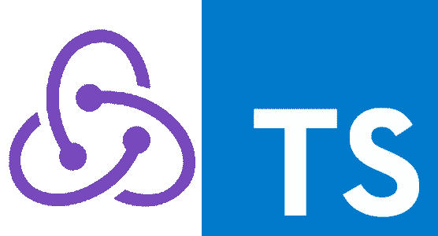
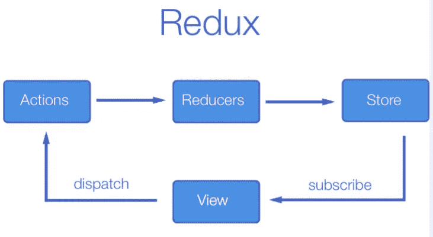

# 将 Redux 与 TypeScript 一起使用

> 原文：<https://javascript.plainenglish.io/demystifying-redux-with-typescript-2f7c64da5d89?source=collection_archive---------0----------------------->

## 理解 **Redux、**的核心概念以及最佳实践&模式。

# 议程

1.  什么是 Redux，为什么我们需要它。
2.  通过从头开始构建来学习 Redux 的核心概念
3.  用 Redux 构建一个 Todo 应用程序，我们从头开始编写

## Redux 是什么？

Redux 是一种*数据架构模式*，帮助我们在单一窗口系统中管理应用程序数据。

简而言之，Redux 是孤立处理应用程序数据的最佳实践和模式的集合。

## 我们为什么需要它？

任何前端应用程序的基本构建块都是*组件*(它可以是 react/angular/web 组件或任何框架实现)。我们仍然可以将组件进一步分为[表示组件和](https://medium.com/@dan_abramov/smart-and-dumb-components-7ca2f9a7c7d0)容器组件。

为了给这些组件提供动力，我们需要用数据来推动它。数据在任何应用中都扮演着重要的角色。

## **现在的问题是我们需要如何管理数据？**

由于组件相互组合以适应视图端口——如果我们管理组件内部的数据，我们可能会以*数据重复*而结束，并且整个应用程序数据可能*没有被规范化*并且我们无法获得应用程序状态的*全貌*。

解决方案是用一些经过验证的最佳实践和技术隔离应用程序数据——这是状态管理框架的唯一目的。

市场上有许多状态管理框架，如 Flux、Redux、Akita、NgRx、MobX 等。

> 我们选择了 Redux，因为状态管理工具的核心概念是通用的，它们的书面实现可能有所不同。

## 通过从头开始构建来学习 Redux 的核心概念

Redux Core Concepts

**动作** —动作是一个简单的老式 JavaScript 对象，指示需要对应用程序数据采取什么动作。

在大多数情况下，Action 持有代表唯一动作类型的`type`,而`payload`携带附加数据以促进动作。

**Reducer** — Reducer 是一个纯函数，它保存了处理各种动作指令的实现逻辑。

将当前状态和动作传递给 reducer 函数，将使用更新后的状态进行响应。因为它的纯函数——结果，将会被纯函数论元所表达。(即国家、行动)

存储(Store)—存储负责管理应用程序数据，它处理分派的动作——通过将数据传递给缩减器，并保持状态与注册的监听器同步。

以上是 Redux store 的最小实现。Store 将 reducer 和初始应用程序数据作为构造函数参数。我们有三种主要的存储方法。他们是，

1.  **分派** —帮助消费组件分派动作的方法。一旦一个动作被分派，存储将当前状态和动作传递给 reducer 并重新分配更新的状态。Dispatcher 还遍历所有侦听器回调函数，并通知它们—状态发生了变化。
2.  **getState** —方法响应当前状态。
3.  **subscribe** —方法帮助消费者注册回调，以便在状态改变时得到通知。

> 你可能想知道为什么`subscribe`函数不响应当前状态，因为`getState`和`subscribe`的目的是相互正交的。这里可以看到详细解释

如果您熟悉反应式扩展，我们已经用观察者模式编写了 subscribe——Redux store 也可以在 RxJS API 的帮助下编写。您可以在这里找到可观察的商店实现

## 用 Redux 构建一个 Todo 应用程序，我们从头开始编写

在我们使用任何状态管理工具开发 web 应用程序之前。最好按照下面的路线图，这将有助于流水线的发展。

1.  定义应用数据的**数据结构，不可能声明完整的框架。我同意，但是至少要根据你的用户界面使用计划来构建最小的结构。**
2.  定义将改变您的应用程序数据的**动作**。
3.  声明 **Reducer** 函数，该函数将应用程序数据和动作作为输入，并以更新后的状态进行响应。
4.  通过传递减速器和初始应用数据创建**存储**。

让我们启动 todo 应用程序，同时考虑用于 Todo 管理的应用程序数据。我脑海中出现的大致情况是

有了这个想法——让我们看看 todo **模型**和 todo **应用程序状态**

让我们重复驱动我们的应用程序所需的动作。

1.  添加待办事项
2.  删除待办事项
3.  将待办事项切换为完成/未完成

让我们定义下面的动作，

**动作创建者**——是帮助定义或框定动作对象的人。例如，— `AddTodoAction`帮助创建一个添加待办事项动作，动作创建者的目的是删除动作对象属性的重复声明。

例如，如果我们需要为 todo 动作添加`createdAt`属性，假设动作创建者不在那里，那么我们需要在调度动作的任何地方将其声明为动作对象。

让我们声明 reducer 逻辑来处理这些声明的动作。

让我们实例化我们的存储，

最终的 DOM 实现——使数据从存储区适合视图。

`todoListElem`、`addButtonElem` 和`todoInputElem` 是在 Typescript 中捕获的用于处理视图的 DOM 节点。

我们使用 store 的`subscribe`函数来重新绘制视图，使用`dispatch`函数来调度我们声明的动作。

浏览代码——应该是不言自明的。

## 结论

*   Redux 是最佳实践和模式的集合，它帮助我们以高效的方式管理应用程序数据。
*   动作、缩减器、存储是任何状态管理框架的核心基础部分。
*   可以找到完整的源代码和[现场演示](https://mohanramphp.github.io/redux-with-typescript/)

如果你喜欢这篇文章或有任何问题，请随时留下评论！🤓

 [## mohanramphp/redux-with type script

### 使用 TypeScript 从头构建 Redux 数据架构模式-mohanramphp/Redux-with-TypeScript

github.com](https://github.com/mohanramphp/redux-with-typescript)