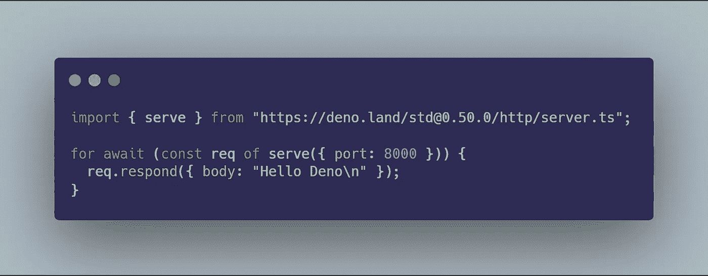

# Deno:又一个 JavaScript 运行时

> 原文：<https://javascript.plainenglish.io/deno-a-brand-new-and-yet-another-javascript-runtime-6bb8a9a88fbf?source=collection_archive---------8----------------------->

德诺德诺德诺…整个开发人员社区都在谈论这项非常棒的新技术。它是 Node 的变位词，指的是 Node . js——一个基于 JavaScript 构建的稳定的 JavaScript V8 引擎，用于将 JavaScript 运行到服务器中。这两个可以被认为是兄弟姐妹，因为他们有同一个创造者，伟大的瑞安达尔。

 [## 德诺

### Deno，JavaScript 和 TypeScript 的安全运行时。

德诺.兰德](https://deno.land/) 

> Deno 社区说“Deno 是 JavaScript 和 TypeScript 的安全运行时”。

## Deno 到底是什么？

Deno 对于 JS 和 TS 来说都是一个全新的安全运行时。是的，你没听错，它内部也支持 TypeScript，不需要任何外部编译。这真是太棒了，人们可以获得一个具有现代 JavaScript 和 TypeScript 的强大功能的安全环境。Deno 是由它的创作者 Ryan Dahl 在 2018 年 JSConf EU 2018 关于“Node.js 我后悔的 10 件事”的演讲中首次宣布的。

## 一个很重要的问题——它会取代 Node.js 吗？

不，绝对不是因为 Node.js 有一个独立的粉丝群。是的，它在这个行业已经存在 10 年了，开发者很喜欢它。许多大公司正在使用 Node.js 作为他们网站和服务器的主要技术。不可能用它的兄弟 Deno 替换 Node，Deno 社区的目标也不是替换 Node.js。

Deno 在 Node.js 的基础上增加了更多的功能，使其更加安全，并为开发人员提供了许多便利。Deno 现在正处于发展的初级阶段，需要来自社区越来越多的支持。

# Deno 的特点

Deno 看起来很牛逼，它带给开发者生活的东西真的很牛逼。以下是这项神奇技术的一些超级棒的功能:

## **支持打字稿**

Deno 有一个很棒的内置特性，它默认支持 TypeScript，不需要任何显式编译。是的，这是正确的，我们可以直接从 Deno 提供的命令行实用程序运行. ts 文件。这个特性非常显著，因为使用 TypeScript，我们可以获得现代 JavaScript 和静态类型检查的精髓。

## 安全性

默认情况下，Deno 为文件、网络和外部包提供了很好的安全性。我们无法访问所有这些，除非我们明确地允许它这样做。这种显式活动可以通过命令行标志和其他特定于框架的特性来完成。

## 无外部包管理

是的，你没听错，一个不使用像 npm 和 yarn 这样的包管理器的 JavaScript 或 TypeScript 项目。它允许开发者使用远程 URL 直接使用外部包，并且默认情况下会缓存这些包以备将来使用。这可以通过 Deno 自己的包管理器来实现。

## 现代 JavaScript

Deno 使用像 es 模块这样的现代 JavaScript 模块作为其默认模块系统，而不是 commonJS 模块，这些模块为我们提供了现代 Javascript 的新特性和本质。

## 与浏览器的兼容性更好

Deno 旨在通过使用各种 web APIs 来更好地与浏览器兼容，这非常棒，因为它将为开发人员提供巨大的支持。

## 针对现有 JS 功能重新设计的 API

Deno 使用自己的实现来重新设计核心 JS 功能和 API，如 ES6、Promises 和其他 TypeScript 特性。其中一个例子是带有等待功能的循环，也没有异步函数(稍后在演示中讨论)。

## 尺寸优化

由于 Deno 没有在本地安装模块和包，这意味着核心 API 或应用程序的大小将被优化，这将有助于最小化整个应用程序的大小。

## 消息传递的使用

Deno 利用消息传递通道来调用系统 API 和使用绑定。这使得系统特定的调用变得高效，并增加了它们的语义，以便更好地理解。

这些都是 Deno 关注的重点。显然，随着框架的发展，可能还会有一些其他的东西，新的目标和特性也将不断发展。

# 一个例子——你好，迪诺

Deno 似乎真的很棒，很多开发人员肯定会喜欢的。这个全新的 JS 运行时的特性将会吸引热情的开发人员。

> **Deno 安装—** 在您的机器上安装 Deno 请参考[这个](https://deno.land/#installation)链接。

现在，为了看 Deno 的演示，我将创建一个新的。ts 文件，并在其中编写一个简单的 hello world 程序。您可以使用 Deno 提供的命令行工具，使用以下命令来运行它:

`deno run filename.ts`

这是一个简单的 hello world 程序，当我们从新的东西开始时会引入这个程序。现在让我们看看更现实的东西。

main.ts in Deno

现在，我们再次需要使用`deno run`命令运行该文件，但是这一次我们需要一个标志来表示访问 HTTP 服务器的权限。下面是实际的命令:`deno run --allow-net main.ts`。

上面的代码与下面的 Node.js 代码相当:

main.js in Node.js

实际上，上面的 Deno 代码正在创建一个服务器，并对网页给出一个回答“你好 Deno”。在这个 Deno 例子中，我们使用了带有一个 wait 关键字的 for 循环，这是 Deno 中的一个新特性，它在顶层使用 wait 语句，没有任何异步函数。这个特性允许我们对到达服务器的请求数量进行响应，尽管在我们的例子中它只是一个普通的字符串响应。

# 最后一句话

哦！你还在这里看这篇文章。我要感谢你，感谢你在这篇文章中的耐心。新技术正在被频繁开发，而成功的关键是适应性。你必须适应这个行业的新技术和前沿技术，并不断学习新的东西。

现在，你还在等什么，就在它的官网 [deno.land](https://deno.land/) 探索这项革命性的技术吧。也分享一下你对这项新技术的看法。非常感谢你阅读这篇文章。再见:)

# **用简单英语写的便条**

你知道我们有四份出版物和一个 YouTube 频道吗？你可以在我们的主页 [**plainenglish.io**](https://plainenglish.io/) 上找到所有这些——关注我们的出版物并 [**订阅我们的 YouTube 频道**](https://www.youtube.com/channel/UCtipWUghju290NWcn8jhyAw) **来表达你的爱吧！**