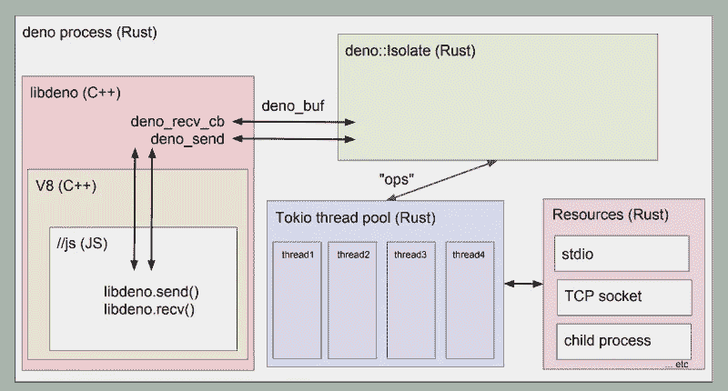

# Deno:更好的初学者指南

> 原文：<https://javascript.plainenglish.io/deno-first-approach-5a78c591513e?source=collection_archive---------5----------------------->

## Deno 的目标是修复什么，它是用什么构建的，后端 JavaScript 的未来会是什么样子，以及您现在可以在 Deno 中使用的代码示例


Deno 是一个跨平台的运行时，即一个运行时环境，基于`[Google's V8](https://v8.dev/)` [引擎](https://v8.dev/)，用`[Rust](https://www.rust-lang.org/)` [语言](https://www.rust-lang.org/)开发，用[为事件循环系统构建一个库](https://github.com/tokio-rs/tokio)。

**# deno # node # typescript # rust**

## 放弃

在开始之前，非常重要的是要记住，在撰写本文时，Deno 仍在开发中。因此，由于 API 中潜在的意外变化，任何产生的代码都必须被认为是不稳定的。因此，我们将使用版本`0.21.0`作为下一步的基础。

最后，还应该注意，Deno 并不打算取代 Node 或与其合并。

[](https://medium.com/flutter-community/deno-1-0-released-easy-rest-api-example-e40fef062afa) [## Deno 1.0 发布！(简单)REST API 示例

### Deno 已经正式发布，1.0.0 版本现已上市！如果你不知道什么是 Deno，看看这个视频…

medium.com](https://medium.com/flutter-community/deno-1-0-released-easy-rest-api-example-e40fef062afa) 

# 简介和架构

Deno 是一个跨平台的运行时，即基于`[Google's V8](https://v8.dev/)` [引擎](https://v8.dev/)，用`[Rust](https://www.rust-lang.org/)` [语言](https://www.rust-lang.org/)开发，用`[Tokio](https://github.com/tokio-rs/tokio)` [库](https://github.com/tokio-rs/tokio)为事件循环系统构建的运行时环境。

# 节点的问题

Deno 是由它的创造者，**瑞安·达尔(**[**@ ry**](https://dev.to/ry)**)**在 2018 年 6 月的欧洲 JSConf 上提出的，距离首次提交仅 1 个月。

在这次演讲中，Dahl 揭露了 Node 架构中的十个缺陷(对此他自责不已)。总而言之:

*   Node.js 随着回调而发展，牺牲了 V8 第一版中的 Promise API
*   应用程序上下文的安全性
*   GYP(*Generate Your Projects*)，编译系统强迫用户在`C++`中编写他们的绑定(节点和 V8 之间的链接)，而 V8 本身不再使用它。
*   依赖性管理器 NPM 本质上链接到节点`require`系统。到目前为止，NPM 模块都存储在一个单一的中央服务器上，由一家私人公司管理。最后，`package.json`文件变得过于关注项目，而不是技术代码本身(许可证、描述、存储库等)。
*   随着时间的推移，`node_modules`文件夹变得过于沉重和复杂，使得模块解析算法变得复杂。最重要的是，上面提到的`node_modules`和`require`的使用是对浏览器所建立的标准的背离。
*   `require`语法省略了文件中的`.js`扩展名，这和最后一点一样，不同于浏览器标准。此外，在找到请求的模块之前，模块解析算法被迫浏览几个文件夹和文件。
*   在 require 能够支持`package.json`文件之后，名为`index.js`的入口点就变得无用了
*   浏览器中没有`window`对象，防止了任何同构

最后，总的缺点是，随着时间的推移，节点已经将 I/O 事件饱和系统的优先级降低到有利于模块系统。

# Deno 的解决方案:

然后达尔开始在 Deno 工作，目的是解决节点的大部分问题。为了实现这一点，该技术基于一组规则和范例，允许未来的开发遵循以下指导原则:

## 本机类型脚本支持

*   创造者的最高目标之一，他对语言有着特殊的兴趣。这些年来，我们已经看到 Node 在维护对新的`V8`和`ECMAScript`特性的支持时，不需要破坏现有的 API。
*   Deno 已经结束了，它使您能够立即使用 TypeScript，而无需对应用程序进行初始配置。使用仅限于默认编译器的本机配置。然而，可以使用标志`--config=<file>`给编译器一个 tsconfig.json 文件。

## 通过支持`ECMAScript`模块语法和取消`require()`功能，与网络同构

*   如上所述，节点遭受无效的依赖性解析；Deno 通过在遵守标准的同时更加明确、简单和直接来解决这个问题。
*   `(import * as log from "https://deno.land/std/log/mod.ts";)`

## 远程代码被检索并缓存在本地

*   像`node_modules`一样，正常工作项目所必需的依赖项被下载并在本地检索。但是，它们不会存储在项目级别，而是存储在 Deno 的全局缓存文件夹中。(`~/.deno/src`默认)
*   无论有多少本地项目需要，都不需要重新下载相同版本的依赖项。注意这个功能类似于`yarn plug'n'play`。

## 最终用户必须明确给出特定的权限

*   如今，安全性是每个应用程序的基础。为此，Deno 以沙盒模式包含可执行文件，在这种模式下，执行上下文之外的每个操作都必须得到授权。例如，网络访问必须由用户在 CLI 中明确表示“是”或使用`--allow-net`标志来授予。
*   Deno 再次希望向网络范例靠拢。(例如，通过网站访问网络摄像头)

## 一个可交付，一个可执行

*   为了确保高效配送，Deno 提供了自己的捆扎机(`deno bundle`)来生产单一耗材(。js)在交付时和之后，一个单独的可执行二进制文件(`deno compile`)。

## 最后但同样重要的是…

*   Deno 还致力于在出现未处理的错误时总是终止程序；生成与当前浏览器兼容的 JavaScript 代码；以支持应用程序最高层的承诺(`top-level await`，受 V8 支持，在 TypeScript 端等待)；能够以高效的速度(如果不比 Node 更快的话)通过 HTTP 提供服务。

# Deno(根本)不针对的是:

## 使用类似于`package.json`的清单

*   检索依赖项本身的代码不需要依赖项管理清单。

## 像`npm`这样的包管理器的使用

*   出于同样的原因，`npm`(或等同物)对于 Deno 应用程序的开发不是也不应该是必不可少的。

## 符号/节点同构

*   即使这两种技术使用相同的语言，设计也不相同，因此不允许同构代码。

# 建筑模型

## 锈

Rust 是用来封装 V8 引擎的语言。正是他通过可以在 JavaScript 中使用的 API 来公开隔离的功能。这个链接，或者说**绑定**，被称为`libdeno`，是按原样交付的，独立于 Deno 基础设施的其余部分，这要感谢一个被称为`deno-core`的 Rust 模块(一个**机箱**；[https://crates.io/crates/deno](https://crates.io/crates/deno)由命令行 deno-cli 消耗。
如果你愿意，这个板条箱可以用在你自己的 Rust app 里。

`deno-cli`是 crate 核心、TypeScript 编译器(最终代码的热编译和缓存)和 Tokyo(事件循环库)之间的链接。

总而言之，下面是执行过程的示意图:



## 时男

这个用 Rust 编写的库赋予了该语言异步编程和面向事件编程的能力。

本来，Rust 不支持事件循环管理，直到 2014 年，它一直使用`libuv`库来异步和跨平台地执行其 I/O 操作，从而弥补了这一缺陷。

需要注意的是，Node 今天在其 V8 进程中仍然使用 libuv。

因此，Tokio 成为 Rust 中所有异步事件驱动编程的参考库。

从 Deno 的角度来看，Tokio 因此负责并行化由`deno-core`隔离中暴露的 V8 绑定执行的所有异步 I/O(提醒一下，`deno-core`是独立的 Rust crate)

## V8

最后，正如前面几次提到的，整个架构是基于 JavaScript 解释引擎的。它会定期更新，以满足最新版本的 TypeScript 等的需求。撰写本文时，Deno 使用的版本是 2019 年 10 月 14 日起的版本`7.9.304`。

# 生态系统和首次开发

## 装置

对于现在的几个版本，Deno 可以通过 Scoop for Windows 和通过 Homebrew for OSX 获得。

安装也可以通过 Shell 下的`cURL`手动完成，特别是对于目前只有这个解决方案的 Linux，或者通过 PowerShell 下的`iwr`for Windows。

按照与代码相同的理念，Deno 是作为一个单独的可执行文件交付的。

```
# Shell
curl -fsSL https://deno.land/x/install/install.sh | sh# PowerShell
iwr https://deno.land/x/install/install.ps1 -useb | iex# Scoop
scoop install deno# Homebrew
brew install deno
```

安装完成后，启动命令`deno https://deno.land/welcome.ts`测试其功能是否正常。

## deno-cli

命令行界面提供了一组集成的特性，允许您沉浸在 Deno 专有的开发环境中。最重要的是，当你需要向社区提供你的图书馆时，它也允许你保持符合标准。

以下是当前可用的命令列表:

*   允许从程序的入口点检查程序的依赖性
*   `deno fmt`允许用集成的`Prettier`格式化代码
*   `deno bundle`如前所述，允许将我们的应用程序转换成一个具有依赖关系的可交付文件，一个`.js`文件(可供浏览器使用)
*   `deno install`允许从 URL 或本地代码在主文件夹(`~/.deno/bin`默认)中安装 Deno 应用程序
*   `deno types`允许生成 Deno 的 types 脚本类型进行开发
*   `deno test`允许执行集成测试工具。(Deno 集成了自己的测试库)
*   `deno completions`允许在终端中添加自动完成功能(通常在 Deno 安装过程中已经添加)
*   `deno eval`允许解释包含可由 Deno 执行的代码的文件或字符串
*   `deno xeval`(根据与`xargs`相同的想法命名)允许`deno eval`运行代码，但是通过获取来自`stdin`的每一行

## " HelloWorld.ts "

现在我们来谈谈我们的第一个节目。目前，即使 Deno 生态系统本身提供了一系列可以在命令行上使用的开发工具，VSCode 扩展目录(或其他编辑器)在功能上仍然非常贫乏。

不要期望在你的第一行代码中有完整的开发者体验。

# 示例 1: Grep

第一个例子简单再现了 grep 的行为，突出了 Deno 标准库的导入、它们的用法以及文件和参数的操作。

为了对它们进行分组，可以在一个通常称为`deps.ts`的文件中声明依赖关系:

```
import * as path from "https://deno.land/std/fs/path/mod.ts";
export { path };
export { green, red, bold } from "https://deno.land/std/colors/mod.ts";
```

然后经典导入到它的`mod.ts`(相当于节点中的`index.js`):

```
import { path, green, red, bold } from "./deps.ts";
```

从 Deno 的“ *http* ”导入是在编译时对 web 资源的检索。Deno 目前只支持`http://`、`https://`和`file://`协议。

然后，我们验证直接从`Deno`全局对象传递和检索的参数:

```
if (Deno.args.length != 3) {
  if (Deno.args.length > 3) {
    throw new Error("grep: to much args.");
  } else {
    throw new Error("grep: missing args.");
  }
}const [, text, filePath] = Deno.args;
```

最后，我们解析并迭代该文件，以显示包含您正在寻找的模式的行:

```
try {
  const content = await Deno.readFile(path.resolve(Deno.cwd(), filePath)); let lineNumber = 1;
  for (const line of new TextDecoder().decode(content).split("\n")) {
    if (line.includes(text)) {
      console.log(
        `${green(`(${lineNumber})`)} ${line.replace(text, red(bold(text)))}`
      );
    }
    lineNumber++;
  }
} catch (error) {
  console.error(`grep: error during process.\n${error}`);
}
```

最后，要启动应用程序，请执行命令`deno grep/mod.ts foo grep/test.txt`

`foo`是模式，`test.txt`是包含字符串的文件。

# 示例 2:过度猜测数字

第二个例子是一个小游戏，目标是从“多”或“少”的线索中找出一个 0 到 10 之间的数字。它强调了第三方框架的使用、React 的导入和 JSX 兼容性。

第三方的导入几乎等同于标准的导入:

```
import Home from "./page.tsx";
import {
  Application,
  Router,
  RouterContext
} from "https://deno.land/x/oak/mod.ts";
import { App, GuessSafeEnum, generate, log } from "./misc.ts";
```

一个`.tsx`文件被导入，必须使用 React 才能运行整个东西。`page.tsx`文件完成如下:

```
import React from "https://dev.jspm.io/react";
import ReactDOMServer from "https://dev.jspm.io/react-dom/server";
```

感谢`.tsx`扩展和 React，我们可以使用 JSX 导出一个在服务器端呈现的组件，例如:

```
export default (props: HomeProps = {}) => `<!DOCTYPE html>
  ${ReactDOMServer.renderToString((
  <>
    <Home {...props} />
    <hr />
    <Debug {...props} />
  </>
))}`;
```

您可以用命令`deno guessanumber/mod.ts`运行这个例子

最后，你可以在 Github 上找到完整的例子，甚至直接从它们的*" raw . githubusercontent "*URL 运行它们。

([https://github.com/bios21/deno-intro-programmez](https://github.com/bios21/deno-intro-programmez))

# 生产和未来

现在，Deno 还没有准备好生产。主要用途是创建命令行工具、后台任务管理器或 web 服务器(如 Node)，Deno 的性能没有达到 Dahl 希望的水平。

然而，可以开始尝试开发内部工具，比如批处理脚本。

在[https://deno.land/benchmarks.html](https://deno.land/benchmarks.html)上有一个实时基准

一次又一次地提交，基准更新，并在几个级别上将 Deno 的性能与 Node 的性能进行比较，例如每秒请求数(这是阻碍生产使用的第一个瓶颈)、最大延迟、输入输出交互、内存消耗等。

Deno 在一些方面已经比 Node 更好，并随着时间的推移不断改进，希望在所有测试中获得第一名。

## 1.0 版

除了性能之外，Deno 还为 1.0 版本的发布提供了一系列基本功能和工具，可以说是准备好投入生产使用了。

## 调试

当前无法调试或检查应用程序；在开发过程中可能会受到限制的东西。这个主要特性对于 1.0 版是必需的。

利用`V8`，调试将依赖于`V8InspectorClient`和 *Chrome Devtools* ，允许使用与任何其他 JavaScript 开发相同的工具。

## API 稳定性

无论是在 TypeScript 层还是在`deno-core`中，API 中仍然存在一些 bug。这些 bug 虽然小，但还是阻碍了整体的良好稳定性。

稳定不仅仅意味着平稳的执行，还意味着具有一致和统一的入口点。因此，必须从名称甚至签名的角度对一些函数进行审查。

## 清晰明确的文件

任何在后台开始的项目都有一个共同的问题 Deno 文档仍然很少，缺乏用例或对特定主题的解释。

官网目前正在重新设计，很快就会完成。

## 将来的

与第一个稳定版本分离，将对 CLI 进行添加，将提供对添加本机功能的支持(通过 Rust 中称为 *"ops"* crates 的模块)，以及与 Web 世界和 **ECMA 标准**更紧密的兼容性(例如，通过支持 *WebAssembly 模块*)。

关于 CLI，以下是计划功能的非详尽列表:

*   允许将其整个应用程序编译成一个完全独立的二进制文件。
*   `deno doc`允许生成一个 JSON 结构的完整代码文档。这个 JSON 将成为 Deno 的标准，然后可以被包含该标准的可视化文档工具使用。
*   `deno ast`允许从给定的入口点生成代码的*抽象语法树(AST)* 的 JSON 结构。AST 可以被像`ESLint`这样的工具用来有计划地分析代码结构，并识别潜在的代码缺陷或内存泄漏。
*   `deno lint`与`deno fmt`相结合，可以使所有开发人员产生的代码保持一致，并通过确保代码符合 Deno 标准来提高质量。请注意，目前不能访问或修改 linter 配置。

1.0 版本已经很接近了，快速的开发速度使得团队可以估计在今年年底或明年一月初发布。

重要的是要记住，Deno 仍然是一个开源的社区项目，社区有责任通过试验该技术，将其推向极限，并向开发人员提供尽可能多的数据来提供帮助。

[](https://medium.com/@tejmaddimsetty/deno-node-js-killer-introduction-demo-d8869f6e6a34) [## Deno: Node.js 黑仔？介绍和演示

### 辞旧迎新！Deno 会取代 Node 吗？？让我想想。

medium.com](https://medium.com/@tejmaddimsetty/deno-node-js-killer-introduction-demo-d8869f6e6a34) 

## 社区和贡献

由于其相对年轻的年龄，德诺社区仍然很小。然而，它每天都在增长，许多来自 Rust 或 Node 的开发人员对这项技术越来越感兴趣。

Deno 需要你，请随意提交你的内容；提供的许多库都是 Node、Rust 甚至 Go 中现有库的移植。

总之，Deno 仍处于早期阶段，但 Ryan Dahl 并不是第一次尝试。

由于 1.0 版本的新功能，TypeScript 的可用性，越来越有趣的性能，最后但同样重要的是，由于自信和不断增长的社区，Deno 无疑将成为 2020/2021 年利用的潜在趋势技术之一。

敬请期待！

感谢您阅读这篇文章。随时欢迎反馈。

你可以在[Github](https://github.com/tejamaddimsetty)&[LinkedIn](http://www.linkedin.com/in/tejmaddimsetty)上联系我