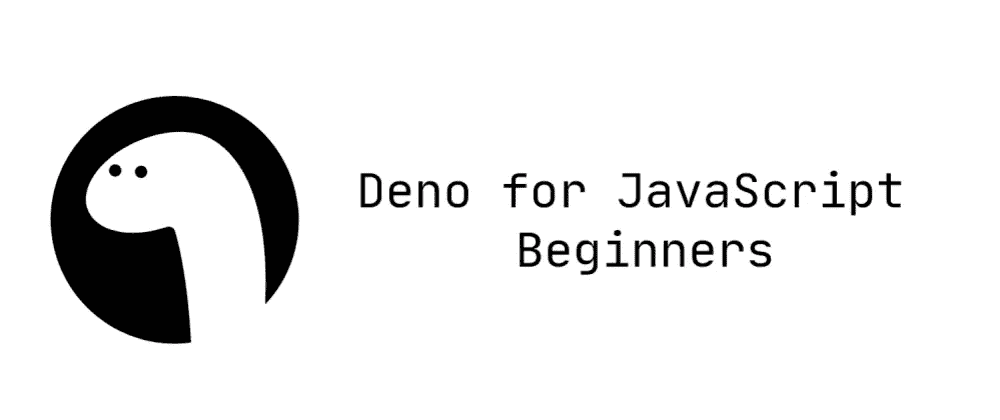

# 面向 JavaScript 初学者的 Deno

> 原文：<https://javascript.plainenglish.io/deno-for-javascript-beginners-1a300d152977?source=collection_archive---------10----------------------->



所以，你在努力学习 JavaScript。您刚刚对浏览器中的 JavaScript 有点熟悉了。然后突然间，你遇到了 [Deno](https://deno.land/) 和#NodeKiller 炒作。但你不知道这些是什么。如果是这样，请继续阅读！

在深入研究之前，您需要一些背景信息。

# 什么是 JavaScript 引擎？

您可能知道，JavaScript 是一种解释型编程语言。这意味着源代码在执行前不会被编译成二进制代码。

## *但是计算机怎么知道如何处理一个纯文本脚本呢？*

这是 JavaScript 引擎的工作。JavaScript 引擎动态地将 JavaScript 代码编译成可执行的机器代码。这就是所谓的实时(JIT)编译。

比如你在谷歌 chrome 上运行 JavaScript，你的 JavaScript 引擎是 V8。如果在 Mozilla 上，就是蜘蛛猴。

# 什么是 JavaScript 运行时环境？

你通常不会直接使用 JavaScript 引擎。JavaScript 引擎在一个环境中工作，该环境为您的 JavaScript 应用程序提供了可以在运行时使用的附加特性。

## *什么特征？*

这些可以是允许与引擎外部的环境通信的 API。

比如像 Google Chrome 这样的 web 浏览器，就是一个桌面 JavaScript 运行时环境，使用 V8 JavaScript 引擎，提供 DOM API、Fetch API、Storage API 等。

类似地，Node 和 Deno 等服务器端运行时环境使用 V8 引擎，并提供文件系统访问、网络访问、控制台等。

# 为什么我们需要浏览器之外的运行时？

尽管 JavaScript 的主要环境是 web 浏览器，但近年来，JavaScript 已经接管了服务器平台。

服务器端 JavaScript 运行时环境允许您访问文件系统、网络和其他在 web 浏览器中不允许的东西。你可以用一个只基于 JavaScript 的技术栈来构建一个完整的 web 应用程序(从 UI 到数据层)，比如像[意味着](http://meanjs.org/)或者 [MERN](https://www.geeksforgeeks.org/mern-stack/) 。

# NodeJS 怎么了？

根据 Ryan Dahl(NodeJS 的创始人)的说法，NodeJS 做错了一些事情。他在 JSConf EU 2018 上就此发表了一篇[演讲](https://youtu.be/M3BM9TB-8yA)。

# 不遵守承诺

NodeJS 有原生的 promises 支持，但是几个月后，它被移除了。由于这个原因，NodeJS 必须使用变通办法来实现承诺。

# 安全性

V8 本身就是一个非常好的安全沙箱。NodeJS 删除了所有这些安全特性，并允许应用程序访问所有内容。

# 该构建系统

我不完全理解这个，所以不要引用我的话。

Chrome 开始使用 [GYP](https://gyp.gsrc.io/) 构建系统，所以 NodeJS 也进行了切换。但是后来 Chrome 放弃了 GYP，采用了 [GN](https://gn.googlesource.com/gn/) 作为他们的构建系统，因为它更快更简单。Ryan Dahl 认为，继续使用 GYP 可能是 NodeJS 核心最大的失败。

# npm 和 package.json

所有 npm 包都包含一个文件，通常在项目根目录下，名为[package . JSON](https://docs.npmjs.com/files/package.json)——这个文件保存了与项目相关的各种元数据。

## *什么是 npm？*

npm 或节点包管理器，顾名思义，是用来管理项目中的依赖包，让你的生活更轻松。

## *听起来很棒！这有什么问题？*

package.json 文件包含一些不必要的信息，只有 npm 注册表需要这些信息。Ryan 将此描述为“样板噪声”,因为它除了噪声之外没有给项目增加任何东西。

国家预防机制是中央集权和私人控制的。如果你在浏览器中做过一些项目，你会知道如何链接到依赖项。类似 JQuery，Bootstrap 等。你添加任何链接到 HTML，你可以直接使用它。在节点中，除了 npm 之外，不能在任何地方安装依赖项表单。

# require("module ")不带扩展名"。js "

这就是你导入外部库的方式，不够具体。例如，如果您想在项目中安装 JQuery，那么首先要使用 npm，通过 install 命令将其安装在项目文件夹中

```
npm install jquery
```

然后，如果您想在文件中使用它，您可以在想要使用 JQuery 的文件中添加一个“require()”语句。

```
require("JQuery")// code that uses JQuery
```

## *这有什么问题？看起来很整洁！*

是的，但是这种*简洁的*语法所需要的算法非常复杂且效率低下。模块加载程序必须在多个位置查询文件系统，试图猜测用户的意图。

# 节点 _ 模块

这是使用简洁的语法导入模块的结果。

当您在项目中安装依赖项时，它们会被下载到“node_modules”文件夹中。

> 那使它更整洁！我可以离线使用它们！有问题吗？

问题是你安装的依赖项，有他们的依赖项，对他们来说也一样。依赖关系树变得如此之大，很难管理和存储。您必须对每个项目都这样做，这些项目可能大部分都使用相同的依赖项。没有办法在项目之间共享依赖关系。

假设您想要创建两个不同的项目，但它们都使用 JQuery，您可以下载“JQuery.js”文件并将其保存在一个共享文件夹中，您可以从这两个项目链接到该文件夹。当您准备好发布项目时，您只需更改到远程文件的链接并发布它们。您甚至可以在将来的项目中重用本地文件。这在节点中是不可能的。

如果有关于它的迷因，那么你知道它是严重的。这是演示中的一张幻灯片。


# 索引. js

与“index.html”类似，如果没有指定，NodeJS 将查找“index.js”文件。这是一件没有必要做的事。它不必要地使模块装载系统变得复杂。在“require()”支持 package.json 之后，这变得尤其不必要

## 他们为什么不解决这些问题？

在这一点上，所有这些问题都是 NodeJS 的核心特性，试图修复它们将意味着创建一个全新的东西。使用 NodeJS 的代码如此之多，以至于修复这些问题就像永久停电一样。所有旧代码都会过时。许多科技巨头使用它，许多初创公司使用它，许多开发人员将它用于个人项目。**到处都是！**

## *那他们为什么不创造一个全新的东西？*

对此，我想说:

在你知道你能得到之前，你不会去要求。

NodeJS 在 2009 年问世时，是互联网上可能发生的最好的事情。

是的，他们确实创造了一个全新的东西… Deno。

# 什么是德诺？

Deno 是一个*新的*跨平台运行时环境，基于 Google 的 V8 引擎，就像 NodeJS 一样。它是由 NodeJS 的创造者 Ryan Dahl 制作的。它和 NodeJS 的目的是一样的。

## 如果就像 NodeJS 一样，那有什么新的？

与 Node (C++)不同，它是用 Rust 编写的，这使得它更快更安全。它还有许多很酷的新功能。

# 类型脚本支持

Deno 支持开箱即用的[类型脚本](https://www.typescriptlang.org/)。您不需要设置或配置任何东西。

## *什么是 TypeScript？*

TypeScript 是 JavaScript 的一个类型化超集，可以转换成普通 JavaScript。它是由微软开发的。Typescript 增加了许多特性，使您的 JavaScript 应用程序更容易扩展，并从一开始就防止未来的错误。

你不需要为此学习一门全新的语言。任何 JavaScript 代码都是有效的类型脚本代码，但反之则不然。TypeScript transpiles 生成干净、简单的 JavaScript 代码，可以在任何支持 ECMAScript 3(或更新版本)的 JavaScript 引擎上运行。

# ES 模块导入语法

Deno 允许您使用 ES 模块语法从 web 导入，就像在浏览器中一样。

```
import { bgBlue, red, bold } from "https://deno.land/std/colors/mod.ts";
```

## *线下使用情况如何？*

Deno 在第一次获取依赖项后缓存它们。所以现在你甚至不必使用单独的本地文件进行开发。一切正常。缓存的依赖项可以在项目之间共享，因此您可以为您正在处理的每个项目使用每个依赖项的一个副本。

这个开关解决了整个 node_modules 问题，使它更快，并有助于 Deno 使用您在任何地方都使用的标准 JavaScript。

# 默认安全

默认情况下，如果您在 Deno 中运行一个 JavaScript 文件，除了读取项目目录的权限之外，它没有其他权限。您必须明确地同意您希望脚本拥有的所有权限。它甚至没有权限连接到互联网甚至你的本地网络。你控制你想要你的脚本做什么。

## *就这样？你就这点能耐吗？*

大多数变化都发生在幕后。运行时本身变得更快，尊重浏览器标准，因此它不必使用现成的 API，摆脱了 npm 及其带来的一切。去掉了所有不必要的工作区，给你一个最小的运行环境来完成工作。

## *节点刚刚被摧毁，对不对？*

不对！有一件事，仍然保持节点在那里…年龄。随着时间的推移，Node 获得了大量的用户、学习资源和社区支持。另一方面，Deno 最近达到了 1.0 版本的里程碑。这意味着它的用户群很小，没有很多学习资源，而且它本身把 JavaScript 社区分成了两部分。

Deno 也没有标准的工作流程和开发栈。从谷歌和微软这样的科技巨头转向全职 it 还有很长的路要走。这反过来意味着没有与 Deno 相关的工作，正因为如此，没有多少人会尝试学习它。

所以阻止 Deno 成为#节点杀手的主要原因是用户群。

## *那么我应该试试吗？*

试试看？是啊！全力以赴？还没有！

如果您是 JavaScript 新手，应该学习 Node。JS 第一。将来，如果 Deno 仍然被证明是#NodeKiller，你可以很容易地切换到 Deno。你所要做的就是抛弃整洁的导入语法，开始对你所做的负责。

感谢您阅读这篇文章。