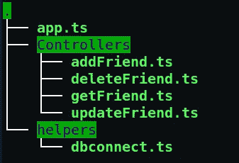

# 用 Oak 和 MongoDB 在 Deno 中创建 CRUD API

> 原文：<https://javascript.plainenglish.io/deno-oak-mongo-3d29542333fd?source=collection_archive---------6----------------------->

> Deno 是一个简单、现代和安全的 JavaScript 和 TypeScript 运行时，它使用 V8 并内置于 Rust 中。

2020 年 5 月 13 日，Deno 的 v1.0 正式上线。Deno 是由 Ryan Dahl 开发的，他也在 Node.js 的开发中发挥了重要作用。看看几个月前的视频，Ryan Dahl 和麦显杰·凯利在视频中谈论了创建 Deno 背后的想法。

[Deno is a New Way to JavaScript — Ryan Dahl & Kitson Kelly](https://www.youtube.com/watch?v=1gIiZfSbEAE)

下面是 Deno 和 Node.js 的一些基本的异同点。

*   Deno 是用 Rust 在核心构建的，不像 Node.js 用 C++。
*   而且，Deno 支持开箱即用的 typeScript。在 Node.js 中使用 like 之前，它们不需要编译成 javascript 文件。
*   Deno 和 Node.js 都使用 V8 javascript 运行时。
*   除非明确启用，否则 Deno 没有文件、网络或环境访问权限。而 Node.js 可以访问本地文件和网络，而不需要任何额外的权限，这是一个安全问题。
*   Deno 不使用节点模块和 npm。当程序第一次运行时，直接从 URL 导入并缓存的包。


DENO

## 装置

使用 Shell (Linux):

```
curl -fsSL https://deno.land/x/install/install.sh | sh
```

使用自制软件(macOS):

```
brew install deno
```

使用巧克力(Windows):

```
choco install deno
```

在这篇博客中，我将使用 oak 和 deno_mongo 库在 Deno 中创建一个服务器应用程序。

*   [**橡树**](https://deno.land/x/oak) **:** 它是 Deno 的 [Http](https://github.com/denoland/deno_std/tree/master/http#http) 服务器的中间件框架，包括一个路由器中间件。这个中间件框架的灵感来自于 [Koa](https://github.com/koajs/koa) 和中间件路由器，灵感来自于 [koa-router](https://github.com/alexmingoia/koa-router/) 与 Node.js 一起使用。
*   [**deno_mongo**](https://deno.land/x/mongo) :是为 deno 开发的 MongoDB 数据库驱动，基于 Rust 的 [MongoDB](https://crates.io/crates/mongodb) 库包。

所以，让我们从编码部分开始。这个迷你项目是一个简单的服务器应用程序来创建我们的朋友名单。我们将能够在 MongoDB 数据库中添加、获取、更新和删除我们朋友的数据。

下面是我们目录的结构



Directory structure

这是 app.ts 文件。这是我们将用来启动服务器和声明路由的文件。

`**./app.ts**`

然后创建 helper 文件夹，我们将在其中创建用于连接 MongoDB 数据库的`dbconnect.ts`。

`**./helpers/dbconnect.ts**`

现在我们将进入主要部分。为路线创建控制器。

这个项目我们有 4 个控制器。

1.  **add friend**(POST)**:**向数据库添加好友。(插入操作)
2.  **getFriend** (GET):获取指定 id 的好友数据。(查找操作)
3.  **updateFriend** (补丁):更新给定 id 的朋友的电子邮件和 pno。(更新操作)
4.  **删除好友**(删除):使用 id 删除好友。(删除操作)

1. `**./Controllers/addFriend.ts**`

**路线-**

**样本输入**:请求体，内容类型:json

```
{
 “name”: “Subhra”,
 “pno”: “9003814273”,
 “email”: “[subhrapaladhi9@gmail.com](mailto:subhrapaladhi9@gmail.com)”
}
```

**样本输出**:mongoID 返回。

```
{"$oid": "5ec0a99c003430240011550b"}
```

2.`**./Controllers/getFriend.ts**`

**路线-**

**样本输出**:返回好友数据

```
{
  "_id": {
    "$oid": "5ec0a99c003430240011550b"
  },
  "name": "Subhra",
  "pno": "9003814273",
  "email": "subhrapaladhi9@gmail.com"
}
```

**3。** `**./Controllers/updateFriend.ts**`

**路线-** `**PATCH:** localhost:3000/updateFriend/5ec0a99c0034302411550b`

**样本输入**:请求体，内容类型:json

```
{
 "pno": "9458059340",
 "email": "[subhrapaladhi9@outlook.com](mailto:subhrapaladhi9@outlook.com)"
}
```

**样本输出**:返回以下 3 个字段。

```
{
  "matchedCount": 1,
  "modifiedCount": 1,
  "upsertedId": null
}
```

**4** 。`**./Controllers/deleteFriend.ts**`

**路线-** `**DELETE:** localhost:3000/deleteFriend/5ec0a99c0034302411550b`

**样本输出** : `“result”`删除成功时为 1，否则为 0。

```
{
  "result": 1
}
```

现在让我们运行我们的项目。在项目的根目录下打开终端/命令提示符，粘贴这个命令。

```
deno run --allow-net --allow-write --allow-read --allow-plugin --unstable app.ts
```

`- — allow-write --allow-read --allow-plugin --unstable` —这些是授予 Deno 访问网络和其他资源的权限所需的标志。

当您第一次运行该命令时，它将下载依赖项并在本地缓存它们。还将创建一个`./.deno_plugins`文件夹。您可以在提交代码之前将其添加到`.gitignore`文件中。

Deno 的一个小更新刚刚发布(2020 年 5 月 20 日)。它主要有一些错误修复。运行以下命令进行升级:-

```
deno upgrade --version 1.0.1
```

希望这能帮助你开始使用 Deno。我附上了一些资源链接，你可以从中了解更多关于 Deno 的知识。

## **参考资料和资源:**

**该项目的 GitHub 链接**

1.  [好友列表带号](https://github.com/subhrapaladhi/Friend-List-with-Deno)

**视频**

1.  [Deno 视频速成班](https://youtu.be/ll-8rtmq2Zc)
2.  [node . js 我后悔的 10 件事——Ryan Dahl——JSConf EU](https://www.youtube.com/watch?v=M3BM9TB-8yA)

**单据**

1.  [Deno 官网](https://deno.land/)
2.  [橡树](https://deno.land/x/oak)
3.  [德诺 _ 蒙戈](https://deno.land/x/mongo)

**博客**

1.  [使用 Deno 和 Mongo 创建服务器(使用 abc 框架)](https://dev.to/slimhmidi/create-a-server-with-deno-and-mongo-206l)
2.  [使用 Deno 和 Postgres 创建您的第一个 REST API](https://blog.logrocket.com/creating-your-first-rest-api-with-deno-and-postgres/)

# **来自简明英语团队的笔记**

你知道我们有四份出版物和一个 YouTube 频道吗？你可以在我们的主页[**plain English . io**](https://plainenglish.io/)找到所有这些信息——关注我们的出版物并 [**订阅我们的 YouTube 频道**](https://www.youtube.com/channel/UCtipWUghju290NWcn8jhyAw) **来表达你的爱吧！**