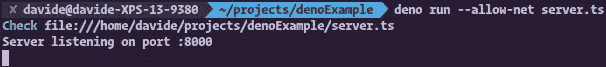
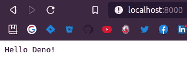
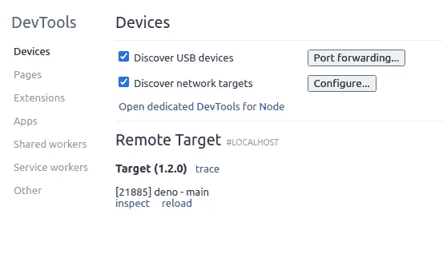
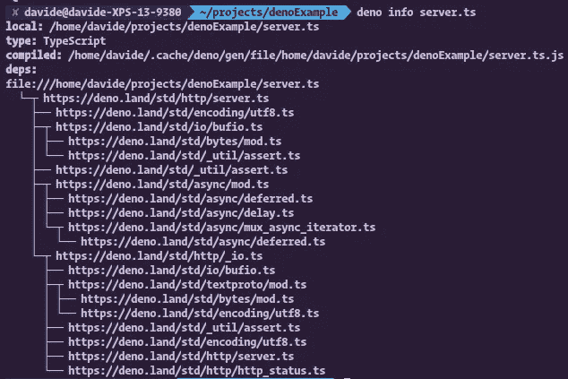
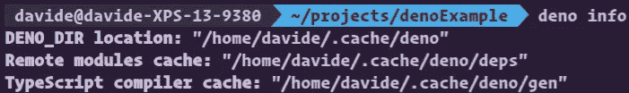
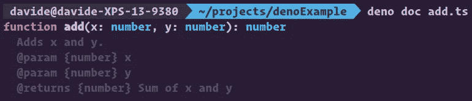
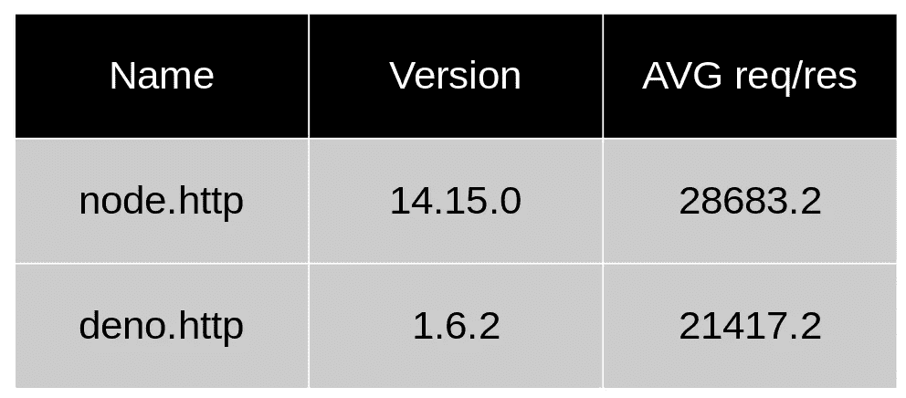
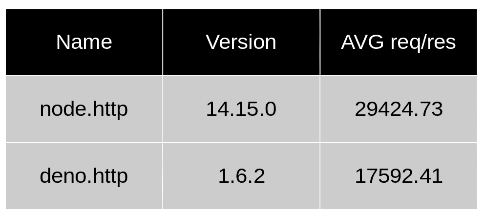

# deno vs . Node——JavaScript 运行时的永无止境的挑战

> 原文：<https://javascript.plainenglish.io/deno-vs-node-658fc5e1fb5c?source=collection_archive---------4----------------------->

## Deno vs. Node —有什么区别，哪个更好？


Node.js 的创始人 Ryan Dahl 在过去的几年里一直致力于开发新的 Javascript 运行时 Deno，根据 Ryan 自己的说法，它应该可以解决困扰 Node.js 的所有问题。

不要误会，Node.js 是一个很棒的运行时，主要得益于庞大的 userland 模块和 JavaScript 的使用；然而，Dahl 自己也承认，他没有考虑一些基本的方面，例如安全性、模块和依赖关系等等。

这是为 Ryan 辩护，他在他的时代从来没有想到这个平台会在如此短的时间内增长如此之快。

必须指出的是，在 2009 年，JavaScript 仍然是那种每个人都取笑的语言，今天出现的许多功能都不存在。

Ryan Dahl

# 什么是德诺？

Deno 是基于 Google 的 JavaScript 运行时 V8 的 TypeScript 运行时；如果你熟悉流行的服务器端 JavaScript 生态系统 Node.js，你就会明白 Deno 完全一样。除了在设计上做了一些改进:

*   它基于 JavaScript 语言的现代功能；
*   它有一个广泛的标准库；
*   它原生支持 TypeScript
*   支持 EcmaScript 模块；
*   它没有像 npm 那样的集中式包管理器；
*   它有几个内置的工具，如依赖检查器和代码格式化程序；
*   旨在尽可能与浏览器兼容；
*   安全性是主要特点。

# 与 Node.js 的主要区别是什么？

我认为 Deno 的主要目标是取代 Node.js，然而有一些重要的共同特征。例如:

*   两者都是由瑞安·达尔创作的；
*   两者都是基于谷歌的 V8 引擎开发的；
*   两者都是为了执行服务器端 JavaScript 而开发的。

但另一方面，也有一些重要的不同之处:

*   **生锈和打字稿**。与用 C++和 JavaScript 编写的 Node.js 不同，Deno 是用 Rust 和 TypeScript 编写的。
*   **东京**。作为一个事件驱动的异步平台，取代了 libuv。
*   **包装经理**。与 Node.js 不同，Deno 没有集中的包管理器，因此可以从 URL 导入任何 ECMAScript 模块。
*   **ECMAScript** 。Deno 在其所有 API 中使用现代 ECMAScript 功能，而 Node.js 使用标准的基于回调的库。
*   **安全**。Node.js 程序默认情况下从运行脚本的系统用户那里继承权限，与之不同，Deno 程序在沙箱中运行。例如，对文件系统、网络资源等的访问。必须被授予标志权限。

# 装置

Deno 是一个独立的可执行文件。我们可以通过从[本页](https://github.com/denoland/deno/releases)下载二进制版本在我们的机器上安装它，或者我们可以下载并执行下面列出的安装程序之一。

## Shell (Mac、Linux)

```
$ curl -fsSL https://deno.land/x/install/install.sh | sh
```

## PowerShell (Windows)

```
$ iwr https://deno.land/x/install/install.ps1 -useb | iex
```

## 自制软件(Mac OS)

```
$ brew install deno
```

# 让我们来看看安全性

Deno 的主要特性之一是安全性。与 Node.js 相比，Deno 在沙箱中执行源代码，这意味着运行时:

*   无权访问文件系统；
*   无权访问网络资源；
*   无法执行其他脚本；
*   无权访问环境变量。

我们举个简单的例子。考虑以下脚本:

```
*async* function main () {
  const encoder **=** **new** TextEncoder ()
  const data **=** encoder**.**encode ('Hello Deno! 🦕 \n')
  **await** Deno**.**writeFile( 'hello.txt' , data)
}
main()
```

剧本真的很简单。它只是创建一个名为`hello.txt`的文本文件，其中包含字符串`Hello Deno` 🦕。真的简单！还是没有？

正如我们之前所说的，代码将在沙箱中运行，显然，它不能访问文件系统。事实上，如果我们用以下命令执行脚本:

```
$ deno run hello-world.ts
```

它将在终端上打印如下内容:

```
Check file:///home/davide/denoExample/hello-world.ts
error: Uncaught PermissionDenied: write access to "hello.txt", run again with the --allow-write flag
    at unwrapResponse ($deno$/ops/dispatch_json.ts:42:11)
    at Object.sendAsync ($deno$/ops/dispatch_json.ts:93:10)
    at async Object.open ($deno$/files.ts:38:15)
    at async Object.writeFile ($deno$/write_file.ts:61:16)
    at async file:///home/davide/projects/denoExample/hello-world.ts:5:3
```

正如我们所看到的，错误信息非常清楚。文件没有在文件系统上创建，因为脚本没有写权限，但是通过添加标志`--allow-write`:

```
$ deno run --allow-write hello-world.ts
```

脚本将无错误地结束，并且文件`hello.txt`已在当前工作目录中正确创建。

除了让我们访问文件系统的标志`--allow-write`之外，还有其他标志，比如让我们访问网络资源的标志`--allow-net`，或者对运行外部脚本或子进程有用的标志`--allow-run`。我们可以在以下网址找到完整的许可列表[https://deno.land/manual/getting_started/permissions](https://deno.land/manual/getting_started/permissions)。

# 简单的服务器

现在我们将创建一个简单的服务器，它接受端口`8000`上的连接，并向客户机返回字符串`Hello Deno`。

```
// file server.ts
*import* { serve } *from* 'https://deno.land/std/http/server.ts'const s **=** serve({ port: 8000 })
console**.**log('Server listening on port :8000')
**for** **await** (const req **of** s) {
  req**.**respond({ body: 'Hello Deno!\n' })
}
```

显然，要运行这个脚本，我们需要指定`--allow-net`标志:

```
$ deno run --allow-net server.ts
```

在我们的终端上会出现类似这样的东西:



现在，如果我们打开我们最喜欢的浏览器，或者如果我们想使用`curl`命令，我们可以测试 URL `http://localhost:8000`。结果将是这样的:



# 模块

就像浏览器一样，Deno 通过 URL 加载他所有的模块。许多人最初对这种方法感到困惑，但这是有道理的。这里有一个例子:

```
import { assertEquals } from "https://deno.land/std/testing/asserts.ts";
```

通过 URL 导入包有其优点和缺点。主要优点是:

*   更大的灵活性；
*   我们可以创建一个包，而不用将它发布到公共存储库中(如 npm)。

我认为，一种包管理器可以在未来发布，但目前还没有正式发布。

Deno 的官方网站给了我们机会来托管我们的源代码，然后通过网址发布:[https://deno.land/x/](https://deno.land/x/)。

通过 URL 导入包给了开发人员他们需要的自由，可以在任何他们想要的地方托管他们的代码:最好的分散。因此，我们不需要`package.json`文件或`node_modules`目录。

当应用程序启动时，所有导入的包都被下载、编译并存储在缓存中。如果我们想再次下载所有的包，我们需要指定旗帜`--reload`。

## 我需要每次都输入网址吗？🤯🤬

Deno 本机支持 [**导入地图**](https://github.com/WICG/import-maps) 。这意味着可以指定一个类似`--importmap=<FILENAME>`的特殊命令标志。让我们看一个简单的例子。

假设我们有一个文件`import_map.json`，里面有以下内容:

```
{
  "imports": {
    "fmt/": "https://deno.land/std@0.65.0/fmt/"
  }
}
```

该文件指定在`/ftm`键处，在`imports`对象中，对应于 URL `[https://deno.land/sdt@0.65.0/ftm/](https://deno.land/sdt@0.65.0/ftm/)`，可以如下使用:

```
// file colors.ts
*import* { green } *from* "fmt/colors.ts";console**.**log(green("Hello Deno! 🦕"));
```

这个功能现在不稳定，我们需要使用标志`--unstable`运行我们的脚本`color.ts`，所以:

```
$ deno run --unstable --importmap=import_map.json colors.ts
```

现在在我们的终端里出现了这样的东西:


## 版本控制

包版本控制是开发人员的责任，在客户端，我们可以在导入包时决定在包的 URL 中使用特定的版本:

```
https://unpkg.com/package-name@0.0.5/dist/package-name.js
```

# 准备使用实用程序

老实说:开发者的 JavaScript 工具的当前状态是非常混乱的！当添加 TypeScript 类型时，混乱会变得更糟。😱


Photo by [Ryan Snaadt](https://unsplash.com/@ryansnaadt?utm_source=unsplash&utm_medium=referral&utm_content=creditCopyText) on [Unsplash](https://unsplash.com/s/photos/scream?utm_source=unsplash&utm_medium=referral&utm_content=creditCopyText)

JavaScript 最好的特性之一是代码不需要编译，可以在浏览器中立即执行。这使得开发人员的生活变得更加容易，并且很容易获得对所写代码的即时反馈。然而，不幸的是，这种过去时期的简单性并没有被我所认为的*“过度工具崇拜”*所确定。这些工具将 JavaScript 开发变成了一场真正的复杂性噩梦。Webpack 配置指南有完整的在线课程！是的，你答对了…一整个课程！

工具的混乱已经增加到许多开发人员渴望回到实际编写代码而不是玩弄配置文件的地步。一个旨在解决这个问题的新兴项目是脸书的罗马项目。

另一方面，Deno 有一个完整的生态系统，比如运行时和模块管理。这种方法为开发人员提供了构建应用程序所需的所有工具。现在，让我们看看 Deno 1.6 生态系统提供的工具，以及开发人员如何使用它们来减少对第三方的依赖并简化开发。

在 Deno 中替换整个构建管道是不可能的，但是我认为我们不会在拥有它之前等待太久。下面是集成功能的列表:

*   **bundler:** 它在单个 JavaScript 文件中写入指定的模块及其所有依赖关系；
*   **调试器:**它让我们能够用 Chrome Devtools、VS Code 以及其他工具调试我们的 Deno 程序；
*   **依赖检查器:**如果我们在一个 ES 模块上执行这个工具，它会显示所有的依赖树；
*   **文档生成器:**它分析给定文件中的所有 JSDoc 注释，并为我们生成文档；
*   **格式化程序:**自动格式化 JavaScript 或 TypeScript 代码；
*   **test runner:** 这是一个实用程序，它让我们能够使用标准库的`assertions`模块来测试我们的源代码。
*   用于识别我们程序中潜在的错误。

## 打包机

Deno 可以使用`deno bundle`命令从命令行创建一个简单的包，但是它在内部公开了一个 API。有了这个 API，开发者可以创建一个定制的输出，或者可以用于前端的东西。这个 API 不稳定，所以我们需要使用`--unstable`标志。让我们以前面的例子为例，修改如下:

```
// file colors.ts
*import* { green } *from "*https://deno.land/std@0.65.0/fmt/colors.ts";console**.**log(green("Hello Deno! 🦕"));
```

现在让我们从命令行创建我们的包:

```
$ deno bundle colors.ts colors.bundle.js
```

这个命令创建了一个文件`colors.bundle.js`，其中包含了我们执行它所需的所有源代码。事实上，如果我们尝试使用该命令运行脚本

```
$ deno run colors.bundle.js
```

…我们会注意到没有模块会从 Deno 的存储库中下载。这是因为执行所需的所有代码都包含在`colors.bundle.js`文件中。我们将在终端上看到的结果与前面的示例相同:


## 调试器

Deno 有一个集成的调试器。如果我们想在调试模式下手动启动程序，我们需要使用`--inspect-brk`

```
$ deno run -A — inspect-brk fileToDebug.ts
```

现在，如果我们打开 Chrome inspector `chrome://inspect`，我们会发现一个类似这样的页面



如果我们点击`inspect`，我们可以开始调试我们的代码。

## 依赖性检查器

使用这个工具真的很简单！简单地说，我们需要使用后面的`info`子命令和一个模块的 URL(或路径),它将打印该模块的依赖树。如果我们使用前面例子中使用的`server.ts`文件启动命令，它将在我们的终端中打印如下内容:



命令`deno info`也可用于显示缓存信息:



## 文档生成器

这是一个非常有用的工具，它允许我们自动生成 JSDoc。如果我们想使用它，只需运行命令`deno doc`，后面跟着一个或多个源文件的列表，它会自动将我们模块的所有导出文件的所有文档打印到终端。让我们通过一个简单的例子来看看它是如何工作的。假设我们有一个包含以下内容的文件`add.ts`:

```
/**
 * Adds x and y.
 * [@param](http://twitter.com/param) {number} x
 * [@param](http://twitter.com/param) {number} y
 * [@returns](http://twitter.com/returns) {number} Sum of x and y
 */
export function add(x: number, y: number): number {
  return x + y;
}
```

执行`deno doc`命令，它将在标准输出上打印以下 JSDoc:



可以使用`--json`标志生成 JSON 格式的文档。Deno 的网站可以使用这种 JSON 格式自动生成模块文档。

## 格式程序

格式化程序是由 prettle 的替代者 [dprint](https://github.com/dprint/dprint) 提供的，它克隆了 Prettier 2.0 所支持的所有规则。如果我们想要格式化一个或多个文件，我们可以使用`deno ftm <files>`或一个 VSCode 扩展名。如果我们运行带有`--check`标志的命令，将对当前工作目录中的所有 JavaScript 和 TypeScript 文件执行格式检查。

## 测试跑步者

这个工具的语法非常简单。我们只需要使用`deno test`命令，就会对所有以`_test`或`.test`结尾，扩展名为`.js`、`.ts`、`.tsx`或`.jsx`的文件执行测试。除了这个实用程序之外，还可以使用标准的 Deno API，它为我们提供了`asserts`模块，我们可以通过以下方式使用它:

```
import { assertEquals } from "https://deno.land/std/testing/asserts.ts"

Deno.test({
  name: "testing example",
  fn(): void {
    assertEquals("world", "world")
    assertEquals({ hello: "world" }, { hello: "world" })
  },
})
```

这个模块给了我们九个可以在测试用例中使用断言:

*   `assert(expr: unknown, msg = ""): asserts expr`
*   `assertEquals(actual: unknown, expected: unknown, msg?: string): void`
*   `assertNotEquals(actual: unknown, expected: unknown, msg?: string): void`
*   `assertStrictEquals(actual: unknown, expected: unknown, msg?: string): void`
*   `assertStringContains(actual: string, expected: string, msg?: string): void`
*   `assertArrayContains(actual: unknown[], expected: unknown[], msg?: string): void`
*   `assertMatch(actual: string, expected: RegExp, msg?: string): void`
*   `assertThrows(fn: () => void, ErrorClass?: Constructor, msgIncludes = "", msg?: string): Error`
*   `assertThrowsAsync(fn: () => Promise<void>, ErrorClass?: Constructor, msgIncludes = "", msg?: string): Promise<Error>`

## 棉绒

Deno 集成了 JavaScript 和 TypeScript linter。这是一个新特性，它不稳定，显然，如果我们想使用它，需要`--unstable`标志来执行它。

```
*# This command lint all the ts and js files in the current working directory* $ deno lint --unstable*# This command lint all the listed files* $ deno lint --unstable myfile1.ts myfile2.ts
```

# 基准

好了，伙计们！我们到了关键时刻了！谁是最好的 JavaScript 环境 Deno 或 Node？但我认为正确的问题是另一个:**谁最快？我做了一个非常简单的基准测试(一个 http hello 服务器),结果非常有趣。我在我的笔记本电脑上做的，它有以下特点:**

```
Model: XPS 13 9380
Processor: Intel(R) Core(TM) i7-8565U CPU @ 1.80GHz
RAM: 16GB DDR3 2133MHz
OS: Ubuntu 20.04 LTS
Kernel version: 5.4.0-42
```

我用来制作这些基准的工具是[auto canon](https://github.com/mcollina/autocannon)，使用的脚本如下:

```
// file node_http.js
const http = require("http");const hostname = "127.0.0.1";
const port = 3000;http.createServer((req, res) => {  
  res.end("Hello World");
}).listen(port, hostname, () => {  
  console.log("node listening on:", port);
}); // file deno_http.ts
import { serve } from "[https://deno.land/std@0.61.0/http/server.ts](https://deno.land/std@0.61.0/http/server.ts)";const port = 3000;
const s = serve({ port });
const body = new TextEncoder().encode("Hello World");console.log("deno_http listen on", port);
for await (const req of s) {
  const res = {
    body,
    headers: new Headers(),
  };
  res.headers.set("Date", new Date().toUTCString());
  res.headers.set("Connection", "keep-alive");
  req.respond(res).catch(() => {});
}
```

我们可以在下面的 github 资源库中找到它们:

[](https://github.com/trivikr/node-deno-http-benchmarks) [## tri vikr/node-deno-http-基准

### 测试 deno 的步骤安装 Deno 在后台运行 Deno 服务器 Deno Run-allow-net Deno _ http . ts & Run…

github.com](https://github.com/trivikr/node-deno-http-benchmarks) 

第一个测试用例使用命令`autconannon [http://localhost:3000](http://localhost:3000) -c100`在 100 个并发连接上执行，结果如下:



好像 Node 在速度上打败了 Deno！但是这个基准测试是基于 100 个并发连接的，这对于中小型服务器来说是很多的。所以让我们做另一个测试:这次有 10 个并发连接。

同样，Node 打败了 Deno:



就性能而言，Node 似乎以 2:0 击败了 Deno！它在两种分析的情况下都表现得更好。然而，Deno 是一个非常年轻的项目，社区正在努力工作以尽快在生产环境中被采用，但这将是一场艰苦的战斗。

# 结论

本文的主要目的不是支持 Node 或 Deno，而是比较这两种环境。现在你应该对两者的异同有所了解了。

Deno 对开发人员来说有一些特别的优势，包括健壮的支持系统和本机类型脚本支持。设计决策和额外的内置工具旨在提供高效的环境系统和良好的开发人员体验。我不知道这些选择在未来是否会成为一把双刃剑，但现在似乎吸引了更多的开发者。

另一方面，Node 有一个强大的生态系统，十年的开发和发布，一个海洋社区和在线课程，可以在许多线程或问题上帮助我们，一个无限的框架列表(Fastify，Express，哈比神，Koa 等)。)，许多书籍，如*《Node.js 设计模式》*或*《Node Cookbook》*，都是我认为讨论 Node . js 的最佳书籍。出于这些和许多其他原因，我认为 Node 是目前最安全的选择。我能说什么呢…

```
HAPPY CODING!
```

# 文献学

[](https://deno.land/) [## 德诺

### 编辑描述

德诺.兰德](https://deno.land/) 

*更多内容请看*[***plain English . io***](http://plainenglish.io/)