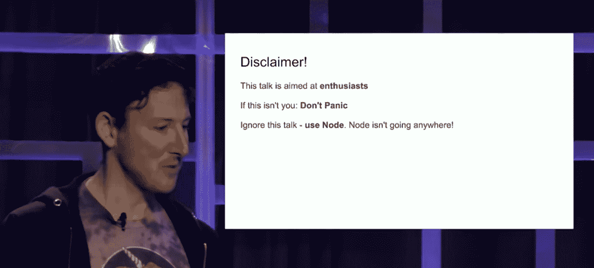
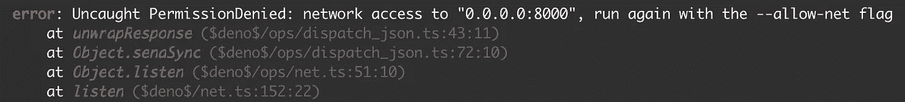
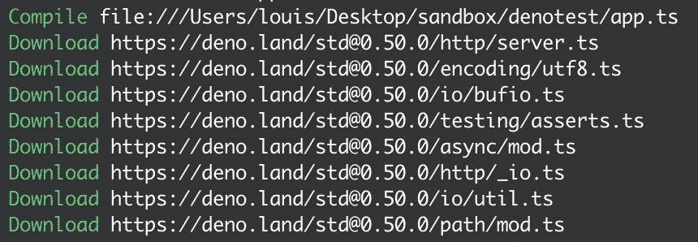

# Deno 与 node . js——以下是最重要的区别

> 原文：<https://javascript.plainenglish.io/deno-vs-node-js-here-are-the-most-important-differences-62b547443be1?source=collection_archive---------0----------------------->

## 安全性，在引擎盖下，窗口对象和类型脚本支持

Deno 是新 Node.js 吗？或者这只是一个不错的选择？在这篇文章中，我们将探讨一些重要的区别和特点——玩得开心！

# Node.js 和 Deno 的主要区别:

*   Deno 用的是引擎盖下的 Rust，也是 V8 引擎，跟 Node.js 一样。
*   Deno 支持现成的 TypeScript。它也可以处理 JavaScript，没有任何问题，开箱即用。
*   Deno 不支持 NPM 包，也不使用 node_modules 目录。库是通过 URL 导入的。
*   Deno 使用权限系统来执行代码。
*   Deno 支持窗口对象——尽管我们正在编写后端代码。


# 德诺背后的历史和故事

现在已经被一些人视为下一个大事件，并取代 Node.js，两者都有一个起源: **Ryan Dahl**

达尔从 2009 年开始参与 Node 项目，但几年后退出了。2018 年，他发表了关于 Node.js 的 ***10 件让我后悔的事情，其中他还宣布了 Deno——一种新的 JavaScript & TypeScript 运行时。***

**fun fact**:“Deno”其实是“Node”的变位词。

## 但所有 Node.js 开发者现在应该担心 Ryan Dahl 自己创造了竞争，Node 将被取代吗？

答案似乎是“**不。**”，正如你可以在链接中找到的达尔在另一个演讲中提出的那样



Source: [YouTube](https://youtu.be/1gIiZfSbEAE?t=69)

正如达尔自己在这个演讲中所说，Deno 仍然是新的。目前，更准确地说是在 1.0.0 版本中。另一方面，Node 已经有点老了——本质上两者的目的是一样的。

它们是 JavaScript 运行时，所以我们可以在浏览器之外使用 JS，例如用于 web 服务器。但是几年后 Deno 和 Node 之间的事情会是什么样子，几乎没有人能说得清。

# 引擎盖下的 Deno 和 Node

Node.js 基于 C++使用 V8 引擎执行 JavaScript 代码。
V8 引擎本身最初是为谷歌 Chrome 开发的，用于在浏览器中快速执行 JavaScript。与此同时，甚至新的微软 Edge 版本也是基于 V8 的。

Deno 也依赖于 V8 引擎，但不是 C++，Deno 也基于 Rust——一种编程语言，据称可以提供与 C++类似的良好性能，但也特别强调安全性:应该避免内存访问错误或缓冲区溢出。

安全性是一回事——对 Node.js 的一个常见批评是，一旦 Node 应用程序运行，它就可以轻松访问文件系统或网络等。

Deno 希望通过要求运行 Deno 应用程序的人首先允许 Deno 想做的事情来避免这一点。

下面的 TS 代码就是一个很好的例子，我们在 Deno 官方网站上找到了它作为入门示例:

```
*import* { serve } *from* “https://deno.land/std@0.50.0/http/server.ts";const s = serve({ port: 8000 });*for* *await* (const req of s) {
  req.respond({ body: “Hello World\n” });
}
```

正如您可能已经看到的，这是一个非常简单的 web 服务器，我们必须如下执行整个操作:

```
deno run app.ts 
```

但此时 Deno 的安全措施介入，我们尚未允许访问网络，因此出现以下消息:



为了让我们的应用程序能够访问网络，我们必须首先对其进行授权:

```
deno run --allow-net app.ts 
```

现在，我们的小型 web 服务器运行成功——但好的一面是，我们只批准了网络。应用程序仍然不能像那样访问文件系统，我们必须首先手动允许它。

# 再见 NPM，你好 ES6 进口

我们的应用程序的另一个安全性问题是 NPM:不仅使用 NPM 经常导致巨大的 **node_modules** 文件夹，而且还有节点和安全性的问题:如果我们使用 NPM 为我们的节点应用程序安装一个包，理论上它可以偷偷地做其他事情。
过去，NPM 软件包曾爆出丑闻，例如，它窃取了用户数据。

Deno 根本不依赖 NPM——相反，我们通过 URL 导入库，如上面的代码示例所示。

```
*import* { serve } *from* “https://deno.land/std@0.50.0/http/server.ts";
```

我们要使用的库在第一次执行时下载，然后缓存:



当我们简单地为我们的 web 服务器复制代码，并将其存储在我们的服务器或 PC 上完全不同的位置，然后再次执行它时，就可以看到这一点。不需要重新加载库。

如果你想了解更多关于 NPM 的危险:

[](https://medium.com/javascript-in-plain-english/the-biggest-scandals-of-npm-d739c11a2406) [## NPM 最大的丑闻

### JavaScript 世界中巨大的依赖树使得开发变得非常愉快。但有时它会压倒…

medium.com](https://medium.com/javascript-in-plain-english/the-biggest-scandals-of-npm-d739c11a2406) 

# 窗口对象—也在浏览器之外

窗口对象是浏览器中的父对象，JavaScript 的一些最重要的函数就是从它派生出来的。

其中一个就是，比如**取**。不幸的是，像 Axios 这样的库的本地替代品在 Node.js 中没有用武之地——在 node . js 中你必须找到一个库的解决方案——但在 Deno 中没有。

因为在 Deno 中，窗口对象是可用的，正如你在文档中看到的:[https://deno.land/typedoc/interfaces/window.html](https://deno.land/typedoc/interfaces/window.html)
而在 window 所在的地方，我们也可以使用 fetch，就像在浏览器中一样。

让我们尝试一下，你会发现你可以在浏览器中运行以下代码，也可以在 Deno 应用中运行:

```
fetch(“https://jsonplaceholder.typicode.com/todos/1")
  .then((response) => response.json())
  .then((json) => console.log(json));
```

如果你想了解更多关于窗口对象的信息，看看这个:

[](https://medium.com/javascript-in-plain-english/the-window-document-object-in-javascript-7-useful-things-you-can-do-with-them-14888333ec91) [## JavaScript 中的窗口和文档对象——你可以用它们做 7 件有用的事情

### 为什么不再用香草 JavaScript 呢？这里有一些文档和窗口对象的很酷的特性，你可能不知道…

medium.com](https://medium.com/javascript-in-plain-english/the-window-document-object-in-javascript-7-useful-things-you-can-do-with-them-14888333ec91) 

# 现成的类型脚本支持

打字稿当然是一个品味问题，被许多人推崇，但也被一些人视为没有必要。但我能说的是，双方都可以对 Deno 感到满意——因为 Deno 直接提供了对 TypeScript 的支持，当然它也支持经典的 JavaScript。

你可以很容易地用这两种语言编写代码，把它保存为**。ts** ，或**。js** 并简单地用 ***deno run*** 照常执行。在我看来，与 Node.js 相比，它并不是绝对的游戏改变者，因为你可以很容易地在那里获得 TypeScript 支持，但它绝对是一件很酷的事情。

**感谢您的阅读！有兴趣订阅 Medium.com，同时支持我吗？如果你的答案是肯定的，一定要看看这个:**

[https://louispetrik.medium.com/membership](https://louispetrik.medium.com/membership)

通过这个链接，我会收到你每月付款的一部分，如果你注册。然而，你不会有额外的费用。因此:

**提前感谢！:)**

## 从 2020 年 11 月开始更新

[](https://medium.com/javascript-in-plain-english/is-deno-already-dead-661ce807338a) [## 德诺已经死了吗？

### 炒作消失的一些原因

medium.com](https://medium.com/javascript-in-plain-english/is-deno-already-dead-661ce807338a) 

## [加入我的邮件接收一切，你感兴趣的](http://eepurl.com/hacY0v)

# **简明英语笔记**

你知道我们推出了一个 YouTube 频道吗？我们制作的每个视频都旨在教给你一些新的东西。点击 [**点击**](https://www.youtube.com/channel/UCtipWUghju290NWcn8jhyAw) 查看我们，并确保订阅该频道😎