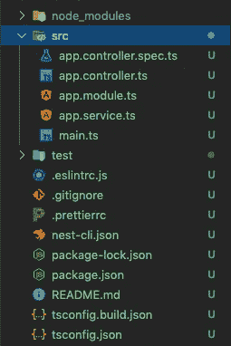
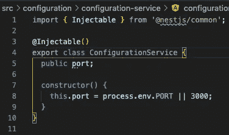
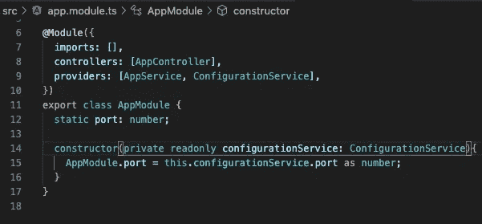
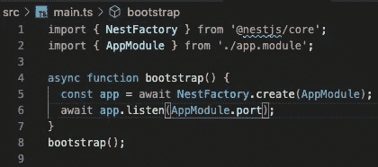
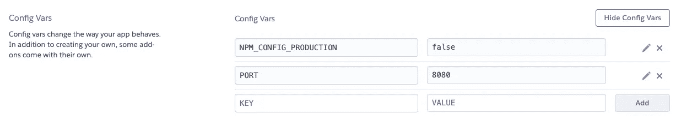
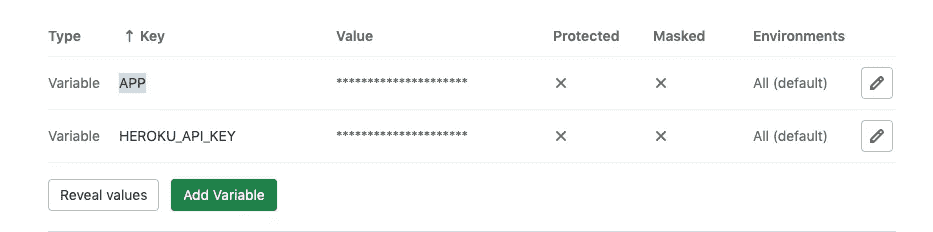
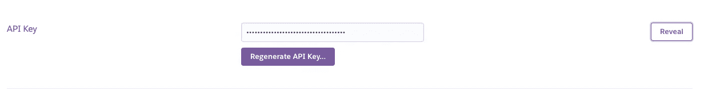
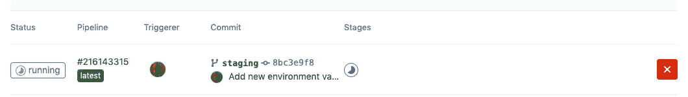
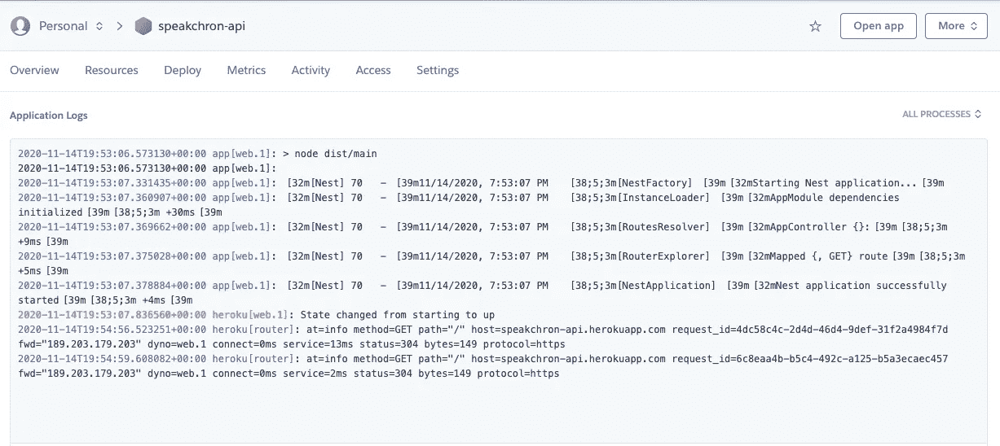

# 使用 GitLab CI/CD 管道在 Heroku 中部署一个 NestJS 应用程序

> 原文：<https://javascript.plainenglish.io/deploy-a-nestjs-application-in-heroku-with-gitlab-ci-cd-pipelines-9773e6a8eb71?source=collection_archive---------1----------------------->

## 如何使用 GitLab CI/CD 管道在 Heroku 中部署 NestJS 应用程序


# 介绍

前几天我写了一个小教程解释如何创建一个 NestJS 应用程序[用 NestJS 和 PostgreSQL](https://medium.com/swlh/create-an-api-rest-with-nestjs-1954723e8234) 创建一个 API Rest，现在我将解释如何使用 GitLab 管道部署它。

# 先决条件

我们需要在 [Heroku](https://devcenter.heroku.com/articles/heroku-cli#download-and-install) 和 [GitLab](https://about.gitlab.com) 创建一个账户。

请确保您的操作系统上安装了 [Node.js](https://nodejs.org/) ( > = 10.13.0)。

# 装置

## NestJS

一旦安装了 NodeJS，我们就要安装 [NestJS CLI](https://docs.nestjs.com/cli/overview) ，命令行界面帮助我们维护我们的应用程序。

安装完成后，我们将执行下一个命令来创建我们的项目。

```
$ nest new project-name
```

您可以在 src 目录中找到核心文件。



Core files

*   app.controller.ts:路线简单的基础控制器。
*   app.service.ts:简单的服务。
*   app.module.ts:应用程序的根模块。
*   main.ts:使用核心函数`NestFactory`创建嵌套应用实例的应用的入口文件。

要启动应用程序，请键入以下命令。

```
$ cd project-name$ npm run start
```

现在您可以打开浏览器并导航到 [http://localhost:3000](http://localhost:3000/) 。

我们将创建一个服务来管理每个环境的配置，并读取环境变量[**process . env**](https://nodejs.org/dist/latest-v8.x/docs/api/process.html)**，**在我们的例子中，我们只需要端口。

```
$ nest g service configuration/configuration
```



Configuration service.

现在，在 AppModule 类中创建一个服务实例，并添加一个名为 port 的新静态属性，在构造函数中初始化该属性。



AppModule.

在 main.ts 文件中添加端口配置



main.ts file

这些都是我们部署应用程序所需设置。

## 赫罗库

是时候安装 Heroku 了，可以找如何安装[https://dev center . Heroku . com/articles/Heroku-CLI #下载安装](https://devcenter.heroku.com/articles/heroku-cli#download-and-install)。

安装后，登录您的帐户。

```
$ heroku login$ heroku create application-name
```

现在我们需要将名为**NPM _ 配置 _ 生产**的环境变量配置为 false，这是因为我们的管道需要在启动服务器之前生成我们项目的构建，而**端口**是应用程序用于部署的端口。



Environment variable

## GitLab

是时候在 [GitLab](https://gitlab.com/) 中创建一个账户了，一旦账户被创建，我们将创建一个新的存储库。

现在进入 NestJS 项目，添加第一次提交，并将更改推入新的存储库中。

```
$ cd projectname$ git add -A .$ git commit -m"First commit"$ git remote add origin [git@gitlab.com](mailto:git@gitlab.com):groupname/projectname-api.git$ git push -u origin — all
```

现在转到 Settings / CI/CD / Variables，添加 **APP** 和 **HEROKU_API_KEY** 变量。



Environment variables

要获得 Heroku 的 API 密钥，请进入帐户设置和底部，您可以找到值和应用程序的名称。



Heroku API key.

现在，在项目中创建。gitlab-ci.yml 文件，在这个文件中，我们将配置我们的管道。

在我们的管道中，我们有 4 种规格。

*   **图片**:指定 NodeJS 的版本。
*   **before_script** :覆盖作业前执行的一组命令。
*   **阶段** : 定义一个作业阶段。
*   **分期** : 部署的是我们的环境。

我们安装了 **dpl** 依赖项，dpl 是 Travis CI 开发和使用的用于持续部署的部署工具，但也可以与 GitLab CI/CD 一起使用，您可以在[https://docs.gitlab.com/ee/ci/examples/deployment/](https://docs.gitlab.com/ee/ci/examples/deployment/)中找到关于它的更多信息。

在 staging 部分，我们指定任务“Deploy”的类型、我们使用的映像、定义作业阶段和我们用于部署的脚本。

```
dpl --provider=heroku --app=$HEROKU_APP_STAGING --api-key=$HEROKU_API_KEY
```

在脚本中，我们指定提供者，在我们的例子中是 Heroku，我们的应用程序的名称，以及 API 密钥。

现在创建 **Procfile** 并添加下一行:

```
web: npm run start:prod
```

此命令在生产模式下启动项目。

在 package.json 中，我们添加了新的脚本。

```
"postinstall": "npm run prestart:prod""prestart:prod": "rimraf dist && npm run build"
```

在 **install** 命令完成后，下一个命令是 **prestart:prod** its，因为我们需要在执行 **start:prod** 之前创建我们项目的构建。

配置已经完成，现在我们提交所有的更改，创建一个名为 **staging** 的新分支，并将其推送到 GitLab。

GitLab 将识别我们的管道，并开始在 Heroku 部署我们的应用程序。



Deploying app.



Log.

部署过程完成后，我们可以通过单击“打开应用程序”按钮打开应用程序。

你可以在[https://gitlab.com/speakchron/speakchron-api](https://gitlab.com/speakchron/speakchron-api)找到这个项目

# 结论

让我们来看看我们学到了什么。

*   如何用 NestJS CLI 创建一个简单的应用程序？
*   在我们的应用程序中配置环境变量。
*   配置我们要部署的项目的脚本。
*   Heroku 和 GitLab 上的环境配置。

首先感谢你的阅读，我希望这个小教程能帮助你。

最亲切的问候。