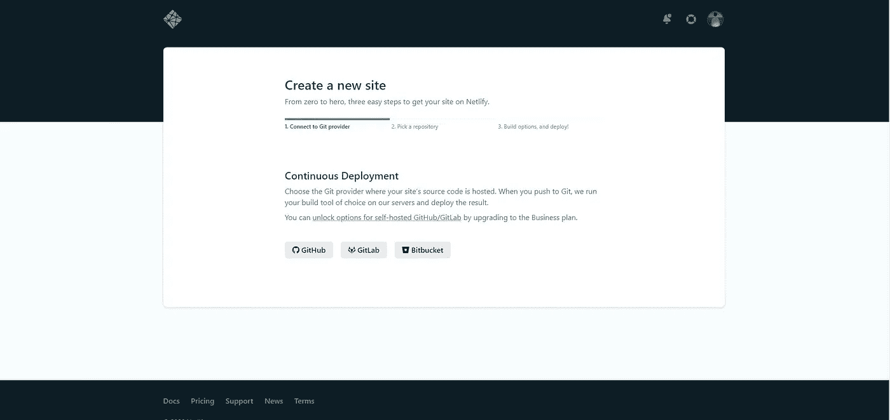
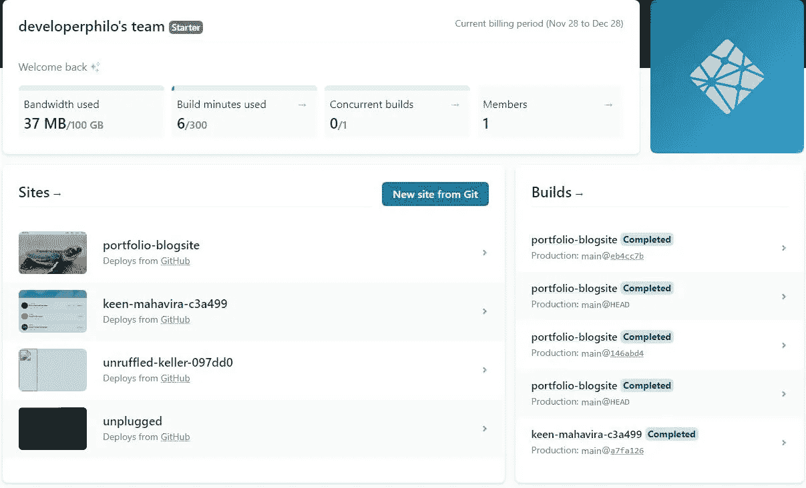
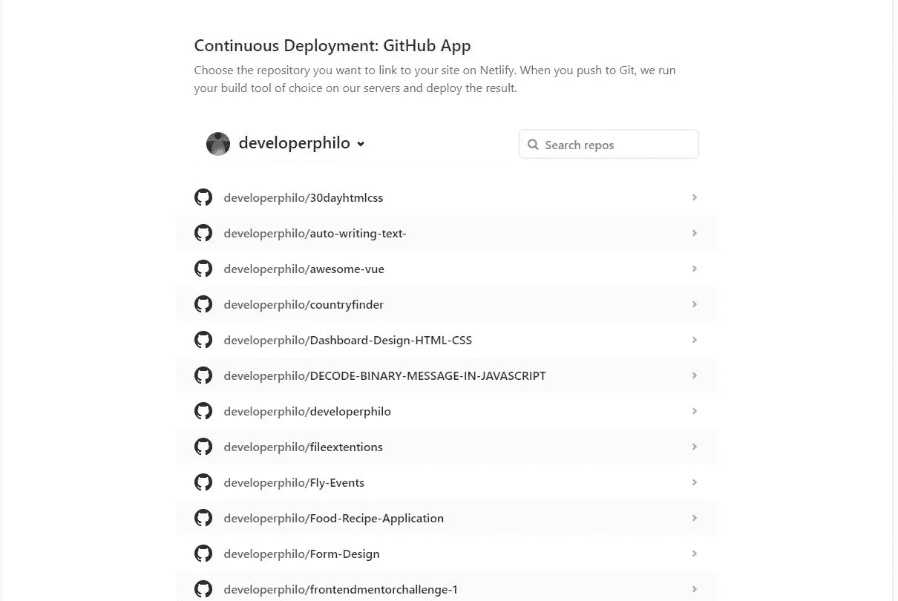
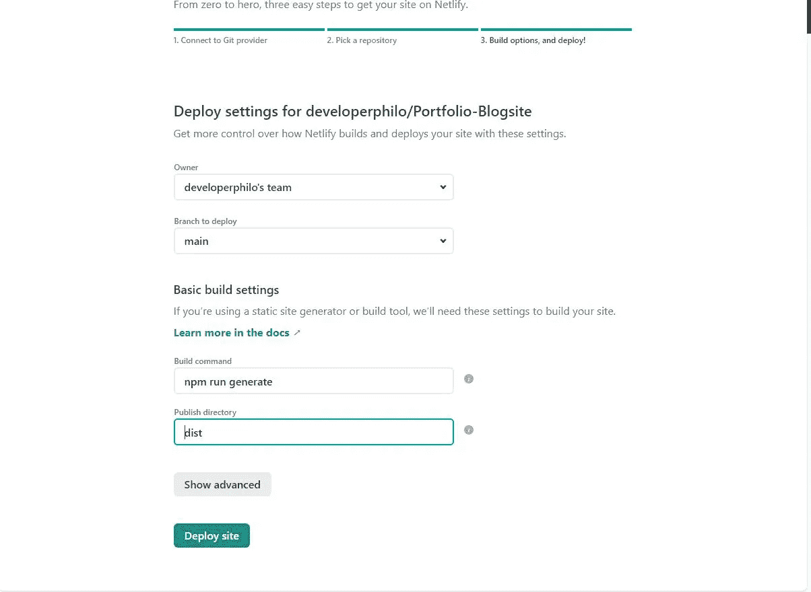
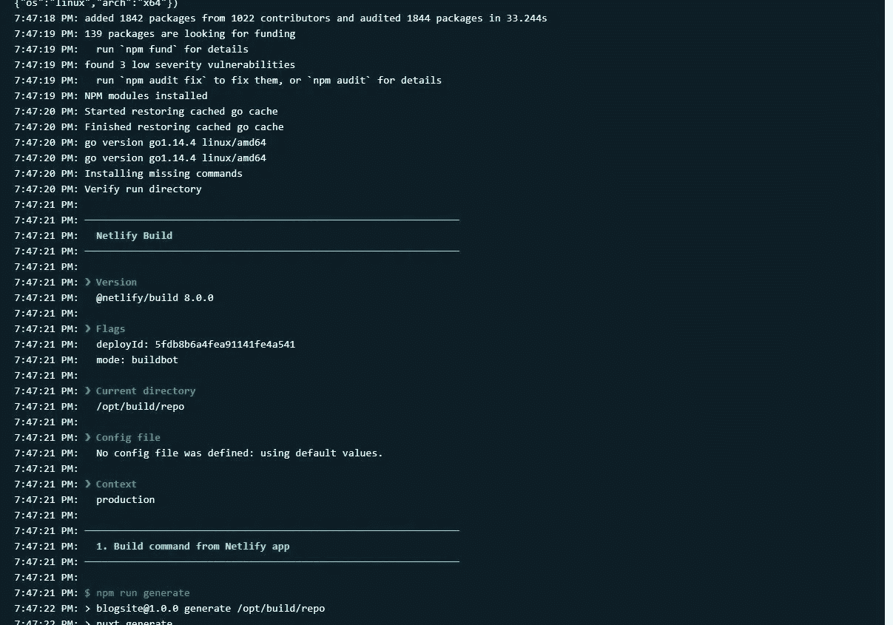
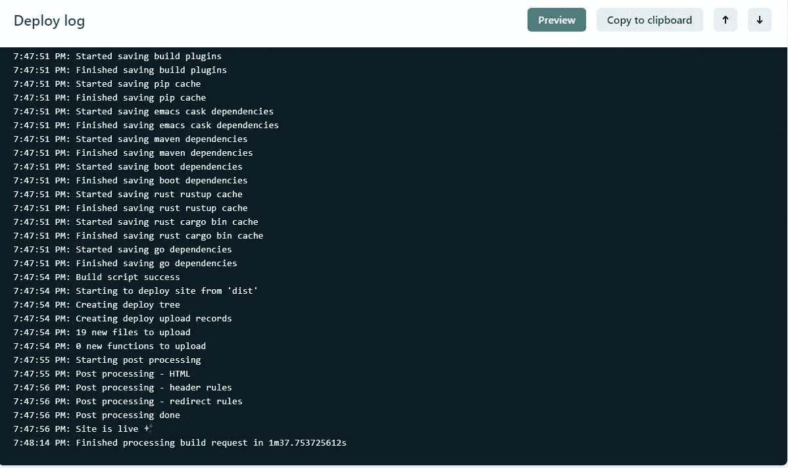

# 将 Nuxt.js 应用程序部署到 Netlify

> 原文：<https://javascript.plainenglish.io/deploy-a-nuxtjs-application-to-netlify-9301099d0c28?source=collection_archive---------4----------------------->

## 如何将静态 Nuxt.js 应用程序部署到 Netlify 的分步指南


Photo by [Markus Winkler](https://unsplash.com/@markuswinkler?utm_source=medium&utm_medium=referral) on [Unsplash](https://unsplash.com?utm_source=medium&utm_medium=referral)

在本文中，我们将探讨如何将一个静态 NuxtJs 应用程序部署到 Netlify。

Netlify 是一个托管网站，提供免费托管和一种更快速的方式来动态构建和部署站点。

我们将从我们的 GitHub 库部署我们的应用程序。

Netlify 非常方便，因为在对我们的应用程序进行更改并将代码推送到 GitHub 之后，我们就可以获得应用程序的更新版本。

首先，我们需要为将要部署到 Netlify 的应用程序创建一个 GitHub 存储库。

创建我们的存储库后，我们需要登录到 [Netlify](https://www.netlify.com/) 网站并链接我们的 GitHub 帐户。

如果您没有 Netlify 帐户，您可以注册并创建一个帐户。然后你登录，你会被提示链接你的 GitHub，GitLab 或者 Bitbucket 账户，如果你有的话。



将 GitHub 帐户链接到 Netlify 后，单击“来自 Git 的新站点”按钮——这将为您提供一个屏幕来选择使用 NuxtJs 应用程序的 GitHub repo。



现在 Netlify 将引导我们进入第二个屏幕，在这里我们将选择包含 NuxtJs 应用程序文件的存储库。

选择您的 Nuxtjs 应用程序存储库并点击它。



在从上一步中选择了存储库之后，Netlify 将提示您进行下一步，根据您的 GIT 配置，它将位于 Nuxt 应用程序文件的根目录或(main 或 master)分支中。

对于我们的静态 Nuxtjs 应用程序，我们使用这个命令

```
npm run generate
```

在 publish 目录中，我们需要指定 dist 文件夹来告诉 Nuxt 服务于这个特定的文件夹，并在那里生成我们所有的应用程序内容。



然后点击 deploy site 按钮，等待 Netlify 生成并构建我们的应用程序。

Nuxtjs 将运行命令并生成我们的应用程序，您将看到一个窗口，上面显示了有关您的应用程序构建过程的信息。



运行完所有这些之后，Netlify 将为您提供另一个屏幕来预览您生成和部署的站点。

点击预览查看您的应用程序。



## **结论**

这是一个关于如何部署静态 Nuxtjs 应用程序的简单指南。

只是回顾一下我们已经看到的。

*   如何将你的 GitHub 账号链接到 Netlify？
*   使用 Netlify 部署静态 Nuxtjs 应用程序。

如果你发现了这篇文章的帮助，请毫不犹豫地分享出来。

你也可以点击这里查看我的[个人资料，获取一些博客文章。](https://amjohnphilip.medium.com/)