# 如何安全地部署 Node.js 应用程序

> 原文：<https://javascript.plainenglish.io/deploy-node-js-app-securely-f508b1f27d25?source=collection_archive---------7----------------------->

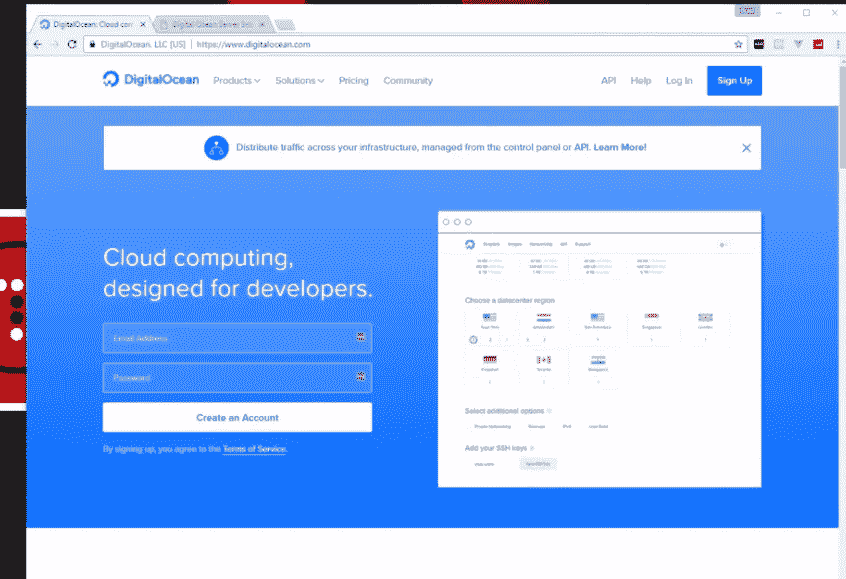

您应该使用 AWS 或 droplet →这些是标准配置→部署是我们应该能够做好的另一件事。(因为这实际上是我们赚钱的方式)。

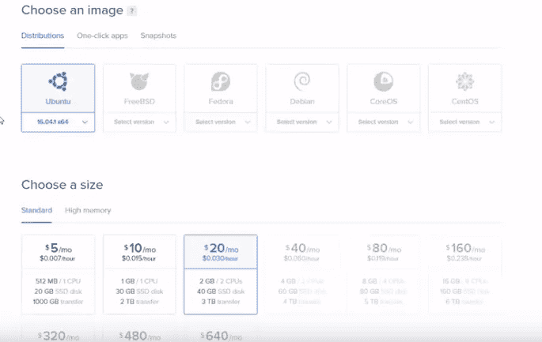

操作系统→以及定价点→这些都是部署的好选择。

为了创建 SSH →我们使用 Putty →这也是解决这些系统的标准方法。(保存公钥和私钥→标准)

服务器设置很容易→甚至监控也很容易。(这个好)。(备份和快照也是可能的)。

在为 Ubuntu 设置用户时，我们也将使用 Nginx 作为服务器。(复制 SSH 可能不是最安全的想法)。

用 NPM 和包安装节点 JS。(他用的是样本 GitHub)。

这里完成了大量的 SSH 配置→并且不确定是否需要所有这些→以及用于文件传输的 WinSCP。(非常有趣的开发管道设置)。

也运行在 80 端口→恐怖的想法。(但是 pm2 是个很好的用途)。

他使用 ENOM 作为域名。

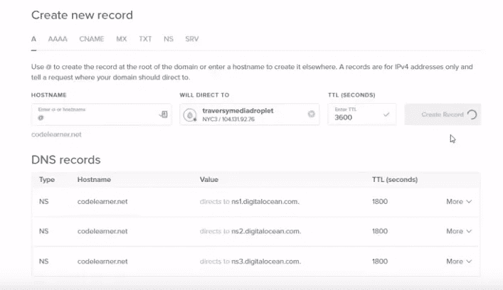

建立记录很容易→其他网站也允许这样做。

使用 80 端口是个糟糕的主意。

他打算用 OpenSSL 和其他东西建立一个更像服务器的服务器。

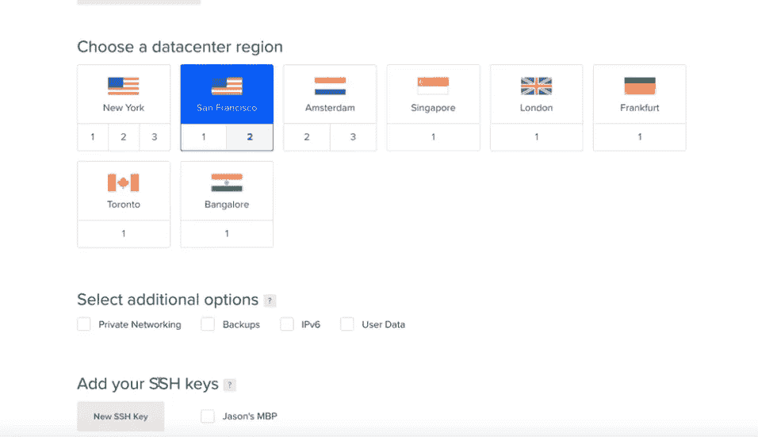

另一个家伙使用数字海洋公关→这是一个很好的服务整体。

安全性→我们将创建一个用户→并删除公共根目标→这是一个好方法→非常安全的方法。

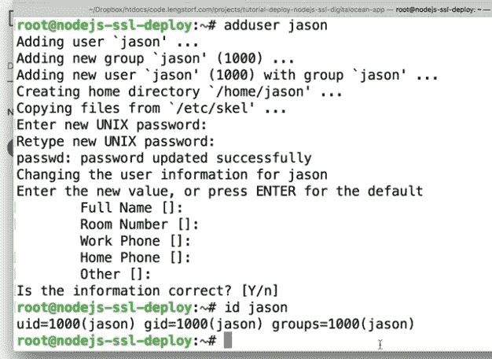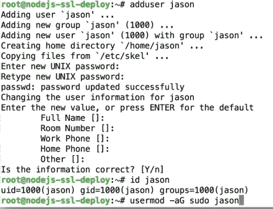

所以现在我们有了我们的超级用户→这是一个非常聪明的举动。

哇，一种非常安全的做事方式→正确设置 SSH 只允许允许的用户进入。(禁用密码登录→仅允许 SSH 登录→智能移动)。

我们不希望人们进行暴力攻击。

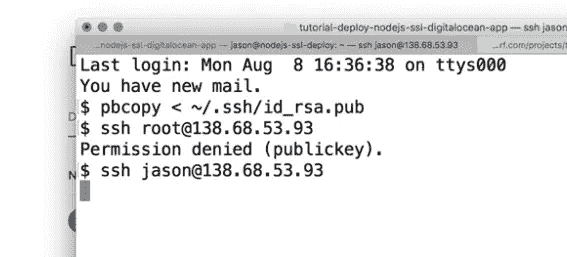

root 登录没了→ ufw →这是调整防火墙→使用这种防火墙可以阻止一些基本的攻击。

超级重要→安全。

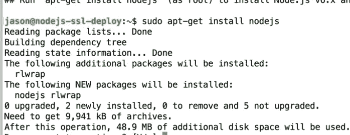

并且我们正在正确地安装 Node JS →这是通过使用 CURL 选项→更合适的安装 Node JS 的方式。

他用 git 进行→实际开发 app。

我们已经运行了应用程序→我们将为流程管理器使用 PM2→现在我们需要为服务器和 OpenSSL 安装 Nginx。

PM2 →在后台运行一切。(甚至可以配置为在系统启动时启动)。

很有意思→他在用 GIT 进行加密→这可能是为了避免使用域名。

证书→做起来其实很烦→但是这个操作可以很轻松的完成→为了安全连接。

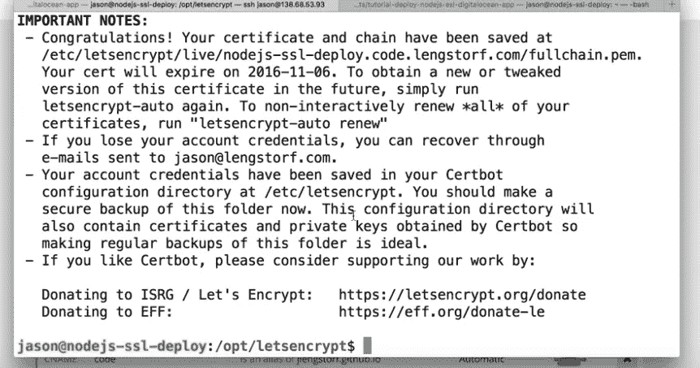

但是他有域名。

这是我们在 2016 年的行事方式→但了解这一点也是一个好主意。

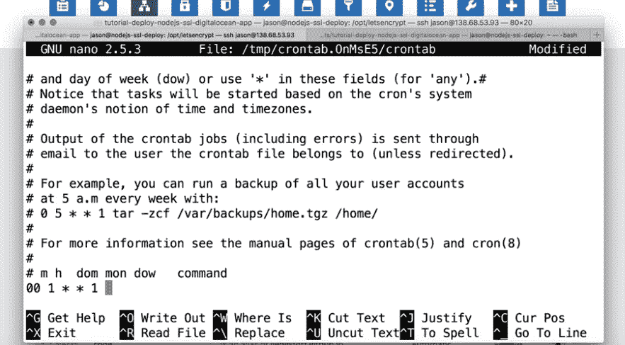

确保 SSL 证书每年更新→以便我们是最新的。(代理→ Nginx)

将流量重定向到节点 js 应用程序→我们将确保连接安全。(我们正在提高我们网站的安全性)

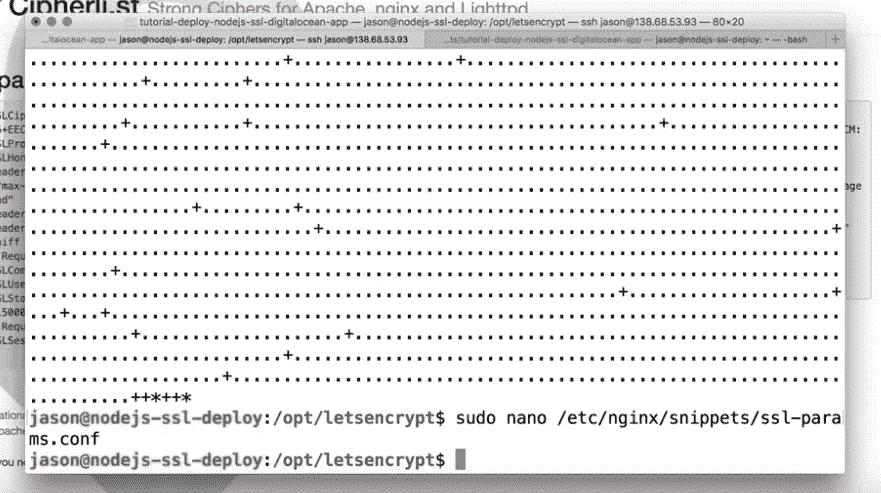

相当复杂的过程→但我们正在让事情变得更安全。

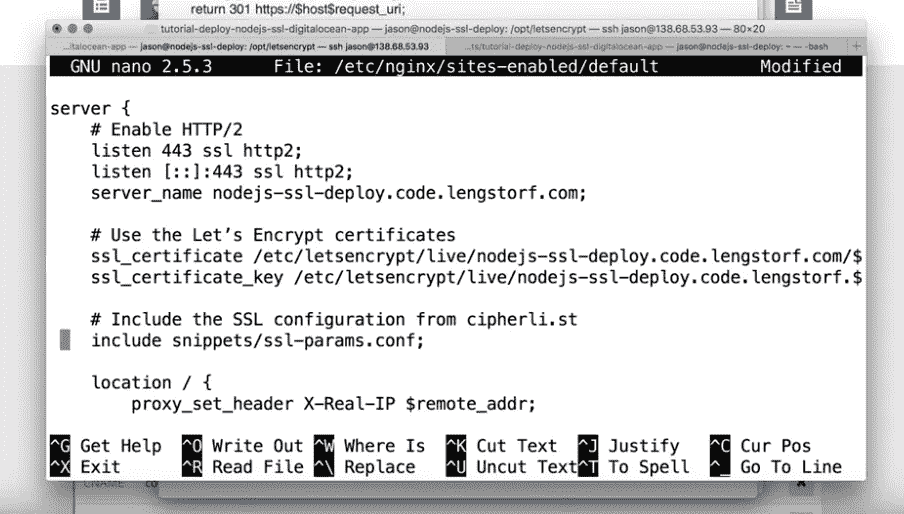

一般过程很容易使用→现在有一个 python 程序为我们做这些。

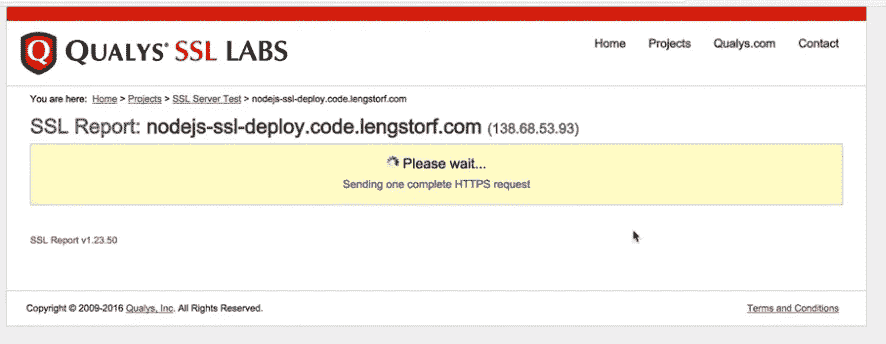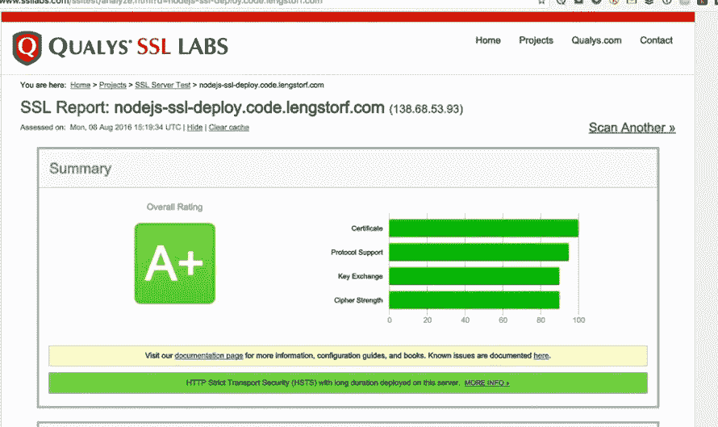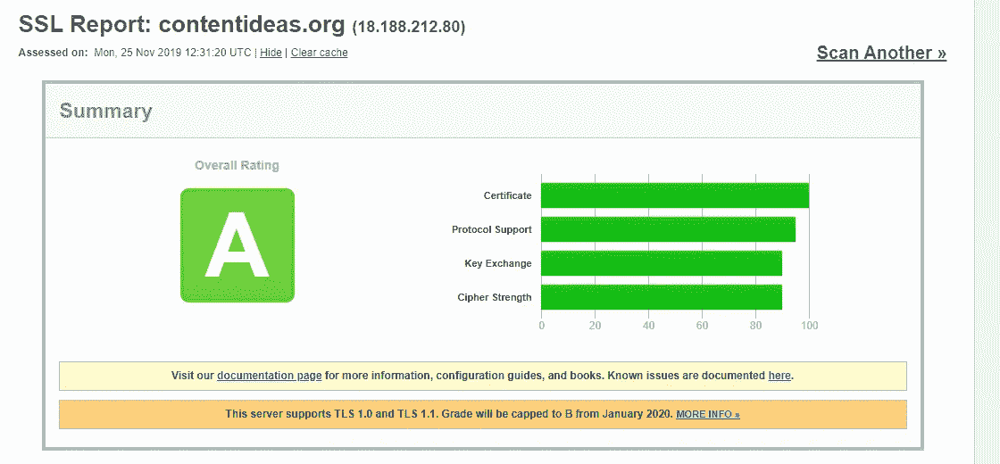 [## 在数字海洋上部署 Node.js/Express 应用程序(第二部分)

### 介绍

blog.cloudboost.io](https://blog.cloudboost.io/deploying-a-node-js-express-application-on-digital-ocean-part-2-573f0b8b8ea4) 

这是另一个关于部署的帖子→一般做法是一样的。

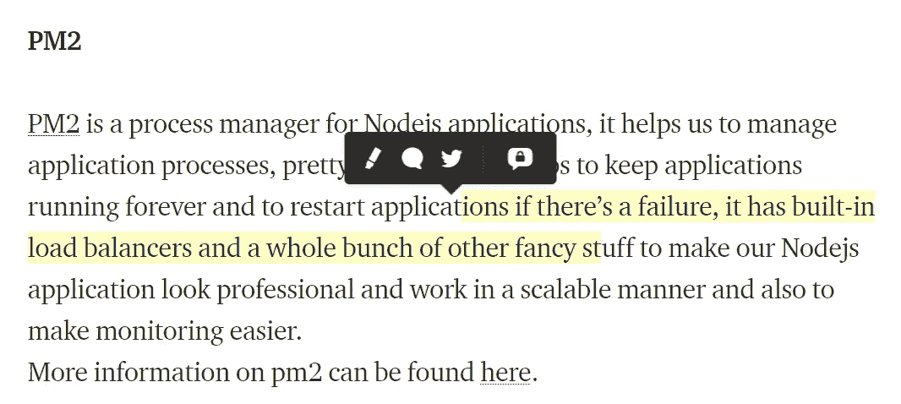

强烈建议在生产服务器期间使用 PM2，因为它会自动管理进程，并在退出或出错时重新启动。

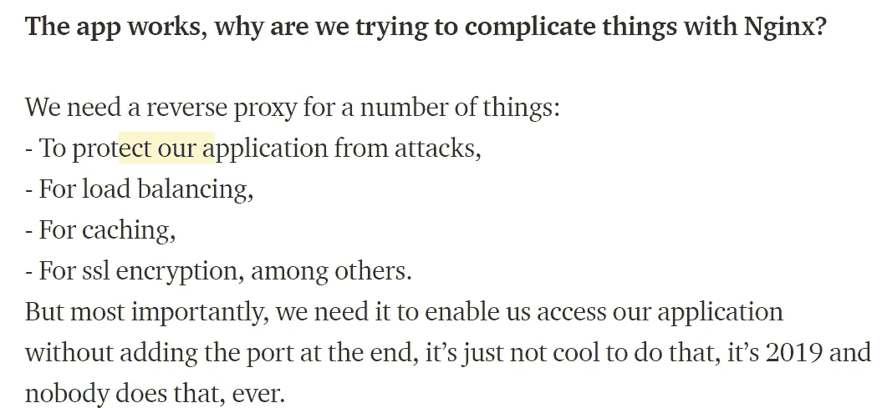

负载平衡和更多→以及 SSL。

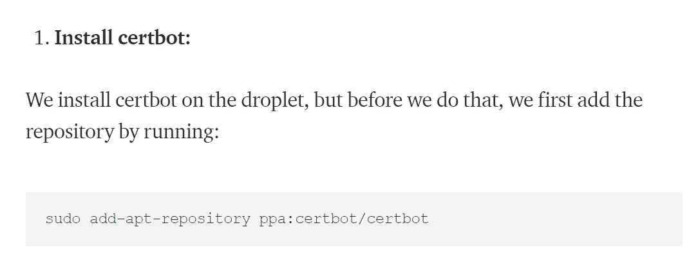

这家伙基本上是从别的网站复制粘贴的→不过 certbot 很棒！

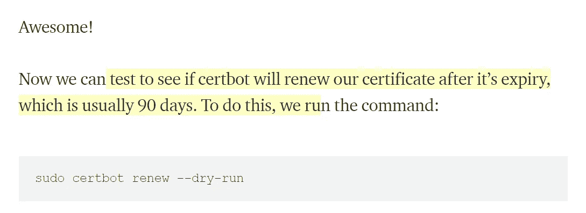

该计划还附带自动续订功能

 [## 节点。JS 并发与 Async/Await 和 Promises！

### 你必须熬过“回调地狱”才能获得“并行的幸福”吗？—嗯，不再是了😉

medium.com](https://medium.com/platformer-blog/node-js-concurrency-with-async-await-and-promises-b4c4ae8f4510) 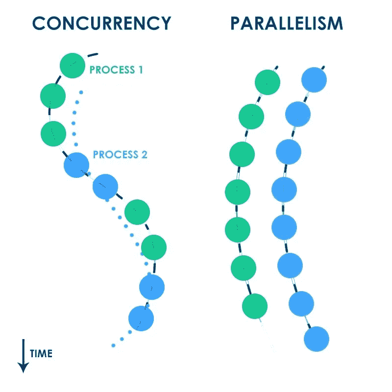

哪个更好？两者都有自己的用例，但是节点 js 使用并发。

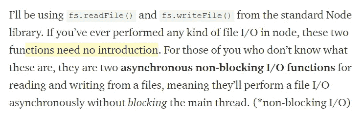

我们将读取文件→同时不阻塞主线程→这很好→因为我们希望用户体验一些东西。

回调地狱真的是一个东西→因为如果我们不能管理这些处理器→我们就不知道会发生什么。

链接承诺→是一种更好的管理代码的方式→这要好得多。

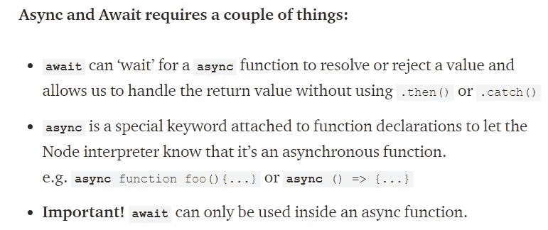