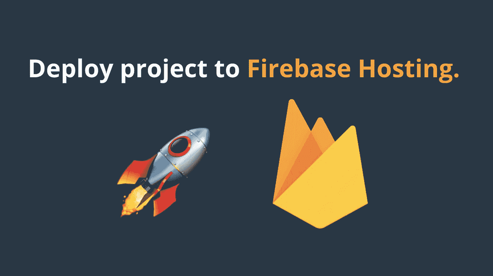

# 如何使用 Firebase 主机部署 Web 应用程序

> 原文：<https://javascript.plainenglish.io/deploy-project-to-firebase-hosting-ce6acbd06435?source=collection_archive---------2----------------------->



用 Firebase **托管**发布你的项目。为了提高性能，创建-生产-构建(如果您正在构建 Angular/PWA/Ionic App)

# 开始前..

**我们需要创建和** [**设置一个 Firebase 项目**](https://medium.com/@AnkitMaheshwariIn/steps-to-setup-firebase-firestore-instruction-to-setup-firebase-firestore-database-c7cc49ce96de) **。**
[点击此处👆](https://medium.com/@AnkitMaheshwariIn/steps-to-setup-firebase-firestore-instruction-to-setup-firebase-firestore-database-c7cc49ce96de)关于设置 Firebase 的步骤(通过 web 在 Firebase Firestore 中创建新数据库。)

> 好了，我假设你已经按照上面的链接↑中的每一步设置了一个 Firebase 项目。

在正确设置了一个 Firebase 项目之后，部署到 Firebase 就变得很容易了。

在部署到 Firebase 之前，我们应该总是准备生产版本。
让我们准备生产构建以提高性能。要这样做，请遵循说明👇👇

如果您正在构建 **Angular App** ，只需在您的命令提示符/终端中运行:

```
ng build --prod
```

*您可能需要将“sudo”放在该命令的开头，以管理员身份执行该命令。或者，如果您是 Windows 用户，只需以管理员身份打开您的命令提示符。*

如果你正在构建 Ionic App ，只需在你的命令提示符/终端中运行:

```
ionic build --prod
```

*您可能需要将“sudo”放在该命令的开头，以管理员身份执行该命令。或者，如果您是 Windows 用户，只需以管理员身份打开您的命令提示符。*

它到底是做什么的？ **— prod** 标志根据类型将整个项目最小化并优化为一个文件。它还会忽略你已经包含但没有使用的插件/导入。

# 伟大的工作👏👏
我们现在准备将我们的项目部署到 Firebase🚀

只需在命令提示符下运行即可部署该应用程序:

```
firebase deploy
```

*您可能需要将“sudo”放在该命令的开头，以管理员身份执行该命令。或者，如果您是 Windows 用户，只需以管理员身份打开您的命令提示符。*

# 搞定了。🤩将项目部署到 Firebase 主机就是这么简单。

再见👋👋

> 请在评论框中随意评论…如果我错过了什么，或者什么是不正确的，或者什么对你不起作用:)
> 
> 更多文章敬请关注:
> [https://medium.com/@AnkitMaheshwariIn](https://medium.com/@AnkitMaheshwariIn)

如果你不介意给它一些掌声👏 👏既然有帮助，我会非常感谢:)帮助别人找到这篇文章，所以它可以帮助他们！

永远鼓掌…

*原载于 2019 年 12 月 24 日*[*【https://www.codewithchintan.com*](https://www.codewithchintan.com/deploy-project-to-firebase-hosting/)*。*

【JavaScript 用简单英语写的一句话:我们总是对帮助推广优质内容感兴趣。如果你有一篇文章想用简单的英语提交给 JavaScript，用你的 Medium 用户名给我们发邮件到[submissions@javascriptinplainenglish.com](mailto:submissions@javascriptinplainenglish.com)，我们会把你添加为作者。