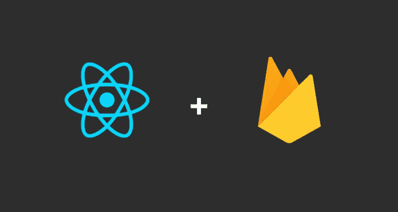
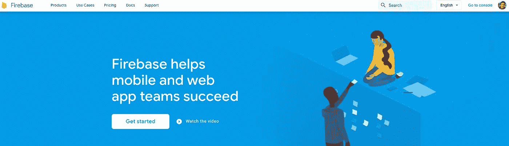
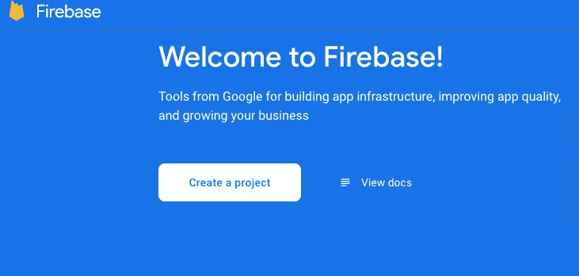
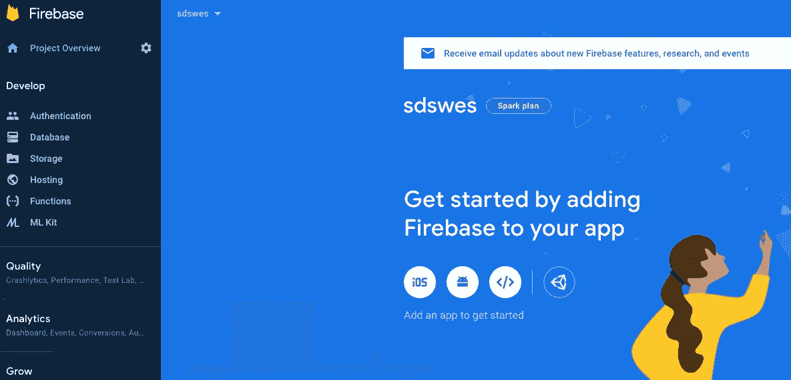
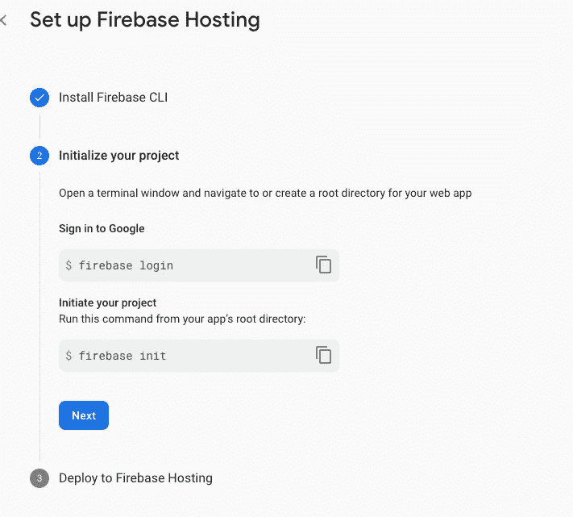
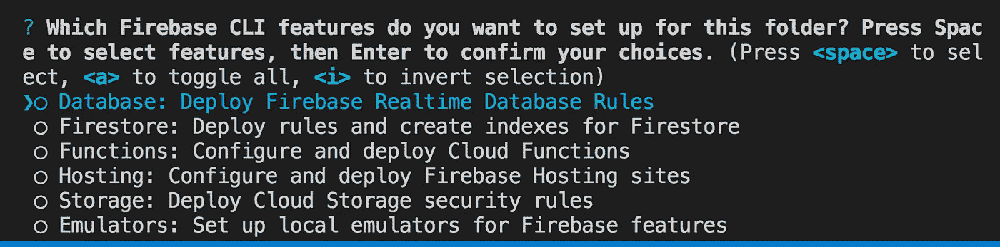
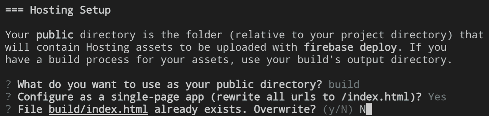
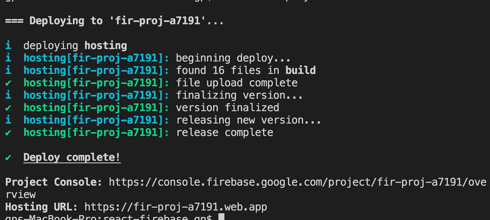

# 使用 Firebase 部署 React 应用程序

> 原文：<https://javascript.plainenglish.io/deploy-react-app-with-firebase-2b44c06fad47?source=collection_archive---------8----------------------->



# 反应模板

**React 模板可从*github(React-Template****分支* ***)*** 获得

[](https://github.com/gpDA/react-firebase/tree/react-template) [## gpDA/react-firebase

### 这个项目是用 Create React App 引导的。在项目目录中，您可以运行:在…中运行应用程序

github.com](https://github.com/gpDA/react-firebase/tree/react-template) 

**您可以克隆存储库并从那里开始**

上面的代码是用 CRA (react-react-app)创建的

```
npm install -g create-react-app
create-react-app react-firebase
```

& `react-router-dom`

```
npm install react-router-dom
```

**样本代码**

# 与 Firebase 集成并使用 Firebase 进行部署

第一步(可选) :创建一个账户

*   如果您没有帐户，请创建一个帐户并登录到主页
*   您可能会看到这样的主页



**步骤 2 创建项目**

*   点击**转到控制台**，它位于您的账户图像的右上方
*   点击**创建一个项目** &按照说明操作(这里没什么特别的)



**步骤 3 点击托管选项**

您将看到这个登录页面



点击位于左侧**开发**导航栏下的**主持**点击**开始**



**步骤 4 安装 Firebase CLI**

*这是步骤 1【安装 Firebase CLI】*

在 react 项目目录的根目录下运行`npm install -g firebase-tools`

**第 5 步反应构建**

在根目录下运行`npm run build`(同上)

*   这将在您的项目根目录下创建一个名为`build`的新文件夹，其中包含所有用于静态托管的 **html、css & javascript** 文件

```
<USEFUL FIREBASE COMMAND>**firebase projects:list :** show all the projects available**firebase use <project_id> :** use / change the project to use
```

**步骤 6 初始化您的项目**

*这是第二步【初始化你的项目】*

*   运行`firebase login`登录谷歌(确保你登录的是你在**firebase.google.com**创建项目时使用的同一个谷歌账户)
*   您将看到登录

```
success! Logged in as <Your gmail>
```

*   运行`firebase init`(这是**最重要的部分|构建部分**)
*   选择**托管(**使用<空格>选择)



*   选择**使用现有项目** &选择您在**firebase.google.com**中创建的<项目名称>
*   选择**建立**作为目录*重要*然后， **Y** & **N**



**第 7 步部署！**

*   你将完成 **Firebase 的初始化！在你的**控制台中&已经有`.firebaserc` & `firebase.json`文件创建了
*   跑`firebase deploy`



*   复制粘贴**托管 URL** ，你终于可以使用 Firebase 托管你的 React web 了


Photo by [Bill Jelen](https://unsplash.com/@billjelen?utm_source=medium&utm_medium=referral) on [Unsplash](https://unsplash.com?utm_source=medium&utm_medium=referral)

> 我的 github 上有完整的代码

[**https://github.com/gpDA/react-firebase/tree/deploying**](https://github.com/gpDA/react-firebase/tree/deploying)

> 如果你有任何问题，请写下评论。谢谢:)

【JavaScript 用简单英语写的一句话:我们总是对帮助推广优质内容感兴趣。如果你有一篇文章想用简单的英语提交给 JavaScript，用你的 Medium 用户名给我们发邮件到[submissions@javascriptinplainenglish.com](mailto:submissions@javascriptinplainenglish.com)，我们会把你添加为作者。