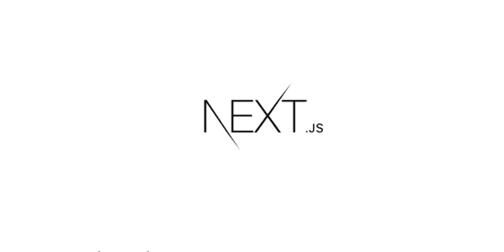
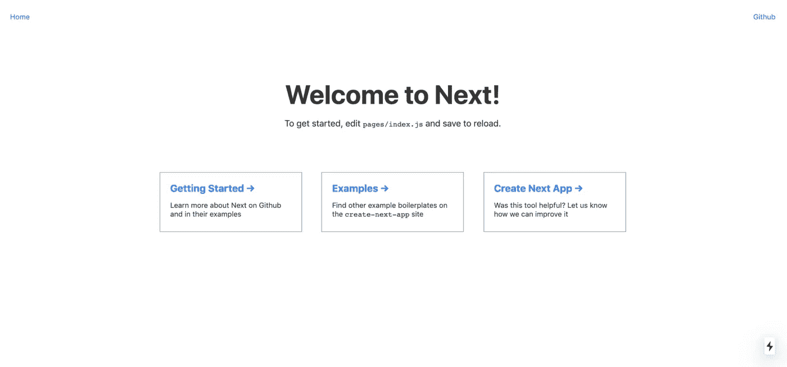
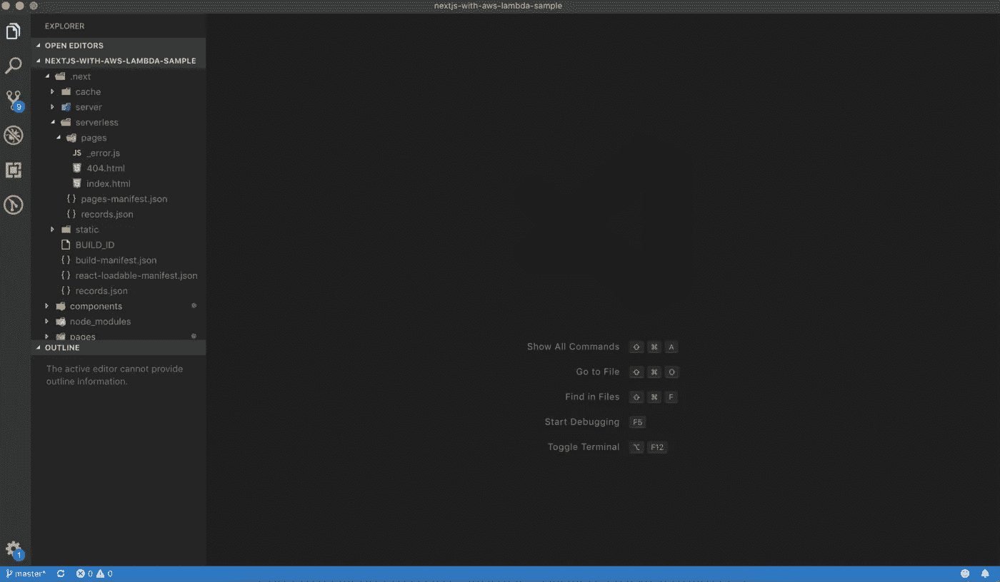
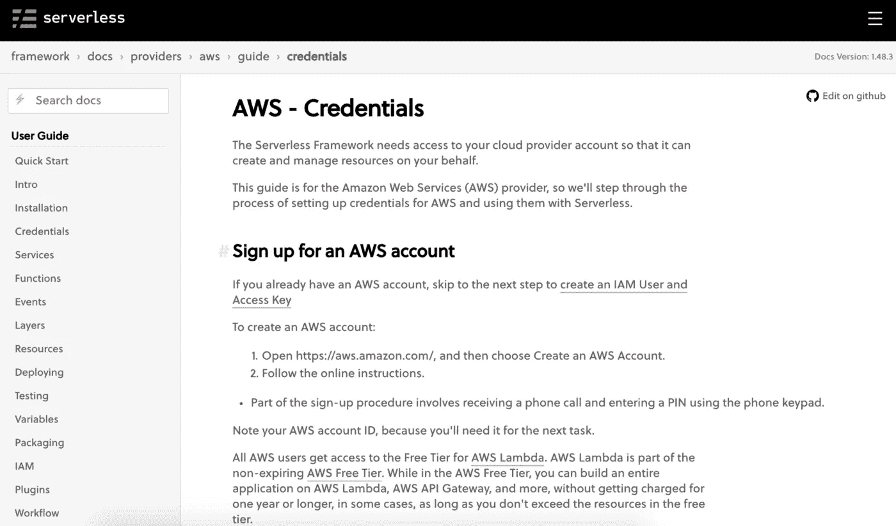
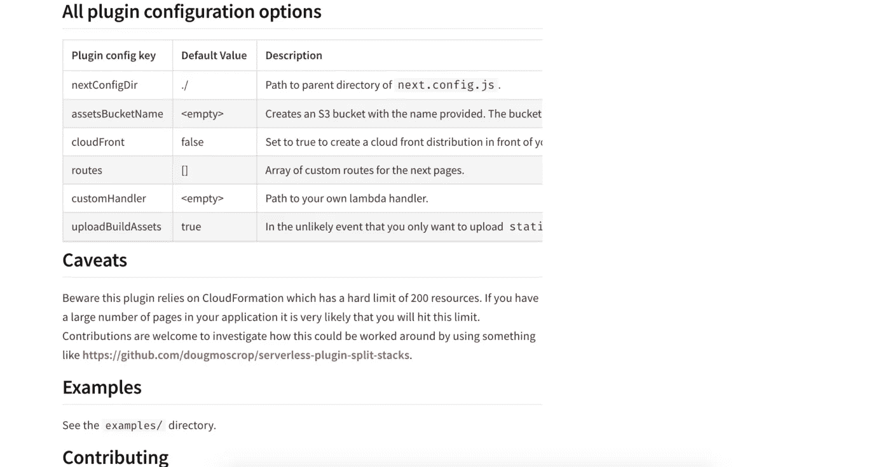
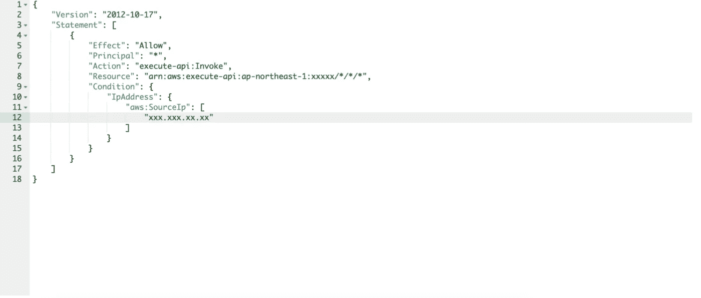

# 使用 Next.js 8、AWS Lambda 和 CircleCI 部署无服务器应用程序

> 原文：<https://javascript.plainenglish.io/deploy-serverless-app-with-next-js-8-aws-lambda-and-circleci-part-1-a0c9c6ea7c57?source=collection_archive---------1----------------------->

## 第 1 部分:使用[无服务器框架](https://serverless.com/)、[无服务器-nextjs-plugin](https://www.npmjs.com/package/serverless-nextjs-plugin) 和 [AWS Lambda](https://aws.amazon.com/lambda/) 函数部署无服务器 Next.js 应用程序。



Next.js

Next.js 宣布在 [v8 版本](https://nextjs.org/blog/next-8#serverless-nextjs)中支持开箱即用的无服务器部署。通过分解成 lambdas 函数，它提高了可靠性和可伸缩性。它提供了按需扩展和“按使用付费”模式的优势。为了简单地测试它，Next.js 给了我们一个很棒的教程[和 Zeit Now 部署，非常简单和容易。但是在本文中，我将介绍 AWS Lambda 的一个部署。](https://blog.hasura.io/build-and-deploy-serverless-apps-with-nextjs-8-zeit-now/)

按照以下步骤进行部署:

*   **设置 Next.js**
*   **安装** `**Serverless**` **框架**
*   **安装**[**server less-nextjs-plugin**](https://www.npmjs.com/package/serverless-nextjs-plugin)
*   **展开**
*   **应用自定义域**
*   **限制 IP 地址**

# 回购示例

以下是完整的代码库:

[](https://github.com/manakuro/nextjs-with-aws-lambda-sample) [## manakuro/nextjs-with-AWS-lambda-sample

### 使用 Next.js 8 和 AWS Lambda-manakuro/nextjs-with-AWS-Lambda-sample 部署无服务器应用程序

github.com](https://github.com/manakuro/nextjs-with-aws-lambda-sample) 

# 设置 Next.js

要快速安装 Next.js 并进行设置，可以使用`create-next-app`。

安装`create-next-app`:

```
$ npm install -g create-next-app
```

安装 Next.js 应用程序:

```
$ create-next-app my-app
```

确保在`package.json`中使用 v8:

```
{
  "name": "my-app",
  "scripts": {
    "dev": "next",
    "build": "next build",
    "start": "next start"
  },
  "dependencies": {
    "next": "^8.1.0",
    "react": "^16.8.6",
    "react-dom": "^16.8.6"
  },
}
```

并启动开发服务器:

```
$ cd my-app
$ yarn dev
```



Welcome page

在`next.config.js`中打开无服务器模式:

```
/* next.config.js */module.exports = {
  target: 'serverless', // <- add here
  webpack: config => {
    // Fixes npm packages that depend on `fs` module
    config.node = {
      fs: 'empty'
    }
    return config
  }
}
```

构建一个 app，你可以看到`.next`中`serverless`的神器是这样的:

```
$ yarn build
```



Artifacts of build

这些是路由到您的应用程序并在 AWS 中作为 Lambda 函数部署的函数。

# 安装`Serverless`框架

可以部署到所有主要的云提供商，如 AWS、GCP 和 Azure，并提供大量 API 进行部署。一个名为`serverless.yml`的配置文件允许您列出您的函数并定义端点。你可以在这里看到 AWS [的文档。](https://serverless.com/framework/docs/providers/aws/guide/intro/)

安装无服务器:

```
$ npm install serverless -g
```

要部署 AWS Lambda，您需要配置 AWS 帐户:

```
$ serverless config credentials --provider aws --key {your access key id} --secret {your secret access key}
```

如果您没有 AWS 帐户，请按照说明在这里注册[。](https://serverless.com/framework/docs/providers/aws/guide/credentials?source=post_page---------------------------#sign-up-for-an-aws-account)



serverless — Sign up for an AWS account

要通过无服务器框架进行部署，请将`serverless.yml`添加到 root:

```
# serverless.ymlservice: ${self:custom.name}provider:
  name: aws
  runtime: nodejs10.x
  stage: ${opt:stage, 'dev'}
  region: ap-northeast-1 // wherever you wantcustom:
  name: my-app
```

# 安装无服务器-nextjs-plugin

Nextjs 8 无服务器模式在 AWS Lambda 上不能开箱即用。您需要为每个无服务器页面手动添加处理程序。但是已经有一个插件叫做`serverless-nextjs-plugin`，它允许你在 Lambda 中处理下一个应用页面，而不需要任何配置。

安装`serverless-nextjs-plugin`:

```
yarn add -D serverless-nextjs-plugin
```

编辑`serverless.yml`并添加:

```
service: ${self:custom.name}provider:
  name: aws
  runtime: nodejs10.x
  stage: ${opt:stage, 'dev'}
  region: ap-northeast-1plugins: # <- add here
  - serverless-nextjs-plugincustom:
  name: my-app
  serverless-nextjs: # <- add here
    assetsBucketName: 'my-app-assets-${self:provider.stage}'package: # <- add here
  # exclude everything
  # page handlers are automatically included by the plugin
  exclude:
    - ./**
```

`assetBucketName`是一个具有所提供名称的 S3 桶。所有插件配置选项都可以在[这里](https://www.npmjs.com/package/serverless-nextjs-plugin#all-plugin-configuration-options)看到。



serverless-nextjs-plugin options

# 部署

现在，您已经准备好部署您的应用程序。

部署:

```
$ serverless deploy -v
```

您可以看到输出:

```
Serverless Nextjs: Started building next app ...
Creating an optimized production build ...Compiled successfully.Page            Size     Files  Packages
┌ ⚡ /           21.1 kB      2         3
├   /_app       2.04 kB      0         3
├   /_document
└   /_error     2.11 kB      0         3Serverless Nextjs: Copying next pages to tmp build folder
Serverless Nextjs: Found 3 next page(s)
Serverless Nextjs: Creating compat handler for page: 404.js
Serverless Nextjs: Creating compat handler for page: _error.js
Serverless Nextjs: Creating compat handler for page: index.js
Serverless: Packaging service...
Serverless: Excluding development dependencies...
Serverless Nextjs: Cleaning up tmp build folder ...
Serverless Nextjs: Found bucket "my-app-assets-dev" from serverless.yml
Serverless Nextjs: Proxying NextJS assets -> [https://s3-ap-northeast-1.amazonaws.com/my-app-assets-dev/_next/{proxy](https://s3-ap-northeast-1.amazonaws.com/my-app-assets-dev/_next/{proxy)}
Serverless Nextjs: Proxying static files -> [https://s3-ap-northeast-1.amazonaws.com/my-app-assets-dev/static/{proxy](https://s3-ap-northeast-1.amazonaws.com/my-app-assets-dev/static/{proxy)}
Serverless: Creating Stack...
Serverless: Checking Stack create progress...
CloudFormation - CREATE_IN_PROGRESS - AWS::CloudFormation::Stack - my-app-dev
CloudFormation - CREATE_IN_PROGRESS - AWS::S3::Bucket - NextStaticAssetsS3Bucket
CloudFormation - CREATE_IN_PROGRESS - AWS::S3::Bucket - ServerlessDeploymentBucket
CloudFormation - CREATE_IN_PROGRESS - AWS::S3::Bucket - NextStaticAssetsS3Bucket
CloudFormation - CREATE_IN_PROGRESS - AWS::S3::Bucket - ServerlessDeploymentBucket
CloudFormation - CREATE_COMPLETE - AWS::S3::Bucket - NextStaticAssetsS3Bucket
CloudFormation - CREATE_COMPLETE - AWS::S3::Bucket - ServerlessDeploymentBucket
CloudFormation - CREATE_COMPLETE - AWS::CloudFormation::Stack - my-app-dev
...Nextjs Application InfoApplication URL: [https://xxxxx.execute-api.ap-northeast-1.amazonaws.com/dev](https://97jal1fbld.execute-api.ap-northeast-1.amazonaws.com/dev)
```

应用程序 URL([https://xxxxx.execute-api.ap-northeast-1.amazonaws.com/dev](https://xxxxx.execute-api.ap-northeast-1.amazonaws.com/dev?source=post_page---------------------------))是您的应用程序 URL。

如果您想完全删除它，请使用:

```
$ serverless remove
```

并确保移除 S3 桶:

```
$ aws s3 rb s3://my-app-assets-dev --force
```

# 应用自定义域

现在您注意到部署的应用程序 URL 只是一个随机的名称，如`[https://xxxxx.execute-api.ap-northeast-1.amazonaws.com/](https://97jal1fbld.execute-api.ap-northeast-1.amazonaws.com/dev)`。如果您想使用自定义域名，您可以创建自己的域，并使用[server less-domain-manager](https://www.npmjs.com/package/serverless-domain-manager)将其应用于无服务器框架。

您可能还想部署不同的环境，比如，`staging`和`production`。为了处理它，使用一个子域，最后你希望它们像这样:

*   `https://staging.mydomain.com` //用于暂存环境
*   `https://mydomain.com` //针对生产环境

在转到下一步之前，请按照说明创建您的域并申请证书:

*   [如何用无服务器为 Lambda & API 网关设置自定义域名](https://serverless.com/blog/serverless-api-gateway-domain/)

让我们假设您在本文中使用了一个名为`mydomain.me`的域名。

安装`serverless-domain-manager`:

```
$ yarn add -D serverless-domain-manager
```

编辑`serverless.yml`:

```
service: ${self:custom.name}provider:
  name: aws
  runtime: nodejs10.x
  stage: ${opt:stage, 'staging'}
  region: ap-northeast-1plugins:
  - serverless-nextjs-plugin
  - serverless-domain-manager # <- add herecustom:
  name: my-app
  serverless-nextjs:
    assetsBucketName: 'my-app-assets-${self:provider.stage}'
  customDomain: # <- add here
    domainName: '${self:provider.stage}.mydomain.me'
    certificateName: '*.mydomain.me'
    basePath: ''
    stage: ${self:provider.stage}
    createRoute53Record: truepackage:
  # exclude everything
  # page handlers are automatically included by the plugin
  exclude:
    - ./**
```

`domainName`和`certificateName`应该适用于你的领域。如果创建一个名为`yourdomain.me`的域，应该是这样的:

```
customDomain:
    domainName: '${self:provider.stage}.yourdomain.me'
    certificateName: '*.yourdomain.me'
    basePath: ''
    stage: ${self:provider.stage}
    createRoute53Record: true
```

创建`staging`域:

```
$ serverless create_domain --stage staging...
Serverless: 'staging.mydomain.me' was created/updated. New domains may take up to 40 minutes to be initialized.
```

40 分钟后，您可以部署一个`staging`环境:

```
$ serverless deploy -v --stage staging
```

很好。现在您可以访问`https://staging.mydomain.me`。

`serverless.yml`可以根据[指南](https://serverless.com/framework/docs/providers/aws/guide/variables/)拆分成各个环境文件以便维护。所以你可以这样分割它:

*   `serverless.staging.yml`
*   `serverless.production.yml`

创建`serverless.staging.yml`:

```
# serverless.staging.ymlcustom:
  customDomain:
    domainName: '${self:provider.stage}.mydomain.me'
    certificateName: '*.mydomain.me'
    basePath: ''
    stage: ${self:provider.stage}
    createRoute53Record: true
```

并编辑`serverless.yml`:

```
# serverless.ymlservice: ${self:custom.name}provider:
  name: aws
  runtime: nodejs10.x
  stage: ${opt:stage, 'staging'}
  region: ap-northeast-1plugins:
  - serverless-nextjs-plugin
  - serverless-domain-managercustom:
  name: my-app
  serverless-nextjs:
    assetsBucketName: 'my-app-assets-${self:provider.stage}'
  customDomain: ${file(./serverless.${self:provider.stage}.yml):custom.customDomain} # <- add herepackage:
  # exclude everything
  # page handlers are automatically included by the plugin
  exclude:
    - ./**
```

创建`serverless.production.yml`:

```
# serverless.production.ymlcustom:
  customDomain:
    domainName: 'mydomain.me'
    basePath: ''
    stage: ${self:provider.stage}
    createRoute53Record: true
```

生产中的`domainName`应该是`mydomain.me`，不再需要`certificateName`。

让我们部署`production`环境。创建域:

```
$ serverless create_domain --stage production...
Serverless: 'mydomain.me' was created/updated. New domains may take up to 40 minutes to be initialized.
```

40 分钟后，您可以部署一个`production`环境:

```
$ serverless deploy -v --stage production
```

现在你可以访问`https://mydomain.me`。

## 限制 IP 地址

您可以使用 API Gateway 中的资源策略来控制对您的应用程序的访问，AWS [网站](https://aws.amazon.com/jp/blogs/compute/control-access-to-your-apis-using-amazon-api-gateway-resource-policies/)上有很好的描述。`Serverless framework`支持。

将`resourcePolicy`添加到`serverless.yml`:

```
service: ${self:custom.name}provider:
  name: aws
  runtime: nodejs10.x
  stage: ${opt:stage, 'staging'}
  region: ap-northeast-1
  resourcePolicy: ${file(./serverless.${self:provider.stage}.yml):resourcePolicy} // <- add here...
```

像这样给每个环境添加`resourcePolicy`:

```
# serverless.staging.ymlresourcePolicy:
  - Effect: Allow
    Principal: "*"
    Action: execute-api:Invoke
    Resource:
      - execute-api:/*/*/*
    Condition:
      IpAddress:
        aws:SourceIp:
          - "xxx.xxx.xxx.xx"
```

`aws:SrouceIp`是您可以访问的特定 IP 地址范围的白名单。部署后，API 网关控制台中将有资源策略:



API Gateway console

## 结论

第一部分到此为止。至此，您应该已经学会:

*   Setup Next.js
*   通过无服务器框架部署应用
*   创建自定义域
*   限制 IP 地址

在下一部分中，我们将介绍使用 CircleCI 部署 CI。

[](https://medium.com/@manakuro/deploy-serverless-app-with-next-js-8-aws-lambda-and-circleci-part-2-60cfc8c36c86) [## 使用 Next.js 8、AWS Lambda 和 CircleCI 部署无服务器应用程序—第 2 部分

### 使用无服务器框架、无服务器-nextjs-plugin 和 AWS Lambda 函数部署无服务器 Next.js 应用程序…

medium.com](https://medium.com/@manakuro/deploy-serverless-app-with-next-js-8-aws-lambda-and-circleci-part-2-60cfc8c36c86) 

你可以在这里看到最终的代码库:

[](https://github.com/manakuro/nextjs-with-aws-lambda-sample) [## manakuro/nextjs-with-AWS-lambda-sample

### 使用 Next.js 8 和 AWS Lambda-manakuro/nextjs-with-AWS-Lambda-sample 部署无服务器应用程序

github.com](https://github.com/manakuro/nextjs-with-aws-lambda-sample)