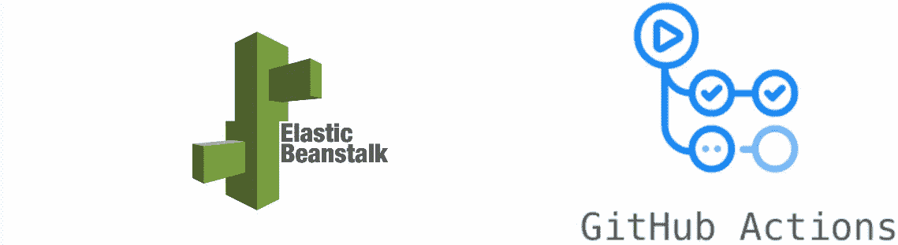
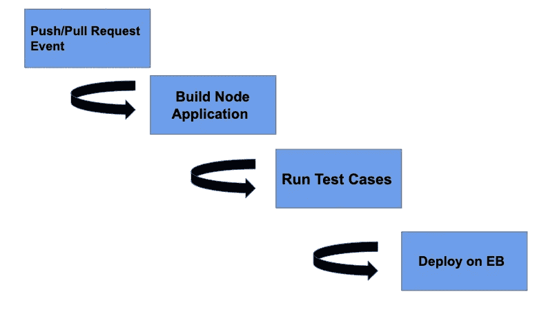
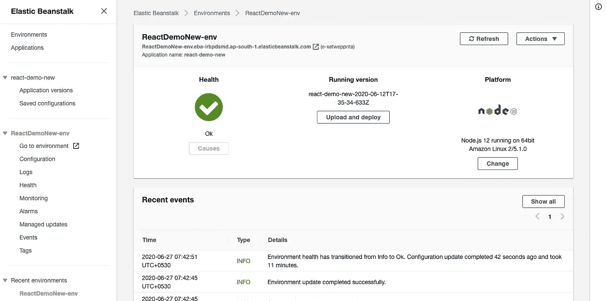
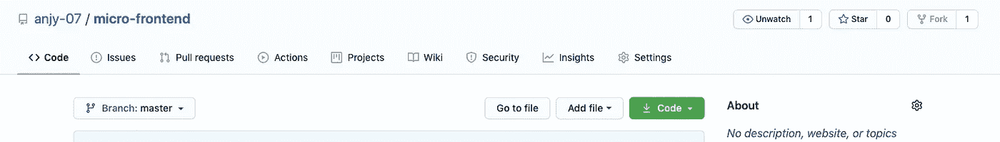
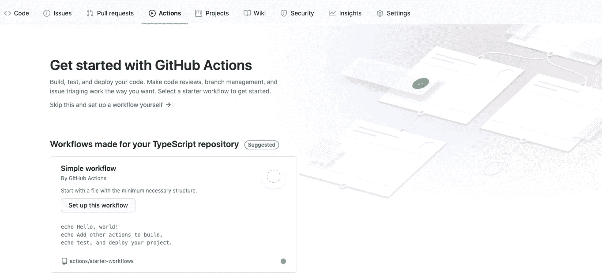
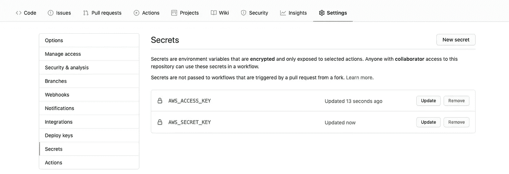
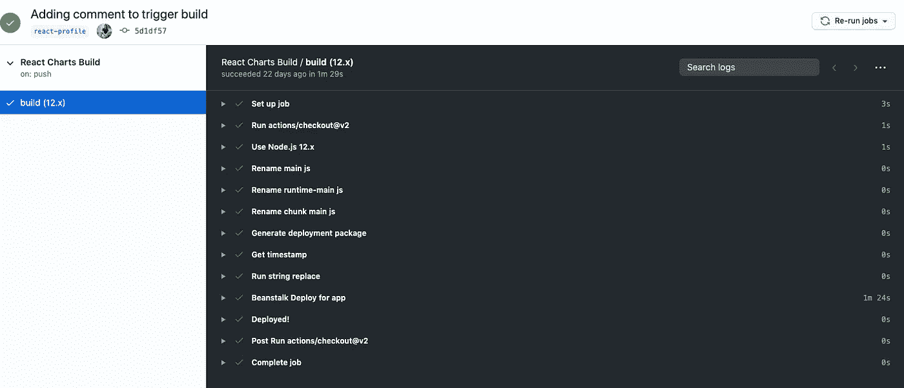

# 在 AWS Elastic BeanStalk 上使用 Github 操作进行部署

> 原文：<https://javascript.plainenglish.io/deploy-using-github-actions-on-aws-elastic-beanstalk-c23ecd35776d?source=collection_archive---------2----------------------->



在本文中，我们将介绍使用 Github 操作在 AWS Elastic BeanStalk 上部署节点应用程序的过程。

虽然我一直在使用 TravisCI 进行部署，但是当我开始使用 Github Actions 时，我觉得已经没有回头路了。Github 动作让你的 web 应用程序的部署变得超级简单❤.

## 什么是弹性豆茎？

AWS Elastic Beanstalk 是一个编排服务，它抽象出一些硬件资源和细节(例如设置 AWS 组件和容器)，同时仍然允许开发人员在操作系统和编程语言方面有一系列选择。Elastic Beanstalk 采用自动扩展和弹性负载平衡来扩展和平衡工作负载。它以 Amazon [CloudWatch](https://aws.amazon.com/cloudwatch/) 的形式提供工具来监控部署的应用程序的健康状况。由于依赖 AWS S3 和 EC2，它还提供容量配置。

您所要做的就是上传您的应用程序代码，而 Elastic Beanstalk 会负责部署、负载平衡和容量供应。只需一次点击，您就可以启动所有必要的应用服务器运行。Elastic Beanstalk 服务本身是免费的，只对您实际使用的 AWS 资源收费。

## 什么是 Github 动作？

GitHub 动作让你有可能直接从 GitHub 库自动化你的软件开发工作流程。换句话说，`you will be able to initiate the deployment of your application from the same place where your code is stored.`

Github Actions 的另一个伟大特性是，工作流可以在 Github 托管的机器上的 Linux、macOS、Windows 和容器中运行。Github Actions 完全支持 Elastic Beanstalk web 应用程序，因此您可以直接从存储库中部署您的应用程序。

我们在本文中试图实现的管道是:



CI/CD Pipeline

有了适当的操作，您就可以启动诸如无缝构建和部署 Docker 容器之类的功能。当您将操作组合到工作流中时，事件可以触发一系列复杂的流程以并行顺序运行，从而实现更具响应性的体系结构。

> 自动化您从创意到生产的工作流程。

# 入门指南

[Elastic Beanstalk](https://aws.amazon.com/elasticbeanstalk/) 会在我们创建应用程序时自动为我们创建一个 [EC2](https://aws.amazon.com/ec2/) 实例，这是我们的 Node.js 服务器托管的地方。

## **设置弹性豆茎环境的步骤:**

1.  为了设置弹性 BeanStalk 环境，我建议您阅读[配置 EB 环境的分步指南](http://bit.ly/deploy-angular-application-on-aws-beanstalk)直到步骤#9，您可以跳过负载平衡器步骤或观看 AWS 的视频。
2.  为了提高性能，您可以将代理服务器配置为从 web 应用程序内的一组目录中提供静态文件(例如，HTML 或图像)。为了在 EB 上统计部署您的节点应用程序，您需要添加*。ebextensions/deploy.config 文件:*

遵循[此](https://docs.aws.amazon.com/elasticbeanstalk/latest/dg/environment-cfg-staticfiles.html)获取更多信息，以静态方式提供您的文件。

一旦设置了 Beanstalk 环境，您还可以在每次构建后在 EB 控制台中监控环境的健康状况:



## **构建项目的步骤:**

1.  安装依赖项来静态地服务于您的节点应用程序。

```
npm i serve --save
```

2.在节点应用程序的生产文件夹中，确保更改`package.json`文件中的`start`脚本。

```
"scripts": {
    "start": "serve -s build",
}
```

如果你给它起了别的名字，用你的主服务器文件替换`server.js`。这太有弹性了，Beanstalk 知道使用哪个文件来启动您的服务器。

## **创建您的 Github Actions 工作流的步骤:**

1.  进入你的 GitHub 库，点击**动作**标签按钮。



2.点击**右上角的**按钮建立自己的工作流程，如下图所示。



3.在编辑器中粘贴下面的代码片段并点击右上角的**开始提交**按钮。添加一些提交消息并点击**提交新文件按钮。我已经添加了注释来解释这个工作流程的每个步骤。**

这里，`push and pull request events`触发了这个工作流，但是我们也可以让它在各种[其他事件](https://docs.github.com/en/actions/reference/events-that-trigger-workflows#webhook-events)上触发。

4.在你机器上的 IDE 中打开你的项目，从`master`分支中提取更新的代码。

5.现在，转到您的存储库的**设置**选项卡，并在侧边菜单上选择**机密。**秘密是您的私有值，如 AWS 秘密密钥和访问密钥，它们不应该直接出现在您的代码中。

6.点击**添加新秘密**按钮，添加您的 AWS 秘密密钥和访问密钥，推荐名称为`AWS_ACCESS_KEY`和`AWS_SECRET_KEY.`



如果您成功配置了所有内容，您的工作流应该如下所示:



Output of the pipeline

就是这样，用 Github 动作为您的节点项目创建您自己的 CI/CD 管道就这么简单。您只需要创建一个工作流文件来在云上部署您的节点项目。

您可以在以下位置找到工作流和 EB 配置文件:

[](https://github.com/anjy-07/micro-frontend/tree/master/react-charts) [## anjy-07/微前端

### 演示微前端原理的简单 Github 仪表板…

github.com](https://github.com/anjy-07/micro-frontend/tree/master/react-charts)