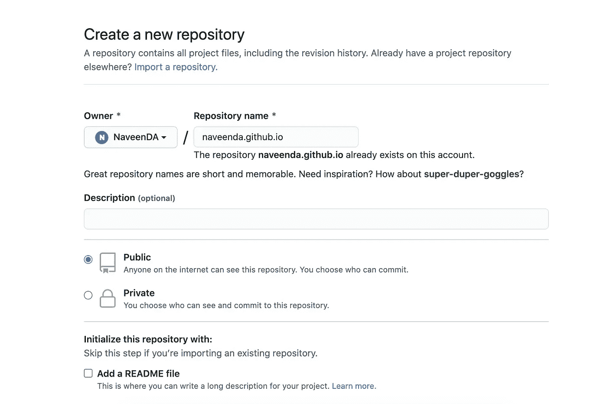
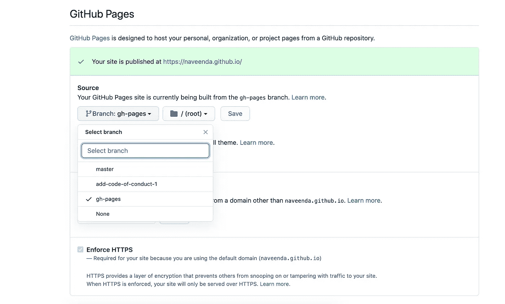
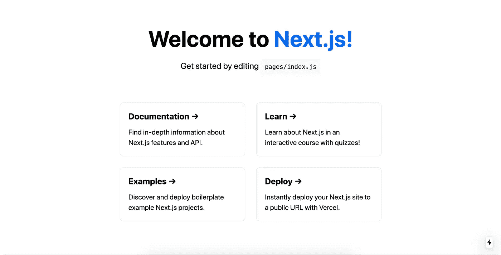
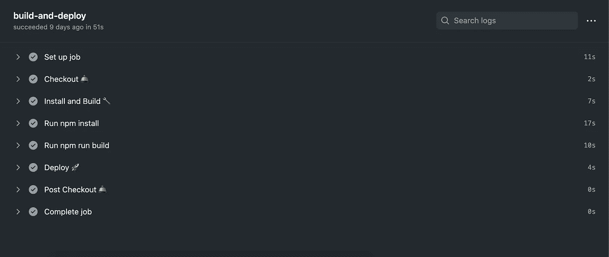
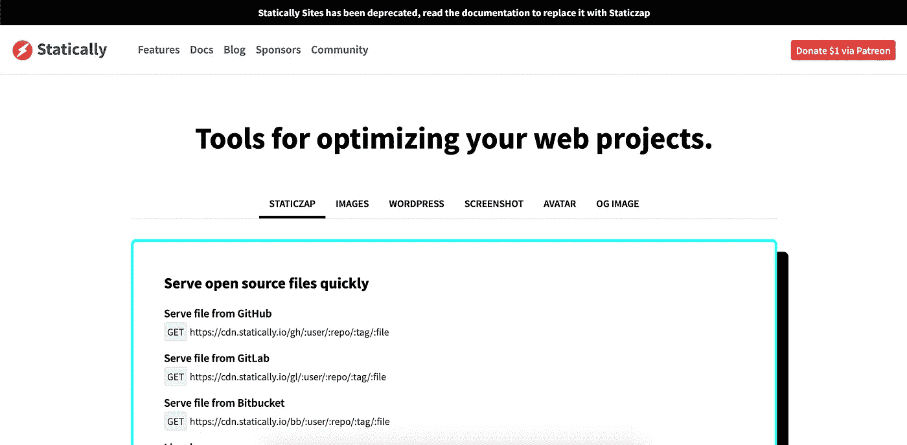

# 使用 GitHub 操作在 GitHub 页面上部署 Next.js 应用程序

> 原文：<https://javascript.plainenglish.io/deploy-your-next-js-app-on-github-pages-using-the-github-action-525271137409?source=collection_archive---------1----------------------->


## 快速小结

我在 Github 页面上使用 next.js 开发我的投资组合，我在部署项目时遇到了一些问题。所以我决定写博客来帮助别人。

## **链接**

投资组合:[https://naveenda.github.io/](https://naveenda.github.io/)

源代码:【https://github.com/NaveenDA/naveenda.github.io 


## 让我们开始这个项目吧

1.  创建一个包含您的 Github 用户名和`.github.io`的 Github repo。
    比如我的 GitHub 用户名是 NaveenDA，我的回购名是`naveenda.github.io`



2.转到 repo 的设置，向下滚动到 Github 页面部分。选择`gh-pages`作为分支，选择`root`作为文件夹，然后点击保存按钮。



3.使用以下命令在您的本地计算机上克隆此存储库

```
git clone https://github.com/yourname/yourname.github.io.git
```

5.使用`create-next-app`创建 next.js app

```
npx create-next-app src
```

它将创建一个`src`目录并生成所需的文件夹。

6.转到`src`目录并运行这个命令`npm run dev`，它将在`http://localhost:3000`上运行我们的应用程序

现在你可以看到这一页。



我们将部署此页面。

7.提交此代码并推送到服务器。

```
git add .
git commit -m "Initial Project Setup"
git push
```

8.现在，每当我们在主分支上推一些东西并部署构建`github-pages`时，我们都需要创建下一个构建。因此我们将使用 [Github 动作](https://github.com/features/actions)


[https://github.com/features/actions](https://github.com/features/actions)

9.在您的 repo 根目录中创建`.github`目录

10.在`.github`目录下创建`workflows`目录，并创建文件`intergrate.yml`

11.将此代码粘贴到`intergrate.yml`文件中。

12.提交此代码并推送到服务器

```
git add .
git commit -m "Add github Actions"
git push
```

13.转到 Github repo 中的 action 选项卡，现在你可以看到正在运行的 Github 操作。



14.现在转到网址`https://username.github.io`

15.现在看到一些 404 错误

16.出于某种原因(我不知道)，Github 服务器将`_next`目录内的一个文件作为 404 响应。为了解决这个问题，我们需要一个 CDN 来服务静态文件。所以我们打算静态地使用



[https://statically.io/](https://statically.io/)

17.在我们的`src`目录中创建一个名为`next.config.js`的文件，粘贴这段代码并用我的替换你的 repo URL。

18.现在提交这段代码并推送到服务器

```
git add .
git commit -m "Add CDN"
git push
```

等到 Github 动作完成部署，然后导航到 URL[https://username . Github . io](https://username.github.io)

19.我开玩笑的，没有第 19 步。我们做到了！

**感谢您的阅读！**如果你喜欢这篇文章，可以考虑[在 Twitter 上关注我](https://twitter.com/NaveenDA_)，并与你的开发者朋友分享这篇文章🐋😀