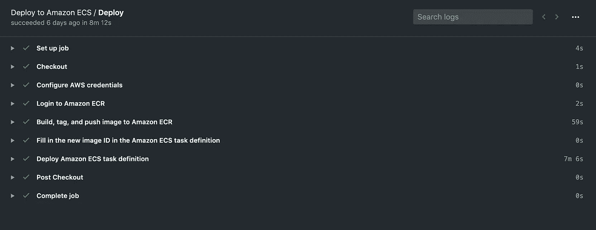
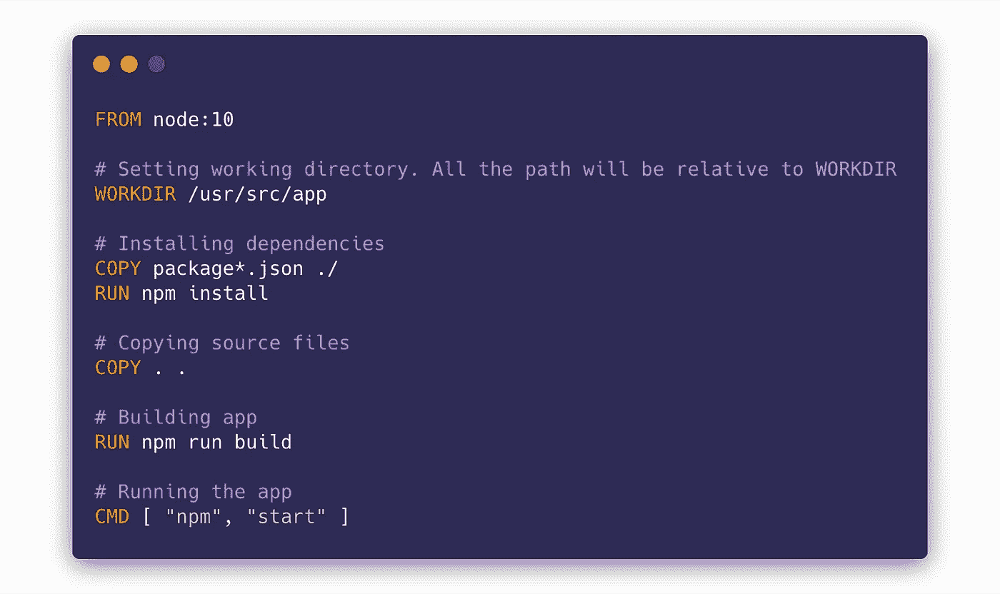
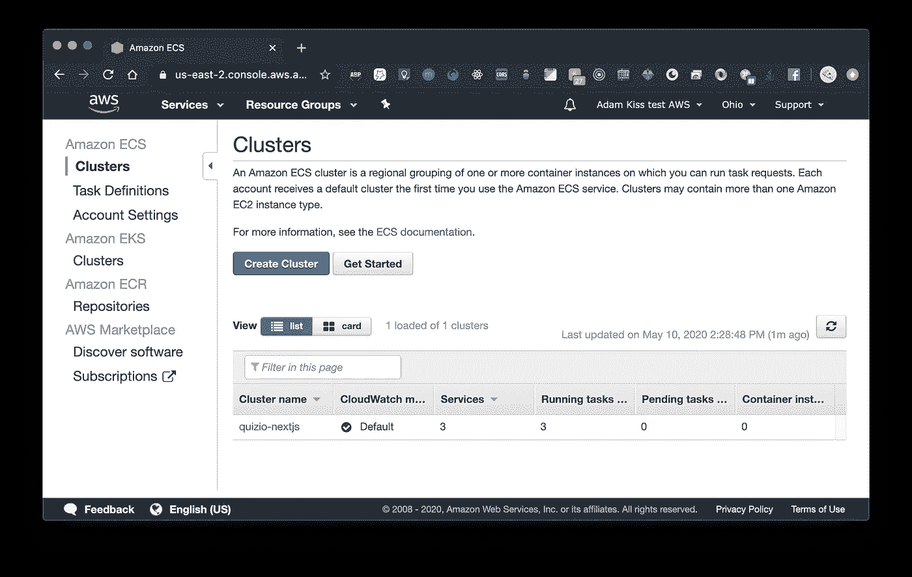
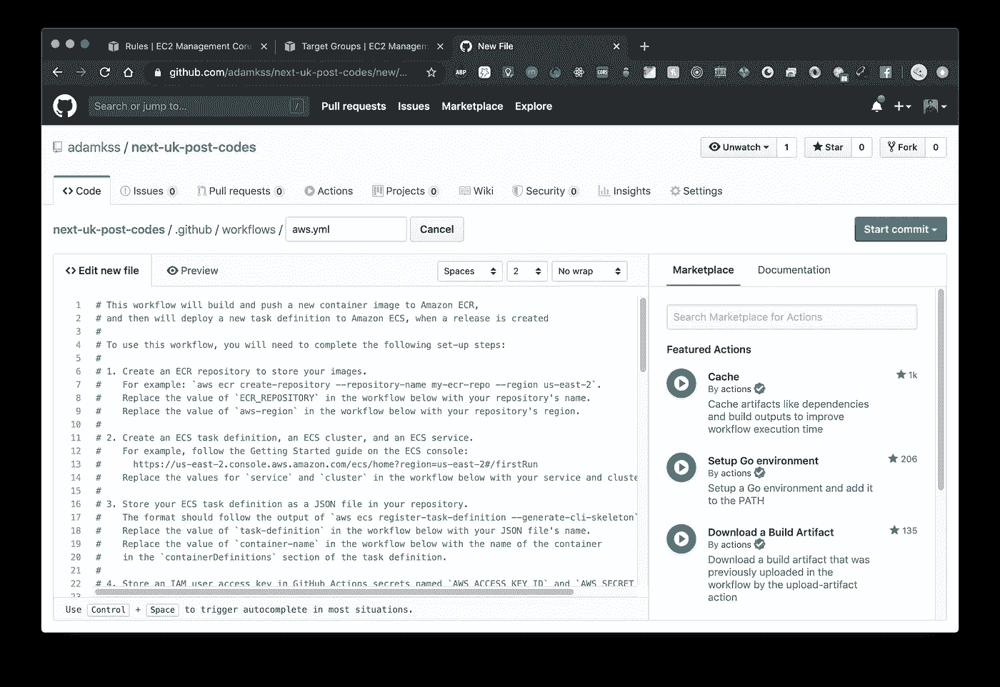

# 通过 GitHub Actions 将您的节点应用程序部署到 AWS 容器服务，并构建一个管道

> 原文：<https://javascript.plainenglish.io/deploy-your-node-app-to-aws-container-service-via-github-actions-build-a-pipeline-c114adeb8903?source=collection_archive---------0----------------------->



A successful build & deployment 💚

将您的应用程序部署到一个平台上是必须的，这一点没有人可以否认。

没有它，你的应用程序就无法从互联网上访问，人们也无法体验你努力开发的应用程序😢。

然而，**自动化部署**——当您或您的团队将一些全新的新代码推向源代码控制时——同样重要，因为您不想浪费宝贵的时间来进行手动、繁琐的部署。

设置复杂的 CI/CD 管道可能很棘手，但也相当昂贵💸。有时使用像 Jenkins 这样复杂的工具可能是值得的(也是必要的)，但是大多数时候，通过使用简单的工具，您可以使您的生活变得更加简单。比如 GitHub 的动作。

在本文中，我们将利用 GitHub Actions 和 Amazon Elastic Container Service 的强大功能来创建一个自动化流程，该流程从您的应用程序自动构建 Docker 映像，并将其部署到您的 AWS ECS 集群。

我们将以 Node.js 应用程序为例:一个服务器端呈现的 Next.js 应用程序，并围绕它构建解决方案。但是，您可以使用任何具有公开端口(如 3000、8080、4000 或任何数字)和 docker 文件的节点应用程序。实际上，您可以使用任何具有 Dockerfile 文件和公开端口的应用程序🎉。
你将不得不根据你的需要调整一些东西，但是一般步骤是完全一样的，这篇文章将指导你完成这个过程。

所以让我们开始吧！🔥

# 动机

## 为什么是 AWS？

没人能否认亚马逊网络服务(AWS)是☁️.云计算领域的领导者对拥有 AWS 技能的开发人员有巨大的需求，因为许多公司要么迁移到云，要么已经在云上运行他们的应用程序。

AWS 弹性容器服务(ECS)使运行您的集装箱码头应用程序变得简单。基本上，如果您有一个 Docker 映像，您可以在 AWS ECS 中轻松部署它。您不需要管理基础设施或任何底层操作(假设您使用的是 AWS Fargate——您将会使用)。

在本文中，我们还将使用其他核心 AWS 组件，如弹性负载平衡器、弹性容器注册表(用于存储 Docker 图像)、安全组、IAM 等。

## 为什么选择 GitHub Actions？

有时团队努力建立一个复杂且昂贵的 CI/CD 渠道，就像 Jenkins 一样。GitHub Actions 使得创建 CI/CD 管道变得容易，至少对于某些用例是这样。

最好的事？GitHub actions 对公共存储库是免费的，你对私有存储库也有 2000 分钟的免费时间，如果你刚开始用一个 app 的话，这是绰绰有余的(事后也确实便宜，目前每分钟 0.008 美元)。

我们将设置 GitHub 操作来从我们的代码构建 Docker 映像，将其推送到 AWS 容器注册中心，然后部署到我们的 AWS 弹性容器服务应用程序。

## 为什么是 Next.js？

[Next.js](https://nextjs.org/) 最近被大肆宣传，但理由很充分。Next.js 以非常简单的方式支持服务器端呈现。服务器端渲染可以在很多方面提供帮助，比如潜在地加快你的应用程序的加载时间和提升你的搜索引擎优化。

但是，Next.js 并不仅仅是因为方面而伟大。Next 是一个很好的开发工具，在 JS 解决方案中自带了很好的 CSS，路由很容易，它还能生成静态站点，有很好的文档，它的受欢迎程度非常高。很有前途🚀。

如上所述，您可以使用任何带有 Dockerfile 文件的应用程序，并围绕它轻松构建 GitHub Actions + AWS ECS。

# 我们将完成什么？

我们希望最终有一个托管在 GitHub 上的 Next.js 应用程序，每次我们向*主*分支推送新的更改，新的应用程序版本将自动构建并部署在 AWS ECS 上，因此任何人都可以在互联网上访问🎆。

本文并不是对 AWS 或 Next.js 的完整介绍。为 AWS 创建一个帐户超出了本文的范围，但是您肯定会找到很多很好的入门资源💪。

我们将构建的下一个. js 应用程序也是基本的，它只是作为概念的证明。然而，在您设置了整个 CI/CD 流之后，您可以使用它来制作一个生产就绪的应用程序，或者将这个概念应用到您现有的节点应用程序中😎。

# 先决条件

1.  首先，您需要有一个 AWS 帐户，并且可能需要一些信用来开始使用 AWS ECS(使用 Fargate)。
2.  确保安装了 AWS CLI，并且您拥有必要的访问权限。
3.  你需要在 GitHub 上托管你的项目。对于公共项目，GitHub 的所有操作都是终身免费的，因为 GitHub 支持开源项目。那真的很酷。

# 入门指南

## 创建一个新的 Next.js 项目并将其推送到 GitHub

我们将创建一个简单的单页 Next 应用程序，它将从[的邮政编码中随机获取一个英国邮政编码。使用这种方法，我们可以测试服务器端的渲染。我们将通过服务器端呈现(最终将在 ECS 上运行)在服务器端发出请求，而不是在客户端发出请求。](http://postcodes.io/)

我已经创建了项目，你可以在这里找到:[https://github.com/adamkss/next-uk-post-codes](https://github.com/adamkss/next-uk-post-codes)。

克隆并把它推送到你的 GitHub 账户，或者把它取出来，这样你也可以把这个项目放在你自己的 GitHub 用户下。

要在本地运行项目，请在终端中执行以下命令:

```
npm install && npm run dev
```

让我们快速浏览一下这个项目的一些文件。

**index.js**


pages/index.js

这是主页。我们正在定义一个`getServerSideProps` 异步函数。这就是服务器端渲染奇迹发生的地方，⭐️.该功能在服务器上执行，并在实际的 React 组件(主页)中添加了某些道具。

在我们的例子中，我们使用 **axios** (一个 HTTP 客户端库)从 public postcodes.io API 获取一个随机的邮政编码，并将结果作为一个属性传递给组件。

页面如下所示(每次页面刷新显示不同的邮政编码):


**Dockerfile**



Dockerfile

这是一个标准的 Docker 文件，告诉 Docker 如何建立我们的应用程序的形象。

基本上，所有的文件都被复制到镜像中，`npm install`被运行，`npm run build` 构建 Next.js app，依次调用`next build` ，在`package.json` *中指定。*

映像的启动命令是`npm start`，它运行构建和优化的 Next.js 应用程序🆒。

**ECS-任务-定义. json**


ecs-task-definition.json

该文件用于定义我们将在 ECS 集群中运行的容器。

看一下`containerDefinitions`属性。您可以看到 Docker 映像的名称和标签以及端口映射。我们将根据您自己的情况重新访问和更新这些属性。

该文件的最后两个属性用于定义任务定义所需的处理能力和内存。这里我们为 CPU 设置了 512(相当于 0.5 个 ECS 虚拟 CPU)和 1024 MB 的 RAM。对于单个容器来说，这些值应该足够了，尤其是对于刚开始的时候。

`cpu`属性的最小值是 256(一个 ECS 虚拟 CPU 的 25%)，对于`memory`是 512。

## AWS ECS 定价

在继续之前，我们必须谈一谈 ECS 定价。

ECS 有多种发布类型。这意味着，您可以手动指定 EC2 机器(虚拟机)——您的容器将在其上运行——或者您可以让 Amazon 管理并指定虚拟 CPU 和内存量。

我们将采用第二种方案，因为它更简单，也更现代。此外，这种方法被称为 **Fargate** 发射类型。

在撰写本文时，使用 0.5 vCPU 和 1GB RAM 运行一个 ECS 任务定义(一个或多个容器/应用程序)每月将花费大约 18 美元。

## 我们需要从 AWS 获得的东西

为了在 ECS 上成功运行 Docker 容器，我们需要以下组件:

1.  ECS 集群
2.  一个 ECR(弹性容器注册)库。这是我们的 Docker 图像将被存储的地方📷
3.  ECS 任务定义。这基本上就是我们将要运行的容器的描述。我们将有一个容器，我们的应用程序:下一个英国邮政编码。我们已经有了一个 JSON 形式的任务定义:`ecs-task-definition.json`
4.  ECS 服务，它将在我们创建的 ECS 集群中运行我们的任务定义

## 设置 AWS ECS 集群

我们将使用 AWS 在线控制台来设置和配置将保存您的应用程序的 ECS 群集。

因此，导航到弹性容器服务:



AWS ECS (Elastic Container Service) homepage

点击**创建集群**，创建一个新的集群来存放您的应用。然后选择“仅联网”——由 Fargate 供电。

> Fargate 是 ECS 中使用容器的一种方式。基本上，使用 Fargate，您不必管理底层基础设施，如 AWS EC2 机器。只需指定容器需要的处理能力，其他一切都由 Fargate 负责。


点击**下一步，**为您的集群命名，然后点击**创建:**


太好了！现在我们有了一个集群，我们的应用程序将位于其中:


在下一步中，我们将创建一个 ECR 来保存我们生成的容器图像。点击左侧导航栏中的**Amazon ECR-Repositories**。

## 为您的应用程序创建 ECR 存储库


在 ECR 存储库页面上，点击**创建存储库，**为您的 ECR 存储库命名，然后点击**创建存储库:**


干得好！现在，您应该有了一个带有特定 URI 的工作 ECR 存储库。复制那个 URI，放入你的应用项目的`ecs-task-definition.json`、`image`属性 **:**


You can take the URI from the repositories’ overview list


ecs-task-definition.json

粘贴 URI 时要格外小心。您还必须将`latest` 标记留在其后，因为标记有`latest`的 Docker 映像将被部署到 ECS 上。

## 配置执行角色

对于 ECS 中的每个任务定义(我们的`ecs-task-definition.json`是我们的任务定义)，您必须有一个适当的执行角色。

您必须将自己的执行角色的 ARN (Amazon Resource Number)放在`ecs-task-definition.json`中。

要检查您是否已经拥有这样的角色，请导航到在线控制台中的 ECS ->任务定义，然后单击**创建新的任务定义。**

我们实际上不会在在线控制台上创建任务定义，但是这是确保我们有一个`ecsTaskExecution`角色的最简单的方法。


在创建新任务定义页面上，您应该选择 Fargate，单击**下一步**并滚动到**任务执行 IAM 角色**部分。

您应该已经在下拉列表中看到该角色(`ecsTaskExecutionRole`):


The task execution IAM role

完美！现在我们应该得到这个角色的 ARN。

在 AWS 控制台中导航到 IAM，然后导航到 Roles。从列表中选择`ecsTaskExecutionRole`并复制**角色 ARN:**


现在将它粘贴到您的`ecs-task-definition.json`中的`executionRoleArn`属性中:


We now also have the executionRoleArn in our ecs-task-definition.json

## 将我们的任务定义导入 AWS

对于这一步，我们将使用 AWS CLI。

我们将通过 AWS CLI 导入`ecs-task-definition.json`中描述的任务定义。

请确保您已登录到 AWS CLI，并执行以下命令，该命令根据`ecs-task-definition.json:`创建您的 ECS 任务定义

```
aws ecs register-task-definition --region us-east-2 --cli-input-json file://./ecs-task-definition.json
```

请确保相应地更改您的地区🌎。

## 配置负载平衡器

拥有一个负载平衡器总是一个好主意。

使用我们选择的 AWS 负载平衡器(应用程序负载平衡器— ALB)可以帮助我们横向扩展我们的应用程序，拥有 SSL 终端(免费使用 HTTPS 保护)并以不会影响客户端的方式更改我们的 AWS 设置的内部组件。

请注意，安装负载平衡器是要花钱的，如果全天候运行的话，每月大约需要 10-20 美元🕐。

在 AWS 在线控制台中，导航到 EC2 页面，然后导航到负载平衡器子部分，并单击**创建负载平衡器。**选择符合我们需求的**应用负载平衡器**。


在配置页面上，确保为您的 ALB 命名，选择“面向互联网”，确保您在端口 80 上有一个 HTTP 侦听器，并选择您的 VPC 和子网。点击**下一步**。

在第二页上，它可能会告诉您尚未配置安全端口(我们可以用于 HTTPS)。暂时没问题。通过负载均衡器实现 TLS 不是本文讨论的范围，但是设置它真的很容易。点击下一个的**。**

在“配置安全组”页面上，确保创建一个新的安全组，为其命名，并打开端口 80:


在下一页，您将创建一个目标组。创建一个新的目标组，并为其命名。保持其他设置不变，然后单击下一步。

> 一个**目标组**是一组机器(在我们的例子中是容器)，负载均衡器会将传入的请求路由到这些机器。


Specify a new target group name and click next

在下一页，您可以注册目标组中的目标。我们没有设置任何，因为 ECS 稍后会自动将它们设置到我们应用程序的容器实例中。只需单击 Next，您的应用程序负载平衡器就应该创建好了🎆。

## 创建 ECS 服务

现在，您已经有了任务定义、ECS 中的集群以及负载平衡器，唯一缺少的是 ECS 服务。

这是我们的 ECS 设置的组件，它实际上在我们的 ECS 集群中运行指定数量的任务定义。

在在线控制台中转至 AWS ECS，并导航至**集群**。选择您创建的集群。默认视图应该是服务选项卡。点击**创建:**


We can create a new service in the cluster, that will actually run our task definition

在**配置服务**页面选择 Fargate 作为启动类型，确保任务定义是正确的，给服务一个名称并指定任务数量，现在应该是一个。

在“部署”部分下，保留“滚动更新”。然后点击**下一步**。


Select Fargate, specify a service name and task definition count (only 1 for now)

在下一页中，选择您选择的 VPC 和子网(您已经在创建负载平衡器时选择了它们)。


在 Security groups -> Edit 下，创建一个新的安全组，并只打开端口 3000(这是一个自定义的 TCP 端口)。

> 我们使用端口 3000，因为这是我们的容器公开 Next.js 应用程序的端口。您需要设置应用程序公开的任何端口。


然后，在**负载平衡器类型**部分，选择应用程序负载平衡器，并选择您刚刚创建的 ALB:


选择 ALB 后，在**负载平衡器类型**之前的部分，您现在可以指定**健康检查宽限期**。在那里放 10(如在 10 秒内)。

> 健康检查宽限期告诉 ECS 在它认为容器不健康之前应该等待多少秒。由于我们的 Next.js 应用程序不会立即启动，我们应该将其设置为几秒钟。

然后，在**容器到负载平衡器**部分，确保“next-uk-post-codes”容器被选中(根据任务定义，您只有这一个),并单击**添加到负载平衡器**:


进行以下修改:

1.  选择 **80:HTTP** 作为生产监听器端口
2.  创建一个新的目标组，并给它一个名字(如果你想知道，不幸的是，似乎不可能重用我们用 ALB 创建的目标组)
3.  选择 HTTP 作为目标组协议
4.  对于路径模式 put `/`，评估顺序为 1(因此它在 ALB 中首先被评估)
5.  对于健康检查路径，也放入`/`(这是到 Next.js 中我们主页的路径)。这通常可以是您的应用程序公开的、可用于检查其健康状况的任何端点。

在**服务发现**部分下，取消选中**启用服务发现集成**，因为我们不需要它。


点击**下一步**后，您将看到自动缩放选项。选择暂时不调整。点击**下一步**，然后在最后一页点击**创建服务**。

## 为 GitHub 操作创建 IAM 用户

因为 GitHub Actions 需要访问以下 AWS 资源:

1.  将应用程序的 Docker 映像推送到 ECR 存储库中
2.  将应用程序部署到 ECS

，您需要在 AWS IAM 中为它创建一个用户。为此:

1.  导航到 AWS 在线控制台中的 IAM
2.  选择用户，点击**添加用户。**给用户一个名称并选择编程访问。点击**下一步**


3.在下一页上，选择**直接附加现有策略**，并搜索 ECS。选择`AmazonECS_FullAccess`，然后搜索“Container”并选择`AmazonEC2ContainerRegistryFullAccess`——这将让 GitHub Actions 推送至您的 ECR 存储库。点击**下一个**。


This policy is used to control ECS


This policy is used to push to ECR

4.在**标签**页面上，将其留空并点击下一步，然后在最后一个页面上点击**创建用户**

5.在最后一个页面上，您应该可以看到新创建的用户的所有信息。将访问密钥 ID 和秘密访问密钥保存在安全的地方，或者将其导出为 CSV 文件


我们将马上把这个用户的证书添加到你的 GitHub 项目的秘密中。

# 设置 GitHub 操作

在我们继续之前，你应该在 GitHub 上有你自己的应用程序代码库。如果你正在使用我的 Next.js 的例子，你要么分叉它，拉它，然后把它推到你自己的遥控器上，要么从头开始做一个项目。

首先，我们必须将 AWS 凭证添加到 GitHub Secrets 中。这样，GitHub Actions 将能够在执行工作流时读取它们。

1.  在您项目的 GitHub 页面上选择**设置**并导航到**秘密**


2.创建两个秘密，一个名为`AWS_ACCESS_KEY_ID`，另一个名为`AWS_SECRET_ACCESS_KEY`。用您刚刚从 AWS 控制台保存的 AWS 凭证填充它们。

酷，现在一切都设置好配置我们的 GitHub 行动！🕺

再次指出，GitHub Actions 是**免费的，**无论如何，如果你的库是公开的🎆。去开源！

然而，如果你有一个私有的存储库，你每个月都有大量的 GitHub 动作的自由执行时间，这可能绰绰有余，至少对于启动项目来说是如此。

说够了，让我们开始吧！

需要注意的是，GitHub 动作会在您的 GitHub 存储库中的`.github/workflows`文件夹下创建一个文件。如果你已经克隆/派生了我的例子，并且已经有了这个目录，请删除它并把修改推送到 GitHub，因为最好从零开始。

让我们在 GitHub 项目的在线编辑器中点击工具栏中的**动作**，然后点击**创建新工作流:**


搜索**部署到 Amazon ECS** 工作流，并点击**设置该工作流。**

现在您应该会看到一个类似 page 的编辑器:



这是您实际配置 GitHub 动作的地方🤔。如果仔细观察，这个动作实际上使用了多个其他动作，比如配置 AWS 凭证的动作、登录 Amazon ECR 的动作、配置任务定义的动作和部署任务定义的动作。

现在，对代码进行以下更改:

1.  在注释掉的块之后，您将看到一个`on:`属性。这指定了该特定工作流应该何时运行。有许多选项，如每次推送时运行、每次合并等。我们将设置它，使它在`master`分支上的每次推送时运行:


We set the Action to run on every push to the master branch

2.看一下配置 AWS 凭证操作。它使用你刚刚设置的秘密！确保机密的名称与代码中的名称相匹配。此外，如果需要，修改您的 AWS 区域


Look, it uses the GitHub secrets we’ve set!

3.在`build-image`步骤下，将您的 ECR 存储库的名称和`latest`作为图像标签

> 在本教程中，我们总是使用**最新的**作为图像的标签。我们不会根据版本或提交哈希来标记图像。


Put the correct ECR repository name and “latest” as image tag

4.在`task-def`步骤中，确保放置正确的路径到您的`ecs-task-definition.json`(基于您的项目的根)和容器名，也在 JSON 中设置


Put the right path to the task definition JSON and container name

5.在最后一步中，确保输入您创建的正确的 ECS 群集名称和 ECS 服务名称


Put the right ECS service & cluster names

现在，点击**开始提交**，点击**提交新文件**:


We are committing our action! 🎉

现在应该发生的是 GitHub 开始执行这个动作，实际上在你的应用程序之外构建一个 Docker 映像，把它推送到 ECR，基于任务定义把它部署到 ECS 上，你的应用程序应该很快就可以运行了！

## 测试结果

导航到 GitHub 项目中的**动作**，点击新创建的工作流。您应该会看到与此类似的页面:


GitHub is working for us! For free!

GitHub Actions 正在执行工作流！如果尚未完成，您可以在这里看到所有步骤的小勾号或黄色圆圈。在 ECS 上部署可能需要一些时间，因为实例必须通过运行状况检查。

耐心点，检查结果！如果有问题，请查看错误消息。通常是相当明确的。本教程中有很多步骤，你很容易犯一两个错误。当我开始做的时候，我亲自重新做了好几次！不在话下👍。


It should be all green in the end ✅

# 进行最后的烟雾测试

太好了！现在一切都应该就位并开始工作了🍾。

我们可以导航到我们的负载平衡器，并通过它的公共 URL 访问它。

1.  在 AWS 在线控制台中，导航到 EC2，然后导航到负载平衡器部分
2.  选择您创建的负载平衡器
3.  复制 DNS 名称


Take the DNS name from the ALB (Application Load Balancer)

现在，在浏览器中访问这个 URL。您应该看到您的应用程序在运行！💍


The app is working!

完美。这是一次累人的旅行，但非常值得！

# 我们取得了什么成就

我们已经成功地建立了一个 GitHub Actions 工作流，每次推送 GitHub 项目的主分支时都会触发这个工作流。

反过来，在构建 Docker 映像之后，您的自动化工作流将使用您的 ECS 任务定义将其部署到您的 ECS 集群。该应用程序将通过负载平衡器可用，等待一些热情的客户端访问。有希望地😉。

# 从这里去哪里

这篇文章作为一个例子/概念证明。我们已经看到了 GitHub Actions 如何与 AWS ECS 集成。GitHub Actions 要么是免费的，要么非常便宜，这非常方便，尤其是如果你已经在使用 GitHub 托管 git 的话。

您可以使用这些知识为您的应用程序构建一个类似的工作流。如本文开头所述，任何类型的应用程序都可以使用这种方法。它只需要有一个用于构建它的 docker 文件和一个要公开的端口。如果是网络应用，当然可以🗺。

谢谢你一路看完这篇文章，你太棒了！干杯！

# 资源

1.  示例项目的 GitHub 回购—[https://github.com/adamkss/next-uk-post-codes](https://github.com/adamkss/next-uk-post-codes)
2.  AWS ECS 概述—【https://aws.amazon.com/ecs/ 
3.  GitHub 行动概述—【https://github.com/features/actions 

# **用简单英语写的便条**

你知道我们有四份出版物和一个 YouTube 频道吗？你可以在我们的主页[**plain English . io**](https://plainenglish.io/)找到所有这些内容——关注我们的出版物并 [**订阅我们的 YouTube 频道**](https://www.youtube.com/channel/UCtipWUghju290NWcn8jhyAw) **来表达你的爱吧！**