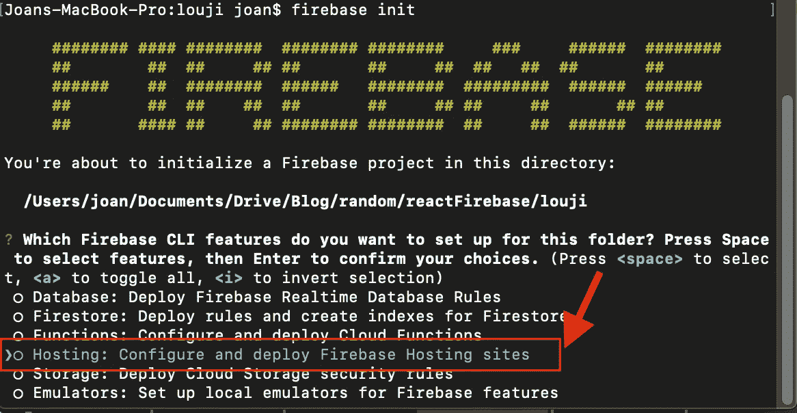
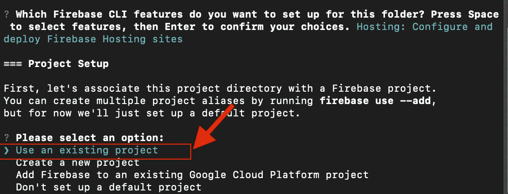
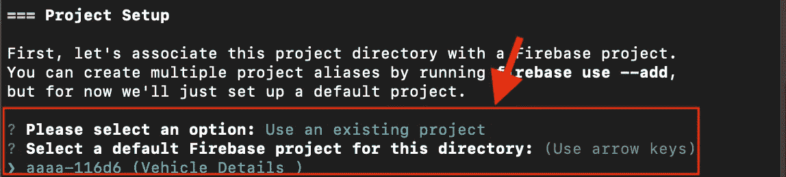
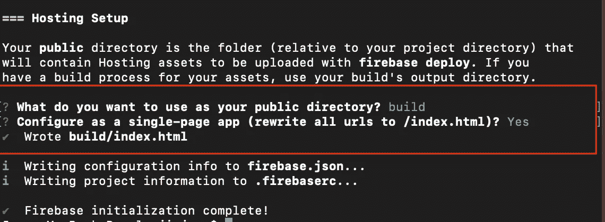
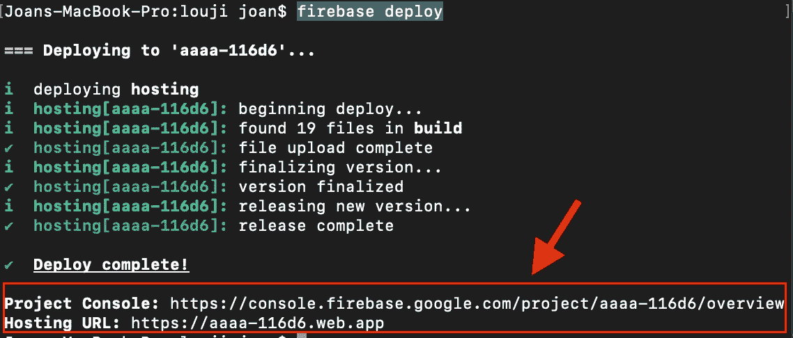

# 只需 4 个命令即可部署 React 应用

> 原文：<https://javascript.plainenglish.io/deploy-your-react-app-just-with-4-commands-196435b441e3?source=collection_archive---------12----------------------->


Cover Image

什么是 Firebase？

Firebase 是 Google 的移动和 Web 应用程序开发平台，帮助您开发、改进和发展您的应用程序。Firebase 是一个 BaaS 提供商(后端即服务)。Firebase 提供的一些功能包括 Firebase 实时数据库、Firebase 存储、Firebase 身份验证、Firebase 云消息传递、Firebase 托管等等。


Features that Firebase Provides

首先，将您的应用程序部署到 firebase，您应该有一个 firebase 帐户。按照下面的链接，创建一个新的 Firebase 帐户。创建 firebase 帐户后，创建一个新的 Firebase 项目。

[](https://firebase.google.com/) [## 重火力点

### Firebase 为您提供了分析、数据库、消息传递和崩溃报告等功能，因此您可以快速移动并…

firebase.google.com](https://firebase.google.com/) 

完成创建 Firebase 项目后，只需在终端中导航到 React 应用程序并执行下面的命令。下面的命令为您的 React 项目安装 firebase 工具。

```
sudo npm install firebase-tools -g
```

要将您的应用程序部署到 firebase，您应该在终端中登录 firebase。下面的命令允许您登录到 firebase。一旦命令被执行，您将被重定向到您的浏览器，并被要求输入您的电子邮件和密码。

```
firebase login
```

登录 firebase 后，将 firebase 初始化到您的项目中。

```
firebase init
```

上面的命令将询问您想要使用什么类型的服务。由于我们正在托管一个 web 应用程序，我们将选择托管。按空格键选择主体，然后按 enter 键。



选择**使用现有项目。**如果您还没有创建任何项目，选择**创建新项目**



现在它将向您显示项目列表。选择您创建的项目。



你会被问到 firebase 应该在哪里寻找资产。大楼是我们存放所有资产的地方。所以在这个提示符下输入 build。

然后它会询问 firebase 是否应该将项目配置为单页应用程序。对此提示输入 Yes。



现在你可以走了。执行下面的命令，将您的项目部署到 firebase。

```
firebase deploy
```



成功部署后，启动 URL 将显示在终端中。使用该 URL 访问您的网站。

如有任何疑问，请随时联系我。电子邮件:sjlouji10@gmail.com。领英:【https://www.linkedin.com/in/sjlouji/ 

Github:

[](https://github.com/sjlouji) [## sjlouji -概述

### 跟随你的心，倾听你内心的声音，不要在意别人的想法。取消注册您自己的…

github.com](https://github.com/sjlouji) 

编码快乐！