# 在几秒钟内将 React 应用程序部署到生产环境中

> 原文：<https://javascript.plainenglish.io/deploy-your-react-application-to-production-within-seconds-58754c79c239?source=collection_archive---------2----------------------->

## 触发自动部署，回滚到以前的工作生产版本等等


Photo by [Jacob Miller](https://unsplash.com/@kineticbear?utm_source=medium&utm_medium=referral) on [Unsplash](https://unsplash.com?utm_source=medium&utm_medium=referral)

今天，我们将了解如何使用 Netlify 快速将 React 应用投入生产。

Netlify 超级牛逼。它现在越来越受欢迎，因为它易于使用，并免费提供许多功能。它适用于托管使用`React`、`Angular`或任何其他静态降价网站开发的静态网站。

我喜欢 Netlify 的一点是，它免费提供了许多有用的功能
**，例如:**

**1.几秒钟内部署**

**2.提供持续部署意味着当您连接您的 Github/Gitlab/Bitbucket 存储库时，它会在新的提交被推送到存储库时自动触发部署**

**3.即使在新的部署过程中，网站也不会宕机**

**4.允许我们轻松地回滚到您的网站的任何以前的工作版本**

**5.立即改变你的站点的域或子域，等等。**

## **我们开始吧**

**Netlify 提供了多种方法来部署您的站点。**

## **拖放构建文件夹**

**部署 React 应用程序的最快和最简单的方法就是将 **build** 文件夹拖到提供部署的区域。**

**要创建一个**构建**文件夹，只需从项目文件夹的命令行执行`npm run build`命令。**

**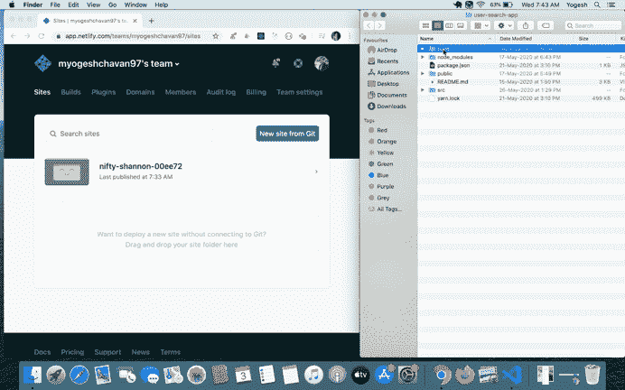**

**Deploy by dragging build folder**

## **通过命令行部署**

**通过命令行执行以下命令进行部署**

```
npm install -g netlify-clicd <your_project_folder_path>npm run buildnetlify deploy
```

**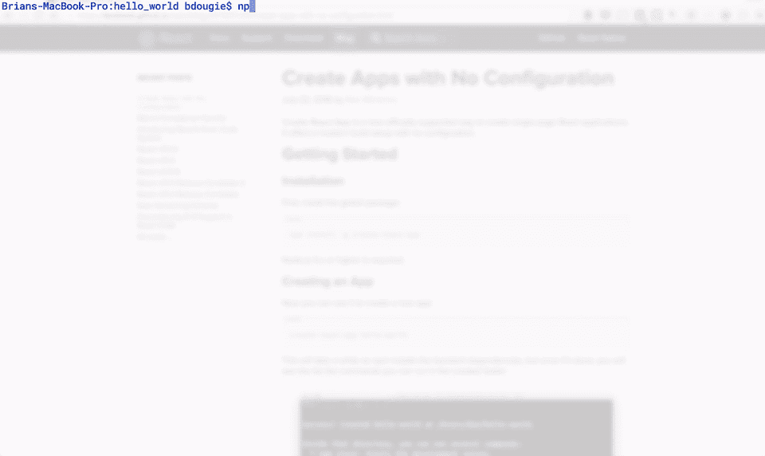**

**Source: [https://www.netlify.com/blog/2016/07/22/deploy-react-apps-in-less-than-30-seconds/](https://www.netlify.com/blog/2016/07/22/deploy-react-apps-in-less-than-30-seconds/)**

## **从 GitHub/Gitlab/Bitbucket 存储库部署**

**如果你已经有了一个推送到 Github 的存储库，那么你只需要连接它。**

1.  **登录您的 Netlify 帐户**
2.  **在仪表板中点击**“从 Git 新建网站”**按钮**

**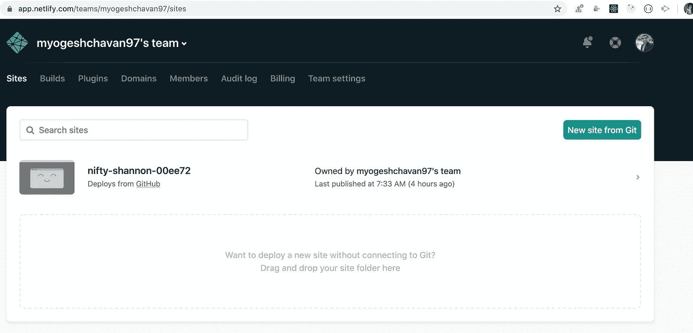**

**Netlify Dashboard**

**3.选择 Git 提供程序**

**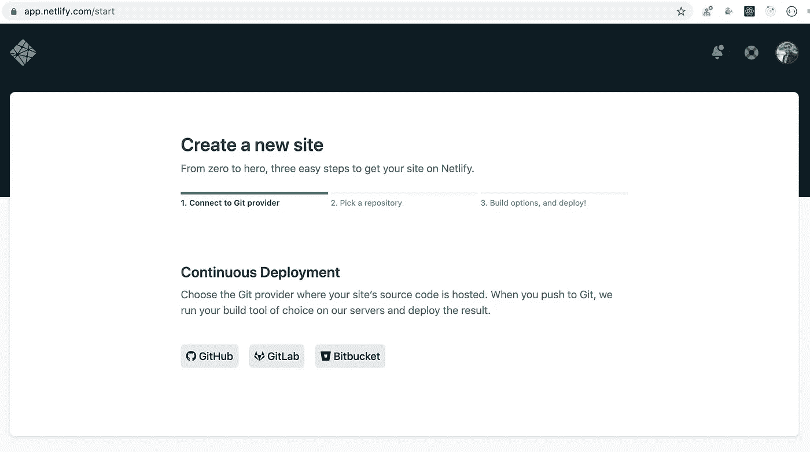**

**Select Provider**

**4.它将打开新标签页。确保浏览器中启用了弹出窗口**

****

**Repositories list**

**5.在**搜索仓库**搜索框中搜索 git 仓库。如果您的存储库没有显示，请点击页面底部的**“在 GitHub 上配置 Netlify 应用程序”**按钮**

**6.在新打开的页面中，向下滚动并选择所有存储库的单选按钮，或者选择一个特定的存储库并单击**保存**按钮**

**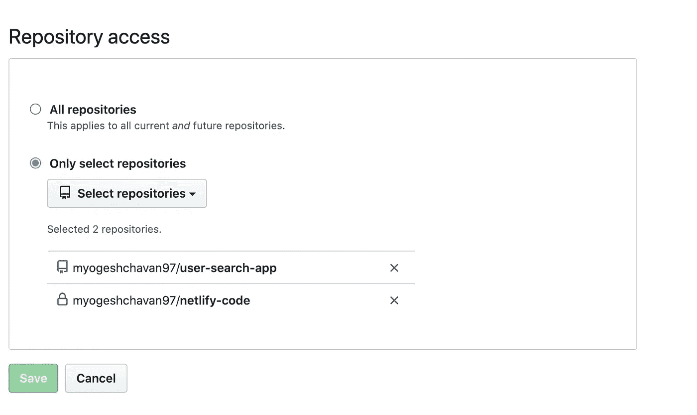**

**Select repository**

**7.您将被重定向到上一页，并将显示您选择的存储库(如果未显示，请刷新页面)**

**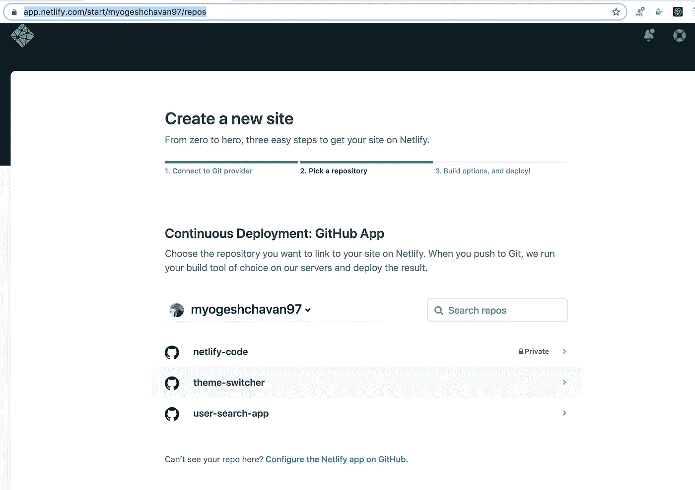**

**Selected repository list**

**8.单击存储库进行部署。您将被导航到下一页**

**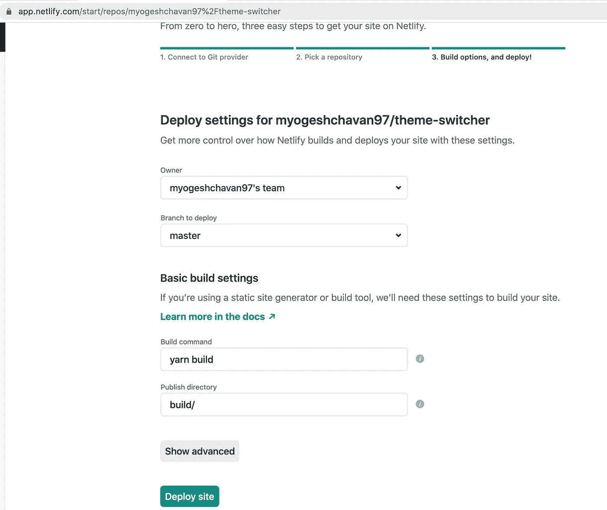**

**Build options**

**9.您的**构建命令**和**发布目录**将被自动填充。如果您在 package.json 中有不同的命令来构建您的应用程序，或者这些字段不是自动填充的，请确保输入这些字段。**

**10.点击**部署站点**按钮**

**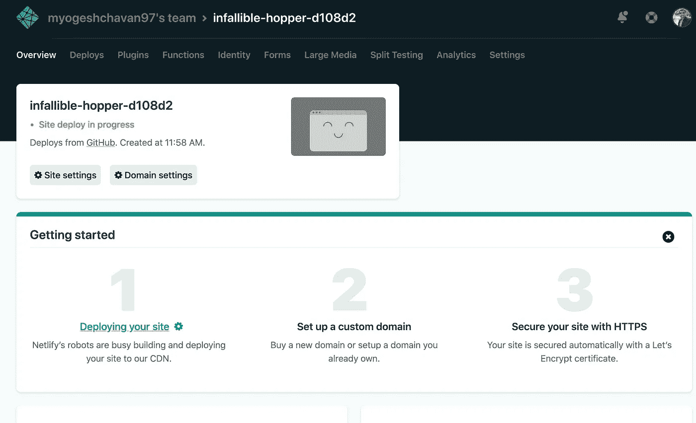**

**Netlify deployment progress**

**11.点击**部署选项卡**(第二个选项卡)，您可以看到您站点的所有部署**

**12.您的站点将在几秒钟内完成部署，您将看到已部署站点的 url。(如果部署成功后页面未刷新，请刷新页面)**

**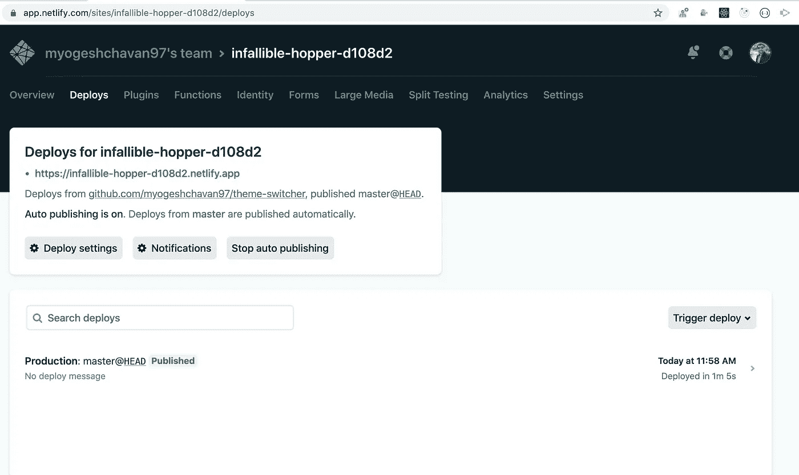**

**Deployment Successful**

**13.如果您想更改已部署应用的子域，点击**总览选项卡**并点击**“域设置”**按钮**

**14.在这里，你可以添加你自定义的域名或者点击
**选项= >编辑站点名称****

**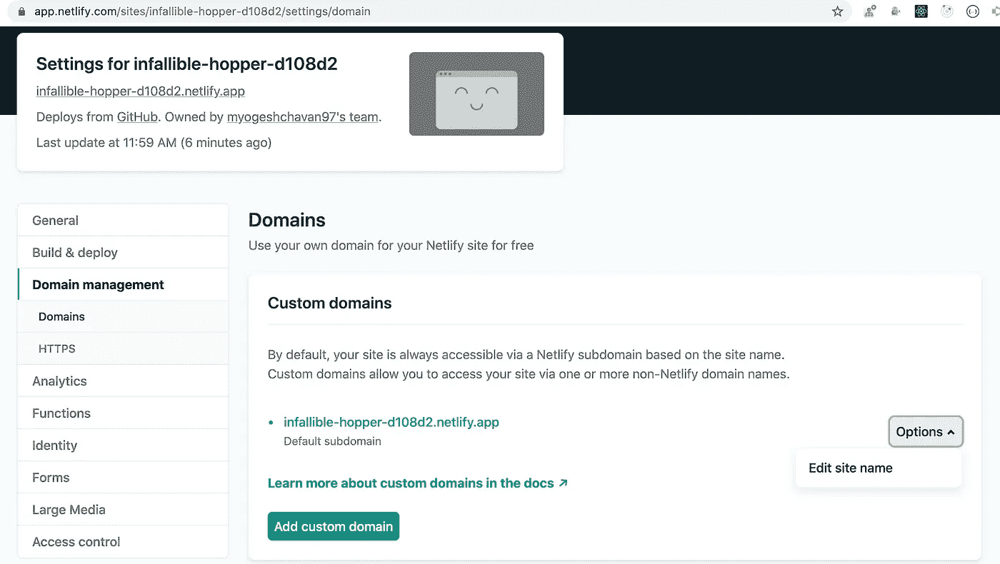**

**15.输入您喜欢的新名称，然后点击**保存**按钮**

**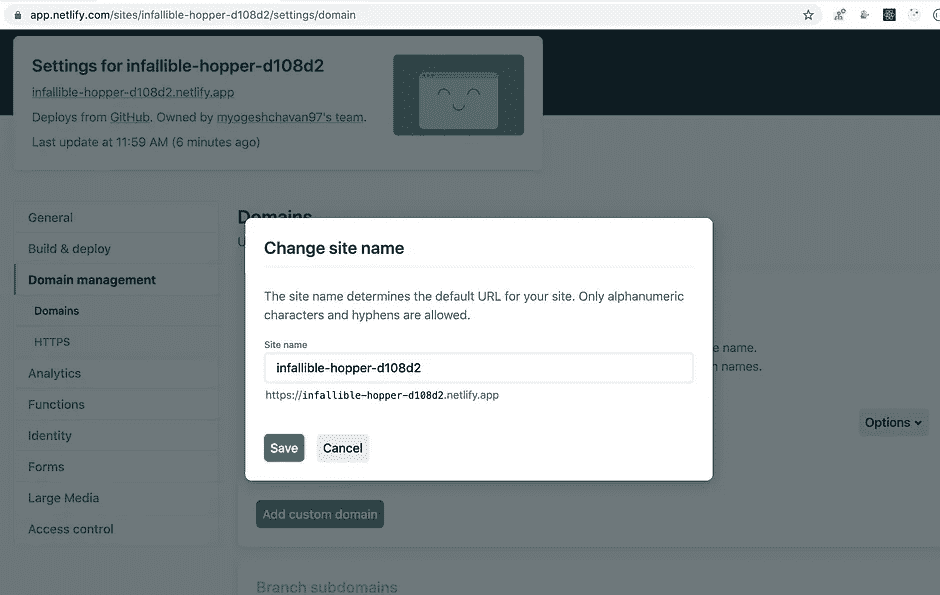****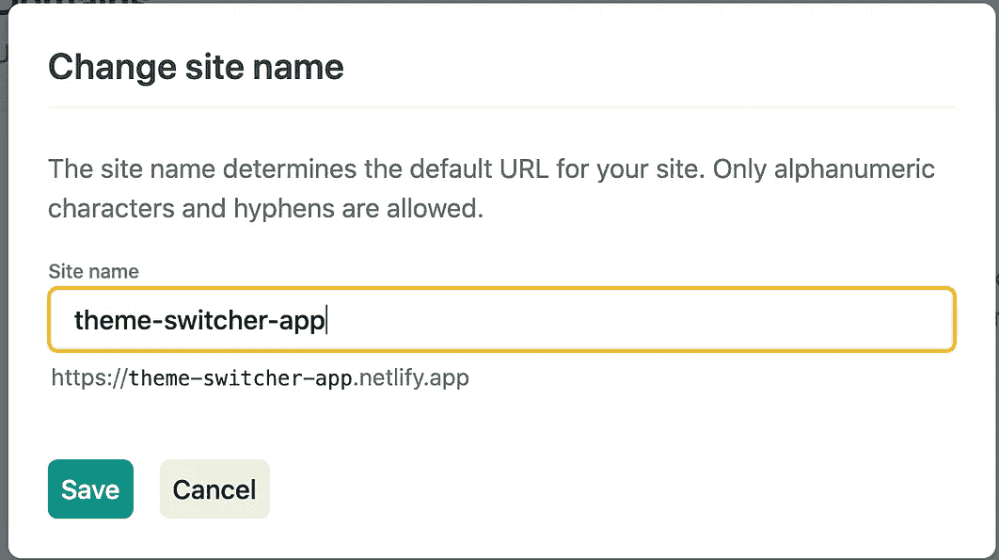**

**Old name and new name**

**16.现在，您可以在新的子域上访问您的应用程序**

**17.直播 App:[https://theme-switcher-app.netlify.app/](https://theme-switcher-app.netlify.app/)**

> **恭喜，您已经成功地将 React 应用程序部署到生产环境中**

**太棒了。**

> **所以现在，每当您将您的更改推送到 git 存储库时， **Netlify** 会自动将您的更改部署到生产环境，而不会在部署时关闭您的站点，因为它会部署到单独的容器，然后将其附加到您的站点。**

**您可以在**部署**选项卡中看到您的所有部署，如果当前部署有问题，可以随时切换到以前的版本。**

**点击查看更多关于 **Netlify** 特性[的信息](https://medium.com/netlify/10-netlify-features-to-surprise-and-delight-225e846b7b21)**

**今天到此为止。我希望你学到了新东西。**

****别忘了直接在你的收件箱** [**这里订阅我的每周简讯，里面有惊人的技巧、诀窍和文章。**](https://yogeshchavan.dev/)**

## ****一张用简单英语写的便条****

**你知道我们有四份出版物和一个 YouTube 频道吗？你可以在我们的主页[**plain English . io**](https://plainenglish.io/)找到所有这些内容——关注我们的出版物并 [**订阅我们的 YouTube 频道**](https://www.youtube.com/channel/UCtipWUghju290NWcn8jhyAw) **来表达你的爱吧！****